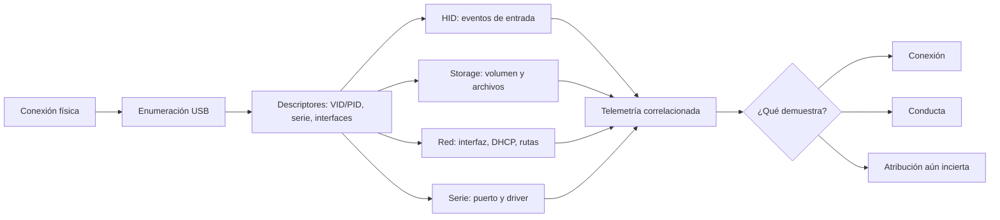

# Clase 177 — Red teaming físico

> Parte: **7 — Red Team y operaciones ofensivas** · Fuentes principales: NIST SP 800-115 y SP 800-53 Rev. 5, documentación de USBGuard, Microsoft y fabricantes citados
> ⏱️ Duración estimada: **210 min** · Nivel: **Intermedio**

---

## 🎯 Objetivo

Evaluar de forma autorizada cómo el acceso físico, los accesorios USB y los dispositivos compactos de red pueden atravesar o poner a prueba controles técnicos y humanos. La clase desarrolla dos sentidos distintos de **controlar**: administrar con seguridad el equipo de laboratorio —inventario, firmware, credenciales, configuración y borrado— y controlar el riesgo que ese equipo representa para endpoints, red, personas y evidencia.

El propósito no es demostrar que un producto «hackea» por sí solo. Es construir una cadena causal verificable: qué interfaz presentó, qué aceptó el sistema, qué conducta ocurrió, qué telemetría quedó, qué control la detuvo y qué conclusión permite sostener la evidencia.

## 📚 Resultados de aprendizaje

Al finalizar, el alumno podrá:

1. **Delimitar** una prueba física mediante autorización, reglas de compromiso, zonas, horarios y condiciones de parada.
2. **Distinguir** un cable normal, un dispositivo USB simple y uno compuesto, y explicar enumeración, interfaces HID, almacenamiento, red y serie.
3. **Comparar** O.MG Cable, USB Rubber Ducky, Bash Bunny, placas con USB nativo y Cynthion sin atribuir capacidades de un modelo a otro.
4. **Preparar y restaurar** un dispositivo de laboratorio sin dejar credenciales, cargas ni datos de la organización.
5. **Ejecutar** una demostración HID inocua y medir conexión, conducta y efecto sin abrir shells ni establecer C2.
6. **Observar** evidencia de host y red, diferenciando conexión, conducta sospechosa y atribución a un producto.
7. **Validar** controles de puerto, autorización por interfaz, bloqueo de sesión, mínimo privilegio y vigilancia física.
8. **Responder** a un accesorio o implante desconocido preservando contexto y evitando una atribución prematura.

## 🗺️ Temas

| # | Tema | Pregunta profesional |
|---|---|---|
| 1 | Alcance físico y seguridad | ¿Qué está permitido y cuándo se detiene la prueba? |
| 2 | Enumeración USB | ¿Qué identidades e interfaces ofrece realmente el dispositivo? |
| 3 | HID y automatización | ¿Por qué «parecer teclado» no equivale a obtener privilegios? |
| 4 | Dispositivos compuestos | ¿Qué cambia al combinar teclado, almacenamiento, red o serie? |
| 5 | Cables y accesorios alterados | ¿Cómo se gestiona la confianza en algo que conserva su función aparente? |
| 6 | Instrumentación USB | ¿Cómo observar el protocolo sin confundir analizador con herramienta de ejecución? |
| 7 | Dispositivos compactos de red | ¿Qué evidencia deja un puente, router o adaptador insertado? |
| 8 | Detección, mitigación y respuesta | ¿Qué demuestra cada fuente y cómo se comprueba el control? |

## 🧠 Explicación en profundidad

### El ejercicio empieza en el documento, no en la puerta

La autorización general para «hacer pentest» no basta para acceder a edificios, conectar hardware o involucrar personas. Las reglas de compromiso deben nombrar sedes y zonas, fechas y ventanas, técnicas permitidas, sistemas de prueba, personas excluidas, tratamiento de fotografías y datos, contacto de la *white cell*, condiciones de parada y procedimiento ante guardias o policía. La carta de verificación de emergencia ayuda a resolver una intercepción; no concede inmunidad ni amplía el alcance.

Esta clase reutiliza el método completo de la [Clase 025 — Ética, legalidad, alcance y divulgación responsable](../../parte-0-fundamentos-y-prerrequisitos/025-etica-legalidad-alcance-y-divulgacion-responsable/README.md). En una prueba física se agregan riesgos que allí no siempre aparecen: lesiones, bloqueo de una salida, daños eléctricos, captación incidental de personas, pérdida del dispositivo implantado y conexión involuntaria a una red fuera de alcance. Si cualquiera de ellos se materializa, preservar la seguridad de las personas tiene prioridad sobre mantener el pretexto.

### USB no es un conector: es una negociación de funciones

Al insertar un dispositivo, el host detecta presencia, restablece el bus, asigna una dirección y solicita **descriptores**. Esos datos anuncian fabricante y producto, pero, sobre todo, una o más **interfaces**. La clase USB `03` corresponde a HID; `08`, a almacenamiento masivo; otras interfaces pueden presentar red o puerto serie. Un dispositivo **compuesto** reúne varias funciones bajo una conexión física. Por eso una política que solo bloquea unidades extraíbles puede impedir montar un disco y, a la vez, aceptar el teclado del mismo objeto.

Los valores VID, PID, nombre y número de serie ayudan a inventariar, pero son afirmaciones del dispositivo, no identidad criptográfica. Herramientas de emulación pueden cambiarlos. El puerto físico, el conjunto exacto de interfaces, el momento de conexión, la línea base del equipo y la conducta posterior aportan contexto; ninguno atribuye por sí solo la actividad a una marca.


```mermaid
flowchart LR
  F[Conexión física] --> E[Enumeración USB]
  E --> D[Descriptores: VID/PID, serie, interfaces]
  D --> H[HID: eventos de entrada]
  D --> S[Storage: volumen y archivos]
  D --> N[Red: interfaz, DHCP, rutas]
  D --> C[Serie: puerto y driver]
  H & S & N & C --> T[Telemetría correlacionada]
  T --> J{¿Qué demuestra?}
  J --> J1[Conexión]
  J --> J2[Conducta]
  J --> J3[Atribución aún incierta]
```

El diagrama se lee de izquierda a derecha. La conexión conduce a una declaración de capacidades; cada interfaz abre una ruta distinta y deja evidencia diferente. Solo al correlacionar esas rutas puede sostenerse que una acción siguió inmediatamente a la conexión. Incluso entonces, afirmar «fue un Rubber Ducky» exige más que ver un teclado USB: una placa programable, un Flipper Zero en modo BadUSB o un cable alterado pueden producir una conducta semejante.

### Cuatro familias que parecen equivalentes, pero no lo son

**USB Rubber Ducky.** En el modelo actual, DuckyScript 3 controla modos `HID`, `STORAGE`, la combinación de ambos u `OFF`. Su función pedagógica principal es estudiar automatización de teclado, tiempos de enumeración, distribución de teclado y dependencia del contexto. El host interpreta teclas como si procedieran de una persona; la herramienta no salta por sí misma el bloqueo de pantalla, UAC, permisos de la cuenta, allowlisting ni controles de aplicación.

**Bash Bunny.** Es un sistema Linux embebido capaz de declarar combinaciones de HID, almacenamiento, serie y adaptadores Ethernet ECM/RNDIS según firmware y modo. Eso lo hace apropiado para estudiar dispositivos compuestos, cambios de identidad durante una sesión y el riesgo de una nueva interfaz de red. No debe describirse como «un Rubber Ducky más potente»: incorpora ejecución local y funciones USB distintas, y el resultado depende del sistema operativo, controladores y combinación admitida.

**O.MG Cable.** Es un cable con implante que conserva la función de carga/datos cuando está inactivo. Las variantes y generaciones no ofrecen lo mismo: la tabla vigente del fabricante diferencia DuckyScript, capacidad, activación, keylogger y control de red. La lección defensiva es la confianza en la cadena de suministro y los accesorios, no aprender a ocultar el implante. Visualmente puede ser indistinguible de un cable permitido; por ello se usan inventario, compra controlada, precintos, cargadores sin datos y puertos restringidos. El bloqueo de almacenamiento tampoco basta si el accesorio presenta HID.

**Placa programable con USB nativo.** RP2040, ATmega32U4 y otras placas pueden implementar un dispositivo USB de laboratorio. Son una alternativa accesible para enseñar descriptores y HID, pero su código, temporización y descriptores dependen del firmware cargado. Que una placa pueda emular una clase no significa que replique las funciones de un producto comercial.

**Cynthion.** Es instrumentación, no un «payload» prearmado. Como analizador USB 2.0 captura tráfico entre host y dispositivo y Packetry permite inspeccionarlo; con LUNA/Facedancer también puede desarrollar o emular dispositivos. Aporta evidencia de protocolo y ayuda a verificar qué descriptores y transferencias ocurrieron. Un analizador USB no sustituye la telemetría del endpoint: ve el bus, no necesariamente el proceso que reaccionó a las teclas.

### Administrar el dispositivo y controlar su riesgo

La administración segura empieza antes de conectarlo al objetivo:

1. Registrar propietario, modelo exacto, identificador físico, firmware, accesorios y hash de archivos de configuración.
2. Descargar firmware y herramientas solo del canal oficial; conservar versión y suma publicada cuando exista.
3. Cambiar contraseñas de administración, desactivar acceso remoto no necesario y usar una red de gestión aislada.
4. Revisar el payload línea por línea, reemplazar secretos por valores de laboratorio y fijar un resultado inocuo.
5. Probar primero en una máquina desechable; registrar qué interfaz enumera y cómo detener la ejecución.
6. Tras el ejercicio, exportar solo la evidencia autorizada, borrar datos y cargas, restablecer configuración y actualizar el inventario.

Controlar el riesgo del dispositivo exige otra perspectiva. Un bloqueador de datos que omite las líneas de datos es útil al cargar un teléfono, pero impide también una conexión legítima y no protege cuando se necesita transferencia. Una política de almacenamiento no controla HID. Una lista basada solo en VID/PID puede ser falsificada. La defensa eficaz combina custodia física, autorización por dispositivo/interfaz, sesión bloqueada, mínimo privilegio, control de aplicaciones, EDR y entrenamiento para reportar accesorios desconocidos.

### Herramientas compactas de red: puente, adaptador e implante

Un **Packet Squirrel** se coloca entre dos enlaces Ethernet y, según el modelo y modo, puede actuar como NAT, puente con dirección propia, puente transparente o punto de aislamiento. Sirve para estudiar captura, cambios de topología y contención. Un **LAN Turtle** se presenta como adaptador USB-Ethernet y ejecuta un sistema embebido; enseña el riesgo de una interfaz de red añadida al host. Una mini-PC puede cumplir un objetivo similar, pero sus capacidades dependen del sistema instalado.

La observación defensiva cambia: en el host puede aparecer un nuevo adaptador, ruta, DNS o DHCP; en la red pueden cambiar MAC, LLDP, asignaciones, enlace y topología. Un puente transparente puede no pedir IP, por lo que «no apareció un lease DHCP» no prueba ausencia. Un TAP de red, en cambio, es hardware de observación diseñado para copiar tráfico a un sensor; no debe confundirse con un implante, aunque también requiere inventario, control físico y evaluación de pérdida o duplicación.

### De señal a afirmación: la escalera de evidencia

| Nivel | Evidencia observable | Afirmación defendible | Lo que no demuestra |
|---|---|---|---|
| Conexión | `lsusb`, árbol PnP, `SetupAPI.dev.log`, evento de USBGuard, cambio de enlace | un dispositivo o interfaz apareció | que ejecutó una carga o qué marca real es |
| Conducta | ráfaga de eventos de teclado, proceso hijo, archivo creado, interfaz/red/ruta nueva | ocurrió una acción correlacionada temporalmente | que fue maliciosa o exclusiva de un producto |
| Impacto | marcador autorizado, cambio de configuración, intento bloqueado | el control permitió o detuvo el objetivo definido | compromiso general del equipo |
| Atribución | custodia del dispositivo, imagen/configuración, captura USB y correlación de host | el equipo examinado es consistente con la acción | autor humano, intención o uso fuera de la ventana |

En Windows, `%SystemRoot%\inf\SetupAPI.dev.log` registra operaciones de instalación de dispositivos y controladores. No es un registro universal de cada pulsación. En Linux, `udevadm monitor --kernel --udev --property` observa altas/bajas y propiedades durante la prueba; `journalctl -k` aporta mensajes del kernel si la configuración los conserva. USBGuard registra decisiones propias cuando está instalado y habilitado. En todos los casos hay falsos negativos si la fuente no estaba activa o retuvo poco, y falsos positivos por teclados, docks y adaptadores legítimos.

## 📖 Definiciones y características

- **Enumeración USB:** negociación por la que el host conoce descriptores y configura el dispositivo. Ocurre antes de que la aplicación use la interfaz.
- **HID:** clase USB para interfaces humanas. Ser HID no prueba automatización; teclados legítimos pertenecen a la misma clase.
- **Dispositivo compuesto:** dispositivo con varias interfaces, por ejemplo HID más almacenamiento. Debe evaluarse por el conjunto, no por una función visible.
- **DuckyScript:** lenguaje de automatización compatible con varios productos Hak5, con comandos que varían por dispositivo y versión.
- **Analizador de protocolo:** instrumento que observa transacciones del bus. No equivale a un endpoint ni decide por sí solo si una acción es maliciosa.
- **Dropbox:** equipo inventariado colocado temporalmente para probar acceso a red. Debe tener propietario, tiempo de retiro y método de contención.
- **TAP:** punto de acceso de prueba que replica tráfico para observación. Su valor es medible por cobertura y pérdida, no por invisibilidad prometida.

## 📔 Glosario

| Término | Definición útil |
|---|---|
| VID/PID | Valores declarados por el dispositivo para fabricante/producto; útiles para inventario, falsificables. |
| Descriptor | Estructura USB que anuncia configuración, interfaces y endpoints. |
| Interfaz | Función lógica dentro de un dispositivo USB. |
| ECM/RNDIS | Formas de presentar un adaptador Ethernet por USB en diferentes sistemas. |
| Allowlist | Política que autoriza solo identidades, interfaces o puertos esperados. |
| Arming mode | Estado de administración separado de la ejecución en algunos equipos. |
| Marcador inocuo | Resultado preparado que prueba la acción sin acceder a datos reales. |
| White cell | Equipo que conoce y controla el ejercicio, alcance y condiciones de parada. |
| Restauración | Eliminación de cargas, credenciales, datos y cambios tras la prueba. |

## 🧰 Herramientas y preparación

**Banco mínimo:** portátil de laboratorio sin datos reales, snapshot o imagen recuperable, un teclado normal, una memoria USB y una placa con USB nativo o dispositivo comercial inventariado. Cynthion es opcional para observar el protocolo. Para red cableada, se puede usar un switch de laboratorio y una VM puente; Packet Squirrel/LAN Turtle son ejemplos, no requisitos.

**Topología:** dispositivo USB → endpoint de prueba → sensor de host; para red, cliente de prueba → dispositivo intermedio → switch aislado → servicio sintético. No se conecta el banco a la LAN corporativa ni a Internet.

**Comprobaciones antes de ejecutar:**

```powershell
# Windows: inventario PnP antes/después. No modifica el sistema.
Get-PnpDevice -PresentOnly |
  Select-Object Class, FriendlyName, InstanceId |
  Sort-Object Class, FriendlyName

# El log existe en Windows Vista y posteriores; copiarlo preserva el original.
Get-Item "$env:SystemRoot\inf\setupapi.dev.log"
```

```bash
# Linux: inventario y observación de eventos del laboratorio.
lsusb
lsusb -t
sudo udevadm monitor --kernel --udev --property

# USBGuard, solo si ya está instalado y configurado en la VM de prueba.
sudo usbguard list-devices
```

En USBGuard, una regla como `allow with-interface equals { 08:*:* }` significa «solo almacenamiento»: un compuesto que además anuncie HID no coincide. La política debe generarse sobre una VM de prueba, revisarse manualmente y conservar un método de recuperación; bloquear un teclado o el controlador equivocado puede dejar el sistema sin entrada.

## 🧪 Laboratorio guiado — HID inocuo y defensa por capas

**Objetivo.** Observar enumeración y automatización sin abrir una terminal, descargar contenido, elevar privilegios ni comunicarse por red.

**Prerrequisitos.** Haber completado la Clase 025; máquina desechable con editor de texto abierto; reloj sincronizado; permisos para revisar logs; dispositivo de laboratorio inventariado. No usar un equipo de producción.

**Payload inocuo de referencia (DuckyScript 3):**

```text
REM LAB 177 - solo escribe en el editor ya abierto
ATTACKMODE HID
DELAY 3000
STRINGLN LAB177-HID-AUTORIZADO
DELAY 500
STRINGLN No se abrio una shell ni se accedio a datos.
ATTACKMODE OFF
```

`ATTACKMODE HID` presenta teclado; `DELAY` permite completar enumeración; `STRINGLN` escribe el marcador y Enter; `OFF` desactiva la interfaz. En una placa distinta, implementa la misma secuencia y documenta biblioteca/firmware: no la llames DuckyScript si no lo es.

**Procedimiento reproducible.**

1. Crea una hoja de alcance con host, dispositivo, operador, hora, payload, resultado permitido y condición de parada.
2. Obtén inventario inicial PnP/`lsusb`, interfaces de red, rutas y hora. Abre un editor vacío y asegúrate de que no tiene privilegios elevados.
3. Inicia `udevadm monitor` o prepara la copia previa de `SetupAPI.dev.log`. Si usas Cynthion, conecta host y dispositivo a los puertos indicados por su documentación y confirma captura antes de continuar.
4. Inserta el dispositivo. No pulses nada en el host. El único resultado aceptable es el texto de dos líneas en el editor.
5. Guarda captura de pantalla, salida de inventario posterior, eventos de conexión y, si existe, traza USB. Registra si el layout produjo caracteres distintos o si el foco estaba en otra ventana.
6. Repite con pantalla bloqueada. El resultado esperado es que el marcador no aparezca en una aplicación de la sesión.
7. En una VM Linux recuperable, genera una política USBGuard inicial, identifica la regla específica del teclado permitido y prueba el dispositivo de laboratorio bajo bloqueo por defecto. No despliegues la política fuera del banco.
8. Restaura: retira el dispositivo, borra el payload de prueba, elimina el archivo del editor, revierte snapshot y anota hashes/configuración final del equipo de prueba.

**Evidencias y criterios de aceptación.** Deben aparecer hora de conexión, conjunto de interfaces, marcador exacto, resultado con sesión bloqueada, decisión de USBGuard o control equivalente y registro de restauración. Se aprueba si el alumno explica por qué cada evidencia prueba conexión, conducta o control, y qué no permite atribuir.

**Ruta sin hardware.** Usa un conjunto entregado por el instructor con `lsusb -v`, árbol PnP, fragmento de `SetupAPI.dev.log`, eventos de USBGuard y captura USB anonimizada. El alumno puede clasificar interfaces, construir la línea de tiempo y diseñar la política. No puede validar reconocimiento físico, calidad eléctrica, temporización real ni respuesta de un host a la conexión.

## 🔍 Caso integrador — El «adaptador» encontrado en una sala

Un equipo reporta un adaptador USB-Ethernet conectado detrás de un puesto. A los 18 segundos aparece una interfaz RNDIS; el host obtiene otra ruta por DHCP; un sensor registra una consulta DNS sintética, pero no hay evidencia de ejecución de procesos nuevos.

La respuesta correcta no es etiquetarlo inmediatamente como Bash Bunny o LAN Turtle. El analista fotografía ubicación y conexiones, registra hora y custodio, aísla el host de acuerdo con el playbook, captura estado volátil si el riesgo lo justifica y conserva el dispositivo sin conectarlo a otro equipo productivo. La hipótesis «dispositivo compuesto o adaptador de red no autorizado» está respaldada; la marca y la intención siguen abiertas. Luego se valida el control: negar nuevas interfaces de red USB en el perfil del puesto, permitir el dock corporativo identificado y confirmar que este último sigue funcionando.

## ✍️ Ejercicios

1. Explica por qué bloquear almacenamiento no detiene necesariamente HID ni Ethernet USB.
2. Compara Rubber Ducky, Bash Bunny, O.MG Cable, una placa USB nativa y Cynthion por función, administración y evidencia.
3. Diseña una política de compra, préstamo, actualización y borrado para accesorios de auditoría.
4. Propón tres fuentes para investigar una nueva interfaz USB y especifica un falso positivo y un falso negativo por fuente.
5. Modela una prueba de Packet Squirrel en modo puente sin Internet y define cómo demostrar que fue retirado.
6. Redacta una decisión de contención que preserve evidencia sin dejar el endpoint conectado a una red dudosa.

## 📝 Reto verificable

Entrega un expediente de prueba con RoE, inventario antes/después, payload HID inocuo, línea de tiempo, política defensiva ensayada, evidencia del resultado, restauración y una conclusión graduada.

**Criterio de aceptación:** la prueba no abre shell ni red; identifica todas las interfaces; distingue conexión, conducta y atribución; demuestra un control que bloquea el dispositivo de prueba sin inutilizar el teclado autorizado; y documenta un método de recuperación. La ausencia de hardware comercial no reduce la nota si el análisis de evidencias es completo; sí debe declararse que no hubo validación física de esos modelos.

## 📊 Matriz de cobertura de la ampliación

La columna inicial conserva el diagnóstico realizado el **6 de octubre de 2026** antes de esta revisión. «Mencionado» no significa enseñado.

El video y las marcas de tiempo aportados se usaron como mapa temático, pero el video no pudo inspeccionarse de forma reproducible en este entorno. Por eso ninguna afirmación técnica depende de él: capacidades, límites y controles se contrastaron con las fuentes primarias citadas en cada clase.

| Familia o equipo | Cobertura inicial y evidencia | Cobertura final y ubicación verificable |
|---|---|---|
| O.MG Cable | **Mencionado** en herramientas de esta clase; sin modelo, administración ni defensa | **Desarrollado con práctica y evaluación** aquí: confianza, variantes, administración, HID inocuo, evidencia y controles |
| USB Rubber Ducky | **Parcialmente desarrollado** aquí; la práctica anterior abría C2 y no evaluaba telemetría | **Desarrollado con práctica y evaluación** aquí: enumeración, DuckyScript 3, límites, práctica inocua y bloqueo |
| Bash Bunny | **Ausente** | **Desarrollado** aquí como dispositivo compuesto, con modos, administración y señales observables |
| WiFi Pineapple | **Ausente** en la Clase 272 | **Desarrollado con práctica y evaluación** en la [Clase 272](../../parte-13-seguridad-movil-iot-e-inalambrica/272-ataques-wifi-avanzados-evil-twin-y-pmkid/README.md) |
| Flipper Zero | **Mencionado** aquí solo como herramienta RFID | **Desarrollado** por interfaces, firmware y límites en la [Clase 270](../../parte-13-seguridad-movil-iot-e-inalambrica/270-ataques-a-rfid-y-nfc/README.md), con vínculos a 269 y 271 |
| RFID/NFC y Proxmark3 | **Parcialmente desarrollado** en la Clase 270 | **Desarrollado con práctica y evaluación** en la [Clase 270](../../parte-13-seguridad-movil-iot-e-inalambrica/270-ataques-a-rfid-y-nfc/README.md) |
| HackRF One y SDR | **Parcialmente desarrollado** en la Clase 269; capacidades mezcladas y sin respuesta a interferencia | **Desarrollado con práctica y evaluación** en la [Clase 269](../../parte-13-seguridad-movil-iot-e-inalambrica/269-radio-definida-por-software-sdr/README.md) |
| Inhibidores/jammers | **Ausente** | **Desarrollado defensivamente**, solo con grabaciones y simulación, en la [Clase 269](../../parte-13-seguridad-movil-iot-e-inalambrica/269-radio-definida-por-software-sdr/README.md) |
| Cynthion y placas USB nativas | **Ausente** | **Desarrollado** aquí como instrumentación y alternativa accesible |
| Packet Squirrel/LAN Turtle | **Ausente** | **Desarrollado** aquí como familia de red cableada compacta y comparada con TAP |
| Bus Pirate, lógica, JTAG/SWD y SPI | **Parcialmente desarrollado** en la Clase 268 | **Desarrollado con práctica y evaluación** en la [Clase 268](../../parte-13-seguridad-movil-iot-e-inalambrica/268-analisis-de-hardware-uart-jtag-y-spi/README.md) |
| BLE/IoT | **Parcialmente desarrollado** en la Clase 271 | **Desarrollado con instrumentación** en la [Clase 271](../../parte-13-seguridad-movil-iot-e-inalambrica/271-seguridad-de-bluetooth-y-ble/README.md) |
| ChipWhisperer | **Ausente** | **Introducido como especialización con prerrequisitos** en la [Clase 268](../../parte-13-seguridad-movil-iot-e-inalambrica/268-analisis-de-hardware-uart-jtag-y-spi/README.md) |

### Estado de la evidencia de esta ampliación

| Nivel | Qué se completó | Qué no demuestra |
|---|---|---|
| Documentado | Contraste de mecanismos, interfaces, límites y administración con documentación primaria | Que cualquier firmware o variante futura se comporte igual |
| Simulado o analizado sin emisión | Diseños de laboratorio, trazas sintéticas, capturas grabadas y diagnóstico diferencial de interferencia | Destrezas de conexión física, calibración, alcance o comportamiento de RF real |
| Comprobado con herramientas del repositorio | Estructura, enlaces, fuentes registradas, codificación y generación de artefactos | Compatibilidad eléctrica o radioeléctrica de una unidad física |
| Probado con hardware real | **No realizado en esta revisión** | Quedan pendientes identificación física, actualización, conexión, restauración y medición con cada modelo disponible en el laboratorio |

La práctica sin equipo permite evaluar interpretación de evidencia, selección de controles y justificación. No se presenta como sustituto de la experiencia física: una validación posterior debe registrar modelo, revisión de placa, firmware, accesorios, región, topología y resultados observados.

## ⚠️ Errores comunes

| Error | Por qué falla | Corrección verificable |
|---|---|---|
| «Bloqueamos pendrives, por tanto bloqueamos USB malicioso» | almacenamiento es solo una interfaz | inventariar y autorizar el conjunto de interfaces |
| «El VID/PID demuestra que es un producto X» | los descriptores pueden modificarse | correlacionar custodia, configuración, traza y host |
| Ejecutar una shell para probar HID | amplía impacto sin necesidad | usar marcador en editor y medir el control |
| Confiar en el aspecto del cable | el implante conserva función aparente | compra controlada, inventario y puertos/cargadores adecuados |
| Conectar evidencia a otro portátil | altera estado y puede ejecutar funciones | preservar y analizar en banco aislado con procedimiento |
| Aplicar una política de bloqueo sin recuperación | puede dejar sin teclado o dock | ensayar en VM, permitir dispositivo conocido y documentar reversión |

## ❓ Preguntas frecuentes

**¿Un dispositivo HID puede escribir si la pantalla está bloqueada?** Puede enumerar, pero la pantalla bloqueada cambia el destino y el efecto de las teclas. La prueba debe observarlo; no asumir equivalencia con una sesión abierta.

**¿Un «USB data blocker» es una defensa completa?** No. Es útil para una necesidad concreta de carga sin datos. No sustituye inventario, políticas de interfaz ni controles cuando sí hace falta transferir datos.

**¿Se puede saber la marca por los logs?** A veces aparece un nombre o VID/PID consistente, pero son datos declarados. Se informa como indicio, no como atribución concluyente.

**¿Qué significa controlar el equipo?** Administrarlo incluye firmware, configuración, acceso, respaldo y borrado. Controlar su riesgo significa impedir o detectar efectos no autorizados sobre el sistema. Son trabajos relacionados, pero diferentes.

## 🔗 Referencias verificables y alcance

- NIST, [SP 800-115 — Technical Guide to Information Security Testing and Assessment](https://doi.org/10.6028/NIST.SP.800-115) — planificación, reglas, ejecución segura y reporte.
- NIST, [SP 800-53 Rev. 5, familia PE](https://doi.org/10.6028/NIST.SP.800-53r5) — acceso físico, visitantes y monitoreo como defensa en profundidad.
- MITRE ATT&CK, [T1200 — Hardware Additions](https://attack.mitre.org/techniques/T1200/) — modela la adición de hardware; no identifica un producto concreto.
- Hak5, [DuckyScript Quick Reference](https://docs.hak5.org/hak5-usb-rubber-ducky/duckyscript-tm-quick-reference) — modos HID/storage, sintaxis y diferencias por versión/dispositivo.
- Hak5, [Bash Bunny ATTACKMODE](https://docs.hak5.org/bash-bunny/writing-payloads/attackmode) — interfaces serie, almacenamiento, HID y Ethernet, incluidas restricciones de combinación.
- Hak5, [O.MG Cable](https://shop.hak5.org/products/omg-cable) y [comparación de variantes](https://shop.hak5.org/pages/o-mg-compare) — capacidades declaradas por generación/variante; no se generalizan a todos los cables.
- Great Scott Gadgets, [Cynthion](https://greatscottgadgets.com/cynthion/) — analizador USB 2.0, Packetry, LUNA y Facedancer.
- USBGuard, [Rule Language](https://usbguard.github.io/documentation/rule-language) — sintaxis real, interfaces y límites de VID/PID/serie/hash.
- Linux Kernel, [USB authorization](https://docs.kernel.org/usb/authorization.html) — autorización de dispositivo e interfaz y advertencia sobre descriptores falsificables.
- Microsoft, [SetupAPI device installation log](https://learn.microsoft.com/windows-hardware/drivers/install/setupapi-device-installation-log-entries) y [Device Control](https://learn.microsoft.com/defender-endpoint/device-control-removable-storage-access-control) — fuentes y alcance; «removable storage» no cubre todo USB.
- Hak5, [Packet Squirrel Mark II: networking and modes](https://docs.hak5.org/packet-squirrel-mark-ii/getting-started/networking-and-modes) — diferencias entre NAT, bridge, transparent, jail e isolate.
- TOOOL, [recursos y código ético](https://toool.us/) — seguridad y práctica responsable en el componente de control de acceso físico; esta clase no enseña bypass de cerraduras.

Fuentes consultadas el **6 de octubre de 2026**. Las páginas de fabricante respaldan funciones del modelo documentado, no eficacia universal ni disponibilidad futura.

## 📥 Material descargable

- 📄 [Guía en PDF](./clase-177-guia.pdf) — se regenera desde esta clase.
- 🎞️ [Presentación (PPTX)](./clase-177-presentacion.pptx) — material docente complementario.

## ⬅️ Clase anterior

[Clase 176 — OPSEC ofensiva](../176-opsec-ofensiva/README.md)

## ➡️ Siguiente clase

[Clase 178 — Purple teaming](../178-purple-teaming/README.md)
