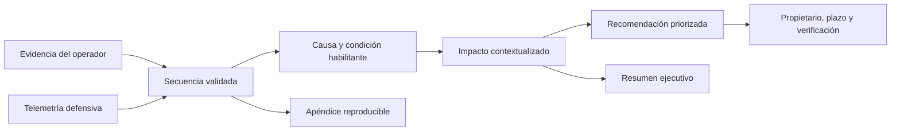

# Clase 179 — Reporte y métricas de Red Team

> Parte: **7 — Red Team y operaciones ofensivas** · Fuente: *Red Team Development and Operations (Vest & Tubberville)*
> ⏱️ Duración estimada: **90 min** · Nivel: **Intermedio**

---

## 🎯 Objetivo

Cerrar el ciclo de una operación con el entregable que le da valor: un informe claro, honesto y accionable, respaldado por métricas defensivas. El alumno aprenderá a estructurar un informe de Red Team, a narrar la ruta de ataque, a mapear cada acción a ATT&CK y a comunicar métricas como tiempo-a-detección y cobertura de forma que la dirección y el SOC actúen.

## 📚 Resultados de aprendizaje

Al finalizar, el alumno podrá:

1. **Estructurar** un informe de Red Team (executive + técnico).
2. **Narrar** la attack path de forma comprensible y reproducible.
3. **Mapear** hallazgos a ATT&CK y a recomendaciones concretas.
4. **Calcular** métricas de efectividad (TTD, TTR, cobertura, dwell time).
5. **Priorizar** recomendaciones por impacto y esfuerzo.

## 🗺️ Temas

| # | Tema | Por qué importa |
|---|------|-----------------|
| 1 | Audiencias del informe | Ejecutiva vs técnica |
| 2 | Resumen ejecutivo | Lo que lee la dirección |
| 3 | Narrativa de attack path | Cuenta la historia del compromiso |
| 4 | Evidencias y reproducibilidad | Credibilidad y remediación |
| 5 | Mapeo a ATT&CK | Lenguaje común y cobertura |
| 6 | Métricas (TTD/TTR/cobertura) | Miden a la defensa |
| 7 | Recomendaciones priorizadas | Convierten hallazgos en acción |

## 🧠 Explicación en profundidad

### Un informe traduce evidencia en una decisión

El reporte no es el diario cronológico del operador. Selecciona evidencia suficiente para explicar qué objetivo se alcanzó, qué condición lo permitió, qué impacto sería razonable y qué cambio reduce el riesgo. La misma operación produce vistas distintas: dirección necesita decisiones, propietarios necesitan prioridades y responsables técnicos necesitan artefactos reproducibles.

El resumen ejecutivo evita nombres de herramientas salvo que sean relevantes para la decisión. Describe escenario, activos o procesos afectados, controles que funcionaron, exposición residual y acciones prioritarias. La sección técnica conserva timestamps, identidades de prueba, técnica ATT&CK, evidencias y limitaciones. Ambas deben contar la misma historia con diferente resolución.

### Una ruta de ataque necesita causalidad

La narrativa une cada salto con una evidencia y explica por qué habilitó el siguiente. No basta con enumerar comandos. También se registran controles que detuvieron o detectaron actividad y las hipótesis no confirmadas. Esto evita sesgo de supervivencia y permite que el equipo defensor reproduzca la condición sin repetir toda la operación.

ATT&CK aporta un lenguaje común, no una puntuación de riesgo. Un mapeo debe llegar al nivel de técnica o subtécnica sustentada por el procedimiento observado. Asignar muchas técnicas no vuelve más grave un hallazgo ni prueba cobertura defensiva.

### Las métricas requieren reloj y evento de inicio definidos

`Time to Detect` carece de significado si no se declara desde qué instante se mide: inicio de la acción, primer evento disponible o final de ejecución. `Time to Respond` puede significar tiempo hasta triage, contención o cierre. Antes del ejercicio se fija cada hito y se sincronizan relojes. Cuando una actividad nunca se detecta, el dato no es cero ni infinito utilizable: se registra como **no detectada dentro de la ventana**.

Promedios aislados esconden distribución y criticidad. Se reportan muestra, mediana o percentiles cuando haya suficientes observaciones, y se separan técnicas, turnos y severidades. Una única operación sirve como evidencia diagnóstica, no como tendencia estadística.

### Una recomendación debe poder cerrarse

«Mejorar monitoreo» no es accionable. Una buena recomendación identifica la condición raíz, control propuesto, responsable probable, prioridad, dependencia y prueba de verificación. Se distingue acción inmediata —revocar un permiso— de cambio estructural —rediseñar delegación administrativa—. El hallazgo se cierra cuando la misma hipótesis deja de producir el impacto o es detectada y respondida según el criterio acordado.

## 📖 Definiciones y características

- **Resumen ejecutivo**: síntesis no técnica del riesgo y el impacto. Característica: sin jerga, orientada a decisiones.
- **Attack path narrative**: relato paso a paso de cómo se llegó al objetivo. Característica: reproducible y con evidencias.
- **TTD (Time To Detect)**: tiempo desde una acción hasta su detección. Característica: mide la visibilidad del SOC.
- **TTR (Time To Respond)**: tiempo desde la detección hasta la respuesta. Característica: mide la reacción.
- **Dwell time**: tiempo que el atacante permanece sin ser detectado. Característica: métrica clave de exposición.
- **Cobertura ATT&CK**: qué técnicas fueron detectadas. Característica: se visualiza en Navigator y guía la mejora.

## 📔 Glosario

- **Audiencia:** grupo que usa el informe para tomar un tipo concreto de decisión.
- **Resumen ejecutivo:** síntesis del escenario, impacto y prioridades sin detalle operativo innecesario.
- **Hallazgo:** condición demostrada con evidencia, impacto, causa y recomendación.
- **Attack path narrative:** explicación causal de los pasos que conectaron acceso e impacto.
- **Evidencia reproducible:** dato suficiente para verificar el hecho sin repetir daño innecesario.
- **TTD:** intervalo definido entre un hito de actividad y el hito acordado de detección.
- **TTR:** intervalo entre detección y un hito explícito de respuesta.
- **Ventana de observación:** periodo dentro del cual se busca y evalúa una reacción.
- **Cobertura validada:** comportamiento probado con resultado y contexto documentados.
- **Causa raíz:** condición subyacente cuya corrección evita o reduce recurrencia.
- **Criterio de cierre:** prueba objetiva que confirma la remediación.

## 🧰 Herramientas y preparación

- El cuaderno de operación (Clase 176) con timestamps y evidencias.
- **ATT&CK Navigator** para la capa de cobertura del informe.
- Plantilla de informe (executive summary + narrativa + hallazgos + recomendaciones + apéndice técnico).
- Datos de detección del ciclo purple (Clase 178) para las métricas.

> ⚠️ El informe describe actividad autorizada y debe manejarse como información sensible: contiene el mapa para comprometer al cliente. Protege su distribución (cifrado, control de acceso) y respeta el NDA. Nada aquí implica ejecutar técnicas nuevas.

## 🧪 Laboratorio guiado (ejercicio aplicado)

1. **Reúne el material.** Toma el cuaderno de la operación en tu AD lab (foothold → AD → DA) con timestamps y capturas.
2. **Redacta el resumen ejecutivo.** Media página: objetivo, si se alcanzó, riesgo de negocio y 3 recomendaciones clave, sin jerga.
3. **Escribe la narrativa.** Cuenta el attack path en orden, cada paso con: acción, evidencia, ID ATT&CK y si fue detectado.
4. **Construye la tabla de hallazgos.** Cada hallazgo con severidad, impacto, técnica ATT&CK y recomendación priorizada.
5. **Calcula métricas.** Para cada fase, deriva TTD y TTR a partir de los timestamps del cuaderno y los datos del SOC; estima el dwell time global.
6. **Genera la capa de cobertura.** En Navigator, marca en verde/rojo las técnicas detectadas/no detectadas y expórtala como anexo.
7. **Prioriza recomendaciones.** Ordénalas en una matriz impacto/esfuerzo para que el cliente sepa por dónde empezar.

## ✍️ Ejercicios

1. Escribe un resumen ejecutivo de media página para una operación ficticia.
2. Redacta la narrativa de 3 pasos de un attack path con evidencias.
3. Crea una tabla de 5 hallazgos con severidad y recomendación.
4. Calcula TTD y TTR de dos fases a partir de timestamps dados.
5. Construye una capa de cobertura ATT&CK del ejercicio.
6. Prioriza 6 recomendaciones en una matriz impacto/esfuerzo.

## 📝 Reto verificable

Produce un **informe de Red Team completo** de tu ejercicio en el AD lab: resumen ejecutivo, narrativa del attack path con mapeo ATT&CK, tabla de hallazgos, métricas (TTD/TTR/dwell/cobertura) y recomendaciones priorizadas.
**Criterio de aceptación:** el informe permite a un ejecutivo entender el riesgo en la primera página y a un ingeniero reproducir y remediar cada hallazgo desde el detalle técnico; las métricas están respaldadas por timestamps reales del cuaderno y hay una capa de cobertura en Navigator adjunta.

## ⚠️ Errores comunes

| Síntoma / mensaje | Causa y cómo arreglar |
|-------------------|-----------------------|
| Resumen lleno de jerga | La dirección no lo entiende; reescribe en lenguaje de negocio |
| Hallazgos no reproducibles | Faltan evidencias/pasos; usa el cuaderno con timestamps |
| Sin métricas | El ejercicio no se puede valorar; calcula TTD/TTR/dwell |
| Recomendaciones genéricas | No accionables; concreta acción, responsable y prioridad |
| Informe filtrable | Sensible sin protección; cífralo y controla el acceso |

## ❓ Preguntas frecuentes

**❓ ¿Un informe de Red Team es como uno de pentest?**
Comparten estructura, pero el de Red Team enfatiza la **narrativa del attack path** y las métricas de detección/respuesta, no solo un catálogo de vulnerabilidades.

**❓ ¿Debo listar TODO lo que hice?**
Lo relevante para reproducir y remediar, sí. El detalle exhaustivo va al apéndice técnico; el cuerpo cuenta la historia y prioriza.

**❓ ¿Qué métrica valora más la dirección?**
El dwell time y el TTD/TTR: indican cuánto tiempo estuvo "dentro" el atacante y cómo respondió la organización, que es lo que el Red Team evalúa.

## 🔗 Referencias

- NIST — *Technical Guide to Information Security Testing and Assessment*, SP 800-115. <https://doi.org/10.6028/NIST.SP.800-115> — fuente principal para análisis, causa raíz, mitigación y reporte adaptado.
- Vest & Tubberville — *Red Team Development and Operations*. <https://redteam.guide/> — estructura operativa y comunicación de ejercicios red team.
- MITRE ATT&CK Navigator. <https://github.com/mitre-attack/attack-navigator> — referencia oficial de capas para visualizar mapeos y cobertura.
- MITRE ATT&CK — *Get Started: Defenders*. <https://attack.mitre.org/resources/get-started/> — guía para usar ATT&CK como conocimiento y no como puntuación automática de riesgo.
- NIST — *Incident Response Recommendations and Considerations for Cybersecurity Risk Management*, SP 800-61 Rev. 3. <https://doi.org/10.6028/NIST.SP.800-61r3> — guía vigente para integrar detección, respuesta y recuperación; las definiciones métricas concretas se acuerdan en el ejercicio.

## 📥 Material descargable

- 📄 [Guía en PDF](./clase-179-guia.pdf) — versión imprimible de esta clase.
- 🎞️ [Presentación (PPTX)](./clase-179-presentacion.pptx) — deck para proyectar en clase.

## ⬅️ Clase anterior

[Clase 178 — Purple teaming](../178-purple-teaming/README.md)

## ➡️ Siguiente clase

[Clase 180 — Adversary emulation con Atomic Red Team y Caldera](../180-adversary-emulation-con-atomic-red-team-y-caldera/README.md)
