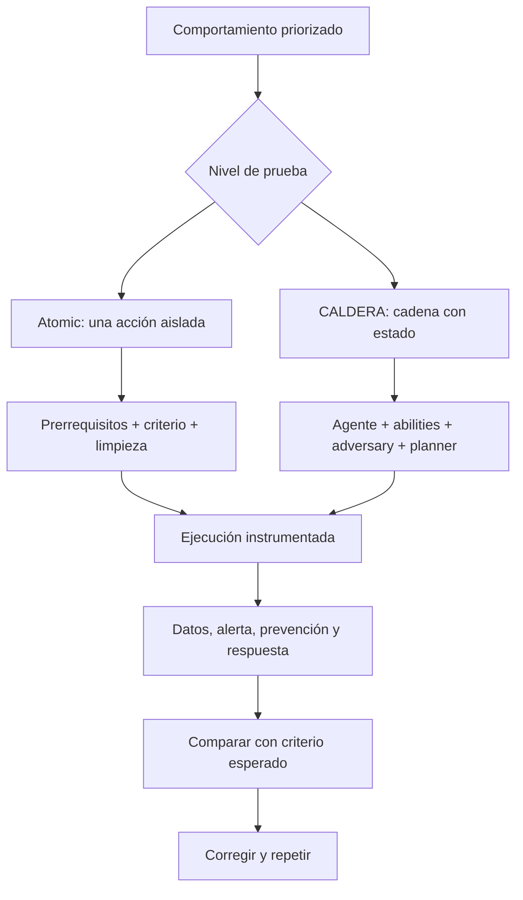

# Clase 180 — Adversary emulation con Atomic Red Team y Caldera

> Parte: **7 — Red Team y operaciones ofensivas** · Fuente: *Atomic Red Team / Apache Caldera (Incubating; proyecto originado en MITRE)*
> ⏱️ Duración estimada: **110 min** · Nivel: **Avanzado**

---

## 🎯 Objetivo

Automatizar la emulación de adversarios con dos herramientas complementarias: Atomic Red Team (tests atómicos por técnica ATT&CK) y Apache Caldera (framework de emulación con agentes y planificadores, originado en MITRE y transferido a Apache Incubator en mayo de 2026). El alumno ejecutará pruebas reproducibles en su lab, medirá la detección y cerrará el círculo entre ofensiva y defensa que abre y cierra esta parte.

## 📚 Resultados de aprendizaje

Al finalizar, el alumno podrá:

1. **Ejecutar** tests atómicos de Atomic Red Team mapeados a ATT&CK.
2. **Desplegar** Caldera y lanzar una operación con agentes.
3. **Encadenar** técnicas en un adversary profile de Caldera.
4. **Medir** la detección de cada TTP en el SIEM/EDR.
5. **Automatizar** un ciclo repetible de emulación + validación.

## 🗺️ Temas

| # | Tema | Por qué importa |
|---|------|-----------------|
| 1 | Atomic Red Team | Tests atómicos por técnica |
| 2 | Invoke-AtomicRedTeam | Runner en PowerShell |
| 3 | Caldera: server y agentes | Emulación autónoma |
| 4 | Abilities y adversary profiles | Encadenar TTPs |
| 5 | Planners | Cómo Caldera decide el siguiente paso |
| 6 | Validación de detección | Cerrar el ciclo con el SOC |
| 7 | Automatización repetible | Emulación continua |

## 🧠 Explicación en profundidad

### Una prueba atómica y una emulación responden preguntas distintas

Atomic Red Team ofrece pruebas pequeñas, enfocadas y descritas en archivos estructurados. Son útiles para preguntar si un comportamiento concreto genera el dato o control esperado. Una emulación de adversario conecta procedimientos en un escenario coherente, con dependencias, objetivos y estado. Superar un atomic no demuestra que la organización detectaría toda la técnica; completar una cadena tampoco identifica por sí solo cuál sensor falló.

La selección comienza por una amenaza y un activo relevantes, no por ejecutar todo el catálogo. Cada prueba se revisa como código: comandos, entradas, prerrequisitos, privilegios, descargas, cambios y limpieza. La documentación oficial exige permiso y una máquina de prueba con controles activos.



### Anatomía de un atomic reproducible

La definición identifica técnica, plataformas, entradas, ejecutor, comando, dependencias y, cuando corresponde, limpieza. `-CheckPrereqs` permite inspeccionar requisitos; obtenerlos automáticamente sigue siendo una modificación que debe revisarse. El cleanup reduce artefactos conocidos, pero no garantiza restaurar snapshots, alertas, cachés o todos los cambios. Para pruebas riesgosas se usa una VM desechable y se compara su estado antes y después.

El identificador del test, versión del repositorio y valores de entrada forman parte de la evidencia. Sin ellos, dos ejecuciones con el mismo ID ATT&CK pueden no ser comparables.

### Cómo razona Apache Caldera

En CALDERA, un **agent** representa el endpoint que ejecuta tareas; una **ability** define una capacidad ejecutable y su mapeo; un **adversary profile** agrupa abilities; y un **planner** decide orden o elegibilidad durante una operación. Los facts obtenidos pueden satisfacer variables y habilitar acciones posteriores. Esa dependencia de estado acerca la prueba a una cadena, pero también aumenta impacto potencial.

Autonomía no significa ausencia de supervisión. Se limitan agentes, objetivos, abilities, duración y condiciones de parada. Primero se ejecuta en modo controlado y se revisa cada comando. La emulación continua solo se programa cuando limpieza, aislamiento, propiedad de alertas y regresión están demostrados.

### Interpretar el resultado sin sobreafirmar

Para cada paso se registra: ¿se ejecutó?, ¿qué dato apareció?, ¿hubo prevención?, ¿se generó alerta?, ¿llegó al analista?, ¿la respuesta fue correcta? Un fallo de ejecución no equivale a una detección y una alerta manualmente encontrada no equivale a una capacidad operacional. Navigator resume el mapa; el detalle vive en la evidencia de cada test.

## 📖 Definiciones y características

- **Atomic Red Team**: biblioteca de pruebas pequeñas y aisladas, una por técnica ATT&CK. Característica: reproducibles y fáciles de auditar.
- **Atomic test**: comando/acción concreto que ejercita una técnica. Característica: granular, ideal para validar una detección.
- **Apache Caldera (Incubating)**: plataforma abierta de emulación originada en MITRE y transferida a Apache Software Foundation en 2026. Característica: combina agentes, abilities, perfiles y planners.
- **Ability**: unidad ejecutable en Caldera ligada a una técnica ATT&CK. Característica: componible en perfiles.
- **Adversary profile**: conjunto ordenado de abilities que emula a un actor. Característica: reutilizable y automatizable.
- **Planner**: lógica que decide qué ability ejecutar a continuación. Característica: da autonomía a la operación.

## 📔 Glosario

- **Prueba atómica:** acción pequeña y enfocada que ejercita un procedimiento determinado.
- **Execution framework:** herramienta que interpreta y ejecuta definiciones de pruebas.
- **Prerrequisito:** estado, software, archivo o privilegio necesario antes de ejecutar.
- **Cleanup:** comandos destinados a revertir artefactos conocidos; no sustituye un snapshot.
- **Emulación de adversario:** representación controlada de comportamientos encadenados y orientados a objetivos.
- **Agent:** componente CALDERA que recibe y ejecuta tareas en un endpoint autorizado.
- **Ability:** capacidad ejecutable con plataforma, comando y metadatos.
- **Adversary profile:** conjunto de abilities que representa un escenario o comportamiento.
- **Planner:** lógica que selecciona y ordena abilities durante una operación.
- **Fact:** dato conocido u observado que puede alimentar acciones posteriores.
- **Operación:** instancia de ejecución con agentes, perfil, planner, estado y resultados.
- **Regresión continua:** repetición gobernada de pruebas para comprobar controles a lo largo del tiempo.

## 🧰 Herramientas y preparación

- **Atomic Red Team** + **Invoke-AtomicRedTeam** (módulo PowerShell) en una VM Windows del lab.
- **Apache Caldera (Incubating)** en un servidor aislado: fija una versión del repositorio <https://github.com/apache/caldera>, clónala con submódulos y sigue sus requisitos vigentes. No expongas su consola a Internet.
- Instrumentación defensiva (Sysmon + SIEM/EDR) de la Clase 178 para validar detecciones.
- ATT&CK Navigator para reflejar la cobertura resultante.

> ⚠️ Atomic Red Team ejecuta acciones ofensivas reales (aunque acotadas): córrelo **solo** en máquinas de laboratorio con snapshots, nunca en producción. Caldera controla agentes: despliégalos únicamente en hosts propios del lab. Revisa siempre qué hace cada test antes de ejecutarlo.

## 🧪 Laboratorio guiado

1. **Instala Atomic Red Team:**

   ```powershell
   IEX (IWR 'https://raw.githubusercontent.com/redcanaryco/invoke-atomicredteam/master/install-atomicredteam.ps1' -UseBasicParsing)
   Install-AtomicRedTeam -getAtomics
   ```

2. **Ejecuta un test atómico.** Lanza un test de una técnica de esta parte, p. ej. Kerberoasting o `T1059.001`:

   ```powershell
   Invoke-AtomicTest T1558.003 -ShowDetails
   Invoke-AtomicTest T1558.003
   ```

   Luego limpia con `-Cleanup`.
3. **Valida la detección.** Busca en tu SIEM/EDR el evento asociado y confirma si hubo alerta.
4. **Despliega Apache Caldera.** Usa una versión fijada del repositorio actual, crea un entorno virtual y sigue la guía de esa versión. Arranca el servidor solo dentro de la red aislada; abre la consola y despliega un agente de laboratorio en una VM autorizada.
5. **Lanza una operación.** Usa un adversary profile existente (p. ej. "Discovery") o crea uno encadenando abilities de discovery → credential access.
6. **Observa la cadena.** Sigue en Caldera qué abilities ejecuta el planner y correlaciona cada una con la telemetría en el SIEM.
7. **Cierra el ciclo.** Marca en Navigator las técnicas emuladas como detectadas/no detectadas y anota qué reglas faltan por crear.

## ✍️ Ejercicios

1. Ejecuta 3 tests atómicos de técnicas distintas y limpia tras cada uno.
2. Para cada test, verifica si tu SIEM lo detecta y anótalo.
3. Despliega un agente Caldera y confírmalo en la consola.
4. Crea un adversary profile con 4 abilities encadenadas.
5. Lanza la operación y documenta la secuencia del planner.
6. Genera una capa de cobertura en Navigator con lo emulado.

## 📝 Reto verificable

Ejecuta una **campaña de emulación automatizada** en tu lab combinando ambas herramientas: al menos 5 tests atómicos y una operación de Caldera con un perfil de 4+ abilities, validando la detección de cada TTP en tu SIEM/EDR.
**Criterio de aceptación:** presentas la salida de los 5 tests atómicos (con su limpieza), la operación de Caldera con su secuencia de abilities, y una capa de Navigator que marca cada técnica emulada como detectada o no, con la regla pendiente para las no detectadas.

## ⚠️ Errores comunes

| Síntoma / mensaje | Causa y cómo arreglar |
|-------------------|-----------------------|
| `Install-AtomicRedTeam` falla | ExecutionPolicy o TLS; ajusta la policy en la VM de lab |
| Un test deja residuos | No corriste `-Cleanup`; usa snapshots y limpia siempre |
| Agente Caldera no aparece | Egress/firewall bloquea; revisa la URL del server y conectividad del lab |
| El planner no avanza | Faltan facts/requisitos de las abilities; revisa dependencias |
| Detección incoherente | SIEM sin la fuente de datos; instrumenta antes de emular |

## ❓ Preguntas frecuentes

**❓ ¿Atomic Red Team o Caldera?**
Complementarios: Atomic para validar detecciones técnica por técnica; Caldera para emular cadenas de ataque autónomas de un actor. Juntos cubren el espectro.

**❓ ¿Es seguro correr Atomic en cualquier máquina?**
No. Ejecuta acciones ofensivas reales; úsalo solo en labs con snapshots y tras leer qué hace cada test. Nunca en producción.

**❓ ¿Esto reemplaza al Red Team humano?**
No. Automatiza la emulación repetible y la validación de detecciones, pero la creatividad, el OPSEC y la adaptación al entorno siguen siendo humanas.

## 🔗 Referencias

- Atomic Red Team — documentación oficial. <https://www.atomicredteam.io/docs/atomic-red-team> — fuente para estructura, autorización, entorno de prueba, dependencias y limpieza.
- Invoke-AtomicRedTeam — *Check Prerequisites* y *Cleanup*. <https://www.atomicredteam.io/docs/invoke-atomicredteam/check-prereqs> — sustenta la preparación y reversión explícita de cada test.
- Invoke-AtomicRedTeam — repositorio oficial. <https://github.com/redcanaryco/invoke-atomicredteam> — fuente utilizada para fijar la versión del runner en el laboratorio.
- Apache Caldera (Incubating). <https://caldera.apache.org/> — portal vigente de la plataforma y referencia de su finalidad y componentes.
- Apache Caldera. <https://github.com/apache/caldera> — repositorio vigente usado para fijar versión, revisar requisitos y desplegar el laboratorio.
- MITRE — *MITRE Contributes Caldera to the Apache Incubator*. <https://www.mitre.org/news-insights/news-release/mitre-contributes-caldera-apache-incubator-expand-open-cybersecurity> — fuente primaria para la transferencia anunciada el 20 de mayo de 2026 y la continuidad de MITRE en el proyecto.
- MITRE ATT&CK. <https://attack.mitre.org/> — vocabulario para mapear comportamiento; el resultado se conserva por prueba concreta.

## 📥 Material descargable

- 📄 [Guía en PDF](./clase-180-guia.pdf) — versión imprimible de esta clase.
- 🎞️ [Presentación (PPTX)](./clase-180-presentacion.pptx) — deck para proyectar en clase.

## ⬅️ Clase anterior

[Clase 179 — Reporte y métricas de Red Team](../179-reporte-y-metricas-de-red-team/README.md)

## ➡️ Siguiente clase

[Clase 181 — El SOC moderno: roles, niveles y procesos](../../parte-8-blue-team-deteccion-y-soc/181-el-soc-moderno-roles-niveles-y-procesos/README.md)
