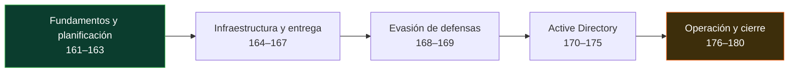

# 🔴 Parte 7 — Red Team y operaciones ofensivas

> [⬅️ Volver al programa](../../README.md) · [📚 Índice completo](../README.md) · [⬅️ Parte anterior](../parte-6-analisis-de-malware/README.md) · [⏭️ Parte siguiente](../parte-8-blue-team-deteccion-y-soc/README.md)

Adversary emulation, C2, evasión de EDR y Active Directory

**Fuentes de referencia de esta parte:**

- Joe Vest & James Tubberville — *Red Team Development and Operations: A Practical Guide*.
- Ben Clark & Nick Downer — *RTFM: Red Team Field Manual v2*.
- MITRE — *ATT&CK Framework* y *Adversary Emulation Plans* (attack.mitre.org, ctid.mitre.org).
- Tim Bryant — *Operator Handbook: Red Team + OSINT + Blue Team Reference*.
- The Hacker Recipes — *AD / Kerberos attack reference* (thehacker.recipes).
- SpecterOps — *BloodHound* y publicaciones sobre Active Directory attack paths.

> ⚠️ **Nota ética y legal (aplica a TODA la parte).** El contenido ofensivo de estas clases se practica **únicamente** en laboratorios propios y aislados (AD lab casero, [GOAD - Game of Active Directory](https://github.com/Orange-Cyberdefense/GOAD), rangos de práctica autorizados) o dentro de un compromiso de Red Team con **autorización escrita, alcance (Rules of Engagement) y ventana temporal explícitos**. Ejecutar cualquiera de estas técnicas contra sistemas de terceros sin permiso es un delito en la mayoría de jurisdicciones. Este material forma operadores éticos: la meta es emular al adversario para **mejorar la defensa**, no dañar.

---

## 🎯 ¿De qué trata esta parte?

El Red Team lleva el pentesting a otra dimensión: en lugar de buscar "todas las vulnerabilidades", emula a un adversario real con objetivos concretos (exfiltrar cierta base de datos, comprometer el dominio, alcanzar un sistema de control industrial) mientras evita ser detectado por el Blue Team. Es una disciplina que combina técnica ofensiva profunda, sigilo operacional (OPSEC) y una comprensión íntima de cómo funcionan —y cómo detectan— las defensas modernas.

Esta parte te lleva desde la filosofía y el encuadre de un ejercicio de Red Team, pasando por el lenguaje común de la industria (MITRE ATT&CK), el diseño de infraestructura de comando y control (C2), la evasión de antivirus y EDR, y el corazón de casi todo compromiso corporativo: **el ataque a Active Directory**. Cerramos con OPSEC, red teaming físico, purple teaming, reporte con métricas y automatización de la emulación con Atomic Red Team y Caldera.

Sirve a pentesters que quieren evolucionar hacia operaciones adversariales, a defensores que necesitan entender al atacante para detectarlo, y a cualquier profesional que aspire a roles de Red Team, purple team o adversary emulation. Se apoya en todo lo aprendido en explotación (Parte 5) y análisis de malware (Parte 6), y alimenta directamente la Parte 8 (Blue Team y SOC).

## 🧩 Problemas que resuelve

- Cómo planificar y ejecutar un ejercicio adversarial con objetivos y métricas, no solo un listado de CVEs.
- Cómo hablar el idioma común de tácticas y técnicas (ATT&CK) con clientes, defensores y otros operadores.
- Cómo montar infraestructura C2 resiliente, con redirectores y perfiles que resistan el análisis del Blue Team.
- Cómo entregar payloads por phishing y lograr acceso inicial sin quemar la operación al primer clic.
- Cómo evadir antivirus y EDR modernos entendiendo hooks de usermode, AMSI, ETW y telemetría del kernel.
- Cómo comprometer un dominio de Active Directory de punta a punta: enumeración, Kerberoasting, movimiento lateral, DCSync, Golden Ticket y persistencia.
- Cómo convertir el ejercicio en valor defensivo: purple teaming, reporte, métricas y automatización de la detección.

## 🎓 Resultados de aprendizaje

Al terminar la parte, el alumno podrá:

1. Diferenciar Red Team de pentest y redactar objetivos, RoE y un plan de emulación basado en un actor real.
2. Mapear técnicas ofensivas a MITRE ATT&CK y construir un plan de emulación desde threat intelligence.
3. Diseñar y desplegar infraestructura C2 con redirectores, dominios y perfiles maleables en un laboratorio propio.
4. Operar frameworks C2 (Sliver, Mythic; conceptos de Cobalt Strike) y entender su telemetría.
5. Construir campañas de phishing controladas y payloads que evadan defensas en un lab autorizado.
6. Evadir AV/EDR con técnicas de ofuscación, bypass de AMSI/ETW y comprender sus contramedidas.
7. Comprometer un dominio de Active Directory de laboratorio completo y documentar cada TTP con su detección.
8. Ejecutar un ciclo purple team y producir un informe de Red Team con métricas accionables para la defensa.

## 🧱 Prerrequisitos

- **Parte 3** (metodología de pentesting) y **Parte 5** (explotación de sistemas y binarios).
- **Parte 6** (análisis de malware): entender packing, C2 y evasión desde la óptica defensiva ayuda enormemente.
- Sólida base de Windows y redes (Partes 0 y 1), scripting en PowerShell/Python y manejo de Linux.
- Un laboratorio virtualizado con capacidad para un dominio AD (recomendado: GOAD o un DC + 2 workstations).

## 🗺️ Estructura temática

<!-- arco:inicio -->

<!-- arco:fin -->

| Bloque | Clases | Tema |
|--------|--------|------|
| Fundamentos y planificación | 161–163 | Filosofía Red Team, MITRE ATT&CK, emulación de adversarios |
| Infraestructura y entrega | 164–167 | Diseño de C2, frameworks C2, phishing, acceso inicial |
| Evasión de defensas | 168–169 | Evasión de AV/EDR, ofuscación y bypass de AMSI |
| Active Directory | 170–175 | Enumeración, Kerberoasting, PtH/PtT, BloodHound, DCSync/Golden Ticket, persistencia |
| Operación y cierre | 176–180 | OPSEC, red team físico, purple teaming, reporte/métricas, Atomic Red Team y Caldera |

## 🔗 Referencias de la parte

- Vest, J. & Tubberville, J. *Red Team Development and Operations*. <https://redteam.guide/>
- MITRE ATT&CK. <https://attack.mitre.org/> · MITRE Engenuity CTID Adversary Emulation Library. <https://github.com/center-for-threat-informed-defense/adversary_emulation_library>
- The Hacker Recipes (AD/Kerberos). <https://www.thehacker.recipes/>
- SpecterOps — BloodHound. <https://bloodhound.specterops.io/> · <https://github.com/SpecterOps/BloodHound>
- Atomic Red Team. <https://github.com/redcanaryco/atomic-red-team> · MITRE Caldera. <https://caldera.mitre.org/>
- GOAD — Game of Active Directory. <https://github.com/Orange-Cyberdefense/GOAD>

## ▶️ Empezar

[Clase 161 — Red Team vs pentest: filosofía y objetivos](161-red-team-vs-pentest-filosofia-y-objetivos/README.md)
