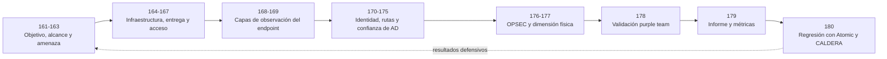

# Parte 7 — Red Team y operaciones ofensivas

> [⬅️ Volver al programa](../../README.md) · [📚 Índice completo](../README.md) · [⬅️ Parte anterior](../parte-6-analisis-de-malware/README.md) · [⏭️ Parte siguiente](../parte-8-blue-team-deteccion-y-soc/README.md)

**20 clases** · rango 161–180 · Adversary emulation, C2, evasión de EDR y Active Directory

**Fuentes de referencia de esta parte:**

- Joe Vest & James Tubberville — *Red Team Development and Operations: A Practical Guide*.
- Ben Clark & Nick Downer — *RTFM: Red Team Field Manual v2*.
- MITRE — *ATT&CK Framework* y *Adversary Emulation Plans* (attack.mitre.org, ctid.mitre.org).
- Tim Bryant — *Operator Handbook: Red Team + OSINT + Blue Team Reference*.
- The Hacker Recipes — *AD / Kerberos attack reference* (thehacker.recipes).
- SpecterOps — *BloodHound* y publicaciones sobre Active Directory attack paths.

> ⚠️ **Nota ética y legal (aplica a TODA la parte).** El contenido ofensivo de estas clases se practica **únicamente** en laboratorios propios y aislados (AD lab casero, [GOAD - Game of Active Directory](https://github.com/Orange-Cyberdefense/GOAD), rangos de práctica autorizados) o dentro de un compromiso de Red Team con **autorización escrita, alcance (Rules of Engagement) y ventana temporal explícitos**. Ejecutar cualquiera de estas técnicas contra sistemas de terceros sin permiso es un delito en la mayoría de jurisdicciones. Este material forma operadores éticos: la meta es emular al adversario para **mejorar la defensa**, no dañar.

---

## 🎯 ¿De qué trata esta parte?

El Red Team lleva el pentesting a otra dimensión: en lugar de buscar "todas las vulnerabilidades", emula a un adversario real con objetivos concretos (exfiltrar cierta base de datos, comprometer el dominio, alcanzar un sistema de control industrial) mientras evita ser detectado por el Blue Team. Es una disciplina que combina técnica ofensiva profunda, sigilo operacional (OPSEC) y una comprensión íntima de cómo funcionan —y cómo detectan— las defensas modernas.

Esta parte te lleva desde la filosofía y el encuadre de un ejercicio de Red Team, pasando por el lenguaje común de la industria (MITRE ATT&CK), el diseño de infraestructura de comando y control (C2), la evasión de antivirus y EDR, y el corazón de casi todo compromiso corporativo: **el ataque a Active Directory**. Cerramos con OPSEC, red teaming físico, purple teaming, reporte con métricas y automatización de la emulación con Atomic Red Team y Caldera.

Sirve a pentesters que quieren evolucionar hacia operaciones adversariales, a defensores que necesitan entender al atacante para detectarlo, y a cualquier profesional que aspire a roles de Red Team, purple team o adversary emulation. Se apoya en todo lo aprendido en explotación (Parte 5) y análisis de malware (Parte 6), y alimenta directamente la Parte 8 (Blue Team y SOC).

## 🧩 Problemas que resuelve

- Cómo planificar y ejecutar un ejercicio adversarial con objetivos y métricas, no solo un listado de CVEs.
- Cómo hablar el idioma común de tácticas y técnicas (ATT&CK) con clientes, defensores y otros operadores.
- Cómo montar infraestructura C2 resiliente, con redirectores y perfiles que resistan el análisis del Blue Team.
- Cómo entregar payloads por phishing y lograr acceso inicial sin quemar la operación al primer clic.
- Cómo evadir antivirus y EDR modernos entendiendo hooks de usermode, AMSI, ETW y telemetría del kernel.
- Cómo comprometer un dominio de Active Directory de punta a punta: enumeración, Kerberoasting, movimiento lateral, DCSync, Golden Ticket y persistencia.
- Cómo convertir el ejercicio en valor defensivo: purple teaming, reporte, métricas y automatización de la detección.

## 🎓 Resultados de aprendizaje

Al terminar la parte, el alumno podrá:

1. Diferenciar Red Team de pentest y redactar objetivos, RoE y un plan de emulación basado en un actor real.
2. Mapear técnicas ofensivas a MITRE ATT&CK y construir un plan de emulación desde threat intelligence.
3. Diseñar y desplegar infraestructura C2 con redirectores, dominios y perfiles maleables en un laboratorio propio.
4. Operar frameworks C2 (Sliver, Mythic; conceptos de Cobalt Strike) y entender su telemetría.
5. Evaluar campañas de phishing y acceso inicial controladas, midiendo impacto y telemetría en un laboratorio autorizado.
6. Explicar cómo AV, EDR y AMSI observan la ejecución, experimentar de forma aislada con degradación de una fuente y diseñar controles compensatorios.
7. Comprometer un dominio de Active Directory de laboratorio completo y documentar cada TTP con su detección.
8. Ejecutar un ciclo purple team y producir un informe de Red Team con métricas accionables para la defensa.

## 🧱 Prerrequisitos

- **Parte 3** (metodología de pentesting) y **Parte 5** (explotación de sistemas y binarios).
- **Parte 6** (análisis de malware): entender packing, C2 y evasión desde la óptica defensiva ayuda enormemente.
- Sólida base de Windows y redes (Partes 0 y 1), scripting en PowerShell/Python y manejo de Linux.
- Un laboratorio virtualizado con capacidad para un dominio AD (recomendado: GOAD o un DC + 2 workstations).

## 🗺️ Estructura temática

| Bloque | Clases | Tema |
|--------|--------|------|
| Fundamentos y planificación | 161–163 | Filosofía Red Team, MITRE ATT&CK, emulación de adversarios |
| Infraestructura y entrega | 164–167 | Diseño de C2, frameworks C2, phishing, acceso inicial |
| Evasión de defensas | 168–169 | Evasión de AV/EDR, ofuscación y bypass de AMSI |
| Active Directory | 170–175 | Enumeración, Kerberoasting, PtH/PtT, BloodHound, DCSync/Golden Ticket, persistencia |
| Operación y cierre | 176–180 | OPSEC, red team físico, purple teaming, reporte/métricas, Atomic Red Team y Caldera |

## 🧭 Mapa de aprendizaje de la parte

La secuencia no está organizada como un catálogo de herramientas. Cada bloque responde una pregunta que necesita la anterior. Primero se define **qué se autoriza y por qué**; luego se construye una emulación trazable; después se estudian acceso, ejecución e identidad; finalmente se verifica qué observó la defensa y se traduce la evidencia en una mejora.

La flecha de regreso importa: una operación madura no termina al obtener acceso. Los resultados ajustan las hipótesis de amenaza, las reglas de enfrentamiento y el siguiente plan de validación.

## 📖 Cómo estudiar cada clase

Cada clase se trabaja en cinco momentos. El orden evita que el laboratorio se convierta en una serie de comandos sin comprensión:

1. **Modelo mental.** Lee el objetivo, los resultados y la explicación en profundidad. Reconstruye el diagrama sin mirar el texto y explica qué cambia de estado en cada paso.
2. **Vocabulario.** Usa definiciones y glosario para distinguir conceptos próximos: TGT frente a TGS, autenticación frente a autorización, telemetría frente a alerta o prueba atómica frente a emulación.
3. **Hipótesis.** Antes de ejecutar, escribe qué debería ocurrir, qué fuente debería observarlo, cuál es el criterio de éxito y cuándo debes detenerte.
4. **Laboratorio instrumentado.** Ejecuta solo en el entorno autorizado, conserva hora, versión, entradas y resultado, y observa tanto el efecto ofensivo como la respuesta defensiva.
5. **Reflexión y transferencia.** Responde ejercicios y errores comunes, relaciona el resultado con ATT&CK y propone una medida verificable. La respuesta no se considera completa si solo reproduce la salida de una herramienta.

## 🔬 Caso conductor

Para dar continuidad, las clases pueden recorrerse con una organización ficticia que posee un dominio de laboratorio, una aplicación pública de práctica, dos estaciones y un SIEM. La white cell entrega un objetivo medible: demostrar si una identidad de prueba puede alcanzar un marcador en un servidor, sin afectar disponibilidad ni usar datos reales.

| Fase | Pregunta pedagógica | Evidencia mínima |
|------|---------------------|-----------------|
| Planificación | ¿Qué comportamiento se emula y bajo qué límites? | Objetivo, RoE, amenaza y condiciones de parada |
| Acceso y C2 | ¿Qué control permite o detecta el primer acceso? | Hipótesis, timestamp, identidad y telemetría |
| Active Directory | ¿Qué relación habilita el camino, no solo qué herramienta lo muestra? | Objetos, aristas, permisos y verificación independiente |
| Purple team | ¿Existe dato, analítica, alerta y respuesta? | Resultado separado por cada capa |
| Cierre | ¿Qué decisión cambia gracias a la prueba? | Hallazgo causal, propietario y criterio de remediación |

## ✅ Evaluación de la parte

La evaluación final no exige comprometer producción ni desarrollar malware. Se entrega un **dossier de emulación autorizada** construido en el laboratorio:

- plan con alcance, exclusiones, amenaza y criterios de parada;
- diagrama de una ruta de acceso e identidad, con cada transición justificada;
- bitácora sincronizada que permita deconfliction;
- matriz por procedimiento con dato esperado, dato observado, prevención, alerta y respuesta;
- informe ejecutivo y técnico con una recomendación verificable;
- prueba de regresión pequeña, con prerrequisitos y limpieza documentados.

El trabajo se aprueba cuando otra persona puede explicar la cadena causal, reproducir la prueba de forma segura y verificar la mejora. No se premia el número de herramientas ni el volumen de comandos.

## 🧾 Criterio de fuentes y afirmaciones

Las explicaciones de protocolo y plataforma se apoyan primero en documentación del fabricante o especificaciones; ATT&CK se usa para clasificar comportamientos y detecciones; NIST, para gobierno de pruebas y reporte; y los proyectos oficiales, para el uso de sus herramientas. Blogs y manuales operativos sirven como apoyo práctico, pero no sustituyen una fuente primaria cuando se afirma cómo funciona Kerberos, AMSI, Active Directory o CALDERA.

Cada referencia de clase indica qué parte del contenido sustenta. Si una afirmación depende de versión o configuración, la clase lo declara y el laboratorio registra esa versión. Lo que no pueda verificarse se formula como hipótesis, no como hecho.

## 🔗 Referencias de la parte

- NIST SP 800-115 — planificación, ejecución segura, análisis y reporte de evaluaciones. <https://doi.org/10.6028/NIST.SP.800-115>
- MITRE ATT&CK — taxonomía de tácticas, técnicas, fuentes y estrategias de detección. <https://attack.mitre.org/>
- Center for Threat-Informed Defense — biblioteca de planes de emulación. <https://github.com/center-for-threat-informed-defense/adversary_emulation_library>
- Microsoft Learn — arquitectura de autenticación, Kerberos, AMSI y seguridad de Active Directory. <https://learn.microsoft.com/en-us/windows-server/security/windows-authentication/windows-authentication-architecture>
- SpecterOps — BloodHound y análisis de rutas. <https://bloodhound.specterops.io/analyze-data/findings/attack-paths>
- Atomic Red Team — estructura, prerrequisitos y limpieza de pruebas. <https://www.atomicredteam.io/docs/atomic-red-team>
- Apache Caldera (Incubating) — agentes, abilities, adversarios, planners y operaciones; proyecto originado en MITRE y transferido a Apache Incubator en 2026. <https://caldera.apache.org/>
- Vest, J. & Tubberville, J. — *Red Team Development and Operations*. <https://redteam.guide/>
- GOAD — laboratorio vulnerable reproducible de Active Directory. <https://github.com/Orange-Cyberdefense/GOAD>

## ▶️ Empezar

[Clase 161 — Red Team vs pentest: filosofía y objetivos](161-red-team-vs-pentest-filosofia-y-objetivos/README.md)
