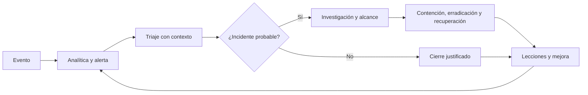

# Clase 181 — El SOC moderno: roles, niveles y procesos

> Parte: **8 — Blue Team, detección y SOC** · Fuente: *Blue Team Handbook: SOC, SIEM, and Threat Hunting Use Cases* — Don Murdoch
> ⏱️ Duración estimada: **90 min** · Nivel: **Fundamentos**

---

## 🎯 Objetivo

Entender qué es un Security Operations Center (SOC) moderno: cómo se organiza en niveles (L1/L2/L3), qué roles lo componen, cómo fluye una alerta desde que se genera hasta que se cierra, y qué modelos operativos existen (interno, MSSP, híbrido). Al final tendrás un mapa mental del ecosistema defensivo sobre el que se apoya toda la Parte 8.

## 📚 Resultados de aprendizaje

Al finalizar, el alumno podrá:

1. **Enumerar** los roles clave de un SOC y sus responsabilidades.
2. **Describir** el ciclo de vida de una alerta (triaje → investigación → escalado → respuesta → cierre).
3. **Diferenciar** los modelos SOC interno, MSSP, virtual e híbrido según necesidad.
4. **Aplicar** conceptos de MTTD y MTTR para razonar sobre el rendimiento del SOC.
5. **Situar** cada herramienta (SIEM, EDR, SOAR, TIP) dentro del flujo operativo.

## 🗺️ Temas

| # | Tema | Por qué importa |
|---|------|-----------------|
| 1 | Definición y misión del SOC | Alinea detección y respuesta con el riesgo del negocio |
| 2 | Niveles L1/L2/L3 y funciones | Define quién hace qué y cómo se escala |
| 3 | Roles: analista, hunter, ingeniero de detección, IR | Evita vacíos de responsabilidad |
| 4 | Ciclo de vida de una alerta | Estandariza el trabajo y reduce errores |
| 5 | Modelos operativos (interno/MSSP/híbrido) | Impacta coste, control y cobertura |
| 6 | Runbooks y playbooks | Consistencia y velocidad ante incidentes |
| 7 | Métricas base (MTTD, MTTR, dwell time) | Permiten mejorar con datos, no con opinión |
| 8 | Turnos y modelo de cobertura (8x5 vs 24x7) | Determina la ventana de exposición |

## 🧠 Explicación en profundidad

Un SOC no es una sala llena de pantallas: es una **capacidad operativa** que convierte señales técnicas en decisiones de riesgo. Personas, procesos, datos y herramientas deben funcionar como un sistema. NIST SP 800-61 Rev. 3 integra la respuesta a incidentes con las seis funciones de CSF 2.0; por eso el SOC no empieza cuando aparece una alerta ni termina cuando se cierra un ticket. También participa en preparación, aprendizaje y reducción del riesgo.

Los niveles L1/L2/L3 son un modelo frecuente, no una norma universal. Su utilidad está en separar decisiones: L1 valida calidad y contexto mínimo; L2 determina alcance e impacto; L3 resuelve investigaciones complejas y transforma lo aprendido en mejores controles. Una escalada útil entrega evidencia, consultas ejecutadas, activos afectados y preguntas pendientes. Reenviar una alerta sin contexto solo traslada la cola.

El cierre es una producción de conocimiento: debe registrar disposición, evidencia, causa de falsos positivos y acciones posteriores. Las métricas necesitan puntos de inicio y fin explícitos; «MTTR» puede significar tiempo hasta reconocer, contener, recuperar o cerrar. Comparar cifras sin esa definición crea una apariencia de precisión, no aprendizaje.

### Cómo se razona una alerta dentro del SOC

Supongamos que una regla informa que Word inició PowerShell. El L1 no debería limitarse a leer el nombre de ambos procesos. Primero confirma que el evento corresponde al host y periodo correctos, consulta la línea de comandos, la identidad, el documento de origen y la criticidad del equipo. Si Word abrió un script firmado desde una plantilla corporativa, el contexto reduce la sospecha; si descargó contenido y PowerShell se conecta a un dominio nuevo, aumenta. Esta comparación enseña por qué triaje significa **reducir incertidumbre**, no decidir a toda velocidad.

El L2 recibe el caso con ese contexto y formula preguntas de alcance: ¿ocurrió en más equipos?, ¿la cuenta inició sesiones anómalas?, ¿aparecieron archivos o persistencia?, ¿hay comunicación exterior? El L3 o especialista entra cuando hacen falta análisis de memoria, ingeniería inversa o una nueva analítica. La separación no es jerárquica por prestigio: protege la atención de especialistas y evita que investigaciones complejas bloqueen el flujo básico.

El diagrama debe leerse como un circuito, no como una cinta transportadora. La flecha de «lecciones» hacia «analítica» obliga a revisar la regla; también puede revelar que falta telemetría, que un runbook es ambiguo o que el control preventivo debe cambiar. Así, un SOC maduro no se mide por cuántas alertas cierra, sino por cuánto reduce incertidumbre y riesgo con evidencia reproducible.

### Roles que cooperan, no compartimentos aislados

El modelo L1/L2/L3 sirve para ordenar la carga, pero puede volverse contraproducente si crea silos. El analista que hace triaje conoce primero los patrones de ruido; esa información debe llegar al ingeniero de detección. El hunter descubre conductas que todavía no generan alertas; debe transferir consultas, datos requeridos y casos negativos. El respondedor conoce qué evidencia faltó durante la contención; ese aprendizaje debe modificar logging y playbooks. El responsable del SOC mantiene prioridades, capacidad, riesgo y comunicación con el negocio. En equipos pequeños, una persona puede asumir varias funciones, pero las responsabilidades siguen necesitando nombre y tiempo asignado.

Una matriz RACI aclara una dimensión, no toda la operación. Para una alerta de acceso privilegiado, por ejemplo, el analista puede ser responsable del triaje, el incident commander aprobador de la respuesta, IAM consultado para interpretar la cuenta y el dueño del servicio informado. Si dos personas figuran como aprobadoras o ninguna tiene autoridad para aislar un servidor, el problema aparecerá durante la crisis. Por eso la matriz se prueba con escenarios, no se archiva como organigrama.

### Modelo interno, MSSP o híbrido

Un SOC interno conserva contexto, control de prioridades y cercanía con ingeniería, pero exige personal, turnos, formación y continuidad. Un MSSP aporta escala y cobertura compartida; sin acceso a contexto empresarial puede limitarse a reenviar alertas. El modelo híbrido suele repartir monitoreo continuo y conocimiento local, pero necesita un contrato operativo preciso: qué fuentes ve el proveedor, qué enriquece, cuándo llama, quién conserva evidencia, qué ocurre fuera de horario y cómo se mide el servicio.

La decisión no se toma solo por coste de licencias. Se comparan riesgo, tiempo de cobertura, soberanía de datos, dependencia del proveedor, capacidad de respuesta y conocimiento que debe permanecer dentro. Un servicio «24x7» no garantiza respuesta 24x7 si el cliente no tiene autoridad de guardia para contener. Cobertura significa que una señal puede convertirse en decisión durante toda la ventana prometida.

### Herramientas dentro del proceso

El SIEM centraliza y correlaciona telemetría; el EDR conserva contexto y permite acciones en endpoints; una TIP gestiona inteligencia; SOAR coordina tareas; el sistema de casos registra evidencia y decisiones. Ninguna herramienta reemplaza al proceso que la rodea. Si el EDR aísla un host pero el playbook no define autorización ni reversión, existe capacidad técnica sin control operativo. Si el SIEM genera una alerta sin dueño ni criterio de severidad, existe detección sin respuesta.

Runbook y playbook tampoco son sinónimos. «Consultar los inicios de sesión de una cuenta» puede ser un runbook técnico. El playbook de compromiso de identidad decide cuándo ejecutar esa consulta, qué otras fuentes revisar, cuándo revocar sesiones, quién comunica al usuario y qué evidencia conservar. El primero reduce variación al ejecutar; el segundo coordina decisiones bajo incertidumbre.

### Medir sin deformar el comportamiento

MTTD, MTTR y dwell time requieren población y relojes que quizá no estén disponibles. El momento real del compromiso suele conocerse solo después, de modo que MTTD puede medirse para incidentes confirmados y no para amenazas nunca descubiertas. Una media baja puede ocultar pocos casos extremadamente lentos; conviene observar distribución, percentiles y severidad. La tasa de falsos positivos necesita denominador: alertas cerradas como benignas sobre alertas investigadas, con criterios consistentes.

Las métricas deben provocar una conversación y una acción. Si aumenta el tiempo de triaje porque ahora se documenta mejor el alcance, no significa automáticamente deterioro. Si una regla produce miles de cierres repetidos, el problema puede estar en la hipótesis, el dato o el control preventivo. El SOC aprende cuando relaciona la cifra con la causa y asigna una mejora verificable.

## 📔 Glosario

- **Triaje:** clasificación inicial basada en validez, severidad y contexto.
- **Escalada:** transferencia documentada de responsabilidad o especialidad.
- **Caso:** contenedor de evidencias y decisiones; no equivale automáticamente a incidente.
- **Runbook:** instrucciones repetibles para una tarea concreta.
- **Playbook:** coordinación de decisiones, tareas y responsables ante un escenario.
- **RACI:** matriz de responsable, aprobador, consultado e informado.
- **Criterio de cierre:** condiciones verificables para terminar un caso.
- **Bucle de mejora:** retorno de lo aprendido hacia datos, reglas, controles y formación.

## 📖 Definiciones y características

- **SOC (Security Operations Center):** equipo y plataforma que monitorea, detecta, investiga y responde a amenazas de forma continua. Característica clave: opera con procesos definidos, no ad hoc.
- **Analista L1 (triage):** primer filtro; clasifica alertas, descarta falsos positivos evidentes y escala lo que merece investigación. Característica: alto volumen, decisiones rápidas.
- **Analista L2 (investigación):** profundiza, correlaciona múltiples fuentes y determina alcance. Característica: pivota entre telemetría de red, endpoint e identidad.
- **L3 / Threat Hunter / Ingeniero de detección:** caza proactiva, crea y afina detecciones, lidera incidentes complejos. Característica: trabaja por hipótesis, no solo por alertas.
- **MTTD (Mean Time To Detect):** tiempo medio desde el compromiso hasta la detección. Cuanto menor, menos daño.
- **MTTR (Mean Time To Respond):** tiempo medio hasta contener/erradicar. Mide la eficacia de la respuesta.
- **Dwell time:** tiempo que el atacante permanece sin ser detectado. Métrica reina del blue team.

## 🔍 Caso resuelto — de una alerta a una decisión

El SIEM genera una alerta porque `WINWORD.EXE` inició `powershell.exe` en el portátil de la directora financiera. La severidad inicial es alta por criticidad del activo, pero todavía no existe un incidente confirmado.

1. **L1 valida la señal.** Confirma host, usuario, hora y que los eventos no estén duplicados. Revisa proceso padre, línea de comandos y fuente del documento. Encuentra `-EncodedCommand` y una conexión posterior. No cierra por el simple hecho de que PowerShell sea una herramienta legítima.
2. **L1 escala con contexto.** Entrega IDs de eventos, consulta utilizada, documento, hash, dominio, criticidad y ventana investigada. Formula la pregunta pendiente: determinar alcance y persistencia.
3. **L2 amplía el alcance.** Busca el mismo hash, dominio y patrón padre-hijo en la flota; revisa identidad y correo. Encuentra el mensaje en tres buzones, pero ejecución solo en un host. Clasifica el caso como incidente probable de phishing con ejecución.
4. **Incident response decide contención.** Se aísla el portátil y se revocan sesiones de la cuenta con autorización registrada. Antes se preservan los artefactos volátiles definidos por el playbook.
5. **L3 y detección cierran el bucle.** Analizan el payload, afinan la regla con la relación Office–intérprete–red y crean una búsqueda retrospectiva. El cierre incluye alcance, acciones, evidencia, limitaciones y prueba de regresión.

La enseñanza no es que cada alerta siga exactamente esos cargos. Es que cada transición agrega evidencia y cambia una decisión. Si L1 hubiera reenviado solo el nombre de la regla, L2 repetiría trabajo; si el equipo hubiera aislado sin autoridad ni adquisición, podría perder evidencia; si cerrara sin regresión, aprendería únicamente sobre ese caso.

## ✅ Evidencias de aprendizaje

El alumno demuestra comprensión cuando puede entregar un flujo donde cada rol tiene una decisión, una entrada y una salida; distingue alerta, caso e incidente; define los relojes de sus métricas; y explica qué mejora retorna al SOC. Un organigrama sin criterios de escalada no cumple el objetivo.

## 🧰 Herramientas y preparación

No necesitas software ofensivo en esta clase; es conceptual y de diseño. Prepara:

- Un editor de diagramas (draw.io / Excalidraw) para modelar el flujo de alertas.
- Una hoja de cálculo para tu **matriz RACI** de roles.
- Acceso al catálogo de MITRE ATT&CK (attack.mitre.org) para familiarizarte con el vocabulario.
- Opcional: revisa la documentación de un SIEM (Splunk, Elastic) para ubicar dónde encaja en el SOC.

Recuerda que todo laboratorio práctico posterior se hace en un **entorno propio y aislado**.

## 🧪 Laboratorio guiado — Diseña tu SOC en papel

Ejercicio aplicado de arquitectura organizativa (no ofensivo):

1. **Define el alcance.** Imagina una empresa de 500 empleados, un data center pequeño y nube (Microsoft 365 + AWS). Anota qué activos son críticos.
2. **Elige el modelo operativo.** Justifica interno vs MSSP vs híbrido según presupuesto y madurez. Documenta 3 pros y 3 contras.
3. **Dibuja el flujo de una alerta.** Desde que Sysmon/EDR genera un evento hasta que se cierra el ticket. Marca los puntos de escalado L1→L2→L3.
4. **Construye la matriz RACI.** Para 5 actividades (triaje, hunting, creación de reglas, respuesta a incidentes, reporte a dirección) asigna Responsible/Accountable/Consulted/Informed.
5. **Define la cobertura.** Decide 8x5 vs 24x7 y calcula la ventana de exposición nocturna/fin de semana. Propón una mitigación (on-call, MSSP nocturno).
6. **Selecciona la pila de herramientas.** Ubica SIEM, EDR, SOAR, TIP y ticketing en el flujo del paso 3.
7. **Fija 4 métricas.** Elige MTTD, MTTR, % falsos positivos y cobertura ATT&CK; define cómo medirías cada una.

## ✍️ Ejercicios

1. Escribe la descripción de puesto (3 responsabilidades) de un analista L1 y de un ingeniero de detección.
2. Redacta el runbook de 6 pasos para una alerta de "inicio de sesión imposible" (geografía incompatible).
3. Compara MTTD y dwell time con un ejemplo numérico propio.
4. Diseña el criterio de escalado L1→L2 con 3 condiciones objetivas.
5. Argumenta cuándo un MSSP es mala idea para una organización concreta.
6. Propón una métrica que un mal SOC podría manipular y explica cómo evitar el gaming.

## 📝 Reto verificable

Entrega un documento de 1–2 páginas con: (a) organigrama del SOC con roles, (b) diagrama del ciclo de vida de la alerta, (c) matriz RACI, (d) 4 métricas con su fórmula. **Criterio de aceptación:** el flujo de alerta muestra al menos un punto de escalado y un punto de cierre con documentación, y cada rol del organigrama aparece como "Responsible" de al menos una actividad en la RACI.

## ⚠️ Errores comunes

| Síntoma / mensaje | Causa y cómo arreglar |
|-------------------|-----------------------|
| Todos los analistas hacen de todo | Falta separación L1/L2/L3; define niveles y criterios de escalado |
| Métrica MTTR baja pero incidentes reincidentes | Se cierra rápido sin erradicar causa raíz; añade métrica de reincidencia |
| Cola de alertas siempre saturada | Exceso de falsos positivos; prioriza afinar reglas antes que contratar gente |
| Nadie es dueño de las detecciones | No hay ingeniero de detección; asigna el rol formalmente |
| SOC 24x7 pero apagado los findes | Cobertura mal diseñada; documenta on-call o MSSP suplementario |

## ❓ Preguntas frecuentes

**❓ ¿Necesito un SOC 24x7 desde el día uno?**
No. Empieza con 8x5 y on-call, mide tu ventana de exposición y crece según el riesgo real. Un 24x7 mal dotado es peor que un 8x5 bien afinado.

**❓ ¿SIEM y SOC son lo mismo?**
No. El SIEM es una herramienta; el SOC es el equipo y los procesos que la usan (junto con EDR, SOAR, hunting, etc.).

**❓ ¿Cuál es la diferencia entre threat hunting y monitoreo de alertas?**
El monitoreo reacciona a lo que una regla ya disparó; el hunting busca proactivamente lo que ninguna regla detectó, partiendo de hipótesis.

## 🔗 Referencias

- Murdoch, D. *Blue Team Handbook: SOC, SIEM, and Threat Hunting Use Cases*.
- Bejtlich, R. *The Practice of Network Security Monitoring*. No Starch Press.
- MITRE ATT&CK — <https://attack.mitre.org/>
- SANS, "Building a World-Class Security Operations Center" (whitepaper).
- NIST SP 800-61 Rev. 3, *Incident Response Recommendations and Considerations for Cybersecurity Risk Management* — <https://doi.org/10.6028/NIST.SP.800-61r3>
- NIST CSF 2.0, marco para integrar gobierno, identificación, protección, detección, respuesta y recuperación — <https://doi.org/10.6028/NIST.CSWP.29>

## 📥 Material descargable

- 📄 [Guía en PDF](./clase-181-guia.pdf) — versión imprimible de esta clase.
- 🎞️ [Presentación (PPTX)](./clase-181-presentacion.pptx) — deck para proyectar en clase.

## ⬅️ Clase anterior

[Clase 180 — Adversary emulation con Atomic Red Team y Caldera](../../parte-7-red-team-y-operaciones-ofensivas/180-adversary-emulation-con-atomic-red-team-y-caldera/README.md)

## ➡️ Siguiente clase

[Clase 182 — Logging y fuentes de telemetría](../182-logging-y-fuentes-de-telemetria/README.md)
