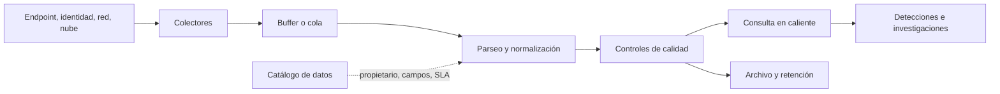

# Clase 182 — Logging y fuentes de telemetría

> Parte: **8 — Blue Team, detección y SOC** · Fuente: *Applied Network Security Monitoring* — Chris Sanders y Jason Smith · *NIST SP 800-92*
> ⏱️ Duración estimada: **100 min** · Nivel: **Fundamentos**

---

## 🎯 Objetivo

Aprender qué telemetría existe, cómo se clasifica y cómo diseñar una estrategia de recolección que no deje puntos ciegos críticos. Sin buenos datos, la mejor detección es inútil: esta clase construye la base de "materia prima" que alimentará el SIEM, el hunting y toda la detección posterior.

## 📚 Resultados de aprendizaje

Al finalizar, el alumno podrá:

1. **Clasificar** fuentes de telemetría (host, red, identidad, nube, aplicación).
2. **Distinguir** datos de sesión, transacción, alerta, estadística y contenido completo (taxonomía NSM).
3. **Priorizar** qué registrar según valor de detección y coste de almacenamiento.
4. **Configurar** reenvío de logs con agentes y syslog hacia un colector central.
5. **Detectar** puntos ciegos en la cobertura de logging de una red.

## 🗺️ Temas

| # | Tema | Por qué importa |
|---|------|-----------------|
| 1 | Taxonomía de datos NSM | Da un vocabulario para pensar la telemetría |
| 2 | Fuentes de endpoint (Event Logs, Sysmon, EDR) | Donde ocurre la ejecución del ataque |
| 3 | Fuentes de red (flujo, PCAP, DNS, proxy) | Ven lo que el host puede ocultar |
| 4 | Identidad y autenticación (AD, IdP, VPN) | Permite reconstruir quién accedió, desde dónde y con qué privilegios |
| 5 | Nube y SaaS (CloudTrail, M365 audit) | El log del data center ya no basta |
| 6 | Normalización y marcas de tiempo (UTC, NTP) | Sin tiempo correcto no hay correlación |
| 7 | Retención y coste | Equilibra visibilidad y presupuesto |
| 8 | Puntos ciegos y cobertura | Delimita qué comportamientos pueden investigarse y cuáles quedan sin evidencia |

## 🧠 Explicación en profundidad

La telemetría defensiva debe tratarse como un **producto de datos con propósito**, no como una acumulación indiscriminada. Cada fuente debe responder qué comportamiento permite observar, con qué campos, durante cuánto tiempo y con qué limitaciones. Endpoint muestra procesos y archivos; identidad muestra autenticaciones y privilegios; red aporta relaciones y protocolos; nube y aplicaciones revelan acciones que nunca pasan por un host administrado. Ninguna fuente ofrece por sí sola la historia completa.

Conviene conservar el evento original y producir, además, una representación normalizada. El original permite revisar errores del parser; el esquema común permite correlacionar fuentes. Deben distinguirse al menos tres tiempos: cuándo ocurrió la acción, cuándo la registró el productor y cuándo llegó a la plataforma. Esa diferencia explica eventos tardíos y obliga a usar ventanas con solapamiento.

La retención se decide por caso de uso, riesgo, obligación legal, privacidad y coste. «Guardar todo» puede aumentar exposición y ruido. Para cada fuente se valida completitud, puntualidad, fidelidad de campos, volumen esperado y ausencia de duplicados. Una regla perfecta sobre datos interrumpidos es una detección inexistente.

### Del caso de uso al dato necesario

Para detectar una cuenta que usa RDP por primera vez no basta pedir «logs de Windows». La hipótesis necesita, como mínimo, identidad, host origen, host destino, tipo de inicio de sesión y tiempo; para evaluar rareza necesita además historia suficiente. Ese desglose convierte un deseo genérico en un contrato verificable. Si el origen llega vacío en el 40 % de los eventos, la detección no tiene la misma cobertura aunque el SIEM muestre millones de registros.

La normalización tampoco consiste en renombrar columnas mecánicamente. Dos productos pueden usar `user` para la cuenta solicitante y la cuenta afectada. Antes de mapear se define la semántica y se conserva el campo original. Lo mismo ocurre con una IP detrás de NAT o con un hostname reutilizado: normalizar facilita consultas, pero la identidad de la entidad todavía necesita contexto.

Lee el diagrama de izquierda a derecha y prueba cada frontera. En la fuente se pregunta si el evento se genera; en el colector, si se pierde al desconectarse; en el parser, si los tipos y tiempos son correctos; en almacenamiento, si la retención cubre la investigación; y en detección, si llega antes del SLA. Un control sintético —por ejemplo, un evento benigno emitido cada hora— permite comprobar la cadena completa. Esto transforma «tenemos logging» en una afirmación medible.

### Elegir telemetría por preguntas defensivas

Para investigar ejecución sospechosa se necesitan proceso, línea de comandos, identidad, linaje y, según la pregunta, firma o hash. Para abuso de identidad hacen falta autenticación, resultado, método, origen, recurso y cambios de privilegio. Para posible exfiltración se combinan red, proxy, aplicación y contexto del dato. Esta descomposición permite priorizar: una fuente costosa que no responde un caso relevante no gana valor por producir mucho volumen.

Las fuentes describen perspectivas diferentes. Endpoint asocia una conexión al proceso; red confirma que cruzó un sensor; DNS muestra resolución; identidad explica la sesión; la aplicación registra la acción de negocio. Si dos fuentes discrepan, se revisan relojes, NAT, proxies, campos y alcance de sensores. La discrepancia puede ser precisamente el hallazgo de calidad que faltaba.

### Parsear sin alterar el significado

El parser transforma tipos y extrae campos. Una cadena `10` y un entero `10` no siempre se consultan igual; una fecha sin zona puede desplazarse al normalizar. Los eventos fallidos no deberían desaparecer: pasan a una cola observable con muestra y razón. Se conserva mensaje raw, representación normalizada y versión del pipeline para atribuir un cambio a la fuente, al parser o a la analítica.

Un esquema común tampoco autoriza borrar matices. «Usuario actor» y «usuario objetivo» son relaciones distintas aunque el producto use una sola etiqueta. La semántica se documenta antes del mapeo. Esa disciplina evita correlaciones que parecen correctas porque los campos comparten nombre, pero describen entidades diferentes.

### Retención, protección y calidad operativa

La ventana de investigación guía retención. Conservar autenticaciones siete días no permite reconstruir un acceso inicial descubierto al día treinta; guardar todo indefinidamente aumenta coste y privacidad. Se decide qué queda disponible inmediatamente, qué pasa a archivo y qué se elimina de forma verificable. La única copia tampoco debe quedar bajo control del host investigado: reenvío temprano, separación de cuentas y alertas por silencio protegen la historia.

Completitud mide lo recibido frente a lo esperado; puntualidad, la demora; exactitud, si el campo representa su contrato; consistencia, cambios y duplicados. Un catálogo registra propietario, propósito, campos críticos, tasa, latencia, retención y detecciones dependientes. Cuando la fuente se degrada, el SOC puede nombrar las capacidades afectadas en lugar de decir vagamente que «faltan logs».

## 📔 Glosario

- **Fuente:** sistema que origina registros.
- **Colector:** componente que recibe o extrae eventos.
- **Parser:** lógica que convierte texto o estructura de origen en campos.
- **Normalización:** mapeo a nombres y tipos comunes sin borrar el original.
- **Latencia de ingesta:** diferencia entre ocurrencia y disponibilidad para consulta.
- **Retención:** periodo y nivel de almacenamiento de los datos.
- **Dato caliente:** telemetría optimizada para consulta inmediata.
- **Calidad de datos:** completitud, exactitud, puntualidad y consistencia útiles para un caso.

## 📖 Definiciones y características

- **Datos de sesión (flow):** metadatos de conexiones (IP origen/destino, puertos, bytes, duración). Característica: baratos y de larga retención; ideales para hunting histórico.
- **Contenido completo (full packet capture):** PCAP con la carga útil. Característica: máxima fidelidad, alto coste de almacenamiento; se retiene poco tiempo.
- **Datos de alerta:** salidas de IDS/EDR (Suricata, Snort). Característica: ya interpretados, propensos a falsos positivos.
- **Datos estadísticos:** agregados (top talkers, volúmenes). Característica: útiles para anomalías y línea base.
- **Log de endpoint:** eventos del SO y aplicaciones (Security.evtx, Sysmon). Característica: granularidad de proceso, línea de comandos, red por proceso.
- **Normalización:** llevar campos heterogéneos a un esquema común (ej. ECS de Elastic). Característica: habilita correlación entre fuentes.
- **Sincronización temporal:** los sistemas mantienen una referencia de tiempo coherente y documentada, normalmente UTC con NTP. Característica: reduce ambigüedades al correlacionar eventos; el desfase debe medirse y conservarse cuando no pueda corregirse.

## 🔍 Ejemplo trabajado — contrato de datos para RDP anómalo

La hipótesis es: «una cuenta de servicio que no usa sesiones interactivas inicia RDP desde un origen no administrativo». Se transforma en requisitos verificables:

| Pregunta | Campo o contexto | Si falta |
|---|---|---|
| ¿Qué identidad inició la sesión? | cuenta y dominio normalizados | no se puede atribuir |
| ¿Desde dónde? | host/IP origen y traducciones conocidas | no se evalúa ruta autorizada |
| ¿Hacia qué activo? | host destino y criticidad | no se prioriza impacto |
| ¿Qué clase de sesión? | tipo de logon o evento de RDP | se mezclan servicios y usuarios |
| ¿Era esperable? | inventario de cuentas y grafo administrativo | rareza sin contexto |
| ¿Qué ocurrió después? | procesos/sesión en destino | no se distingue acceso de actividad |

Se genera una sesión benigna controlada. El evento aparece en el host, tarda 40 segundos en llegar, conserva origen y mapea la identidad correctamente. Después se desconecta temporalmente el colector para verificar buffering. Finalmente se consulta un periodo histórico suficiente para establecer frecuencia. Esta prueba recorre el diagrama completo y produce evidencia de cobertura.

Si el campo origen queda vacío, la acción correcta no es añadir una regla que lo ignore. Se abre una brecha de dato, se identifica versión/configuración del productor y se declara que esa variante no está cubierta. El contrato permite decir qué se perdió y qué decisiones quedaron afectadas.

## ✅ Criterio de dominio

La estrategia es válida cuando cada fuente tiene propósito, propietario, campos críticos, latencia, retención y control de salud; el alumno puede explicar qué fuente confirma cada afirmación y qué conclusión no puede obtener con los datos disponibles.

## 🧰 Herramientas y preparación

Monta un laboratorio aislado con:

- **Sysmon** (Sysinternals) en un Windows de pruebas, con una configuración base (p. ej. la de SwiftOnSecurity como punto de partida).
- **Winlogbeat** o **NXLog** para reenviar Event Logs.
- **rsyslog/syslog-ng** en un Linux como colector central.
- **Zeek** (antes Bro) para telemetría de red rica (conn.log, dns.log, http.log).
- Un servidor NTP interno o `chrony`/`w32tm` apuntando a una fuente confiable.

Todo en tu red de laboratorio; no captures tráfico de redes que no te pertenecen.

## 🧪 Laboratorio guiado — Centraliza y cubre puntos ciegos

1. **Instala Sysmon** en el Windows de laboratorio:
   `sysmon64.exe -accepteula -i sysmonconfig.xml`
   Verifica en Visor de eventos: *Applications and Services Logs > Microsoft > Windows > Sysmon/Operational*.
2. **Reenvía Event Logs.** Configura Winlogbeat (`winlogbeat.yml`) para enviar los canales Security y Sysmon/Operational hacia tu colector.
3. **Levanta el colector.** En Linux, habilita recepción syslog en rsyslog (`module(load="imudp")` y `input(type="imudp" port="514")`).
4. **Añade telemetría de red.** Instala Zeek en un tap/mirror del laboratorio: `zeek -i eth0 local`. Revisa `conn.log` y `dns.log`.
5. **Sincroniza el tiempo.** Configura NTP en todas las máquinas y confirma con `w32tm /query /status` (Windows) y `chronyc tracking` (Linux). Todo en UTC.
6. **Mapa de cobertura.** Crea una tabla activo × fuente de log y marca huecos: ¿registras autenticación? ¿DNS? ¿PowerShell? ¿tráfico saliente?
7. **Prueba de humo.** Ejecuta un comando benigno (`whoami /all`) y confirma que aparece en el colector con timestamp coherente entre host y red.

## ✍️ Ejercicios

1. Clasifica 8 fuentes de tu laboratorio según la taxonomía NSM.
2. Calcula el coste aproximado de retener 30 días de PCAP para un enlace de 100 Mbps al 20% de uso.
3. Diseña una política de retención por tipo de dato (flow, alerta, endpoint, PCAP).
4. Identifica 3 puntos ciegos típicos en una pyme y cómo cerrarlos.
5. Explica por qué el log de PowerShell (ScriptBlock) merece prioridad alta.
6. Propón qué recolectar de M365/Azure AD y por qué.

## 📝 Reto verificable

Entrega un **plan de logging** de una página con: matriz activo×fuente, prioridad (alta/media/baja) por fuente, política de retención y 3 puntos ciegos con su remediación. **Criterio de aceptación:** en tu laboratorio, un evento generado en el endpoint aparece en el colector central con la misma marca de tiempo (±2 s) que la vista local, demostrando reenvío y sincronización correctos.

## ⚠️ Errores comunes

| Síntoma / mensaje | Causa y cómo arreglar |
|-------------------|-----------------------|
| Eventos con horas descuadradas | NTP no configurado; sincroniza todo a UTC |
| El SIEM no recibe Sysmon | Canal no incluido en Winlogbeat; añade `Microsoft-Windows-Sysmon/Operational` |
| Volumen de logs dispara el coste | Registras todo sin filtrar; filtra ruido (ej. eventos 4688 irrelevantes) |
| No hay rastro de un ataque conocido | Punto ciego; faltaba PowerShell/DNS logging |
| Campos incomparables entre fuentes | Sin normalización; adopta un esquema común (ECS) |

## ❓ Preguntas frecuentes

**❓ ¿Registro todo o filtro?**
No existe una respuesta universal. Conserva las fuentes y campos que sostienen casos de uso, investigación, obligaciones y auditoría; mide volumen, privacidad y coste antes de excluir. Un filtro debe documentar qué evidencia elimina y cómo se valida que no rompa una detección.

**❓ ¿Event Logs nativos o Sysmon?**
Ambos. Los nativos dan autenticación y auditoría; Sysmon aporta creación de procesos con hash, línea de comandos y conexiones por proceso.

**❓ ¿Necesito PCAP completo?**
Solo en segmentos críticos y con retención corta. Para hunting histórico, los datos de sesión (flow/Zeek) rinden mucho más por byte almacenado.

## 🔗 Referencias verificables y alcance

- NIST SP 800-92, *Guide to Computer Security Log Management*: guía primaria para infraestructura, procesos y ciclo de vida de gestión de logs; sus decisiones deben adaptarse a tecnologías y riesgos actuales — <https://doi.org/10.6028/NIST.SP.800-92>
- NIST SP 800-53 Rev. 5, familia AU: fuente primaria para objetivos de auditoría, contenido, protección, revisión y retención; no define por sí sola la configuración de un producto — <https://doi.org/10.6028/NIST.SP.800-53r5>
- Microsoft Sysmon: documentación oficial de instalación, configuración y capacidades del sensor de Windows — <https://learn.microsoft.com/en-us/sysinternals/downloads/sysmon>
- Zeek, documentación oficial: referencia para los metadatos y registros de actividad de red producidos por Zeek — <https://docs.zeek.org/en/current/reference/logs/index.html>
- Elastic Common Schema (ECS): especificación oficial del esquema usado como ejemplo de normalización; adoptar ECS no corrige por sí solo errores de origen o parsing — <https://www.elastic.co/guide/en/ecs/current/index.html>
- Sanders, C. y Smith, J. *Applied Network Security Monitoring*. Syngress: bibliografía profesional complementaria para el análisis de telemetría de red.

## 📥 Material descargable

- 📄 [Guía en PDF](./clase-182-guia.pdf) — versión imprimible de esta clase.
- 🎞️ [Presentación (PPTX)](./clase-182-presentacion.pptx) — deck para proyectar en clase.

## ⬅️ Clase anterior

[Clase 181 — El SOC moderno: roles, niveles y procesos](../181-el-soc-moderno-roles-niveles-y-procesos/README.md)

## ➡️ Siguiente clase

[Clase 183 — SIEM: arquitectura y componentes](../183-siem-arquitectura-y-componentes/README.md)
