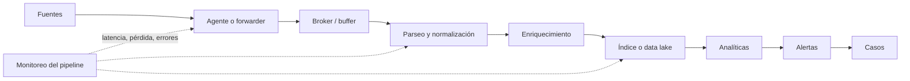

# Clase 183 — SIEM: arquitectura y componentes

> Parte: **8 — Blue Team, detección y SOC** · Fuente: *Blue Team Handbook: SOC, SIEM, and Threat Hunting Use Cases* — Don Murdoch
> ⏱️ Duración estimada: **100 min** · Nivel: **Intermedio**

---

## 🎯 Objetivo

Comprender qué es un SIEM (Security Information and Event Management), de qué piezas se compone y cómo fluye un evento desde la recolección hasta la alerta. Entenderás las decisiones de arquitectura (ingesta, parsing, indexación, correlación, retención) que determinan si un SIEM detecta o solo acumula datos.

## 📚 Resultados de aprendizaje

Al finalizar, el alumno podrá:

1. **Describir** la tubería de un SIEM: colección → normalización → indexación → correlación → alertas.
2. **Diferenciar** SIEM de un simple almacén de logs y de un EDR/XDR.
3. **Explicar** parsing, enriquecimiento y esquemas de datos.
4. **Dimensionar** ingesta (EPS/GB por día) y su impacto en licencia y hardware.
5. **Valorar** modelos de despliegue: on-prem, cloud-native y SIEM as a Service.

## 🗺️ Temas

| # | Tema | Por qué importa |
|---|------|-----------------|
| 1 | Definición y funciones del SIEM | Clarifica su rol en el SOC |
| 2 | Pipeline de ingesta | Determina qué datos entran y en qué forma |
| 3 | Parsing y normalización | Sin campos limpios no hay correlación |
| 4 | Enriquecimiento (GeoIP, threat intel, activos) | Convierte datos en contexto |
| 5 | Motor de correlación y reglas | El corazón de la detección |
| 6 | Indexación, búsqueda y retención | Afecta velocidad y coste |
| 7 | Dimensionamiento (EPS, GB/día) | Base del presupuesto y la licencia |
| 8 | Modelos de despliegue | On-prem vs cloud vs gestionado |

## 🧠 Explicación en profundidad

Un SIEM es una **cadena de suministro de evidencia**. Si un eslabón pierde datos, cambia tipos o introduce retraso, la consulta final puede ejecutarse correctamente y aun así responder mal. La arquitectura debe observar su propia salud: último evento por fuente, tasa recibida, errores de parseo, retraso, descartes y capacidad de las colas son señales de seguridad.

EPS mide eventos por segundo, mientras GB/día mide bytes ingeridos; ninguno sustituye al otro. El diseño debe considerar picos, tamaño por evento, compresión, réplicas y consultas concurrentes. Un buffer desacopla productores y consumidores, pero requiere política frente a saturación: bloquear, descartar o desviar son decisiones con consecuencias distintas.

El enriquecimiento añade valor —criticidad del activo, propietario, identidad o inteligencia—, pero necesita procedencia y caducidad. Una dirección IP puede cambiar de propietario; un usuario puede rotar de función. Finalmente, una coincidencia analítica no es un caso investigado: la capa de alertas debe agrupar, deduplicar y conservar el razonamiento que llevó a una decisión.

### Diseñar desde la investigación, no desde el producto

Imagina una caída de red de veinte minutos. Un agente con buffer local puede reenviar los eventos cuando vuelve la conexión; un envío UDP sin confirmación puede perderlos. Ambos dashboards podrían verse normales después. Por eso la arquitectura se decide preguntando qué pérdida es aceptable, cuánto retraso tolera cada detección y cómo se demuestra la recuperación. La cola no es solo rendimiento: es parte de la integridad operativa.

El dimensionamiento requiere una historia cuantitativa. Si 5.000 endpoints producen un promedio moderado pero una actualización dispara creación de procesos simultánea, el pico puede superar parsers o indexadores. Se miden percentiles y ráfagas, no únicamente promedio diario. Si el sistema aplica backpressure, se observa dónde crece la cola y cuánto tiempo hay antes de agotar disco. Si descarta, se define qué fuente pierde prioridad y quién recibe la alerta.

El diagrama también muestra dos productos diferentes: eventos y casos. Entre ambos deben existir reglas de agrupación. Diez alertas del mismo proceso en un host pueden ser un caso; la misma alerta en cien hosts puede ser una campaña. Esa decisión necesita claves de correlación y ventanas explícitas. Diseñar el SIEM desde preguntas investigativas evita comprar capacidad de ingesta sin capacidad real de explicación.

### Almacenamiento, consulta y seguridad de la plataforma

No toda la telemetría necesita la misma velocidad. Los eventos usados por alertas inmediatas permanecen en una capa de consulta rápida; la historia menos consultada puede pasar a almacenamiento económico y restaurarse cuando una investigación lo requiera. Esta separación obliga a definir cuánto tarda la restauración y qué búsquedas dejan de ser posibles. Una política de treinta días «hot» y un año archivado no equivale a trece meses de búsqueda instantánea.

La arquitectura también debe protegerse. Un SIEM concentra identidades, direcciones, comandos y hallazgos sensibles. El acceso se separa por función; las cuentas de ingesta no administran reglas; los analistas no alteran evidencia original; las acciones administrativas se auditan fuera de la misma frontera cuando sea posible. Alta disponibilidad no solo significa réplicas: se prueban recuperación, consistencia y continuidad de colectores.

### Enriquecimiento con tiempo y procedencia

Agregar «activo crítico» parece simple hasta que el inventario está atrasado. Cada enriquecimiento necesita fuente, momento de consulta y vigencia. Para investigaciones históricas puede ser incorrecto usar el propietario actual de un host sobre un evento de hace seis meses. Cuando el contexto histórico no existe, el analista debe indicarlo. El enriquecimiento ayuda a priorizar, pero nunca debe ocultar el evento de origen ni convertir reputación externa en veredicto.

Una prueba arquitectónica completa inyecta un evento conocido, sigue su recorrido y mide cada etapa: generación, recepción, parseo, indexación, coincidencia, alerta y caso. Si el evento llega pero la alerta no, la falla está después de ingesta; si no llega, revisar la regla desperdicia tiempo. Esa localización sistemática es una competencia central del ingeniero SIEM.

## 📔 Glosario

- **Forwarder:** agente que transporta eventos desde el origen.
- **Broker:** cola duradera que desacopla etapas.
- **EPS:** eventos procesados por segundo.
- **Backpressure:** acumulación causada por un consumidor más lento que el productor.
- **Índice:** estructura optimizada para buscar campos.
- **Data lake:** repositorio de datos a gran escala, usualmente con varios esquemas.
- **Enriquecimiento:** contexto adicional unido a un evento.
- **Deduplicación:** reducción de repeticiones equivalentes sin perder trazabilidad.

## 📖 Definiciones y características

- **SIEM:** plataforma que centraliza, normaliza y correlaciona eventos de seguridad para detectar, investigar y reportar. Característica: correlación entre múltiples fuentes en tiempo casi real.
- **Colector/forwarder:** agente o servicio que recibe y reenvía logs (Universal Forwarder de Splunk, Beats de Elastic). Característica: puede filtrar y enrutar en origen.
- **Parser:** convierte texto crudo en campos estructurados (`src_ip`, `user`, `event_id`). Característica: específico por tipo de fuente.
- **Enriquecimiento:** añade contexto externo (geolocalización, reputación, propietario del activo). Característica: aumenta la precisión del triaje.
- **Regla de correlación:** lógica que dispara una alerta al cumplirse condiciones sobre uno o varios eventos. Característica: puede ser umbral, secuencia o anomalía.
- **EPS (Events Per Second):** volumen de eventos por segundo. Característica: métrica de dimensionamiento y licenciamiento.
- **Retención caliente/fría:** datos recientes rápidos de consultar (hot) vs históricos baratos (cold). Característica: equilibrio coste/velocidad.

## 🔍 Diagnóstico resuelto — la regla dejó de alertar

Una detección de creación de cuentas producía resultados diarios y pasa a cero. Reiniciar la búsqueda o bajar el umbral no identifica la causa. Se recorre el pipeline desde el origen:

1. El productor sigue generando el evento; se verifica localmente con una acción controlada.
2. El forwarder informa envío, pero la cola local crece: el destino rechaza conexiones por un certificado renovado.
3. El broker no recibe nuevos eventos de esa fuente, mientras otras mantienen su tasa.
4. Parseo e índice funcionan para los últimos eventos conocidos; la consulta también coincide con un fixture histórico.

La causa es transporte, no lógica de detección. La respuesta restaura confianza/certificado, observa que la cola drena sin pérdida y comprueba el evento sintético hasta el caso. Si solo se hubiera mirado el dashboard de alertas, «cero» podría interpretarse como ausencia de ataques.

### Decisión de dimensionamiento

Supón 5.000 endpoints, 0,8 EPS promedio y picos de 4 EPS durante actualizaciones. El promedio conjunto es 4.000 EPS, pero el pico teórico alcanza 20.000. El diseño debe declarar simultaneidad realista, tamaño por evento, duración, capacidad de buffer y margen. GB/día se calcula aparte porque dos eventos pueden diferir mucho en tamaño. Estas estimaciones se validan con medición, no se presentan como capacidad garantizada.

## ✅ Criterio de dominio

El alumno debe localizar una falla por etapa, distinguir ingestión de detección, justificar buffer y política de saturación, y explicar cómo permisos, retención y enriquecimiento afectan evidencia. Dibujar componentes sin flujos de salud ni decisiones de fallo es insuficiente.

## 🧰 Herramientas y preparación

Para experimentar la arquitectura, prepara en laboratorio aislado uno de estos stacks:

- **Splunk Free/Enterprise Trial** con un Universal Forwarder enviando datos.
- **Elastic Stack** (Elasticsearch + Logstash/Beats + Kibana) vía Docker Compose.
- **Wazuh** (indexer + manager + dashboard) para un SIEM open source completo.

Reutiliza la telemetría de la clase 182 (Sysmon, Zeek) como fuente de ingesta. Trabaja siempre en tu red de laboratorio.

## 🧪 Laboratorio guiado — Traza un evento de punta a punta

1. **Levanta el SIEM.** Con Docker Compose despliega Elastic (o instala Splunk Free). Confirma acceso a Kibana/Splunk Web.
2. **Conecta una fuente.** Reenvía los Sysmon/Event Logs del Windows de laboratorio con Winlogbeat/Universal Forwarder.
3. **Verifica el parsing.** Busca un evento de creación de proceso y comprueba que campos como `process.command_line` o `Image` están extraídos, no en texto plano.
4. **Añade enriquecimiento.** Configura un pipeline que agregue GeoIP a las IP públicas (Logstash `geoip` o Splunk `iplocation`).
5. **Escribe una correlación simple.** Regla que alerte ante 5 fallos de autenticación (Event ID 4625) seguidos de un éxito (4624) para el mismo usuario en 5 minutos.
6. **Mide la ingesta.** Observa EPS/GB por día en el panel de monitoreo del SIEM y proyecta el volumen a 30 días.
7. **Prueba retención.** Configura un índice con política de ciclo de vida (ILM en Elastic) que mueva datos a fase fría a los 7 días.

## ✍️ Ejercicios

1. Dibuja el pipeline completo de tu SIEM con cada componente etiquetado.
2. Calcula el GB/día si ingestas 2.000 EPS con un tamaño medio de evento de 800 bytes.
3. Escribe el parser (regex o pipeline) para una línea de log de tu firewall.
4. Compara SIEM on-prem vs cloud-native con 4 criterios (coste, escalado, control, mantenimiento).
5. Diseña un esquema de enriquecimiento con 3 fuentes de contexto.
6. Justifica una política hot/warm/cold para 90 días de retención.

## 📝 Reto verificable

Documenta el recorrido de un evento real de tu laboratorio: captura de pantalla del dato crudo, del dato parseado con sus campos, del enriquecimiento aplicado y de la alerta correlacionada que dispara. **Criterio de aceptación:** la regla de correlación de fuerza bruta (múltiples 4625 + un 4624) dispara una alerta en el SIEM y puedes explicar en qué índice quedó y cuánto tiempo se retiene.

## ⚠️ Errores comunes

| Síntoma / mensaje | Causa y cómo arreglar |
|-------------------|-----------------------|
| Eventos llegan como texto plano | Falta parser para esa fuente; crea/asigna el sourcetype |
| Licencia excedida en Splunk | Ingesta mayor a lo contratado; filtra ruido en el forwarder |
| Búsquedas lentísimas | Retención mal segmentada; usa índices y fases hot/cold |
| Alertas duplicadas | Correlación sin dedup ni throttling; añade ventana de supresión |
| GeoIP vacío | Base de datos GeoIP no instalada/actualizada; refresca el feed |

## ❓ Preguntas frecuentes

**❓ ¿SIEM o data lake?**
El SIEM prioriza correlación y alertas en tiempo real; el data lake, almacenamiento masivo barato. Muchas arquitecturas modernas combinan ambos (SIEM para lo caliente, lake para histórico).

**❓ ¿El SIEM reemplaza al EDR?**
No. El EDR ve el endpoint en profundidad y responde; el SIEM correlaciona todas las fuentes. Se complementan; el EDR suele ser una fuente del SIEM.

**❓ ¿Cómo evito que el SIEM se vuelva un basurero de logs?**
Ingesta con propósito de detección, no por acumular. Cada fuente debe respaldar al menos un caso de uso de detección o hunting.

## 🔗 Referencias verificables y alcance

- NIST SP 800-92: fuente primaria para la arquitectura y los procesos de gestión de logs que un SIEM implementa parcialmente — <https://doi.org/10.6028/NIST.SP.800-92>
- Elastic, documentación oficial sobre creación y ejecución de reglas: respalda el recorrido desde datos consultables hasta una alerta en Elastic Security — <https://www.elastic.co/guide/en/security/current/rules-ui-create.html>
- Splunk, documentación oficial de indexación: respalda los conceptos de parsing, índices, tiempo del evento y almacenamiento en Splunk — <https://help.splunk.com/en/splunk-enterprise/administer/manage-indexers-and-indexer-clusters/10.2/indexing-overview/how-indexing-works>
- Wazuh, arquitectura oficial: describe agente, servidor, indexer, dashboard y su flujo de datos; no se extrapola automáticamente a otros SIEM — <https://documentation.wazuh.com/current/getting-started/architecture.html>
- Murdoch, D. *Blue Team Handbook: SOC, SIEM, and Threat Hunting Use Cases*: bibliografía profesional complementaria para casos de uso operativos.

## 📥 Material descargable

- 📄 [Guía en PDF](./clase-183-guia.pdf) — versión imprimible de esta clase.
- 🎞️ [Presentación (PPTX)](./clase-183-presentacion.pptx) — deck para proyectar en clase.

## ⬅️ Clase anterior

[Clase 182 — Logging y fuentes de telemetría](../182-logging-y-fuentes-de-telemetria/README.md)

## ➡️ Siguiente clase

[Clase 184 — Splunk para detección](../184-splunk-para-deteccion/README.md)
