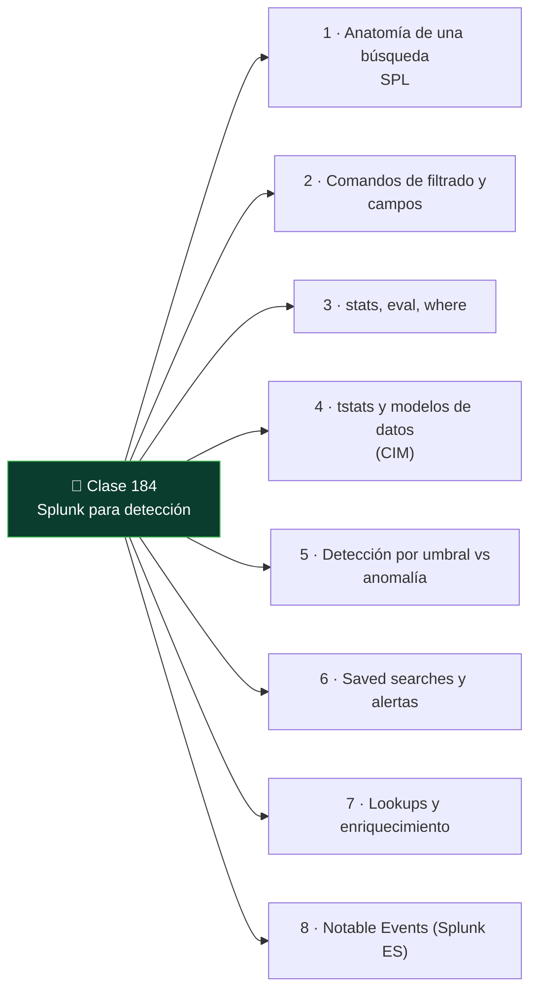

# Clase 184 — Splunk para detección

<!-- cabecera:inicio -->

> 🗂️ Parte: **8 — Blue Team, detección y SOC** · 📖 Fuente: *Blue Team Handbook: SOC, SIEM, and Threat Hunting Use Cases* — Don Murdoch
> ⏱️ Duración estimada: **120 min** · 🎚️ Nivel: **Intermedio**

<!-- cabecera:fin -->

---

## 🎯 Objetivo

Dominar los fundamentos del lenguaje de búsqueda de Splunk (SPL) aplicado a detección: filtrar, transformar, agregar y correlacionar eventos para construir búsquedas de detección y alertas programadas. Splunk es uno de los SIEM más extendidos; saber consultarlo con soltura es una habilidad central del analista de SOC.

## 📚 Resultados de aprendizaje

Al finalizar, el alumno podrá:

1. **Escribir** búsquedas SPL con filtros, `stats`, `eval` y `where`.
2. **Construir** detecciones basadas en umbrales, agregaciones y línea base.
3. **Usar** `tstats` y modelos de datos para búsquedas rápidas.
4. **Programar** alertas (saved searches) con acciones y throttling.
5. **Aplicar** el ciclo Notable Event de Splunk Enterprise Security a nivel conceptual.

## 🗺️ Temas

<!-- mapa:inicio -->

<!-- mapa:fin -->

| # | Tema | Por qué importa |
|---|------|-----------------|
| 1 | Anatomía de una búsqueda SPL | Base de todo lo demás |
| 2 | Comandos de filtrado y campos | Reduce ruido y aísla lo relevante |
| 3 | `stats`, `eval`, `where` | Agregación y lógica de detección |
| 4 | `tstats` y modelos de datos (CIM) | Velocidad a escala |
| 5 | Detección por umbral vs anomalía | Distintos tipos de caso de uso |
| 6 | Saved searches y alertas | Automatiza la detección |
| 7 | Lookups y enriquecimiento | Añade contexto (activos, intel) |
| 8 | Notable Events (Splunk ES) | Cómo se gestiona la alerta en producción |

## 📖 Definiciones y características

- **SPL (Search Processing Language):** lenguaje de consulta de Splunk basado en tuberías (`|`). Característica: componible, cada comando transforma el resultado del anterior.
- **`stats`:** agrega eventos por campos (`count by user`). Característica: pieza central para líneas base y umbrales.
- **`tstats`:** consulta datos acelerados/indexados sin escanear eventos crudos. Característica: órdenes de magnitud más rápido.
- **CIM (Common Information Model):** esquema de normalización de Splunk. Característica: permite escribir detecciones portables entre fuentes.
- **Lookup:** tabla externa (CSV/KV) para enriquecer (ej. lista de activos críticos). Característica: cruza eventos con contexto de negocio.
- **Saved search / alert:** búsqueda guardada que corre en horario y dispara acciones. Característica: soporta throttling para evitar spam de alertas.
- **Notable Event:** alerta gestionable en Splunk ES con estado, propietario y urgencia. Característica: el objeto de trabajo del analista.

## 🧰 Herramientas y preparación

- **Splunk Enterprise Trial** o **Splunk Free** en el Windows/Linux de laboratorio.
- Datos de muestra: la app **Boss of the SOC (BOTS)** de Splunk es un dataset público excelente para practicar detección.
- Un **Universal Forwarder** enviando tus Sysmon/Event Logs de la clase 182.
- Opcional: **Splunk Security Essentials** (app gratuita con ejemplos de detección mapeados a ATT&CK).

Practica siempre sobre datos de laboratorio o el dataset BOTS.

## 🧪 Laboratorio guiado — Detecta con SPL

1. **Explora los datos.** Búsqueda base:
   `index=main sourcetype=XmlWinEventLog EventCode=1 | head 20`
2. **Cuenta procesos raros.** Línea base de procesos por host:
   `... EventCode=1 | stats count by Computer, Image | sort - count`
3. **Detecta ejecución sospechosa.** Busca intérpretes lanzados por Office:
   `... EventCode=1 ParentImage="*\\WINWORD.EXE" (Image="*\\powershell.exe" OR Image="*\\cmd.exe") | table _time, Computer, ParentImage, Image, CommandLine`
4. **Fuerza bruta de autenticación.** Con eventos 4625/4624:
   `... (EventCode=4625 OR EventCode=4624) | stats count(eval(EventCode=4625)) as fails count(eval(EventCode=4624)) as success by Account_Name | where fails>10 AND success>0`
5. **Acelera con tstats.** Reescribe una de las anteriores usando un modelo de datos CIM y `tstats` para comparar tiempos.
6. **Enriquece con lookup.** Crea un CSV `criticos.csv` (host, propietario) y cruza: `... | lookup criticos.csv host OUTPUT propietario`.
7. **Programa la alerta.** Guarda la búsqueda del paso 3 como alerta cada 5 min con throttling por `Computer` de 30 min y acción de registro.

## ✍️ Ejercicios

1. Escribe una búsqueda que liste los 10 dominios DNS más consultados por host.
2. Detecta `regsvr32.exe` o `mshta.exe` con conexión de red saliente.
3. Construye una línea base de horas de login por usuario y marca actividad fuera de horario.
4. Usa `eval` para clasificar la severidad de un evento en alta/media/baja.
5. Convierte una búsqueda lenta en una con `tstats` y mide la diferencia.
6. Crea un lookup de cuentas de servicio y suprime sus falsos positivos.

## 📝 Reto verificable

Entrega tres búsquedas SPL de detección con su explicación y una de ellas convertida en alerta programada con throttling. **Criterio de aceptación:** al menos una búsqueda detecta correctamente un patrón malicioso simulado en tu laboratorio (p. ej. Office→PowerShell) sin disparar con la actividad benigna de línea base, y la alerta guardada aparece en el listado de saved searches ejecutándose.

## ⚠️ Errores comunes

| Síntoma / mensaje | Causa y cómo arreglar |
|-------------------|-----------------------|
| Búsqueda tarda minutos | Escaneas eventos crudos; usa `tstats`/modelos de datos |
| `stats` no agrupa como esperas | Campo no extraído o mal nombrado; verifica con `\| fieldsummary` |
| Alerta dispara sin parar | Falta throttling; añade supresión por entidad |
| Resultados vacíos pero hay datos | Rango de tiempo o índice equivocado; revisa el time picker |
| CommandLine truncado | Límite de campo; ajusta `maxchars`/truncation en props.conf |

## ❓ Preguntas frecuentes

**❓ ¿`stats` o `transaction`?**
Prefiere `stats`: es mucho más eficiente. `transaction` solo cuando necesitas agrupar eventos por sesión con lógica de inicio/fin que `stats` no expresa bien.

**❓ ¿Necesito Splunk ES para detectar?**
No para aprender. Con Splunk core y saved searches ya construyes detecciones. ES aporta gestión de notables, correlación empaquetada y flujo de incidentes en producción.

**❓ ¿Por qué usar el CIM?**
Porque una detección escrita contra campos CIM funciona sin importar el fabricante del log, evitando reescribir por cada fuente nueva.

## 🔗 Referencias

- Splunk Search Reference (SPL) — <https://docs.splunk.com/Documentation/Splunk/latest/SearchReference>
- Splunk Boss of the SOC (BOTS) datasets — <https://github.com/splunk/botsv3>
- Splunk Security Essentials — <https://splunkbase.splunk.com/app/3435>
- Murdoch, D. *Blue Team Handbook: SOC, SIEM, and Threat Hunting Use Cases*.
- Splunk Common Information Model — <https://docs.splunk.com/Documentation/CIM>

## 📥 Material descargable

- 📄 [Guía en PDF](./clase-184-guia.pdf) — versión imprimible de esta clase.
- 🎞️ [Presentación (PPTX)](./clase-184-presentacion.pptx) — deck para proyectar en clase.

## ⬅️ Clase anterior

[Clase 183 — SIEM: arquitectura y componentes](../183-siem-arquitectura-y-componentes/README.md)

## ➡️ Siguiente clase

[Clase 185 — Elastic Stack y Wazuh](../185-elastic-stack-y-wazuh/README.md)
