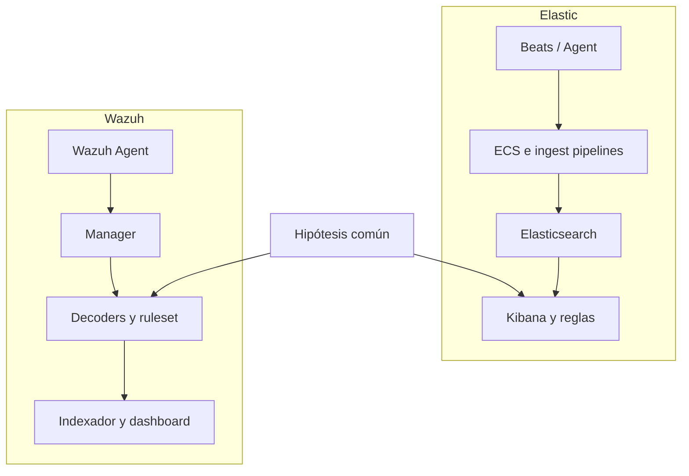

# Clase 185 — Elastic Stack y Wazuh

> Parte: **8 — Blue Team, detección y SOC** · Fuente: *Applied Network Security Monitoring* — Chris Sanders y Jason Smith
> ⏱️ Duración estimada: **120 min** · Nivel: **Intermedio**

---

## 🎯 Objetivo

Desplegar y operar un SIEM open source con Elastic Stack (Elasticsearch, Kibana, Beats) y Wazuh. Aprenderás a ingerir telemetría, escribir consultas KQL/EQL, y usar las reglas y el motor de detección de Wazuh como alternativa gratuita a soluciones comerciales, ideal para laboratorios y organizaciones con presupuesto limitado.

## 📚 Resultados de aprendizaje

Al finalizar, el alumno podrá:

1. **Desplegar** Elastic Stack y Wazuh en contenedores de forma reproducible.
2. **Ingerir** logs de endpoint y red con Beats y el agente Wazuh.
3. **Consultar** datos con KQL y detección de secuencias con EQL.
4. **Interpretar** las reglas y decoders de Wazuh y su mapeo a MITRE ATT&CK.
5. **Construir** un dashboard de detección en Kibana.

## 🗺️ Temas

| # | Tema | Por qué importa |
|---|------|-----------------|
| 1 | Arquitectura Elastic (ES, Kibana, Beats) | Entender el flujo de datos |
| 2 | ECS: esquema común | Normalización para detección portable |
| 3 | KQL y EQL | Consultas y correlación de secuencias |
| 4 | Elastic Detection Rules | Detecciones listas mapeadas a ATT&CK |
| 5 | Wazuh: manager, indexer, agente | SIEM+HIDS integrado y gratuito |
| 6 | Reglas y decoders de Wazuh | Cómo se generan las alertas |
| 7 | FIM y detección de rootkits | Capacidades de HIDS de Wazuh |
| 8 | Dashboards en Kibana | Visualización operativa |

## 🧠 Explicación en profundidad

Elastic Security y Wazuh pueden compartir componentes, pero no son productos intercambiables. En Elastic, la investigación y la detección se apoyan en documentos indexados, Elastic Common Schema (ECS), reglas y capacidades del stack. Wazuh añade agentes, decodificadores, reglas, inventario, evaluación de configuración e integridad de archivos. Antes de comparar interfaces hay que comparar **qué dato existe y qué semántica conserva**.

ECS es un contrato de campos; KQL filtra documentos y EQL expresa secuencias o relaciones temporales. Confundirlos lleva a reglas que parecen equivalentes pero no lo son. En Wazuh, un decoder reconoce la estructura y una regla interpreta su significado; una falla en el primero invalida la segunda.

El contenido preconstruido acelera el inicio, no elimina la ingeniería. Cada regla debe comprobar fuente requerida, versión, campos, impacto en rendimiento y supuestos ambientales. Para evaluar plataformas se ejecuta la misma hipótesis con el mismo conjunto de positivos y negativos, y se compara fidelidad, explicación, latencia y coste operativo; contar reglas instaladas no mide cobertura.

### La misma pregunta, dos recorridos técnicos

Supongamos que se quiere detectar la creación inesperada de un usuario local. En Elastic se verifica que el agente recoja el evento, que el pipeline lo convierta a ECS sin perder el mensaje original y que la regla consulte campos realmente poblados. En Wazuh se comprueba recepción, decoder, regla base y regla de correlación. El resultado visible puede parecer igual, pero los puntos de fallo y la evidencia de diagnóstico son distintos.

KQL resulta apropiado para filtrar documentos: «muéstrame eventos con este host y acción». EQL aporta secuencia: «una creación de cuenta seguida de incorporación a un grupo privilegiado en el mismo host». La secuencia necesita entidad, orden y `maxspan`; sin ellos puede unir acciones no relacionadas. En Wazuh, frecuencia y timeframe también exigen saber qué identificador conecta eventos. Aprender el lenguaje significa comprender esas relaciones, no memorizar operadores.

El diagrama paralelo se lee desde la hipótesis común hacia atrás y hacia adelante. Hacia atrás pregunta si cada plataforma posee el dato equivalente; hacia adelante compara qué alerta, contexto y evidencia produce. Una evaluación profesional documenta diferencias de semántica y operación, no declara ganador universal. La elección depende del entorno, equipo, casos de uso y coste total de mantener datos y contenido.

### Operación y mantenimiento

En Elastic, mappings incompatibles pueden rechazar documentos o volver un campo no consultable como se esperaba; los ingest pipelines necesitan métricas de fallos. En Wazuh, una actualización de decoder o ruleset puede cambiar coincidencias. Por eso el laboratorio conserva muestras de eventos y repite pruebas después de actualizar.

FIM tampoco significa que todo cambio sea sospechoso. Se eligen rutas por criticidad, se reconoce el volumen de actualizaciones legítimas y se correlaciona con usuario o proceso cuando la fuente lo permite. La evaluación final compara la capacidad de responder una pregunta y mantenerla durante meses: despliegue de agentes, salud, upgrades, almacenamiento, permisos, pruebas y esfuerzo de triaje forman parte del coste real.

## 📔 Glosario

- **ECS:** esquema común de eventos de Elastic.
- **KQL:** lenguaje de filtrado de Kibana.
- **EQL:** lenguaje para secuencias y relaciones entre eventos.
- **Ingest pipeline:** transformaciones aplicadas antes de indexar.
- **Decoder:** lógica de Wazuh que extrae campos del mensaje.
- **Ruleset:** conjunto versionado de reglas.
- **FIM:** monitoreo de integridad de archivos.
- **Contenido preconstruido:** detecciones mantenidas por un proveedor que requieren validación local.

## 📖 Definiciones y características

- **Elasticsearch:** motor de búsqueda e indexación distribuido. Característica: búsquedas rápidas sobre grandes volúmenes vía índices invertidos.
- **Kibana:** interfaz de visualización y análisis. Característica: dashboards, Discover y el motor de detección de Elastic Security.
- **Beats:** agentes ligeros (Winlogbeat, Filebeat, Packetbeat). Característica: cada uno especializado en un tipo de dato.
- **KQL (Kibana Query Language):** lenguaje de filtrado interactivo. Característica: simple, ideal para exploración.
- **EQL (Event Query Language):** consulta secuencias de eventos ordenados. Característica: perfecto para detectar cadenas de ataque (proceso→red→persistencia).
- **Wazuh:** plataforma open source que combina HIDS, SIEM y gestión de cumplimiento. Característica: motor de reglas con niveles de severidad y mapeo ATT&CK.
- **Decoder (Wazuh):** extrae campos de un log crudo antes de evaluarlo contra reglas. Característica: paso previo a la correlación.

## 🔍 Comparación aplicada — alta inesperada de una cuenta

Se usa un mismo conjunto de eventos: creación de usuario local, incorporación posterior a administradores y una creación legítima aprobada. La pregunta no es qué interfaz resulta más cómoda, sino si ambas rutas preservan la relación y explican el resultado.

En Elastic se inspecciona el documento original, el ingest pipeline y el mapeo ECS. KQL confirma presencia y EQL expresa una secuencia por host/cuenta dentro de un `maxspan`. Se comprueba qué ocurre si falta el campo de entidad. En Wazuh se valida que el decoder extraiga los campos, que la regla base coincida y que frecuencia/correlación no unan usuarios diferentes. Los IDs y niveles de reglas se documentan junto a la versión del ruleset.

El caso legítimo debe quedar explicado por contexto estrecho, como host de aprovisionamiento, cuenta autorizada y ventana de cambio. Excluir todas las creaciones en servidores borraría la conducta que se busca. Después se comparan latencia, evidencia mostrada, facilidad de investigación, falsos positivos y mantenimiento.

FIM se evalúa con la misma disciplina. Se modifica un archivo controlado en una ruta vigilada, se verifica qué metadatos ofrece el agente y se repite una actualización legítima. Si la alerta no puede atribuir proceso o usuario, esa limitación queda escrita; no se completa con suposiciones.

## ✅ Criterio de dominio

El alumno puede explicar ECS, KQL, EQL, decoder y ruleset en su función exacta; reproduce positivos y negativos en ambas plataformas y justifica por qué resultados parecidos recorren arquitecturas distintas.

## 🧰 Herramientas y preparación

En laboratorio aislado:

- **Elastic Stack** vía Docker (`docker-compose` oficial de Elastic) o la instalación de Elastic Security.
- **Winlogbeat/Filebeat/Packetbeat** en tus máquinas de prueba.
- **Wazuh** con su despliegue Docker de un solo nodo (manager + indexer + dashboard).
- **Agente Wazuh** instalado en el Windows y el Linux de laboratorio.

Todo dentro de tu red de pruebas; el FIM y la detección se prueban con cambios que tú mismo provocas.

## 🧪 Laboratorio guiado — Doble stack de detección

1. **Levanta Elastic.** `docker compose up -d` con el stack oficial. Accede a Kibana y crea el usuario de kibana.
2. **Ingesta endpoint.** Instala Winlogbeat con el módulo `sysmon` y verifica en *Discover* que llegan eventos ECS (`process.command_line`).
3. **Consulta con KQL.** En Discover: `event.code:1 and process.parent.name:"WINWORD.EXE" and process.name:("powershell.exe" or "cmd.exe")`.
4. **Detecta secuencias con EQL.** En Elastic Security escribe una regla EQL:
   `sequence by host.id [process where process.name=="powershell.exe"] [network where destination.port==443]`
5. **Levanta Wazuh.** Despliega el stack Docker de Wazuh; instala el agente en tus máquinas y confírmalo en el dashboard.
6. **Provoca una alerta.** Modifica un archivo monitoreado por FIM (`/etc/passwd` o una carpeta bajo vigilancia) y observa la alerta con su nivel y regla.
7. **Revisa el mapeo ATT&CK.** En Wazuh, abre una alerta y localiza la técnica ATT&CK asociada; en Elastic, activa reglas prebuilt y filtra por táctica.
8. **Dashboard.** Crea en Kibana un dashboard con: top procesos, alertas por severidad y logins fallidos por host.

## ✍️ Ejercicios

1. Escribe 3 consultas KQL para hunting de PowerShell ofuscado.
2. Traduce una detección de la clase 184 (Splunk SPL) a EQL de Elastic.
3. Explica la diferencia entre un decoder y una regla en Wazuh con un ejemplo.
4. Habilita FIM sobre una carpeta y documenta la alerta generada.
5. Compara Elastic vs Wazuh vs Splunk en coste, curva de aprendizaje y capacidades.
6. Crea una regla local de Wazuh que eleve la severidad de un patrón concreto.

## 📝 Reto verificable

Despliega ambos stacks y demuestra una detección en cada uno: una regla EQL en Elastic que capture una secuencia proceso→red, y una alerta de Wazuh (FIM o regla) con su técnica ATT&CK. **Criterio de aceptación:** ambas alertas se disparan con tu actividad simulada y puedes mostrar en Kibana/Wazuh el evento, la regla que lo detectó y la técnica ATT&CK asociada.

## ⚠️ Errores comunes

| Síntoma / mensaje | Causa y cómo arreglar |
|-------------------|-----------------------|
| Kibana no arranca / `max_map_count` | Falta `vm.max_map_count=262144`; ajústalo en el host |
| Beats no envía datos | Certificados/usuario mal configurados; revisa `output.elasticsearch` |
| EQL no encuentra secuencias | Falta `by` field común o datos sin ECS; normaliza primero |
| Agente Wazuh "Never connected" | Puerto 1514/1515 bloqueado o clave no registrada; re-registra el agente |
| Índice rojo en ES | Disco lleno o shards sin asignar; libera espacio o ajusta réplicas |

## ❓ Preguntas frecuentes

**❓ ¿Elastic o Wazuh para empezar?**
Wazuh trae reglas, agente y mapeo ATT&CK listos, ideal para arrancar rápido. Elastic da más flexibilidad de consulta (EQL) y un ecosistema de detección amplio. En laboratorio, prueba ambos.

**❓ ¿Wazuh usa Elasticsearch?**
Las versiones recientes incluyen su propio Wazuh Indexer (fork de OpenSearch/Elasticsearch), así que funciona de forma autónoma sin depender de Elastic.

**❓ ¿EQL sustituye a las reglas Sigma?**
No. Sigma es un formato portable de reglas (clase 186) que puedes convertir a EQL, KQL o SPL. EQL es el lenguaje nativo de Elastic al que Sigma se traduce.

## 🔗 Referencias verificables y alcance

- Elastic Security, creación de reglas: documentación oficial para tipos de regla, programación, previsualización y acciones — <https://www.elastic.co/guide/en/security/current/rules-ui-create.html>
- Elasticsearch EQL: referencia oficial de sintaxis para consultas de eventos y secuencias; su resultado depende del mapeo y de la categoría de evento — <https://www.elastic.co/guide/en/elasticsearch/reference/current/eql.html>
- Elastic Common Schema (ECS): especificación oficial de los campos normalizados usados por las consultas de la clase — <https://www.elastic.co/guide/en/ecs/current/index.html>
- Wazuh, componentes y flujo de datos: documentación oficial de agente, servidor, indexer y dashboard — <https://documentation.wazuh.com/current/getting-started/components/index.html>
- Wazuh, motor de análisis: documentación oficial sobre decoders, reglas y generación de alertas — <https://documentation.wazuh.com/current/getting-started/components/wazuh-server.html>
- Sanders, C. y Smith, J. *Applied Network Security Monitoring*. Syngress: bibliografía complementaria sobre investigación con telemetría.

## 📥 Material descargable

- 📄 [Guía en PDF](./clase-185-guia.pdf) — versión imprimible de esta clase.
- 🎞️ [Presentación (PPTX)](./clase-185-presentacion.pptx) — deck para proyectar en clase.

## ⬅️ Clase anterior

[Clase 184 — Splunk para detección](../184-splunk-para-deteccion/README.md)

## ➡️ Siguiente clase

[Clase 186 — Escritura de reglas de detección con Sigma](../186-escritura-de-reglas-de-deteccion-con-sigma/README.md)
