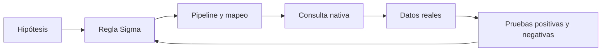

# Clase 186 — Escritura de reglas de detección con Sigma

> Parte: **8 — Blue Team, detección y SOC** · Fuente: *The Sigma Specification* — proyecto SigmaHQ
> ⏱️ Duración estimada: **110 min** · Nivel: **Intermedio**

---

## 🎯 Objetivo

Escribir reglas de detección portables en Sigma, el "YAML de las detecciones": un formato genérico que se convierte a la consulta nativa de cualquier SIEM (Splunk, Elastic, QRadar, etc.). Aprenderás la estructura de una regla, sus operadores lógicos, cómo evitar falsos positivos y cómo compilarla con `sigma`/`pySigma` a tu backend.

## 📚 Resultados de aprendizaje

Al finalizar, el alumno podrá:

1. **Estructurar** una regla Sigma válida (logsource, detection, condition).
2. **Usar** selecciones, listas, wildcards y modificadores (`contains`, `endswith`, `re`).
3. **Convertir** reglas Sigma a SPL/EQL/KQL con la CLI de Sigma.
4. **Reducir** falsos positivos con `filter` y campo `falsepositives`.
5. **Mapear** cada regla a técnicas MITRE ATT&CK en los tags.

## 🗺️ Temas

| # | Tema | Por qué importa |
|---|------|-----------------|
| 1 | Por qué un formato portable | Escribe una vez, despliega en cualquier SIEM |
| 2 | Anatomía de una regla | logsource, detection, condition, metadata |
| 3 | Selecciones y condición | La lógica de detección |
| 4 | Modificadores de campo | Precisión al matchear valores |
| 5 | Filtros y falsos positivos | Detecciones que no ahogan al SOC |
| 6 | Tags ATT&CK y nivel | Contexto y priorización |
| 7 | Conversión con pySigma | Del YAML a la consulta real |
| 8 | Repositorio SigmaHQ | Miles de reglas listas para adaptar |

## 🧠 Explicación en profundidad

Sigma describe una detección en formato independiente del SIEM, pero no promete «escribir una vez y ejecutar igual en todas partes». `logsource` expresa el dato esperado; `detection` selecciona eventos y `condition` combina selecciones. Un pipeline debe resolver campos, valores y capacidades del backend. Si la fuente no registra el dato, la conversión no puede inventarlo.



Las listas y selecciones poseen semántica booleana precisa; los modificadores cambian la comparación y los escapes dependen de la especificación. La validación cubre esquema, conversión, ejecución, positivo conocido, actividad benigna y coste. Estado, autor, fecha, falsos positivos y referencias no son decoración: permiten gobernar la regla durante su ciclo de vida.

### De la hipótesis a la lógica

«Detectar PowerShell» no es una hipótesis: describe una herramienta legítima y produciría ruido. Una formulación defendible podría ser: «un proceso de Office inicia un intérprete con argumentos de descarga en una estación de usuario». De ahí nacen campos esperados —imagen padre, imagen hija, línea de comandos y host— y límites: si el sensor no captura argumentos, la regla no observa la parte decisiva.

En Sigma, selecciones separadas hacen visible el razonamiento. Una selección identifica padres de Office; otra intérpretes; otra términos de red. La `condition` decide si todas son necesarias o si algunas son alternativas. Antes de convertir, se lee como oración booleana y se crean dos eventos mínimos: uno que debe coincidir y otro casi idéntico que no. Esto descubre condiciones demasiado abiertas mejor que mirar YAML.

### Portabilidad real y pruebas

El diagrama muestra una compilación dependiente del entorno. El pipeline traduce nombres canónicos a campos reales y puede añadir condiciones. Un backend quizá sea sensible a mayúsculas, otro trate comodines de forma diferente y otro no soporte una función. Por eso se inspecciona la consulta generada y se ejecuta en la plataforma; una conversión exitosa solo demuestra que se produjo texto válido.

Las pruebas cubren esquema, conversión, positivo, negativos representativos y rendimiento. También se prueba un campo ausente: decidir si no coincide o produce error forma parte del diseño. Regla, pipeline y fixtures se versionan juntos. Cuando cambia el esquema, CI debe señalarlo; cuando cambia el entorno benigno, se ajusta con contexto estrecho y fecha de revisión, sin excluir todo el comportamiento.

### Metadatos que sostienen el ciclo de vida

`status` comunica estabilidad; `date` y `modified` permiten revisar antigüedad; `level` orienta, pero la severidad final depende del activo; `falsepositives` enumera escenarios a investigar, no excepciones automáticas. Las etiquetas ATT&CK justifican relación observable. Una regla retirada conserva motivo y sustituta para que el equipo no repita decisiones ni deje dependencias invisibles.

## 📔 Glosario

- **Logsource:** categoría, producto y servicio esperados.
- **Selection:** condiciones sobre campos.
- **Condition:** expresión booleana que combina selecciones.
- **Modifier:** transformación o comparación aplicada a un valor.
- **Pipeline:** mapeos previos a la conversión.
- **Backend:** plataforma que recibe la consulta traducida.
- **Fixture:** evento controlado para probar un resultado.

## 📖 Definiciones y características

- **Sigma:** formato abierto en YAML para describir detecciones de log de forma agnóstica al SIEM. Característica: portabilidad entre backends.
- **logsource:** define a qué tipo de log aplica la regla (product, category, service). Característica: enruta la regla a la fuente correcta.
- **detection:** bloque con una o más *selecciones* de campos/valores y la *condition* que las combina. Característica: núcleo lógico de la regla.
- **condition:** expresión booleana sobre las selecciones (`selection and not filter`). Característica: define cuándo dispara.
- **Modificador:** sufijo que altera el match (`|contains`, `|endswith`, `|re`, `|base64`). Característica: expresa coincidencias parciales o codificadas.
- **falsepositives:** campo que documenta causas benignas conocidas. Característica: ayuda al triaje y a afinar.
- **pySigma / sigma-cli:** herramienta que compila Sigma a la consulta del backend. Característica: soporta múltiples pipelines (ECS, Splunk CIM…).

## 🔍 Regla razonada — Office inicia un intérprete

La conducta se divide en una selección de procesos padre (`WINWORD.EXE`, `EXCEL.EXE`), otra de hijos (`powershell.exe`, `cmd.exe`, `wscript.exe`) y, si los datos lo permiten, argumentos de descarga. La condición decide si el caso requiere cualquier padre y cualquier hijo, más un término de red. Esa oración se escribe antes del YAML.

El fixture positivo contiene campos mínimos y debe coincidir. Un negativo cercano usa PowerShell iniciado por una herramienta de administración aprobada y no debería hacerlo si la hipótesis exige padre Office. Otro fixture omite `ParentImage`: la prueba documenta que no hay coincidencia, revelando dependencia de telemetría.

La regla se convierte con el pipeline de la organización. Se inspecciona la consulta resultante para comprobar rutas, escape y case sensitivity, luego se ejecuta contra el backend. Una segunda conversión puede producir sintaxis distinta sin ser equivalente; la portabilidad se demuestra con pruebas, no por extensión `.yml`.

## ✅ Criterio de dominio

La entrega incluye hipótesis, logsource, lógica explicada, fixtures, consultas convertidas, resultado real, campos requeridos, falsos positivos contextualizados y dueño. Una regla que pasa validación de esquema pero nunca se ejecutó contra datos no está terminada.

## 🧰 Herramientas y preparación

- **sigma-cli** (`pip install sigma-cli`) con los plugins de backend (`sigma plugin install splunk`, `elasticsearch`).
- El **repositorio SigmaHQ** clonado como referencia y banco de ejemplos.
- Un SIEM de las clases anteriores (Splunk o Elastic) para probar las conversiones.
- Un editor con validación YAML.

Prueba las reglas contra datos de laboratorio o el dataset BOTS; no las apliques a sistemas ajenos.

## 🧪 Laboratorio guiado — De YAML a alerta

1. **Instala la CLI.** `pip install sigma-cli` y luego `sigma plugin install splunk elasticsearch`.
2. **Escribe una regla.** Guarda `office_spawns_powershell.yml`:

   ```yaml
   title: Office lanza PowerShell
   logsource:
     product: windows
     category: process_creation
   detection:
     selection:
       ParentImage|endswith:
         - '\WINWORD.EXE'
         - '\EXCEL.EXE'
       Image|endswith: '\powershell.exe'
     condition: selection
   level: high
   tags:
     - attack.execution
     - attack.t1059.001
   falsepositives:
     - Plantillas corporativas con macros firmadas
   ```

3. **Valida y convierte a Splunk.** `sigma convert -t splunk -p splunk_windows office_spawns_powershell.yml`.
4. **Convierte a Elastic.** `sigma convert -t esql -p ecs_windows office_spawns_powershell.yml` (o el backend/pipeline que uses).
5. **Prueba en el SIEM.** Pega la consulta generada y confirma que detecta tu simulación (Office→PowerShell) sin marcar la línea base.
6. **Añade un filtro.** Excluye una cuenta de servicio benigna con una selección `filter` y `condition: selection and not filter`.
7. **Explora SigmaHQ.** Toma una regla real del repo, adáptala a tu entorno y conviértela.

## ✍️ Ejercicios

1. Escribe una regla Sigma para `rundll32.exe` con argumentos sospechosos.
2. Añade modificadores `|contains` y `|re` para detectar PowerShell ofuscado.
3. Convierte tu regla a dos backends distintos y compara la salida.
4. Documenta 3 falsos positivos plausibles y añádelos al campo correspondiente.
5. Mapea 5 reglas a sus técnicas ATT&CK correctas.
6. Crea una regla con `condition` de umbral (`| count() by ... > N`).

## 📝 Reto verificable

Entrega dos reglas Sigma propias (una de ejecución, una de persistencia) con tags ATT&CK, falsos positivos documentados y sus conversiones a tu SIEM. **Criterio de aceptación:** al menos una regla, ya convertida, dispara sobre tu actividad simulada en el SIEM y NO dispara con la actividad benigna de línea base; la CLI convierte ambas sin errores de sintaxis.

## ⚠️ Errores comunes

| Síntoma / mensaje | Causa y cómo arreglar |
|-------------------|-----------------------|
| `sigma convert` falla por pipeline | Falta el pipeline (ECS/CIM); instala/indica `-p` correcto |
| La consulta no matchea campos | Nombres de campo distintos en tu SIEM; usa el pipeline de mapeo |
| Regla dispara con todo | `condition` demasiado amplia; añade selecciones y filtros |
| Esperabas que `\|contains` fuera obligatorio para comodines | En Sigma los comodines `*`/`?` funcionan **directamente** en el valor; `\|contains`/`\|endswith` son azúcar que los añaden por ti (más legible). El fallo suele ser olvidar escapar un `*` literal. |
| YAML inválido | Indentación o listas mal formadas; valida con linter |

## ❓ Preguntas frecuentes

**❓ ¿Sigma reemplaza al lenguaje de mi SIEM?**
No lo reemplaza: lo genera. Escribes en Sigma y compilas a SPL/EQL/KQL. Ganas portabilidad y una única fuente de verdad para tus detecciones.

**❓ ¿Puedo versionar mis reglas como código?**
Sí, y deberías. Guarda tu carpeta de reglas en un repositorio, con revisión y CI que valide sintaxis y conversión (detección como código, clase 199).

**❓ ¿Debo usar las reglas de SigmaHQ tal cual?**
Úsalas como base, pero adáptalas: cada entorno tiene sus falsos positivos. Copiar sin afinar genera fatiga de alertas.

## 🔗 Referencias

- SigmaHQ (repositorio y specification) — <https://github.com/SigmaHQ/sigma>
- Sigma Rules Specification 2.1.0 — <https://sigmahq.io/sigma-specification/specification/sigma-rules-specification.html>
- Sigma Conditions — <https://sigmahq.io/docs/basics/conditions.html>
- sigma-cli / pySigma — <https://github.com/SigmaHQ/sigma-cli>
- MITRE ATT&CK — <https://attack.mitre.org/>
- Roth, F. y equipo SigmaHQ, documentación del proyecto.

## 📥 Material descargable

- 📄 [Guía en PDF](./clase-186-guia.pdf) — versión imprimible de esta clase.
- 🎞️ [Presentación (PPTX)](./clase-186-presentacion.pptx) — deck para proyectar en clase.

## ⬅️ Clase anterior

[Clase 185 — Elastic Stack y Wazuh](../185-elastic-stack-y-wazuh/README.md)

## ➡️ Siguiente clase

[Clase 187 — Detección basada en MITRE ATT&CK](../187-deteccion-basada-en-mitre-att-ck/README.md)
