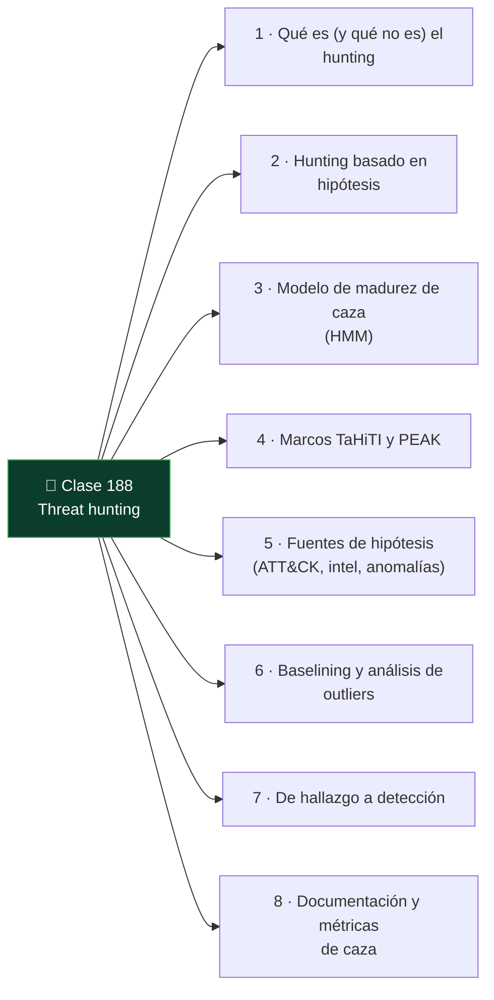

# Clase 188 — Threat hunting: metodología

<!-- cabecera:inicio -->

> 🗂️ Parte: **8 — Blue Team, detección y SOC** · 📖 Fuente: *The Practice of Network Security Monitoring* — Richard Bejtlich
> ⏱️ Duración estimada: **110 min** · 🎚️ Nivel: **Avanzado**

<!-- cabecera:fin -->

---

## 🎯 Objetivo

Aprender a cazar amenazas de forma proactiva: buscar en la telemetría lo que ninguna alerta disparó, partiendo de hipótesis fundadas en ATT&CK y en la inteligencia de amenazas. Aplicarás un ciclo repetible (hipótesis → investigación → hallazgo → nueva detección) y evitarás el "hunting" improvisado que no deja aprendizaje.

## 📚 Resultados de aprendizaje

Al finalizar, el alumno podrá:

1. **Formular** hipótesis de caza accionables y medibles.
2. **Aplicar** el ciclo de hunting y el modelo de madurez de caza (HMM).
3. **Usar** el marco TaHiTI/PEAK para estructurar una cacería.
4. **Convertir** hallazgos de hunting en detecciones automatizadas.
5. **Documentar** una cacería de forma reproducible.

## 🗺️ Temas

<!-- mapa:inicio -->

<!-- mapa:fin -->

| # | Tema | Por qué importa |
|---|------|-----------------|
| 1 | Qué es (y qué no es) el hunting | Diferenciar de monitoreo de alertas |
| 2 | Hunting basado en hipótesis | Da foco y evita cazar sin rumbo |
| 3 | Modelo de madurez de caza (HMM) | Sitúa tu capacidad y próximos pasos |
| 4 | Marcos TaHiTI y PEAK | Estructura repetible de una cacería |
| 5 | Fuentes de hipótesis (ATT&CK, intel, anomalías) | De dónde salen las buenas preguntas |
| 6 | Baselining y análisis de outliers | Encontrar lo anómalo sin firma |
| 7 | De hallazgo a detección | Capitalizar la caza |
| 8 | Documentación y métricas de caza | Aprendizaje acumulativo |

## 📖 Definiciones y características

- **Threat hunting:** búsqueda proactiva e iterativa de amenazas que evadieron los controles automáticos. Característica: parte de una hipótesis, no de una alerta.
- **Hipótesis de caza:** afirmación comprobable sobre actividad adversaria posible en el entorno. Característica: concreta, ligada a datos disponibles y a una técnica.
- **Hunting Maturity Model (HMM):** escala de HM0 (solo alertas) a HM4 (caza automatizada). Característica: mide la capacidad del equipo.
- **TaHiTI:** metodología de hunting dirigida por inteligencia de amenazas (Targeted Hunting integrating Threat Intelligence). Característica: enlaza intel con abuso concreto.
- **PEAK:** marco moderno (Prepare, Execute, Act with Knowledge) para cacerías de hipótesis, baseline y ML. Característica: estructura y documenta el proceso.
- **Baseline:** modelo de lo normal en el entorno. Característica: sin él, no se distingue lo anómalo.

## 🧰 Herramientas y preparación

- Tu SIEM (Splunk/Elastic) con telemetría de endpoint y red de clases previas.
- **Jupyter Notebook** o un documento estructurado para registrar la cacería.
- **Atomic Red Team** para generar actividad de prueba que después "cazarás" (en laboratorio propio).
- El catálogo **ATT&CK** como fuente de hipótesis.

Toda ejecución de técnicas para practicar la caza se realiza en tu entorno aislado y autorizado.

## 🧪 Laboratorio guiado — Una cacería de principio a fin

1. **Prepara (PEAK).** Elige una técnica: T1053.005 (Scheduled Task/Job). Formula la hipótesis: *"un adversario ha creado tareas programadas para persistir en algún host"*.
2. **Define datos y ámbito.** Identifica la telemetría (Sysmon Event ID 1/schtasks, Security 4698) y el rango temporal (últimos 7 días).
3. **Construye la baseline.** Lista las tareas programadas legítimas y sus creadores habituales para separar ruido de señal.
4. **Ejecuta la búsqueda.** En el SIEM, filtra creaciones de tareas y agrupa por host, usuario y binario invocado; ordena por rareza.
5. **Investiga outliers.** Para las tareas raras, pivota: ¿qué proceso las creó?, ¿hay conexión de red asociada?, ¿el binario está firmado?
6. **Genera actividad de control.** Con Atomic Red Team lanza una técnica de tarea programada y confirma que tu búsqueda la habría encontrado.
7. **Capitaliza.** Convierte la búsqueda en una regla Sigma/alerta para automatizar la detección a futuro.
8. **Documenta.** Registra hipótesis, consultas, hallazgos, falsos positivos y la detección creada.

## ✍️ Ejercicios

1. Redacta 3 hipótesis de caza a partir de técnicas ATT&CK distintas.
2. Sitúa a tu SOC en el HMM y define el paso para subir un nivel.
3. Construye una baseline de procesos que hacen conexiones salientes.
4. Diseña una cacería de "living off the land" (LOLBins) y sus consultas.
5. Convierte un hallazgo de caza en una regla Sigma.
6. Define 3 métricas de éxito de una cacería.

## 📝 Reto verificable

Ejecuta una cacería completa documentada (hipótesis, datos, consultas, hallazgos y detección resultante) sobre una técnica ATT&CK a tu elección. **Criterio de aceptación:** la actividad de control que generas con Atomic Red Team aparece en tus resultados de caza, distinguible de la baseline, y entregas una detección nueva (Sigma o saved search) derivada del hallazgo.

## ⚠️ Errores comunes

| Síntoma / mensaje | Causa y cómo arreglar |
|-------------------|-----------------------|
| "Cazar" abriendo dashboards al azar | Falta hipótesis; empieza siempre por una pregunta comprobable |
| Todo parece sospechoso | No hay baseline; modela lo normal primero |
| Hallazgos que no se reutilizan | No capitalizas; convierte cada caza en detección o baseline |
| Cacerías irreproducibles | Sin documentación; registra consultas y decisiones |
| Nunca encuentras nada | Datos insuficientes o hipótesis inverosímil; ajusta telemetría o pregunta |

## ❓ Preguntas frecuentes

**❓ ¿El hunting requiere herramientas caras?**
No. Requiere buena telemetría, hipótesis y método. Con un SIEM open source y Sysmon ya puedes cazar; la madurez viene del proceso, no del precio.

**❓ ¿Cazar es buscar sin saber qué?**
Al contrario. Sin hipótesis no es caza, es navegación aleatoria. La hipótesis enfoca el esfuerzo y hace medible el resultado.

**❓ ¿Cada cacería debe encontrar un atacante?**
No. Una cacería "sin hallazgo" es valiosa: valida controles, mejora baselines y suele revelar higiene o puntos ciegos que corregir.

## 🔗 Referencias

- Bejtlich, R. *The Practice of Network Security Monitoring*. No Starch Press.
- Bianco, D. "The Hunting Maturity Model" — <http://detect-respond.blogspot.com/>
- SURFcert, *TaHiTI Threat Hunting Methodology*.
- Splunk, *PEAK Threat Hunting Framework* — <https://www.splunk.com/en_us/blog/security/peak-threat-hunting-framework.html>
- MITRE ATT&CK — <https://attack.mitre.org/>

## 📥 Material descargable

- 📄 [Guía en PDF](./clase-188-guia.pdf) — versión imprimible de esta clase.
- 🎞️ [Presentación (PPTX)](./clase-188-presentacion.pptx) — deck para proyectar en clase.

## ⬅️ Clase anterior

[Clase 187 — Detección basada en MITRE ATT&CK](../187-deteccion-basada-en-mitre-att-ck/README.md)

## ➡️ Siguiente clase

[Clase 189 — Análisis de endpoints con EDR](../189-analisis-de-endpoints-con-edr/README.md)
