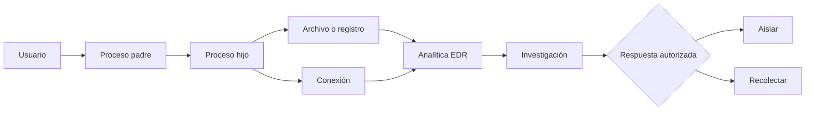

# Clase 189 — Análisis de endpoints con EDR

> Parte: **8 — Blue Team, detección y SOC** · Fuente: *Blue Team Handbook: SOC, SIEM, and Threat Hunting Use Cases* — Don Murdoch
> ⏱️ Duración estimada: **110 min** · Nivel: **Avanzado**

---

## 🎯 Objetivo

Entender qué es un EDR (Endpoint Detection and Response), qué telemetría produce, cómo se investiga una alerta de endpoint y cómo se contiene un host. Trabajarás con conceptos y herramientas abiertas equivalentes (Velociraptor, Wazuh, osquery) para practicar sin depender de un producto comercial, y sabrás leer un árbol de procesos y una línea de tiempo de actividad.

## 📚 Resultados de aprendizaje

Al finalizar, el alumno podrá:

1. **Describir** las capacidades de un EDR: detección, telemetría, respuesta y aislamiento.
2. **Investigar** una alerta reconstruyendo el árbol de procesos y su contexto.
3. **Consultar** el estado de endpoints con osquery/Velociraptor.
4. **Ejecutar** acciones de contención (aislar host, matar proceso) de forma responsable.
5. **Diferenciar** EDR, EPP y XDR.

## 🗺️ Temas

| # | Tema | Por qué importa |
|---|------|-----------------|
| 1 | EPP vs EDR vs XDR | Ubicar cada tecnología |
| 2 | Telemetría de endpoint | La materia prima de la detección local |
| 3 | Árbol de procesos y linaje | Reconstruir qué pasó |
| 4 | Detección conductual vs firmas | Por qué el EDR ve lo que el AV no |
| 5 | Respuesta: aislar, matar, recolectar | Contener sin destruir evidencia |
| 6 | osquery y consultas de flota | Preguntar al parque en SQL |
| 7 | Velociraptor y VQL | Caza y DFIR a escala |
| 8 | Manipulación (tamper) y evasión de EDR | Conocer los límites del control |

## 🧠 Explicación en profundidad

EDR conserva relaciones entre usuario, proceso padre, proceso hijo, archivo, registro y conexión. El valor está en el linaje, no en un nombre aislado: un intérprete puede ser legítimo, pero su padre, línea de comandos, firma, destino y frecuencia cambian la interpretación.

PID y nombre no identifican permanentemente una ejecución: el PID se reutiliza. GUID y tiempo de creación permiten correlacionar mejor; hash y firma aportan contexto, pero tampoco deciden por sí solos. Aislar o terminar procesos modifica producción y puede destruir evidencia. Se define autoridad, reversión y prioridad de adquisición antes de automatizar. osquery consulta estado de flota y Velociraptor recolecta artefactos; complementan la historia retenida por el EDR.

### Reconstruir el árbol de una ejecución

Ante `rundll32.exe`, el nombre no decide. Se localiza la instancia por GUID y tiempo, se examinan padre, línea de comandos, DLL y export, y se siguen archivos, hijos y conexiones. Después se compara ruta, firma, prevalencia y usuario. Un binario firmado puede cargar contenido hostil; un hash desconocido puede ser software interno. La conclusión surge de relaciones, no de una etiqueta aislada.

El árbol puede ser incompleto porque el sensor empezó tarde, perdió eventos o no observa igual procesos protegidos. Se contrasta con Event Logs, filesystem y red. Si un proceso terminó, una consulta actual de osquery no lo devuelve aunque la historia del EDR lo registre. Esta diferencia entre estado presente e historial evita falsos «no ocurrió».

### Alcance desde una entidad

Una investigación pivota en dos direcciones. Hacia atrás pregunta cómo apareció el proceso: documento, servicio, tarea, usuario o descarga. Hacia adelante pregunta qué modificó, con quién habló y si creó persistencia. Luego busca la misma combinación en toda la flota. Hash sirve cuando el objeto es estable; conducta y ruta permiten encontrar variantes. Cada pivote conserva tiempo y criterio para que el alcance no se transforme en búsqueda ilimitada.

### Responder sin perder control

Aislamiento, cuarentena y terminación tienen efectos diferentes. En una estación, aislar pronto puede ser razonable; en un servidor crítico puede interrumpir servicio y cortar la única visibilidad. Antes se define quién autoriza, qué canales quedan permitidos, qué evidencia volátil se recoge, cuánto dura la medida y cómo revertirla. La consola debe registrar operador, motivo y resultado. Una acción rápida sin trazabilidad puede contener hoy y dificultar la investigación mañana.

### EPP, EDR y XDR sin confundir alcance

EPP agrupa capacidades preventivas en endpoint, como antimalware y control de ejecución. EDR prioriza telemetría, investigación y respuesta en endpoints. XDR es una categoría de producto que correlaciona dominios como endpoint, identidad, correo o nube; su nombre no garantiza qué fuentes integra ni cuánto historial conserva. La evaluación comienza por datos y casos de uso, no por la etiqueta comercial.

La detección por firma reconoce objetos o patrones conocidos; la conductual observa relaciones y secuencias. No son adversarias: una firma puede bloquear rápido un hash confirmado y una conducta detectar variantes. Ambas necesitan contexto y medición. «El AV no lo detectó» no implica que EDR lo hará, ni al revés.

### osquery, Velociraptor y el tiempo de la pregunta

osquery modela estado del sistema en tablas y permite consultas de flota; muchas preguntas describen lo que existe al ejecutarlas. Velociraptor usa VQL y artefactos para colección y hunting/DFIR, con capacidad de recuperar distintos datos según plataforma y permisos. Una consulta actual no reemplaza telemetría histórica. El alumno debe indicar si responde «está ahora», «ocurrió» o «queda un artefacto».

### Tamper y límites del sensor

Un adversario con privilegios puede intentar detener servicios, alterar configuración o evadir callbacks. La defensa incluye protección del agente, alertas por pérdida de heartbeats, mínimo privilegio y fuentes independientes. Sin embargo, «sensor online» no demuestra que todos los eventos lleguen. Se monitorean versión, política, retraso y cobertura por host. Hablar de evasión en esta clase sirve para reconocer límites y validar salud, no para prometer invulnerabilidad del EDR.

## 📔 Glosario

- **EDR:** detección y respuesta con telemetría de endpoint.
- **EPP:** prevención en endpoint.
- **Árbol de procesos:** relaciones padre-hijo entre ejecuciones.
- **Process GUID:** identificador de instancia de proceso.
- **Live response:** sesión remota controlada.
- **Aislamiento:** restricción de red del host.
- **Adquisición:** recolección preservada de evidencia.

## 📖 Definiciones y características

- **EDR:** solución que registra actividad de endpoint, detecta comportamientos maliciosos y permite responder remotamente. Característica: telemetría continua + capacidad de acción.
- **EPP (Endpoint Protection Platform):** antivirus/antimalware de prevención. Característica: bloquea conocido; el EDR detecta lo desconocido por comportamiento.
- **XDR:** correlación extendida entre endpoint, red, identidad y nube. Característica: unifica señales que un EDR aislado no ve.
- **Árbol de procesos:** relación padre-hijo de procesos con sus argumentos. Característica: revela el linaje de una ejecución sospechosa.
- **osquery:** expone el SO como tablas SQL consultables. Característica: hunting e inventario en lenguaje familiar.
- **Velociraptor:** plataforma DFIR/hunting con su lenguaje VQL. Característica: recolección forense y caza a escala de flota.
- **Aislamiento de host:** desconecta el endpoint de la red salvo del EDR. Característica: contiene sin apagar, preservando evidencia.

## 🔍 Investigación resuelta — `rundll32.exe` con conexión exterior

La alerta señala `rundll32.exe`, pero el analista localiza su `ProcessGuid`, no todos los procesos con el mismo nombre. El padre es un binario en el perfil del usuario; la línea de comandos carga una DLL recién escrita; poco después la misma instancia abre una conexión. Se preservan hash, ruta, firma, usuario y tiempos.

Hacia atrás se encuentra un archivo descargado por navegador. Hacia adelante se observan un cambio de Run key y una conexión. Se busca el hash en la flota y también el patrón padre–hijo, porque una variante puede cambiar bytes. Event Logs y proxy corroboran descarga e identidad. La combinación sustenta el incidente; ningún indicador aislado lo hacía.

Antes de aislar, el playbook confirma que es una estación y que la consola EDR mantendrá comunicación. Se captura la evidencia prioritaria, se aísla con autoridad registrada y se verifica el estado. En un servidor crítico la secuencia podría cambiar: eso demuestra que la acción depende del activo.

## ✅ Criterio de dominio

El alumno reconstruye linaje por instancia, diferencia estado actual de historia, corrobora con otra fuente y justifica respuesta y reversión. Marcar un proceso como malicioso solo por nombre o hash desconocido no cumple.

## 🧰 Herramientas y preparación

En laboratorio aislado:

- **osquery** en Windows/Linux para consultas de estado.
- **Velociraptor** (servidor + cliente) para hunting y colección.
- **Wazuh** (clase 185) como capa de detección de endpoint gratuita.
- **Sysmon** como fuente de telemetría rica.
- Opcional: prueba de un EDR comercial en su edición de evaluación.

Las acciones de respuesta (aislar, matar procesos) se practican solo sobre tus propias máquinas de laboratorio.

## 🧪 Laboratorio guiado — Investiga y contén un endpoint

1. **Instala la telemetría.** Sysmon + agente Velociraptor + osquery en el Windows de laboratorio.
2. **Genera actividad sospechosa.** En la VM, simula una cadena benigna-pero-anómala (p. ej. `cmd.exe` lanzando `powershell -enc ...` con un script inofensivo).
3. **Reconstruye el árbol.** En Velociraptor, ejecuta un artefacto de listado de procesos o consulta la telemetría Sysmon para ver padre→hijo→nieto.
4. **Consulta la flota con osquery.** `SELECT name, path, parent FROM processes WHERE name='powershell.exe';` y correlaciona con conexiones: tabla `process_open_sockets`.
5. **Construye una línea de tiempo.** Ordena por `_time` los eventos: creación de proceso, archivo escrito, conexión de red.
6. **Contén.** Con Velociraptor, ejecuta un flujo de aislamiento de host de laboratorio y verifica que solo el agente mantiene conectividad.
7. **Recolecta evidencia.** Lanza una colección (procesos, autoruns, prefetch) para preservar el estado antes de remediar.
8. **Documenta.** Resume el incidente: entrada, ejecución, persistencia intentada y acción de contención.

## ✍️ Ejercicios

1. Escribe 3 consultas osquery para hunting (procesos sin firma, autoruns, usuarios).
2. Explica la diferencia entre matar un proceso y aislar el host, y cuándo usar cada uno.
3. Reconstruye un árbol de procesos a partir de eventos Sysmon.
4. Compara EDR y antivirus con un ejemplo de amenaza que solo uno detecta.
5. Diseña un artefacto de Velociraptor para listar tareas programadas.
6. Enumera 3 técnicas de tamper de EDR y una mitigación para cada una.

## 📝 Reto verificable

Investiga una actividad sospechosa simulada en tu endpoint de laboratorio y entrega: árbol de procesos, línea de tiempo, evidencia recolectada y la acción de contención aplicada. **Criterio de aceptación:** reconstruyes correctamente la cadena padre→hijo hasta el proceso sospechoso, muestras al menos una conexión de red asociada, y demuestras que tras el aislamiento el host solo conserva el canal del agente.

## ⚠️ Errores comunes

| Síntoma / mensaje | Causa y cómo arreglar |
|-------------------|-----------------------|
| Matas el proceso y pierdes evidencia | Recolecta antes de responder; aísla en vez de apagar |
| El EDR no ve el ataque | Telemetría insuficiente o exclusiones amplias; revisa cobertura |
| osquery devuelve vacío | Tabla equivocada o permisos; verifica con `.tables` y privilegios |
| Host aislado sin poder investigar | Regla de aislamiento bloqueó también al agente; ajusta la política |
| Alertas EDR sin contexto de linaje | Falta correlación padre-hijo; habilita registro de línea de comandos |

## ❓ Preguntas frecuentes

**❓ ¿EDR o antivirus?**
Ambos. El EPP/AV bloquea lo conocido y barato de parar; el EDR detecta comportamiento y permite responder. Se complementan; el AV suele ser una capa del EDR.

**❓ ¿Puedo practicar EDR sin comprar uno?**
Sí. Velociraptor, osquery, Wazuh y Sysmon cubren los conceptos clave —telemetría, hunting, colección y respuesta— de forma gratuita y realista.

**❓ ¿El EDR es infalible?**
No. Existen técnicas de evasión y tamper. Por eso el blue team combina EDR con telemetría de red, identidad y hunting: defensa en profundidad.

## 🔗 Referencias verificables y alcance

- 🏢 **En la empresa:** EDR/XDR comerciales como **CrowdStrike Falcon**, **Microsoft Defender for Endpoint**, **SentinelOne** o **Elastic Security** — el análisis de endpoint es transferible entre productos.
- 🛠️ [RootCause Windows Inspector](https://github.com/vladimiracunadev-create/rootcause-windows-inspector) (Apache-2.0) — sensor forense de comportamiento para Windows · lab: [`labs/rootcause-windows`](../../../labs/rootcause-windows/README.md).
- Murdoch, D. *Blue Team Handbook: SOC, SIEM, and Threat Hunting Use Cases*.
- Velociraptor: documentación oficial de VQL, artefactos, colecciones y respuesta remota; su presencia no garantiza retención histórica de cada evento — <https://docs.velociraptor.app/>
- osquery: documentación oficial de tablas y consultas; muchas tablas describen estado al momento de consultar, no una secuencia histórica — <https://osquery.readthedocs.io/>
- Microsoft Defender for Endpoint: documentación oficial del flujo de investigación de dispositivos usada como ejemplo de EDR comercial — <https://learn.microsoft.com/en-us/defender-endpoint/investigate-machines>
- MITRE ATT&CK, Defense Evasion: fuente primaria de comportamientos que pueden intentar reducir visibilidad o eludir controles — <https://attack.mitre.org/tactics/TA0005/>
- Wazuh Agent: documentación oficial de las capacidades y fuentes del agente usado en el laboratorio — <https://documentation.wazuh.com/current/getting-started/components/wazuh-agent.html>

## 📥 Material descargable

- 📄 [Guía en PDF](./clase-189-guia.pdf) — versión imprimible de esta clase.
- 🎞️ [Presentación (PPTX)](./clase-189-presentacion.pptx) — deck para proyectar en clase.

## ⬅️ Clase anterior

[Clase 188 — Threat hunting: metodología](../188-threat-hunting-metodologia/README.md)

## ➡️ Siguiente clase

[Clase 190 — Análisis de logs de Windows: Event Logs y Sysmon](../190-analisis-de-logs-de-windows-event-logs-y-sysmon/README.md)
