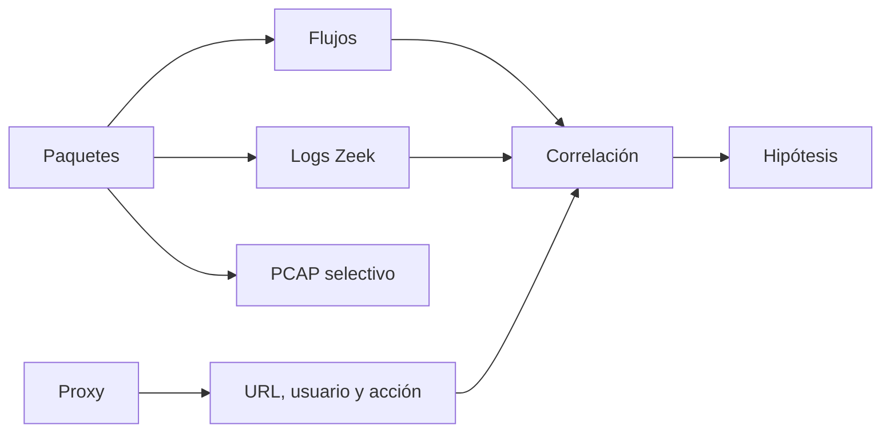

# Clase 191 — Análisis de logs de red y proxy

> Parte: **8 — Blue Team, detección y SOC** · Fuente: *Applied Network Security Monitoring* — Chris Sanders y Jason Smith
> ⏱️ Duración estimada: **110 min** · Nivel: **Avanzado**

---

## 🎯 Objetivo

Explotar la telemetría de red —logs de firewall, proxy web, DNS y metadatos de Zeek— para detectar amenazas que el endpoint no ve o que intentan ocultarse. El monitoreo de red (NSM) es complementario al de endpoint: aunque un host esté comprometido y silencie sus logs, el tráfico que genera sigue pasando por la red.

## 📚 Resultados de aprendizaje

Al finalizar, el alumno podrá:

1. **Interpretar** logs de firewall, proxy y DNS para detección.
2. **Usar** los logs de Zeek (conn, dns, http, ssl) en hunting.
3. **Detectar** exfiltración, dominios sospechosos y user-agents anómalos.
4. **Identificar** túneles (DNS, HTTP) y tráfico cifrado sospechoso vía metadatos.
5. **Correlacionar** telemetría de red con la de endpoint.

## 🗺️ Temas

| # | Tema | Por qué importa |
|---|------|-----------------|
| 1 | NSM: por qué la red importa | Ve lo que el host oculta |
| 2 | Logs de firewall y flujo | Volumen, direcciones, puertos |
| 3 | Proxy web y user-agents | Detecta C2 y descargas maliciosas |
| 4 | DNS: la mina de oro defensiva | DGA, tunneling, resolución rara |
| 5 | Zeek: conn/dns/http/ssl.log | Metadatos ricos sin PCAP completo |
| 6 | JA3/JA3S y fingerprint TLS | Identificar clientes sin descifrar |
| 7 | Exfiltración y beaconing (intro) | Patrones de salida anómala |
| 8 | Correlación red↔endpoint | Historia completa del incidente |

## 🧠 Explicación en profundidad

La visibilidad de red tiene niveles. Un flujo resume quién habló con quién, cuándo y cuánto; los logs de protocolo añaden DNS, HTTP o TLS; un PCAP conserva bytes, con mayor coste y sensibilidad. Un proxy aporta usuario, política y categoría solo para tráfico que realmente lo atraviesa.

Zeek relaciona `conn.log`, `dns.log`, `http.log` y `ssl.log` mediante `uid`. TLS expone metadatos, no el contenido cifrado, y nuevas tecnologías pueden reducir lo visible. Huellas y reputación son señales cambiantes, no identidades. Una detección combina novedad, frecuencia, volumen, proceso de origen y rol del activo.

### Qué puede demostrar cada nivel

NetFlow o IPFIX permite responder si existió una relación, su duración y volumen aproximado, pero no qué objeto se transfirió. PCAP puede permitir reconstrucción cuando el protocolo no está cifrado y la captura es completa; también exige espacio, control de acceso y conocimiento del punto de captura. Zeek convierte tráfico en registros semánticos más consultables, aunque su interpretación depende del protocolo observado. El proxy conoce URL y usuario solo cuando la sesión pasa por él y la identidad está bien asociada.

El diagrama no muestra fuentes equivalentes, sino complementarias. Una conexión en `conn.log` comparte `uid` con DNS, HTTP o TLS cuando Zeek pudo analizarlos. Ese vínculo evita correlacionar únicamente por segundos e IP. Aun así, NAT y proxies pueden hacer que la dirección visible represente un intermediario. Para atribuir a proceso o usuario se añade endpoint e identidad.

### Analizar TLS y destinos sin convertir señales en veredictos

En TLS pueden observarse SNI, versión, certificado y parámetros del handshake según versión, sensor y cifrado. Una huella ayuda a agrupar clientes, pero software legítimo puede compartirla y un atacante cambiarla. Un certificado nuevo no implica host malicioso; un CDN puede alojar muchos dominios. Se combinan señales: primera aparición para ese activo, frecuencia, duración, bytes, categoría, proceso y eventos anteriores.

La línea base se segmenta. Un proxy corporativo, un servidor de actualizaciones y una estación no tienen el mismo patrón. También se distingue «nuevo para la organización» de «nuevo para esta entidad». El primero puede detectar infraestructura recién vista; el segundo, una relación inusual aunque el dominio sea común.

### Calidad y límites de captura

Pérdida de paquetes, tráfico asimétrico o reloj incorrecto alteran resultados. Se monitorean drops del sensor, interfaces y desfase temporal. Bajo cifrado se afirma lo observado —una sesión con ciertos metadatos— y no contenido inexistente. Este lenguaje evita que una investigación convierta ausencia de visibilidad en ausencia de actividad.

### Firewall, flujo y proxy: tres preguntas distintas

Un firewall registra decisiones de política —permitido, denegado, traducido— con los campos que su configuración conserve. Flow resume conversaciones y volumen aunque no exista proxy. El proxy puede asociar URL, categoría, usuario y acción cuando controla esa solicitud. Una sesión permitida por firewall no demuestra que la aplicación completó; un `200` del proxy no demuestra que un archivo se ejecutó.

User-Agent aporta contexto de cliente, pero es un texto modificable y aplicaciones legítimas pueden compartirlo. Las detecciones comparan valor con proceso, destino y patrón histórico. Un cliente que declara navegador pero proviene de un servicio puede merecer investigación; no se etiqueta malware solo por cadena rara.

### DNS como secuencia, no como «mina de oro» automática

DNS permite observar qué nombre preguntó un cliente, respuesta, tipo y frecuencia cuando el sensor está en la ruta. Una consulta no implica conexión posterior y una respuesta NXDOMAIN puede provenir de errores legítimos. DGA y tunneling pueden producir longitud, entropía, volumen o tipos inusuales, pero CDNs, telemetría y software también generan nombres largos.

Se agrupa por entidad y dominio registrable, se compara con rol y se buscan relaciones posteriores. Bajo DoH/DoT, el sensor puede perder detalle si la organización no controla el resolvedor; esa pérdida se declara y puede compensarse con logs del endpoint o servicio DNS administrado.

### Exfiltración: volumen con contexto del dato

Muchos bytes salientes no prueban exfiltración: backups y cargas cloud son normales. Se evalúan origen, destino, horario, protocolo, proceso, usuario y sensibilidad del activo. Una alerta útil explica qué dimensión cambió y contra qué baseline. La red puede demostrar transferencia; clasificar el contenido requiere otras fuentes o inspección autorizada.

## 📔 Glosario

- **Flow:** resumen de una conversación de red.
- **PCAP:** captura de paquetes.
- **Metadato:** campo interpretado sin conservar todo el contenido.
- **Zeek UID:** identificador para unir logs de una conexión.
- **Proxy explícito:** intermediario configurado por el cliente.
- **TLS fingerprint:** huella del handshake observado.
- **Egress:** tráfico que sale de una zona.

## 📖 Definiciones y características

- **NSM (Network Security Monitoring):** recolección y análisis de datos de red para detectar intrusiones. Característica: visibilidad independiente del host.
- **conn.log (Zeek):** registro de cada conexión con duración, bytes y estado. Característica: base para top talkers y anomalías de volumen.
- **dns.log (Zeek):** consultas y respuestas DNS. Característica: detecta DGA, tunneling y dominios recién registrados.
- **Proxy log:** peticiones web con URL, user-agent, método y respuesta. Característica: revela C2 sobre HTTP/S y descargas.
- **JA3/JA3S:** hash del handshake TLS del cliente/servidor. Característica: identifica herramientas (p. ej. ciertos C2) aun con cifrado.
- **DNS tunneling:** exfiltración/C2 encapsulados en consultas DNS. Característica: dominios largos, alta entropía, muchas subconsultas.
- **Beaconing:** conexiones periódicas y regulares a un C2. Característica: patrón temporal casi constante (se profundiza en la clase 193).

## 🔍 Investigación guiada — descarga y conexión posterior

El proxy registra una descarga desde una URL nueva. Primero se verifica si el tráfico pasó realmente por el proxy y qué identidad estaba asociada. Zeek muestra DNS y TLS/HTTP relacionados mediante `uid`; el flow confirma duración y bytes. Si existe PCAP permitido, se comprueba integridad de la sesión y se extrae el objeto solo cuando el protocolo lo permite.

El archivo extraído se hashea, pero no se afirma ejecución. En EDR aparece una creación de proceso desde la ruta de descargas y una conexión al mismo destino. Esa fuente aporta el eslabón que la red no podía demostrar. Si el tráfico está cifrado y no existe objeto, el informe limita la afirmación a metadatos observados.

La huella TLS coincide con software común; no se usa como veredicto. La rareza proviene de que ese proceso y host nunca habían contactado el destino, junto con el linaje del endpoint. El caso enseña cómo fuentes complementarias cambian confianza.

## ✅ Criterio de dominio

El alumno diferencia flow, log de protocolo y PCAP; explica NAT/proxy y pérdida; une logs con identificadores o tiempo justificadamente; y separa descarga, transferencia y ejecución.

## 🧰 Herramientas y preparación

En laboratorio aislado con un tap/mirror:

- **Zeek** generando conn/dns/http/ssl.log.
- **Suricata** como IDS complementario para alertas de firma.
- Logs de un **proxy** (Squid) o firewall de laboratorio.
- **RITA** (Real Intelligence Threat Analytics) para analizar beaconing y tunneling sobre logs de Zeek.
- Tu SIEM para ingerir y consultar estos logs.

Captura tráfico solo de tu propia red de pruebas.

## 🧪 Laboratorio guiado — Caza en la telemetría de red

1. **Genera tráfico.** En la VM, navega, resuelve dominios y descarga un archivo benigno para poblar los logs.
2. **Revisa conn.log.** Identifica top talkers por bytes y conexiones a puertos poco comunes.
3. **Analiza DNS.** En dns.log, busca dominios de alta entropía o subdominios muy largos (indicio de tunneling). Marca dominios recién vistos.
4. **Inspecciona proxy/http.log.** Filtra user-agents raros (p. ej. `python-requests`, cadenas vacías) y métodos POST voluminosos.
5. **Fingerprint TLS.** En ssl.log revisa JA3; compáralo con listas conocidas de herramientas para detectar clientes anómalos.
6. **Ejecuta RITA.** Importa los logs de Zeek y corre el análisis de beaconing y DNS tunneling; interpreta el score.
7. **Simula exfiltración lenta.** Envía datos benignos en pequeños fragmentos DNS a un servidor de laboratorio y confirma que tus consultas lo detectan.
8. **Correlaciona.** Une una conexión saliente sospechosa (red) con el proceso responsable (Sysmon Event 3) del mismo host y momento.

## ✍️ Ejercicios

1. Escribe una consulta que liste los 10 dominios con más subconsultas únicas (posible tunneling).
2. Detecta descargas de ejecutables desde IPs sin dominio asociado.
3. Explica cómo JA3 ayuda cuando el tráfico está cifrado.
4. Diseña una detección de user-agent anómalo para tu entorno.
5. Correlaciona una alerta de red con el proceso de endpoint que la originó.
6. Interpreta un resultado de beaconing de RITA y decide si escalar.

## 📝 Reto verificable

Detecta en tu laboratorio una actividad de red sospechosa (tunneling DNS o exfiltración por HTTP) usando logs de Zeek/proxy y correlaciónala con el endpoint origen. **Criterio de aceptación:** identificas el dominio/destino anómalo con una justificación basada en datos (entropía, volumen, periodicidad o fingerprint) y enlazas la conexión con el proceso concreto que la generó en el host.

## ⚠️ Errores comunes

| Síntoma / mensaje | Causa y cómo arreglar |
|-------------------|-----------------------|
| No hay logs de DNS | El resolver no se registra; envía consultas al colector o usa Zeek |
| Todo el tráfico parece igual | Falta baseline de dominios/UA normales; modela lo habitual |
| JA3 no discrimina | Cliente común (navegador); combínalo con destino y volumen |
| PCAP satura el disco | Retención de contenido completo demasiado larga; usa metadatos Zeek |
| Falsos positivos de CDN | Servicios legítimos con muchos subdominios; añade allowlist |

## ❓ Preguntas frecuentes

**❓ Con TLS everywhere, ¿sigue sirviendo la red?**
Sí. Aunque no veas la carga, los metadatos (SNI, JA3, volumen, periodicidad, DNS) delatan C2, beaconing y exfiltración. La red revela el patrón aunque el contenido esté cifrado.

**❓ ¿DNS realmente es tan importante?**
Muchísimo. Casi todo ataque resuelve dominios: DGA, tunneling y C2 dejan huella en DNS. Es de las fuentes de mejor relación señal/coste.

**❓ ¿Necesito PCAP completo?**
Rara vez y por poco tiempo. Los metadatos de Zeek cubren la mayoría de casos de hunting con una fracción del almacenamiento.

## 🔗 Referencias verificables y alcance

- Zeek, referencia oficial de logs: describe `conn.log`, DNS, HTTP, TLS y la correlación mediante `uid`; los campos dependen de protocolos observables y configuración — <https://docs.zeek.org/en/current/reference/logs/index.html>
- Suricata: documentación oficial de EVE JSON y de los eventos que el sensor puede producir — <https://docs.suricata.io/en/latest/output/eve/eve-json-output.html>
- RITA: repositorio del proyecto para análisis de metadatos y periodicidad; sus puntuaciones ordenan investigación y no demuestran por sí solas C2 — <https://github.com/activecm/rita>
- JA3: repositorio original del método de huella TLS; se usa como atributo contextual, no como identidad estable de una familia — <https://github.com/salesforce/ja3>
- Sanders, C. y Smith, J. *Applied Network Security Monitoring*. Syngress: bibliografía profesional complementaria sobre análisis de telemetría de red.

## 📥 Material descargable

- 📄 [Guía en PDF](./clase-191-guia.pdf) — versión imprimible de esta clase.
- 🎞️ [Presentación (PPTX)](./clase-191-presentacion.pptx) — deck para proyectar en clase.

## ⬅️ Clase anterior

[Clase 190 — Análisis de logs de Windows: Event Logs y Sysmon](../190-analisis-de-logs-de-windows-event-logs-y-sysmon/README.md)

## ➡️ Siguiente clase

[Clase 192 — Detección de movimiento lateral](../192-deteccion-de-movimiento-lateral/README.md)
