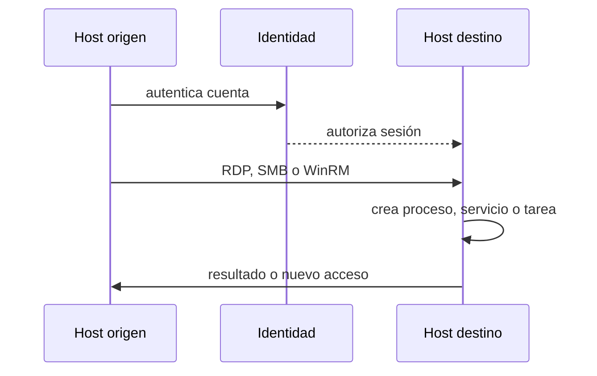

# Clase 192 — Detección de movimiento lateral

> Parte: **8 — Blue Team, detección y SOC** · Fuente: *Blue Team Handbook* — Don Murdoch · *MITRE ATT&CK* (Lateral Movement)
> ⏱️ Duración estimada: **120 min** · Nivel: **Avanzado**

---

## 🎯 Objetivo

Detectar cómo un atacante se desplaza de un host comprometido a otros dentro de la red: PsExec/servicios remotos, WMI, WinRM, RDP, Pass-the-Hash y abuso de credenciales. Aprenderás qué huellas dejan estas técnicas en Event Logs, Sysmon y telemetría de red, y cómo distinguirlas de la administración legítima.

> ⚠️ **Ética:** las técnicas ofensivas descritas se ejecutan únicamente para generar telemetría de detección en tu laboratorio propio y aislado, o con autorización explícita. El objetivo de la clase es defensivo.

## 📚 Resultados de aprendizaje

Al finalizar, el alumno podrá:

1. **Enumerar** las técnicas de movimiento lateral más comunes y sus artefactos.
2. **Detectar** ejecución remota (PsExec, WMI, WinRM) en logs de Windows.
3. **Identificar** Pass-the-Hash y uso anómalo de credenciales.
4. **Distinguir** administración legítima de movimiento lateral malicioso.
5. **Escribir** detecciones y mapearlas a la táctica Lateral Movement de ATT&CK.

## 🗺️ Temas

| # | Tema | Por qué importa |
|---|------|-----------------|
| 1 | Táctica Lateral Movement (ATT&CK) | Marco de referencia |
| 2 | PsExec y servicios remotos | Técnica clásica y muy usada |
| 3 | WMI y WinRM | Ejecución remota "living off the land" |
| 4 | RDP y logon type 10 | Movimiento interactivo |
| 5 | Pass-the-Hash / Overpass-the-Hash | Reutilización de credenciales |
| 6 | SMB, shares admin y admin$ | Vías de propagación |
| 7 | Logon patterns y grafos de acceso | Detectar rutas anómalas |
| 8 | Baseline de administración legítima | Reducir falsos positivos |

## 🧠 Explicación en profundidad

Movimiento lateral es el uso de acceso obtenido para alcanzar otro sistema o identidad. RDP, SMB y WinRM también sostienen operaciones legítimas; el nombre de la herramienta no decide. La señal nace de una relación nueva o impropia entre origen, cuenta, destino, servicio y proceso posterior.

Se correlacionan autenticación, servicio remoto y efecto: archivo escrito, servicio creado, proceso iniciado o conexión posterior. Se compara con grafos de administración permitida, horario, cuenta y criticidad. ATT&CK T1021 agrupa servicios remotos, pero cada subtécnica requiere campos distintos; mapear no reemplaza validar.

### Detectar relaciones, no herramientas

Una administración legítima suele seguir caminos: jump host, cuenta dedicada, ventana y conjunto de destinos. El movimiento lateral rompe o amplía esas relaciones. Una cuenta de soporte que accede desde su bastión a servidores asignados puede ser normal; la misma cuenta desde una estación de usuario hacia un controlador de dominio merece explicación. El grafo usa nodos de identidad y host, y aristas de acceso observadas o autorizadas.

La rareza aislada no basta. Un nuevo servidor produce aristas nuevas; una migración cambia patrones. Se enriquece con criticidad, privilegio, cambio aprobado y actividad posterior. La fuerza de la señal crece cuando a la relación inesperada siguen creación de servicio, tarea, proceso remoto, transferencia de archivo o acceso a credenciales.

### Secuencias por servicio remoto

RDP se investiga con autenticación, tipo de sesión, origen, eventos de sesión y procesos en el destino. SMB puede mostrar acceso a shares administrativos y escritura; si después aparece un servicio, la secuencia es más específica. WinRM y PowerShell remoting dejan artefactos propios del servicio y procesos host. WMI puede ejecutar de manera remota sin seguir la misma ruta. No se busca una secuencia universal: se modela cada procedimiento.

El `sequenceDiagram` enseña que identidad y destino ven fragmentos. El servicio de identidad valida credenciales; el host destino observa sesión y ejecución; red confirma relación. El SIEM une por cuenta, origen, destino y tiempo. Si un eslabón falta, se reduce el nivel de confianza y se declara la limitación.

### Alcance y respuesta

Al confirmar un caso se pregunta dónde más se usaron cuenta, origen y mecanismo, qué credenciales pudieron exponerse y qué destino se volvió nuevo origen. El movimiento lateral forma cadenas; investigar solo el último host subestima alcance. La contención puede revocar sesiones, aislar nodos o limitar rutas, coordinando cuentas compartidas y servicios críticos.

La prueba de detección usa acciones autorizadas y cleanup. Se valida dato, regla, alerta y triaje por subtécnica. Pintar T1021 completa después de probar RDP ocultaría SMB o WinRM sin cobertura; por eso el estado se conserva al nivel realmente demostrado.

### PsExec, WMI y WinRM: efectos observables diferentes

PsExec y herramientas semejantes pueden copiar un binario y crear un servicio remoto; la detección correlaciona share administrativo, Service Control Manager y proceso. El nombre del servicio puede cambiar, por lo que depender solo de `PSEXESVC` cubre una implementación. WMI puede iniciar procesos mediante proveedores y deja otra combinación de autenticación, actividad WMI y proceso. WinRM/PowerShell remoting se apoya en WS-Management y procesos host propios.

Estas tecnologías son administración legítima. La pregunta no es «¿se usó WMI?», sino quién, desde qué origen, hacia qué activo, con qué comando y si respeta rutas autorizadas. Un inventario de herramientas y bastiones reduce ruido, pero sus excepciones deben ser específicas y revisables.

### Pass-the-Hash y Overpass-the-Hash

Pass-the-Hash reutiliza material NTLM sin conocer la contraseña en claro; Overpass-the-Hash usa material para obtener tickets Kerberos según el procedimiento. No existe un evento que diga literalmente «PtH». Se razona con tipo/protocolo de autenticación, origen, cuenta, privilegios, destino y actividad posterior, comparando con comportamiento legítimo.

La detección de credenciales reutilizadas necesita comprender qué protocolos permite el entorno y qué logs poseen controladores y destinos. Una señal aislada de NTLM puede ser compatibilidad heredada. La combinación con una estación no autorizada, cuenta privilegiada y expansión a varios hosts aumenta confianza. La respuesta considera rotación de credenciales y sesiones, no solo aislar el último equipo.

### Baseline administrativo como control vivo

El grafo autorizado se alimenta de arquitectura y cambios aprobados, no solo de lo observado: si un acceso hostil se repite, podría convertirse en «normal» estadístico. Se comparan esperado y observado. Las desviaciones se investigan y el baseline tiene dueño y fecha. Así se evita tanto alertar cada tarea de soporte como aprender actividad maliciosa como normal.

## 📔 Glosario

- **Movimiento lateral:** desplazamiento hacia otros recursos.
- **Remote Services:** técnica ATT&CK T1021.
- **Logon remoto:** sesión iniciada desde otro sistema.
- **Cuenta privilegiada:** identidad con autoridad elevada.
- **Admin share:** recurso SMB administrativo.
- **Grafo de acceso:** relaciones permitidas entre identidades y activos.
- **Blast radius:** alcance potencial del compromiso.

## 📖 Definiciones y características

- **Movimiento lateral:** conjunto de técnicas para moverse por la red tras el compromiso inicial. Característica: usa credenciales y protocolos legítimos, difícil de separar del uso normal.
- **PsExec:** herramienta que ejecuta comandos remotos creando un servicio. Característica: deja Event 7045 (servicio instalado) y accesos SMB al admin$.
- **WMI lateral:** ejecución remota vía `wmic`/`Win32_Process`. Característica: proceso hijo de `WmiPrvSE.exe`, poco ruido de servicio.
- **WinRM:** gestión remota vía PowerShell Remoting. Característica: procesos hijos de `wsmprovhost.exe`.
- **Pass-the-Hash (PtH):** autenticación con el hash NTLM sin conocer la contraseña. Característica: logon NTLM (4624 tipo 3) sin el correspondiente Kerberos esperado.
- **Logon Type 3/10:** red (SMB/WMI) e interactivo remoto (RDP). Característica: pistas para clasificar el tipo de acceso.
- **Event 4648:** logon con credenciales explícitas. Característica: frecuente en overpass-the-hash y uso de credenciales robadas.

## 🔍 Secuencia resuelta — acceso SMB y servicio remoto

Una estación de usuario autentica una cuenta administrativa contra un servidor que normalmente solo recibe gestión desde el bastión. Minutos después aparecen acceso a un share administrativo, escritura de un binario y creación de servicio. Cada evento aislado puede existir en administración; la secuencia, origen y relación no autorizada elevan la confianza.

Se construye un grafo con cuenta, estación y servidor. La investigación busca la misma cuenta en otros destinos y comprueba si el servidor afectado originó conexiones nuevas. También revisa si hubo cambio aprobado. La severidad deriva del privilegio y activo, no del nombre de la herramienta.

La prueba de laboratorio reproduce una variante SMB autorizada y una desde origen inesperado. Se valida qué datos sustentan autenticación, transferencia y ejecución. El resultado solo acredita esa variante; RDP, WinRM y SSH mantienen estados separados.

## ✅ Criterio de dominio

El alumno debe explicar la cadena completa, identificar relaciones administrativas normales, ampliar alcance en ambas direcciones y mapear a la subtécnica exacta sin declarar cobertura total de T1021.

## 🧰 Herramientas y preparación

En laboratorio aislado con un dominio de pruebas:

- **Sysmon** y auditoría avanzada en varios Windows unidos a un AD de laboratorio.
- Herramientas para **generar** la telemetría: PsExec (Sysinternals), `wmic`, PowerShell Remoting; y, con fines de laboratorio, utilidades como Mimikatz/CrackMapExec para simular PtH.
- Tu SIEM recibiendo los eventos de todos los hosts.
- Opcional: **BloodHound** para razonar sobre rutas de ataque de identidad.

Ejecuta las técnicas ofensivas solo contra tus propias máquinas y con conocimiento pleno.

## 🧪 Laboratorio guiado — Sigue el rastro lateral

1. **Prepara el dominio.** 1 DC + 2 workstations de laboratorio con Sysmon y auditoría de logon habilitada.
2. **Genera PsExec.** Ejecuta un comando remoto benigno con PsExec desde host A a host B y observa: Event 7045 (servicio), 4624 tipo 3, accesos a `\\B\ADMIN$`.
3. **Genera WMI.** Lanza `wmic /node:B process call create "cmd /c whoami"` y localiza el proceso hijo de `WmiPrvSE.exe` en Sysmon Event 1.
4. **Genera WinRM.** Con `Invoke-Command -ComputerName B` observa procesos bajo `wsmprovhost.exe`.
5. **Simula PtH.** En laboratorio, autentícate con hash a host B y detecta el 4624 NTLM tipo 3 sin actividad Kerberos previa coherente y con 4648.
6. **Detecta RDP.** Inicia una sesión RDP y localiza 4624 tipo 10 más los eventos TerminalServices.
7. **Construye detecciones.** Escribe reglas para: instalación de servicio remoto inusual, proceso hijo de WmiPrvSE lanzando shells, y logon NTLM tipo 3 desde workstation a workstation (patrón raro).
8. **Baseline.** Excluye las cuentas y hosts de administración legítima para bajar falsos positivos.

## ✍️ Ejercicios

1. Mapea 5 técnicas de movimiento lateral a sus Event IDs/artefactos.
2. Escribe una detección de "workstation-a-workstation SMB admin$" (patrón inusual).
3. Diferencia el rastro de PsExec, WMI y WinRM en una tabla.
4. Explica cómo detectarías Pass-the-Hash con eventos de logon.
5. Diseña una baseline de administración legítima para tu entorno.
6. Usa un grafo de logons para detectar un pivote anómalo.

## 📝 Reto verificable

Genera y detecta al menos tres técnicas de movimiento lateral distintas en tu dominio de laboratorio, entregando por cada una la telemetría, la detección y la técnica ATT&CK. **Criterio de aceptación:** cada detección dispara con la técnica correspondiente y no con la administración legítima de tu baseline; distingues correctamente PsExec de WMI de WinRM por sus artefactos característicos.

## ⚠️ Errores comunes

| Síntoma / mensaje | Causa y cómo arreglar |
|-------------------|-----------------------|
| Falsos positivos con admins de TI | Sin baseline de administración; excluye cuentas/hosts legítimos |
| No detectas WMI/WinRM | Faltan Sysmon y auditoría de proceso; habilítalos en todos los hosts |
| PtH invisible | No correlacionas NTLM vs Kerberos; añade lógica de logon anómalo |
| Solo miras un host | El movimiento lateral es multi-host; correlaciona en el SIEM |
| Ruido de escáneres internos | Herramientas de inventario parecen laterales; añádelas a allowlist |

## ❓ Preguntas frecuentes

**❓ ¿Cómo separo un admin legítimo de un atacante?**
Con baseline y contexto: quién administra qué, desde dónde y cuándo. Un logon administrativo de una workstation a otra fuera de horario, sin ticket de cambio, es sospechoso aunque use credenciales válidas.

**❓ ¿Es suficiente el endpoint para detectar movimiento lateral?**
Ayuda mucho (Sysmon, logon events), pero correlacionar con la red (SMB, conexiones entre hosts) da la imagen completa y detecta lo que un host silenciado ocultaría.

**❓ ¿Detecto Pass-the-Hash directamente?**
No hay un "evento PtH", pero su firma es un patrón: logon NTLM tipo 3 con credenciales explícitas (4648) en contextos donde se esperaría Kerberos. Se detecta por anomalía.

## 🔗 Referencias verificables y alcance

- MITRE ATT&CK, Lateral Movement: fuente primaria para el objetivo táctico, sus técnicas y procedimientos documentados — <https://attack.mitre.org/tactics/TA0008/>
- MITRE ATT&CK T1021, Remote Services: fuente primaria para RDP, SMB/Windows Admin Shares, WinRM, SSH y otras subtécnicas; no afirma que un único evento confirme movimiento lateral — <https://attack.mitre.org/techniques/T1021/>
- JPCERT/CC, *Tool Analysis Result Sheet*: investigación publicada con artefactos de herramientas y eventos de Windows; se usa para formular y probar observables concretos — <https://jpcertcc.github.io/ToolAnalysisResultSheet/>
- SpecterOps BloodHound: documentación oficial del producto para modelar relaciones de identidad y rutas; una ruta posible no prueba que haya sido utilizada — <https://bloodhound.specterops.io/>
- Murdoch, D. *Blue Team Handbook: SOC, SIEM, and Threat Hunting Use Cases*: bibliografía profesional complementaria.

## 📥 Material descargable

- 📄 [Guía en PDF](./clase-192-guia.pdf) — versión imprimible de esta clase.
- 🎞️ [Presentación (PPTX)](./clase-192-presentacion.pptx) — deck para proyectar en clase.

## ⬅️ Clase anterior

[Clase 191 — Análisis de logs de red y proxy](../191-analisis-de-logs-de-red-y-proxy/README.md)

## ➡️ Siguiente clase

[Clase 193 — Detección de C2 y beaconing](../193-deteccion-de-c2-y-beaconing/README.md)
