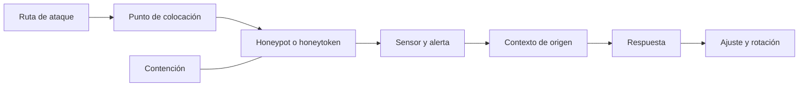

# Clase 194 — Deception: honeypots y honeytokens

> Parte: **8 — Blue Team, detección y SOC** · Fuente: *The Practice of Network Security Monitoring* — Richard Bejtlich
> ⏱️ Duración estimada: **100 min** · Nivel: **Intermedio**

---

## 🎯 Objetivo

Usar el engaño (*deception*) para crear señales deliberadamente selectivas: honeypots, honeytokens y cuentas trampa cuyo uso esperado debe ser nulo o muy limitado. Una interacción eleva la prioridad, pero todavía se valida contra escáneres, pruebas y errores operativos autorizados. Aprenderás a diseñar, colocar, contener y mantener señuelos sin convertirlos en una afirmación automática de compromiso.

> ⚠️ **Ética:** los honeypots se despliegan en tu propia infraestructura para observar y alertar. No los uses para atacar a terceros ni para atraer tráfico hacia sistemas que no controlas.

## 📚 Resultados de aprendizaje

Al finalizar, el alumno podrá:

1. **Diferenciar** honeypots de baja y alta interacción, honeytokens y honeynets.
2. **Desplegar** un honeypot de laboratorio y recolectar sus eventos.
3. **Colocar** honeytokens (credenciales, archivos, canary tokens) estratégicamente.
4. **Configurar** alertas de alta fidelidad ante cualquier interacción con el señuelo.
5. **Integrar** las señales de deception en el SIEM y el flujo del SOC.

## 🗺️ Temas

| # | Tema | Por qué importa |
|---|------|-----------------|
| 1 | Deception como estrategia | Señales potencialmente muy selectivas que aún requieren contexto |
| 2 | Honeypots de baja vs alta interacción | Riesgo vs riqueza de datos |
| 3 | Honeytokens y canary tokens | Trampas ligeras y ubicuas |
| 4 | Cuentas y credenciales trampa | Detectar robo y uso de credenciales |
| 5 | Honeynets y engaño distribuido | Escalar el engaño |
| 6 | Colocación estratégica | Dónde poner el cebo |
| 7 | Alertas de alta fidelidad | Priorización automática |
| 8 | Riesgos y contención | No convertir el señuelo en punto de apoyo |

## 🧠 Explicación en profundidad

Deception crea activos o datos instrumentados cuya interacción es improbable en operación normal. Produce señal de alta confianza, pero no cero falsos positivos: escáneres, administradores o respaldos también pueden tocar el señuelo. La colocación parte de rutas de ataque plausibles y excluye procesos legítimos conocidos.

La interacción baja emula menos y reduce riesgo; la alta ofrece realismo y mayor superficie que contener. Un honeytoken no concede acceso real: usa identidad o secreto sintético, único, revocable y observable. Deben constar propietario, expiración, rotación, privacidad y respuesta. Un señuelo olvidado puede convertirse en vulnerabilidad.

### Diseñar desde una ruta de ataque

Colocar un honeypot al azar produce una herramienta más que mantener. Primero se modela por dónde pasaría un adversario: shares de administración, repositorios de configuración, segmentos con servidores o documentación interna. El señuelo se coloca donde una exploración plausible lo encuentre y una operación normal no necesite tocarlo. Su nombre y contenido deben ser creíbles sin copiar datos reales.

Un honeytoken puede ser una credencial sintética, URL única o registro de base de datos. La señal necesita atribución: cada ubicación usa un token diferente para saber qué fue accedido. La credencial carece de privilegios reales y su uso se observa en un sistema controlado. Si concede acceso para aumentar realismo, deja de ser un simple token y exige un diseño de contención más fuerte.

### Operar el sensor con seguridad

Interacción alta permite observar más conducta, pero el atacante ejecuta código dentro del entorno señuelo. Se segmenta salida, limita recursos, captura telemetría y define restauración. También se revisan privacidad y reglas de monitoreo con responsables internos. La alerta incluye origen, señuelo, método y pasos inmediatos; una señal de alta confianza sin playbook puede desperdiciar su ventaja.

Los accesos legítimos se prueban: scanner, backup, indexador y equipo de infraestructura. Una alerta benigna no invalida deception; indica que la colocación o exclusión necesita ajuste. Rotación y health checks verifican que el token sigue único y el canal de alerta funciona. MITRE Engage ayuda a pensar objetivos y planificación, no autoriza interacción fuera del entorno propio.

### Cuentas trampa y credenciales sintéticas

Una cuenta señuelo se crea para no iniciar sesiones legítimas y se monitorea en autenticación. Debe carecer de privilegios útiles, tener controles que impidan uso real y distinguir intentos de validación automática. Publicar una contraseña funcional en un archivo «trampa» puede crear riesgo; se prefiere un secreto sintético cuyo intento de uso produzca señal sin acceso.

La ubicación debe ser creíble para el modelo de ataque, pero no engañar a empleados de forma irresponsable. Propietarios de identidad y legal/privacidad conocen el diseño cuando corresponde. El playbook empieza por preservar origen y revisar qué repositorio expuso el token; cambiarlo de inmediato sin investigar puede borrar la pista.

### Honeynets y escala

Una honeynet agrupa señuelos y telemetría para representar una superficie más amplia. Escalar aumenta mantenimiento, identidades, rutas y riesgo de que un componente se use como pivote. Se segmenta, limita salida, aplica imágenes restaurables y separa administración. Más señuelos no equivalen a mejor cobertura si no corresponden a rutas plausibles.

### Fidelidad y prioridad

La fidelidad proviene de selectividad y contexto. Un token al que nadie legítimo accede permite priorizar, pero health checks y scanners pueden crear eventos. La automatización puede elevar severidad y recolectar contexto; acciones destructivas siguen criterios de autoridad. Se mide tiempo de detección, accesos legítimos, salud y brechas reveladas, no solo cantidad de alertas.

## 📔 Glosario

- **Deception:** diseño deliberado de señuelos observables.
- **Honeypot:** sistema instrumentado como objetivo.
- **Honeytoken:** dato sintético cuyo uso alerta.
- **Interacción baja/alta:** funcionalidad ofrecida al visitante.
- **Canary:** recurso que alerta ante acceso inesperado.
- **Contención:** límites que impiden usar el señuelo como pivote.
- **Rotación:** reemplazo controlado de señuelos.

## 📖 Definiciones y características

- **Honeypot:** sistema señuelo sin propósito productivo, diseñado para ser sondeado. Característica: toda interacción es sospechosa por definición.
- **Baja interacción:** emula servicios (banners, puertos) sin un SO real. Característica: seguro y fácil, datos limitados.
- **Alta interacción:** SO/servicios reales controlados. Característica: datos ricos, mayor riesgo de ser abusado.
- **Honeytoken:** dato-cebo (credencial, archivo, URL, registro) cuya sola invocación dispara alerta. Característica: no requiere un host dedicado.
- **Canary token:** honeytoken que "avisa" al abrirse (documento, DNS, AWS key). Característica: telemetría de alta fidelidad y despliegue trivial.
- **Cuenta trampa:** identidad sintética sin uso productivo, documentada y monitoreada. Característica: un inicio de sesión es una señal de alta prioridad que debe investigarse con procedencia y contexto, no una conclusión autosuficiente.
- **Honeynet:** red de honeypots interconectados. Característica: observa movimiento lateral del atacante.

## 🔍 Diseño resuelto — token en una ruta de administración

El modelo de ataque muestra que un adversario con acceso a un share de documentación buscaría credenciales de automatización. Se coloca un archivo sintético con una URL única que no otorga acceso. Cada ubicación usa un token distinto, de modo que la alerta identifica dónde se descubrió.

Antes de activar se prueban backup, indexador, antivirus y administradores. El backup toca el archivo y genera una alerta benigna; se ajusta la colocación o se añade contexto estrecho, no se ignoran todas las lecturas. La alerta conserva origen, identidad, token y hora y activa un playbook de alcance.

El token tiene dueño, expiración y rotación. El receptor se monitorea y no expone sistemas reales. Si se usa un honeypot de alta interacción, se aplican segmentación, control de salida, captura y restauración, porque el riesgo operativo es mayor.

## ✅ Criterio de dominio

El alumno justifica ubicación por ruta de ataque, demuestra que el señuelo no concede privilegio, prueba alertado y falsos positivos legítimos, y documenta contención y ciclo de vida.

## 🧰 Herramientas y preparación

En laboratorio aislado y segmentado:

- **T-Pot** o honeypots individuales (Cowrie para SSH/Telnet, Dionaea para malware).
- **Canarytokens** (proyecto open source de Thinkst) para tokens de documento, DNS y AWS.
- **Cuentas trampa** en tu AD de laboratorio con auditoría de logon.
- Tu SIEM para centralizar las alertas de los señuelos.

Aísla los honeypots del resto de la red para que, si son comprometidos, no sirvan de trampolín.

## 🧪 Laboratorio guiado — Siembra señuelos y escucha

1. **Despliega un honeypot SSH.** Levanta Cowrie en una VM aislada; confirma que registra intentos de login y comandos.
2. **Segmenta.** Coloca el honeypot en una VLAN aislada con salida controlada para que no pueda pivotar.
3. **Genera un canary token.** Crea un documento Word/Excel con Canarytokens y colócalo con un nombre atractivo ("nóminas_2026.xlsx").
4. **Crea una cuenta trampa.** En el AD de laboratorio, añade "svc_backup_admin" con auditoría de logon y sin uso legítimo.
5. **Simula el intruso.** Desde otra VM, sondea el honeypot, abre el documento cebo y usa la cuenta trampa.
6. **Verifica las alertas.** Confirma que cada interacción genera una señal: eventos de Cowrie, aviso del canary token, 4624/4625 de la cuenta trampa.
7. **Integra en el SIEM.** Enruta todas estas señales a una regla de máxima prioridad ("cualquier toque = incidente").
8. **Documenta.** Define el runbook: qué hacer cuando un señuelo dispara (aislar origen, investigar alcance).

## ✍️ Ejercicios

1. Compara honeypot de baja y alta interacción con pros/contras.
2. Diseña la colocación de 3 honeytokens en una red corporativa típica.
3. Crea una cuenta trampa y su regla de alerta de máxima prioridad.
4. Explica por qué las señales de deception tienen tan pocos falsos positivos.
5. Enumera 3 riesgos de un honeypot mal segmentado y su mitigación.
6. Diseña un canary token para detectar acceso no autorizado a un repositorio.

## 📝 Reto verificable

Despliega al menos dos mecanismos de deception (p. ej. un honeypot y un honeytoken/cuenta trampa) e intégralos al SIEM con alertas de alta prioridad. **Criterio de aceptación:** cada interacción simulada dispara una alerta de máxima prioridad en el SIEM identificando origen y señuelo tocado, y el honeypot está segmentado de forma que no pueda usarse como pivote hacia el resto de la red.

## ⚠️ Errores comunes

| Síntoma / mensaje | Causa y cómo arreglar |
|-------------------|-----------------------|
| El honeypot se usa como trampolín | Mala segmentación; aíslalo en VLAN sin acceso lateral |
| Falsos positivos en cuenta trampa | Un escáner de inventario la tocó; excluye esas herramientas o ajusta |
| Nadie ve las alertas del canary | No integradas al SIEM/notificación; enruta a máxima prioridad |
| Honeytokens demasiado obvios | Nombres poco creíbles; imita la nomenclatura real de la empresa |
| Deception olvidada | Señuelos caducan (credenciales rotan); revisa y renueva periódicamente |

## ❓ Preguntas frecuentes

**❓ ¿La deception reemplaza a las detecciones normales?**
No. Es una capa complementaria cuya selectividad depende del diseño y de controlar accesos legítimos. Solo observa interacciones con los señuelos desplegados; se combina con SIEM, EDR, telemetría de identidad y hunting.

**❓ ¿No es peligroso poner un honeypot?**
Solo si está mal segmentado. Un honeypot aislado, con salida controlada, es seguro. El riesgo aparece cuando puede pivotar hacia la red real.

**❓ ¿Los honeytokens requieren infraestructura?**
Casi nada. Un canary token es un archivo, una URL o una clave que avisa al usarse. Es de las detecciones más baratas y efectivas que existen.

## 🔗 Referencias verificables y alcance

- MITRE Engage: marco oficial para planificar y analizar adversary engagement; se usa para objetivos, riesgos y operación del engaño — <https://engage.mitre.org/>
- MITRE, *A Practical Guide to Adversary Engagement*: guía primaria del proceso de planificación; no convierte toda interacción con un señuelo en incidente confirmado — <https://engage.mitre.org/wp-content/uploads/2022/04/EngageHandbook-v1.0.pdf>
- Canarytokens (Thinkst): implementación mantenida por su proveedor para generar tokens del laboratorio — <https://canarytokens.org/>
- Cowrie: repositorio oficial del proyecto SSH/Telnet honeypot; respalda su instalación y capacidades concretas — <https://github.com/cowrie/cowrie>
- T-Pot: repositorio oficial de la plataforma para estudiar un despliegue multi-honeypot — <https://github.com/telekom-security/tpotce>
- Bejtlich, R. *The Practice of Network Security Monitoring*. No Starch Press: bibliografía complementaria sobre monitoreo y evidencia de red.

## 📥 Material descargable

- 📄 [Guía en PDF](./clase-194-guia.pdf) — versión imprimible de esta clase.
- 🎞️ [Presentación (PPTX)](./clase-194-presentacion.pptx) — deck para proyectar en clase.

## ⬅️ Clase anterior

[Clase 193 — Detección de C2 y beaconing](../193-deteccion-de-c2-y-beaconing/README.md)

## ➡️ Siguiente clase

[Clase 195 — Threat intelligence operacional](../195-threat-intelligence-operacional/README.md)
