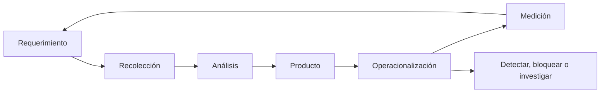

# Clase 195 — Threat intelligence operacional

> Parte: **8 — Blue Team, detección y SOC** · Fuente: *Blue Team Handbook* — Don Murdoch · *MITRE ATT&CK*
> ⏱️ Duración estimada: **100 min** · Nivel: **Intermedio**

---

## 🎯 Objetivo

Convertir la inteligencia de amenazas (threat intelligence) en detección y decisiones, no en un feed que nadie lee. Aprenderás a distinguir los niveles de intel (estratégica, operacional, táctica), a gestionar IOCs con una plataforma (MISP/OpenCTI), a puntuar su valor y a operacionalizarlos en el SIEM sin ahogarte en indicadores caducos.

## 📚 Resultados de aprendizaje

Al finalizar, el alumno podrá:

1. **Diferenciar** los niveles de threat intelligence y sus consumidores.
2. **Aplicar** el ciclo de inteligencia (dirección → recolección → análisis → difusión).
3. **Gestionar** IOCs y TTPs con MISP/OpenCTI y estándares STIX/TAXII.
4. **Operacionalizar** intel en detecciones sin degradar la señal.
5. **Evaluar** la calidad y caducidad de una fuente de intel.

## 🗺️ Temas

| # | Tema | Por qué importa |
|---|------|-----------------|
| 1 | Niveles de intel (estratégica/operacional/táctica) | Cada uno sirve a un consumidor |
| 2 | Ciclo de inteligencia | Proceso, no acumulación de feeds |
| 3 | IOCs vs IOAs vs TTPs | Qué operacionalizar y con qué vida útil |
| 4 | STIX/TAXII | Estándares de intercambio |
| 5 | MISP y OpenCTI | Plataformas de gestión (TIP) |
| 6 | Scoring y caducidad | Evitar el ruido de indicadores muertos |
| 7 | Operacionalización en SIEM | De la intel a la alerta |
| 8 | Atribución y sesgos | Interpretar con cautela |

## 🧠 Explicación en profundidad

La inteligencia empieza con una decisión del consumidor, no con un feed. Un requerimiento define qué necesita saber, para cuándo y qué acción habilitará. Lo estratégico orienta riesgo; lo operacional describe campañas; lo táctico ayuda a reconocer infraestructura, artefactos y comportamientos. La misma observación pierde valor si llega tarde o sin contexto.

Un observable es un hecho técnico; un indicador añade afirmación y contexto; una TTP suele persistir más que una IP. Cada objeto necesita procedencia, confianza, vigencia y retirada. STIX modela objetos y relaciones; TAXII los transporta. TLP orienta compartición, no sustituye clasificación legal ni controles de acceso. Operacionalizar implica probar, medir y retirar indicadores caducos.

### Requerimientos antes que feeds

«Recibir más indicadores» no define éxito. Un requerimiento podría ser: «¿qué infraestructura y procedimientos de campañas contra nuestro sector podemos convertir esta semana en controles para correo e identidad?». Nombra consumidor, decisión y tiempo. A partir de él se eligen fuentes y se descarta información interesante pero no accionable.

Estratégica, operacional y táctica describen alcance y audiencia, no jerarquía de calidad. Dirección puede necesitar tendencia e impacto; respuesta, secuencia de campaña; detección, observables y comportamientos. Un mismo informe se transforma para cada consumidor sin presentar una IP como conclusión estratégica.

### Del observable al indicador

Una IP encontrada en un reporte es un observable. Se vuelve indicador cuando se añade relación, periodo, fuente y confianza: «servidor C2 observado por esta campaña entre estas fechas». La dirección puede ser reasignada; se establece expiración. Un hash es preciso pero cambia con el archivo; una TTP es más durable pero requiere analítica conductual. La pirámide del dolor orienta esa diferencia, no elimina indicadores simples.

La confianza separa credibilidad de fuente y fuerza de la asociación. Dos fuentes pueden repetir el mismo origen y no ser independientes. Se preserva procedencia y se evita incrementar confianza solo por duplicación. Si una observación proviene de análisis interno, se enlaza al caso y a la evidencia permitida.

### STIX, TAXII y TLP sin confusiones

STIX representa objetos como indicator, malware, campaign o attack-pattern y sus relaciones; TAXII define servicios para intercambiarlos. Implementar ambos no garantiza calidad: objetos sin fechas, relaciones o procedencia siguen siendo pobres. TLP indica límites de compartición definidos por FIRST; no reemplaza clasificación contractual, privacidad ni necesidad de conocer.

### Operacionalizar y medir

Antes de bloquear se evalúa colisión con infraestructura compartida y se prueba en modo observación cuando el impacto es alto. En detección se busca retrospectivamente para conocer prevalencia, luego se monitoriza. Cada indicador tiene dueño, primera/última observación, expiración y decisión de renovación. Se mide cuántos productos cambiaron una decisión, generaron hallazgos válidos o redujeron tiempo; contar indicadores ingeridos recompensa volumen, no inteligencia.

## 📔 Glosario

- **PIR:** requerimiento prioritario de inteligencia.
- **Observable:** dato técnico sin conclusión suficiente.
- **Indicador:** patrón contextualizado que puede señalar actividad.
- **TTP:** táctica, técnica o procedimiento.
- **Provenance:** origen y transformaciones de información.
- **STIX:** lenguaje estructurado para CTI.
- **TAXII:** protocolo de intercambio de CTI.
- **TLP:** reglas FIRST para compartir información.

## 📖 Definiciones y características

- **Threat intelligence:** conocimiento sobre amenazas que informa decisiones. Característica: debe ser accionable y contextual, no un simple listado.
- **Intel estratégica:** tendencias y riesgos para la dirección. Característica: horizonte largo, lenguaje de negocio.
- **Intel operacional:** campañas y actores concretos. Característica: guía la priorización de detección.
- **Intel táctica:** IOCs y TTPs concretos. Característica: se consume en el SIEM/EDR de forma directa.
- **IOC (Indicator of Compromise):** artefacto observable de un ataque (hash, IP, dominio). Característica: fácil de operacionalizar, pero volátil (base de la pirámide del dolor).
- **STIX/TAXII:** formato y protocolo estándar para representar e intercambiar intel. Característica: interoperabilidad entre plataformas.
- **TIP (Threat Intelligence Platform):** software para agregar, enriquecer y distribuir intel (MISP, OpenCTI). Característica: gestiona ciclo de vida y scoring de indicadores.

## 🧰 Herramientas y preparación

- **MISP** o **OpenCTI** desplegado en laboratorio (Docker) como TIP.
- Feeds abiertos (p. ej. abuse.ch, listas OSINT) para poblar la plataforma.
- Conector **STIX/TAXII** hacia tu SIEM para consumir indicadores.
- Tu SIEM con capacidad de lookups/threat match (Splunk, Elastic Threat Intel).

Usa únicamente feeds y fuentes públicas o autorizadas; no distribuyas intel sensible fuera de su marco de compartición (TLP).

## 🧪 Laboratorio guiado — De feed a detección

1. **Levanta el TIP.** Despliega MISP/OpenCTI en Docker y accede al panel.
2. **Ingesta feeds.** Habilita 2–3 feeds abiertos (p. ej. listas de C2/malware de abuse.ch) y sincroniza.
3. **Enriquece un evento.** Toma un IOC de la clase 193 (dominio de tu beacon de laboratorio) y créalo como indicador con su contexto y TLP.
4. **Puntúa y caduca.** Asigna un score y una fecha de expiración; revisa cómo la plataforma degrada indicadores viejos.
5. **Conecta al SIEM.** Configura el consumo STIX/TAXII y un lookup de threat match sobre tráfico de red/DNS.
6. **Detecta con intel.** Genera tráfico hacia un indicador de la lista y confirma que el SIEM lo marca.
7. **Prioriza por TTP.** Mapea la campaña asociada a técnicas ATT&CK y compárala con tu cobertura (clase 187).
8. **Documenta.** Registra la fuente, su fiabilidad y la caducidad de los indicadores usados.

## ✍️ Ejercicios

1. Clasifica 5 piezas de intel en estratégica/operacional/táctica.
2. Explica por qué los IOCs caducan y cómo gestionarlo con scoring.
3. Diseña el flujo del ciclo de inteligencia para tu SOC.
4. Configura un lookup de threat match y prueba un hit.
5. Compara MISP y OpenCTI en modelo de datos y casos de uso.
6. Explica el semáforo TLP y cuándo se puede compartir cada nivel.

## 📝 Reto verificable

Operacionaliza un conjunto de indicadores desde tu TIP hasta una detección funcional en el SIEM, con scoring y caducidad definidos. **Criterio de aceptación:** un evento de tu laboratorio que coincide con un indicador dispara una alerta enriquecida con el contexto de la intel (fuente, TLP, campaña/ATT&CK), y demuestras que un indicador caducado deja de generar ruido.

## ⚠️ Errores comunes

| Síntoma / mensaje | Causa y cómo arreglar |
|-------------------|-----------------------|
| Miles de falsos positivos por IOCs | Feeds sin scoring/caducidad; filtra por fiabilidad y expira |
| Intel que nadie usa | Se acumula sin operacionalizar; cierra el ciclo hacia detección |
| Hits sin contexto | Falta enriquecimiento; añade campaña, TTP y TLP al indicador |
| Compartes intel sensible | Ignoras el TLP; respeta el marco de compartición |
| Solo IOCs, nunca TTPs | Detección frágil; sube en la pirámide del dolor hacia comportamiento |

## ❓ Preguntas frecuentes

**❓ ¿Más feeds = más seguridad?**
No. Feeds sin curar generan ruido y falsos positivos. Vale más un puñado de fuentes fiables, puntuadas y caducadas que un torrente de IOCs muertos.

**❓ ¿La intel táctica (IOCs) basta?**
Es útil pero volátil: el atacante cambia hash e IP en segundos. Complétala con intel operacional y TTPs, que son mucho más duraderos de detectar.

**❓ ¿Qué es el TLP?**
El Traffic Light Protocol clasifica cuánto puedes difundir una información (RED/AMBER/GREEN/CLEAR). Respetarlo es clave para participar en comunidades de compartición.

## 🔗 Referencias

- Murdoch, D. *Blue Team Handbook: SOC, SIEM, and Threat Hunting Use Cases*.
- MISP Project — <https://www.misp-project.org/>
- OpenCTI — <https://www.opencti.io/>
- OASIS STIX/TAXII — <https://oasis-open.github.io/cti-documentation/>
- FIRST, Traffic Light Protocol (TLP) — <https://www.first.org/tlp/>

## 📥 Material descargable

- 📄 [Guía en PDF](./clase-195-guia.pdf) — versión imprimible de esta clase.
- 🎞️ [Presentación (PPTX)](./clase-195-presentacion.pptx) — deck para proyectar en clase.

## ⬅️ Clase anterior

[Clase 194 — Deception: honeypots y honeytokens](../194-deception-honeypots-y-honeytokens/README.md)

## ➡️ Siguiente clase

[Clase 196 — Automatización con SOAR](../196-automatizacion-con-soar/README.md)
