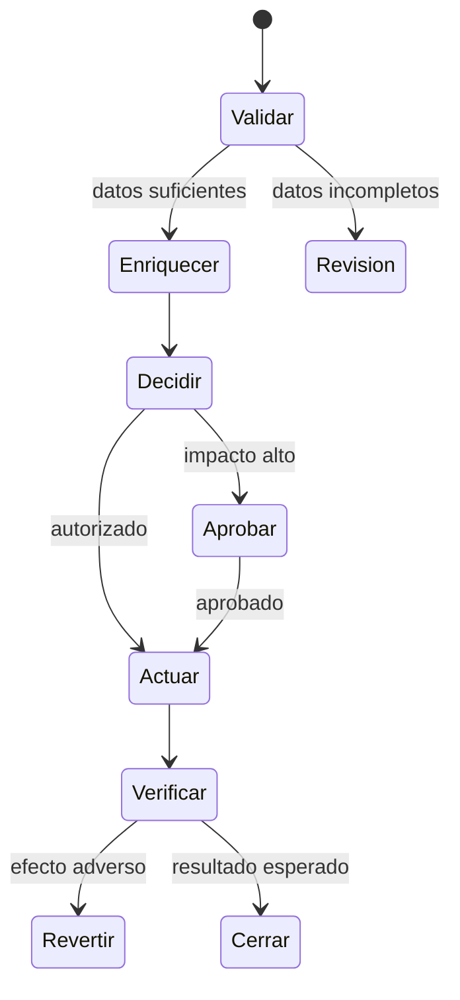

# Clase 196 — Automatización con SOAR

> Parte: **8 — Blue Team, detección y SOC** · Fuente: *Blue Team Handbook* — Don Murdoch
> ⏱️ Duración estimada: **110 min** · Nivel: **Avanzado**

---

## 🎯 Objetivo

Automatizar tareas repetitivas del SOC con SOAR (Security Orchestration, Automation and Response): playbooks que enriquecen alertas, deciden y ejecutan respuestas sin intervención humana para lo rutinario, reservando el criterio del analista para lo que importa. Construirás un playbook de principio a fin y entenderás dónde automatizar y dónde no.

## 📚 Resultados de aprendizaje

Al finalizar, el alumno podrá:

1. **Explicar** qué es SOAR y cómo se relaciona con SIEM, EDR y TIP.
2. **Diseñar** un playbook con enriquecimiento, decisión y acción.
3. **Distinguir** tareas automatizables de las que requieren humano en el bucle.
4. **Implementar** un flujo de respuesta (p. ej. phishing o host comprometido).
5. **Medir** el impacto de la automatización en MTTR y carga del analista.

## 🗺️ Temas

| # | Tema | Por qué importa |
|---|------|-----------------|
| 1 | Qué es SOAR | Orquestación + automatización + respuesta |
| 2 | Casos de uso típicos | Phishing, enriquecimiento, contención |
| 3 | Anatomía de un playbook | Trigger, enriquecimiento, decisión, acción |
| 4 | Human-in-the-loop | Dónde parar y pedir aprobación |
| 5 | Integraciones (APIs) | Conectar SIEM, EDR, TIP, ticketing |
| 6 | Orquestación de respuesta | Aislar, bloquear, notificar |
| 7 | Riesgos de la automatización | No romper producción con una acción |
| 8 | Métricas de automatización | Demostrar el valor |

## 🧠 Explicación en profundidad

SOAR coordina sistemas, decisiones y evidencia. Orquestar hace que herramientas intercambien contexto; automatizar ejecuta pasos sin intervención. Un playbook serio es una máquina de estados con entrada validada, enriquecimiento, decisión, acción, verificación, excepción y cierre; el camino ideal no basta.

Cada integración usa identidad mínima, secretos rotables y auditoría. Las acciones deben ser idempotentes o reconocer repeticiones; bloqueo y aislamiento necesitan duración, propietario y reversión. La adopción progresa desde enriquecer, luego recomendar y finalmente contener solo escenarios probados. La automatización apoya decisiones de riesgo, no sustituye el juicio.

### Qué problema resuelve realmente SOAR

Una alerta de phishing obliga a consultar reputación, obtener el mensaje, extraer URLs, buscar destinatarios, revisar autenticación, abrir un caso y decidir contención. Sin orquestación, el analista cambia de consola y copia información; aumenta demora y error. SOAR estandariza intercambio y registro. No determina por sí solo que el mensaje sea malicioso: reúne evidencia y ejecuta decisiones previamente autorizadas.

NIST SP 800-61 Rev. 3 sitúa la respuesta dentro de la gestión de riesgo de CSF 2.0. Eso justifica que un playbook incluya impacto, autoridad, comunicación y recuperación, no solo llamadas API. TheHive y Cortex ejemplifican separación entre gestión de casos y analizadores/responders; Shuffle muestra workflows e integraciones. La arquitectura concreta varía, pero el principio es el mismo: el caso conserva contexto y el flujo coordina acciones trazables.

### Diseñar el playbook como estados y contratos

Cada paso declara entrada, salida, error y reintento. «Consultar reputación» recibe un observable validado y devuelve fuente, resultado, hora y confianza; no un booleano sin procedencia. Si la API no responde, el flujo debe distinguir desconocido de benigno. Una acción idempotente comprueba si el indicador ya está bloqueado antes de repetir. Las excepciones llegan a una cola con dueño, no desaparecen.

Los gates humanos se ubican según impacto. Enriquecer puede ser automático; deshabilitar una cuenta privilegiada o aislar un servidor requiere contexto y aprobación. La aprobación muestra evidencia, efecto esperado, duración y rollback. Las credenciales de integraciones aplican mínimo privilegio y separación por acción: una clave de consulta no necesita permiso de bloqueo.

### Adoptar y medir sin automatizar el error

Se empieza con tareas frecuentes, deterministas y reversibles. Primero se observa el playbook en modo recomendación y se compara con decisiones humanas; luego se automatizan pasos de bajo impacto. Se prueban positivo, caso benigno, dato ausente, timeout, duplicado y rollback. Métricas útiles separan tiempo ahorrado, tasa de excepción, fallos de integración, acciones revertidas y calidad del resultado. Reducir clics sin mejorar decisión no demuestra madurez.

## 📔 Glosario

- **SOAR:** orquestación, automatización y respuesta.
- **Orquestación:** coordinación de herramientas y datos.
- **Playbook:** flujo ejecutable con decisiones.
- **Idempotencia:** repetición sin efectos adicionales indebidos.
- **Human-in-the-loop:** aprobación humana explícita.
- **Rollback:** reversión de una acción.
- **Service account:** identidad técnica limitada.

## 📖 Definiciones y características

- **SOAR:** plataforma que orquesta herramientas y automatiza flujos de respuesta. Característica: reduce trabajo manual y estandariza la reacción.
- **Playbook:** flujo definido de pasos ante un tipo de alerta. Característica: repetible, auditable y versionable.
- **Enriquecimiento automatizado:** consultar reputación, WHOIS, sandbox, activos de forma automática. Característica: acelera el triaje.
- **Human-in-the-loop:** puntos donde el flujo espera aprobación humana. Característica: evita acciones destructivas sin criterio.
- **Orquestación:** coordinar varias herramientas vía API. Característica: el SOAR "pega" el ecosistema.
- **Acción de respuesta:** aislar host, bloquear IP, deshabilitar cuenta. Característica: potente y potencialmente disruptiva; requiere salvaguardas.
- **Runbook vs playbook:** el runbook describe pasos (a veces manuales); el playbook los automatiza. Característica: el playbook es la versión ejecutable.

## 🧰 Herramientas y preparación

En laboratorio aislado:

- Un **SOAR open source**: Shuffle o Tines (community), o n8n como orquestador genérico.
- **TheHive + Cortex** como plataforma de gestión de casos y analizadores.
- APIs de tus herramientas de laboratorio: SIEM (Splunk/Elastic), EDR (Velociraptor/Wazuh), TIP (MISP).
- Un buzón/alerta de phishing simulado para el caso de uso.

Las acciones de respuesta se ejecutan solo contra tus sistemas de laboratorio; añade siempre aprobación humana antes de acciones destructivas.

## 🧪 Laboratorio guiado — Un playbook de phishing

1. **Define el trigger.** Una alerta de "posible phishing" (correo reportado) llega al SOAR vía webhook/API.
2. **Enriquece automáticamente.** El playbook extrae URLs y adjuntos y consulta reputación (MISP/Cortex), WHOIS del dominio y hash del adjunto.
3. **Decide.** Con reglas: si el dominio/hash es malicioso conocido → severidad alta; si es dudoso → crear caso para revisión humana.
4. **Contén (con aprobación).** Para el caso malicioso, propón bloquear el dominio en el proxy y buscar otros destinatarios; ejecuta solo tras aprobación del analista (human-in-the-loop).
5. **Busca alcance.** Consulta el SIEM: ¿quién más recibió/hizo clic? Añade los hallazgos al caso en TheHive.
6. **Notifica y documenta.** El playbook actualiza el ticket, notifica al canal del SOC y adjunta el enriquecimiento.
7. **Mide.** Compara el tiempo del flujo automatizado con el proceso manual equivalente.
8. **Añade salvaguardas.** Revisa que ninguna acción destructiva se ejecute sin la aprobación explícita definida.

## ✍️ Ejercicios

1. Diseña el diagrama de un playbook de "host comprometido" con puntos de aprobación.
2. Enumera 5 tareas del SOC seguras de automatizar y 3 que no.
3. Implementa un enriquecimiento automático de IP con reputación.
4. Define las salvaguardas para una acción de "deshabilitar cuenta".
5. Calcula el ahorro de MTTR de automatizar el triaje de phishing.
6. Explica el riesgo de un playbook que aísla hosts sin control y cómo mitigarlo.

## 📝 Reto verificable

Construye y ejecuta un playbook funcional en tu SOAR de laboratorio que enriquezca una alerta, decida su severidad y proponga una acción de contención con aprobación humana. **Criterio de aceptación:** ante una alerta de prueba, el playbook realiza el enriquecimiento automático, clasifica correctamente el caso, y NO ejecuta ninguna acción destructiva sin pasar por el punto de aprobación humana definido; el caso queda documentado en la plataforma.

## ⚠️ Errores comunes

| Síntoma / mensaje | Causa y cómo arreglar |
|-------------------|-----------------------|
| Playbook aísla producción por error | Automatización destructiva sin control; añade human-in-the-loop |
| Integración falla intermitente | API sin manejo de errores/reintentos; añade lógica de fallo |
| Automatizas un proceso aún inestable | Automatizaste el caos; estabiliza el runbook manual primero |
| Alertas se cierran solas mal clasificadas | Reglas de decisión pobres; ajusta umbrales y añade revisión |
| Nadie confía en el SOAR | Falta transparencia; registra cada paso y hazlo auditable |

## ❓ Preguntas frecuentes

**❓ ¿SOAR reemplaza analistas?**
No. Automatiza lo repetitivo y libera al analista para investigación y decisiones. El criterio humano sigue siendo esencial, sobre todo en acciones destructivas.

**❓ ¿Qué automatizo primero?**
Lo aburrido, frecuente y bien definido: enriquecimiento de indicadores, deduplicación de alertas, apertura de casos. Deja para después lo que requiere juicio.

**❓ ¿Puedo automatizar la contención completa?**
Con cuidado y salvaguardas. Aislar un host o bloquear una IP puede impactar producción; muchos equipos exigen aprobación humana antes de acciones irreversibles.

## 🔗 Referencias

- Murdoch, D. *Blue Team Handbook: SOC, SIEM, and Threat Hunting Use Cases*.
- TheHive & Cortex — <https://thehive-project.org/>
- Shuffle SOAR — <https://shuffler.io/>
- Gartner, "Market Guide for SOAR Solutions" (marco conceptual).
- NIST SP 800-61 Rev. 3, integración de respuesta a incidentes con CSF 2.0 — <https://doi.org/10.6028/NIST.SP.800-61r3>

## 📥 Material descargable

- 📄 [Guía en PDF](./clase-196-guia.pdf) — versión imprimible de esta clase.
- 🎞️ [Presentación (PPTX)](./clase-196-presentacion.pptx) — deck para proyectar en clase.

## ⬅️ Clase anterior

[Clase 195 — Threat intelligence operacional](../195-threat-intelligence-operacional/README.md)

## ➡️ Siguiente clase

[Clase 197 — Métricas y madurez del SOC](../197-metricas-y-madurez-del-soc/README.md)
