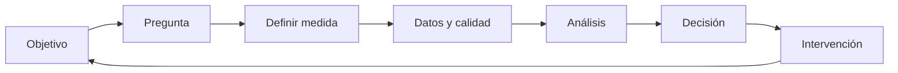

# Clase 197 — Métricas y madurez del SOC

> Parte: **8 — Blue Team, detección y SOC** · Fuente: *Blue Team Handbook* — Don Murdoch
> ⏱️ Duración estimada: **90 min** · Nivel: **Intermedio**

---

## 🎯 Objetivo

Medir el rendimiento y la madurez de un SOC con métricas defendibles, evitando indicadores vanidosos que se pueden manipular. Aprenderás a definir KPIs de detección y respuesta (MTTD, MTTR, dwell time, cobertura ATT&CK), a evaluar la madurez con un modelo (SOC-CMM) y a comunicar el valor del SOC a la dirección.

## 📚 Resultados de aprendizaje

Al finalizar, el alumno podrá:

1. **Definir** métricas de detección y respuesta con su fórmula y fuente de datos.
2. **Distinguir** métricas útiles de las vanidosas o fáciles de manipular.
3. **Evaluar** la madurez del SOC con un modelo estructurado.
4. **Construir** un cuadro de mando para dirección y para el equipo.
5. **Usar** las métricas para priorizar mejoras (no solo reportar).

## 🗺️ Temas

| # | Tema | Por qué importa |
|---|------|-----------------|
| 1 | Para qué medir | Mejorar, no adornar |
| 2 | MTTD, MTTR, dwell time | Núcleo del rendimiento defensivo |
| 3 | Métricas de calidad de detección | Falsos positivos, precisión, cobertura |
| 4 | Métricas vanidosas y gaming | Qué evitar |
| 5 | Cobertura ATT&CK como métrica | Profundidad vs presencia |
| 6 | SOC-CMM y madurez | Dónde estás y hacia dónde ir |
| 7 | Cuadro de mando por audiencia | Dirección vs operación |
| 8 | De la métrica a la acción | Priorizar mejoras con datos |

## 🧠 Explicación en profundidad

Una métrica útil empieza por una decisión: objetivo, pregunta, medida, fuente y acción. Si el SOC no sabe qué decisión cambiará, el indicador se convierte en decoración o incentivo perverso.

MTTD y MTTR requieren inicio, fin, población y zona horaria. El promedio oculta colas largas; mediana y percentiles muestran distribución. Los incidentes nunca detectados no entran por sí solos en MTTD. Precisión y recall necesitan una verdad de referencia que suele ser incompleta. «Cobertura ATT&CK» debe expresar estados verificables, no porcentaje de celdas. La madurez se demuestra con dueños, pruebas, calidad y ciclos de mejora.

### Construir una medida desde una decisión

NIST SP 800-55 Vol. 2 propone desarrollar un programa de medición ligado a objetivos de seguridad. Aplicado al SOC, si el objetivo es reducir exposición de activos críticos, la pregunta puede ser cuánto tarda la contención de incidentes confirmados de severidad alta. Se define inicio —por ejemplo, confirmación— y fin —aislamiento verificado—, población, exclusiones, fuente y periodicidad. Solo entonces existe una medida comparable.

MTTR es ambiguo porque la R puede significar reconocer, responder, remediar o recuperar. Dos equipos pueden publicar «dos horas» midiendo intervalos distintos. La clase exige escribir la fórmula con timestamps concretos. También se presentan mediana y percentiles: un promedio de una hora puede ocultar algunos incidentes de doce horas. Segmentar por severidad y tipo evita comparar phishing simple con ransomware extendido.

### Calidad de detección sin denominadores engañosos

La precisión se aproxima con verdaderos positivos entre alertas clasificadas como positivas, pero las disposiciones de analistas pueden contener error. Recall exige conocer positivos que la detección perdió, algo que se estima mediante incidentes retrospectivos, ejercicios o datasets controlados. Contar «falsos positivos» sin denominador castiga reglas de alto volumen aunque su proporción sea razonable. Tampoco toda alerta benigna es inútil: puede identificar política débil.

MTTD sufre sesgo de selección: solo incluye incidentes descubiertos y cuyo inicio pudo estimarse. Dwell time reportado externamente suele usar otra población. Por eso se documentan límites y no se transforma una métrica en promesa universal.

### Madurez y cobertura como evidencia

SOC-CMM puede ordenar conversaciones de madurez, pero una puntuación necesita evidencia: roles, pruebas, calidad de datos, revisión de reglas, ejercicios y acciones cerradas. ATT&CK Navigator visualiza, no certifica. La cobertura se expresa por procedimiento, activo, dato, analítica, prueba y estado operativo.

Una métrica madura tiene dueño y respuesta prevista. Si el percentil 90 de triaje empeora, se analiza cola, complejidad y datos; no se ordena «cerrar más rápido». Si un objetivo incentiva cierres prematuros, se combina con reapertura, calidad y recurrencia. Medir sirve para decidir una intervención y comprobar su efecto, no para producir una cifra favorable.

### Cuadros de mando por audiencia

La operación necesita distribución por regla, cola, edad, campos faltantes y salud de fuentes para actuar hoy. El responsable del SOC necesita capacidad, calidad, incidentes y deuda para asignar trabajo. Dirección necesita tendencia de riesgo, impacto, decisiones y confianza, no una pared de EPS. La misma medida puede agregarse de forma diferente, pero conserva definición y procedencia.

Un dashboard no sustituye análisis. Se añaden notas sobre cambios de herramienta, población o política que rompen comparabilidad. Colores y umbrales tienen explicación: rojo significa una decisión prevista, no solo valor alto. Los datos sensibles se limitan según audiencia.

### Gaming y revisión del sistema de medición

Si se recompensa cantidad de cierres, aumentan cierres superficiales; si se castigan falsos positivos sin contexto, se silencian reglas útiles. Se anticipan comportamientos inducidos y se equilibran velocidad, calidad y resultado. Periódicamente se retira una medida que ya no orienta decisión. NIST SP 800-55 Vol. 2 respalda tratar medición como programa con roles y gestión de datos, no como lista fija de KPI.

## 📔 Glosario

- **Medida:** valor obtenido mediante una regla definida.
- **Métrica:** interpretación de medidas para un objetivo.
- **Indicador:** señal que apoya una decisión.
- **Percentil:** umbral bajo el que cae una proporción de casos.
- **Precisión:** proporción de alertas relevantes.
- **Recall:** proporción de positivos reales detectados.
- **Ground truth:** referencia para evaluar resultados.
- **Gaming:** mejorar la cifra perjudicando el objetivo.

## 📖 Definiciones y características

- **MTTD (Mean Time To Detect):** media de un intervalo de detección definido. Característica: requiere inicio, fin, población y límites antes de interpretarse.
- **MTTR (Mean Time To Respond/Remediate):** tiempo hasta contener/erradicar. Característica: mide la respuesta; distingue "respond" de "remediate".
- **Dwell time:** intervalo estimado de presencia no detectada para incidentes conocidos. Característica: está sujeto a sesgo de selección y a incertidumbre sobre el inicio.
- **Tasa de falsos positivos:** proporción de alertas que no eran incidentes. Característica: alta = fatiga y coste; guía el afinado.
- **Cobertura ATT&CK:** técnicas detectadas frente al total relevante. Característica: mide amplitud; debe combinarse con profundidad.
- **Métrica vanidosa:** número que impresiona pero no informa (p. ej. "alertas procesadas"). Característica: incentiva el gaming, no la mejora.
- **SOC-CMM:** modelo de madurez de capacidades del SOC. Característica: evalúa personas, procesos, tecnología y servicios.

## 🔍 Métrica construida — tiempo hasta contención

**Objetivo:** reducir exposición de incidentes confirmados de severidad alta. **Inicio:** timestamp de confirmación registrado en el caso. **Fin:** aislamiento o revocación verificados. **Población:** incidentes altos cerrados en el trimestre. **Presentación:** mediana y percentil 90, segmentados por horario y tipo. **Fuente:** historial de estados y acciones del sistema de casos.

La métrica excluye deliberadamente tiempo antes de confirmación; no debe llamarse tiempo desde compromiso. Un caso sin contención se conserva como observación censurada o excepción documentada, no se elimina para mejorar la cifra. Si p90 empeora fuera de horario, la intervención puede ser autoridad on-call, no presionar a cerrar tickets.

Se acompaña con calidad/reapertura para evitar contención aparente. Después de cambiar el proceso se compara una ventana suficiente y se explican cambios de población. NIST SP 800-55 Vol. 2 respalda el vínculo entre medida, objetivo y decisión.

## ✅ Criterio de dominio

El alumno define fórmula con eventos reales, población, segmentación, límites y decisión; detecta incentivos perversos. Escribir «mejorar MTTR» sin definir R ni timestamps no cumple.

## 🧰 Herramientas y preparación

- Datos de tu SIEM/ticketing de laboratorio (o dataset simulado) para calcular métricas.
- Una hoja de cálculo o dashboard (Kibana/Grafana) para el cuadro de mando.
- El **SOC-CMM** (herramienta de autoevaluación gratuita) para medir madurez.
- **ATT&CK Navigator** (clase 187) para la métrica de cobertura.

No se requieren técnicas ofensivas; es una clase de gobierno y medición.

## 🧪 Laboratorio guiado — Cuadro de mando del SOC

1. **Elige tus KPIs.** Selecciona 6 métricas: MTTD, MTTR, dwell time, % falsos positivos, cobertura ATT&CK y % incidentes con causa raíz documentada.
2. **Define fórmula y fuente.** Para cada una, especifica cómo se calcula y de qué log/ticket sale.
3. **Calcula con datos.** Usa tus tickets/alertas de laboratorio (o un CSV simulado) para obtener valores reales.
4. **Detecta gaming.** Para cada métrica, imagina cómo un equipo podría manipularla y añade un contrapeso (p. ej. MTTR bajo + tasa de reincidencia).
5. **Mide madurez.** Completa una autoevaluación SOC-CMM en 2–3 dominios y anota tu nivel.
6. **Construye dos vistas.** Un dashboard operativo (colas, falsos positivos, cobertura) y uno ejecutivo (tendencia de dwell time, riesgo).
7. **Prioriza mejoras.** Con las métricas, define las 3 acciones de mayor impacto para el próximo trimestre.

## ✍️ Ejercicios

1. Escribe la fórmula y la fuente de datos de 5 métricas del SOC.
2. Identifica 3 métricas vanidosas y propón su reemplazo útil.
3. Calcula MTTD y MTTR de un conjunto de 10 incidentes de ejemplo.
4. Diseña un contrapeso para evitar el gaming de MTTR.
5. Completa una mini autoevaluación de madurez en un dominio.
6. Propón un KPI que mida la calidad de las detecciones, no solo la cantidad.

## 📝 Reto verificable

Entrega un cuadro de mando con al menos 6 métricas (fórmula, fuente y valor calculado), sus contrapesos anti-gaming, y una evaluación de madurez con 3 mejoras priorizadas. **Criterio de aceptación:** cada métrica tiene fórmula y origen de datos verificable, al menos una detecta explícitamente un intento de manipulación (contrapeso), y las mejoras priorizadas se justifican con los valores medidos, no con opiniones.

## ⚠️ Errores comunes

| Síntoma / mensaje | Causa y cómo arreglar |
|-------------------|-----------------------|
| MTTR excelente, incidentes reinciden | Se cierra sin erradicar; añade métrica de reincidencia |
| "Procesamos 1M de alertas" | Métrica vanidosa; reporta calidad y resultado, no volumen |
| Cobertura ATT&CK al 95% pero se cuelan ataques | Presencia sin profundidad; mide eficacia real de cada detección |
| Métricas que nadie usa | Se reportan pero no priorizan; ligá cada métrica a una decisión |
| Datos inconsistentes | Fuentes mal definidas; documenta fórmula y origen de cada KPI |

## ❓ Preguntas frecuentes

**❓ ¿Cuál es la métrica más importante?**
Dwell time es la que mejor refleja el impacto real: cuánto tiempo estuvo el atacante sin ser visto. MTTD y MTTR la explican; el resto la contextualizan.

**❓ ¿Por qué evitar métricas de volumen?**
Porque incentivan el comportamiento equivocado: cerrar alertas rápido o inflar cifras. Mide resultados (detectado, contenido, erradicado), no actividad.

**❓ ¿Cómo comunico el valor del SOC a dirección?**
Con tendencias de riesgo y dwell time, no con jerga técnica. Muestra cómo la inversión reduce el tiempo de exposición y el impacto potencial.

## 🔗 Referencias verificables y alcance

- NIST SP 800-55 Vol. 1: fuente primaria para identificar y seleccionar medidas de seguridad vinculadas con objetivos y decisiones — <https://doi.org/10.6028/NIST.SP.800-55v1>
- NIST SP 800-55 Vol. 2: fuente primaria para desarrollar un programa de medición, incluida recolección, análisis, comunicación y revisión — <https://doi.org/10.6028/NIST.SP.800-55v2>
- MITRE ATT&CK Navigator: herramienta oficial para visualizar capas de cobertura; no calcula eficacia, profundidad ni calidad de telemetría — <https://mitre-attack.github.io/attack-navigator/>
- SOC-CMM: modelo público especializado para autoevaluación de madurez; es una referencia de trabajo, no una certificación de NIST o MITRE — <https://www.soc-cmm.com/>
- Mandiant M-Trends: informe anual usado como ejemplo de cómo se publica *dwell time* sobre una población observada; no constituye un benchmark universal — <https://www.mandiant.com/m-trends>
- Murdoch, D. *Blue Team Handbook: SOC, SIEM, and Threat Hunting Use Cases*: bibliografía profesional complementaria.

## 📥 Material descargable

- 📄 [Guía en PDF](./clase-197-guia.pdf) — versión imprimible de esta clase.
- 🎞️ [Presentación (PPTX)](./clase-197-presentacion.pptx) — deck para proyectar en clase.

## ⬅️ Clase anterior

[Clase 196 — Automatización con SOAR](../196-automatizacion-con-soar/README.md)

## ➡️ Siguiente clase

[Clase 198 — Casos de estudio de detección](../198-casos-de-estudio-de-deteccion/README.md)
