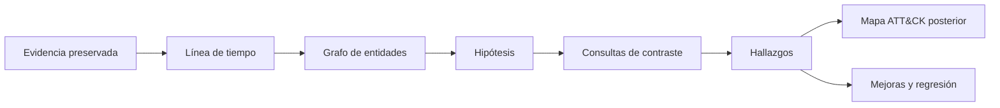

# Clase 198 — Casos de estudio de detección

> Parte: **8 — Blue Team, detección y SOC** · Fuente: *The Practice of Network Security Monitoring* — Bejtlich · *Applied NSM* — Sanders y Smith
> ⏱️ Duración estimada: **120 min** · Nivel: **Avanzado**

---

## 🎯 Objetivo

Integrar todo lo aprendido en la parte resolviendo casos realistas de detección de principio a fin: desde el compromiso inicial hasta la exfiltración, reconstruyendo la cadena de ataque con telemetría de endpoint y red, mapeándola a ATT&CK y proponiendo las detecciones que la habrían atrapado antes. Es la clase de síntesis práctica del blue team.

## 📚 Resultados de aprendizaje

Al finalizar, el alumno podrá:

1. **Reconstruir** una intrusión completa a partir de telemetría heterogénea.
2. **Mapear** cada fase del ataque a técnicas ATT&CK.
3. **Identificar** en qué punto cada detección habría interrumpido la cadena.
4. **Priorizar** mejoras de detección con base en los huecos observados.
5. **Comunicar** el caso con una línea de tiempo y lecciones aprendidas.

## 🗺️ Temas

| # | Tema | Por qué importa |
|---|------|-----------------|
| 1 | Método de análisis de caso | Estructura para no perderse |
| 2 | Caso 1: phishing → ejecución → persistencia | Cadena de intrusión típica |
| 3 | Caso 2: movimiento lateral → dominio | Escalada y propagación |
| 4 | Caso 3: C2 → exfiltración | Salida de datos |
| 5 | Reconstrucción de línea de tiempo | Ordenar los hechos |
| 6 | Mapeo a ATT&CK | Vocabulario y cobertura |
| 7 | Puntos de detección perdidos | Dónde mejorar |
| 8 | Lecciones aprendidas y reporte | Cerrar el ciclo |

## 🧠 Explicación en profundidad

Un caso defensivo reconstruye decisiones desde evidencia, no una narración retrospectiva perfecta. Cada elemento se marca como hecho observado, inferencia sustentada o hipótesis pendiente. Fuente, consulta, zona horaria y adquisición permiten reproducir el razonamiento.

Se distinguen hora del evento, registro e ingesta para ordenar eventos tardíos. Una detección ausente se clasifica: fuente no recolectada, parser defectuoso, analítica inexistente, alerta no creada o triaje incorrecto. Esa clasificación asigna una corrección concreta. ATT&CK se aplica después de comprender evidencia. Para comparar cambios se conserva dataset, versión, consulta y resultado esperado.

### Reconstruir sin escribir la conclusión primero

Un caso empieza con preguntas: qué entidad actuó, qué activo fue afectado, qué cambió y qué evidencia falta. La línea de tiempo reúne eventos con procedencia; el grafo conecta usuarios, procesos, archivos, hosts y destinos. Primero se anotan hechos —un evento con campos concretos—; después inferencias —dos eventos probablemente pertenecen a la misma sesión—; por último hipótesis que aún requieren contraste.

Esta separación evita retrospectiva perfecta. Sabiendo el resultado, es fácil interpretar toda anomalía como señal evidente. El analista debe registrar qué podía conocerse en ese momento y qué consulta reveló el siguiente dato. Una explicación alternativa se prueba: una conexión rara puede ser actualización; un proceso firmado puede haber sido abusado. La fuerza del caso surge de corroboración, no de narrativa dramática.

### Usar datasets de forma reproducible

Splunk Boss of the SOC ofrece datasets y preguntas de investigación para practicar; EVTX-ATTACK-SAMPLES reúne eventos útiles para probar artefactos. Son materiales de laboratorio, no prueba de rendimiento universal. Se fija versión o commit, se preserva archivo y hash, se documentan zona horaria, parser y consulta. Si se modifica una regla, se repite exactamente la misma muestra y se comparan positivos, negativos y coste.

ATT&CK se aplica después de entender el comportamiento. Mapear una ejecución a una técnica no añade evidencia; ofrece vocabulario para comunicar. El caso debe explicar qué procedimiento y campos justifican el mapeo y qué partes no se observaron.

### Convertir fallos en mejoras específicas

Una alerta perdida se localiza en la cadena. Si el origen nunca generó dato, se corrige instrumentación; si llegó sin campos, parser; si la consulta no coincidió, lógica; si coincidió pero no creó notable, programación; si el notable fue cerrado mal, runbook o formación. Decir simplemente «el SIEM falló» no asigna una intervención verificable.

El producto final incluye timeline, entidades, hallazgos, incertidumbres, causa del gap, cambio propuesto y prueba de regresión. Un buen caso enseña tanto por qué se detectó como por qué pudo no detectarse.

### Caso 1: phishing, ejecución y persistencia

El correo aporta entrega y URL/adjunto; proxy o navegador apoya descarga; endpoint demuestra proceso; tareas/registro muestran persistencia. El orden no se presume: se normalizan tiempos y se enlazan entidades. Una detección puede existir en ejecución y faltar en persistencia. El informe distingue qué etapa se observó y qué fuente no estaba disponible.

### Caso 2: acceso remoto y expansión

Una cuenta privilegiada aparece desde una estación hacia un servidor, luego el servidor inicia conexiones a otros activos. El grafo revela que el destino se convirtió en origen. Se comparan rutas administrativas y eventos de servicio remoto. Si el SOC solo agrupó por host inicial, el gap está en correlación/alcance, no necesariamente en ausencia de alertas individuales.

### Caso 3: canal exterior y posible exfiltración

Una relación periódica evoluciona hacia transferencia saliente. Flow demuestra volumen y destino; endpoint vincula proceso; clasificación del dato requiere fuente adicional. No se llama exfiltración solo por bytes. La hipótesis se fortalece si aparecen preparación de archivos, proceso inesperado y destino sin justificación, pero el informe conserva el término «posible» cuando el contenido no puede confirmarse.

Estos tres casos no son historias para memorizar. Enseñan a mover la unidad de análisis: evento, secuencia, entidad, grafo y decisión. Los datasets permiten reproducir el razonamiento, y el reporte explica también alternativas descartadas.

## 📔 Glosario

- **Hecho:** observación directamente respaldada.
- **Inferencia:** conclusión razonada desde hechos.
- **Hipótesis:** explicación por contrastar.
- **Timeline:** secuencia normalizada de eventos.
- **Provenance:** origen y tratamiento de evidencia.
- **Regresión:** prueba que evita reintroducir un fallo.
- **Blind spot:** comportamiento sin visibilidad suficiente.

## 📖 Definiciones y características

- **Análisis de caso:** estudio estructurado de una intrusión para extraer detecciones y lecciones. Característica: enfoque retrospectivo con valor prospectivo.
- **Línea de tiempo (timeline):** secuencia ordenada de eventos del incidente. Característica: base de toda reconstrucción; requiere tiempo sincronizado (clase 182).
- **Cadena de ataque:** fases del compromiso (acceso inicial → ejecución → persistencia → lateral → C2 → exfiltración). Característica: cada eslabón es una oportunidad de detección.
- **Punto de detección:** momento donde una regla habría disparado. Característica: cuanto más temprano, menor el daño.
- **Pivot:** paso de un dato a otro relacionado (proceso→conexión→host). Característica: técnica central de la investigación.
- **Lección aprendida:** mejora concreta derivada del caso. Característica: debe traducirse en detección, control o proceso.

## 🔍 Caso resuelto — detección ausente

Un dataset controlado contiene documento, intérprete y conexión. La timeline confirma los tres hechos. En el SIEM existen proceso y red, pero la regla no alertó. Se ejecuta la consulta contra el evento y se descubre que esperaba `process.parent.name`, mientras el pipeline pobló otro campo.

La clasificación es «mapeo/parser», no «regla inexistente». Se corrige el pipeline o contrato, se reindexa la muestra cuando procede y se ejecutan fixtures. Después se verifica notable y triaje. El mapa ATT&CK se actualiza solo cuando la cadena completa queda probada.

El informe conserva dataset/commit, hash, versión de parser, consulta antes/después, positivo, negativo y resultado. También registra que la prueba cubre una variante concreta y no todas las ejecuciones de intérpretes.

## ✅ Criterio de dominio

El alumno separa hechos, inferencias e hipótesis; reproduce el gap; lo localiza en una etapa y demuestra regresión. Una narración sin consultas ni procedencia no es caso de estudio verificable.

## 🧰 Herramientas y preparación

- Un dataset de intrusión realista: **Splunk BOTS**, **Security Onion** con PCAP/logs de ejemplo, o **EVTX-ATTACK-SAMPLES** (colección de Event Logs de ataques).
- Tu SIEM (Splunk/Elastic) para consultar la telemetría del caso.
- **ATT&CK Navigator** para el mapeo.
- Una plantilla de reporte de incidente con línea de tiempo.

Trabaja sobre datasets públicos o de tu laboratorio; no analices datos de terceros sin autorización.

## 🧪 Laboratorio guiado — Resuelve una intrusión completa

1. **Carga el dataset.** Importa BOTS o los EVTX de ataque en tu SIEM.
2. **Establece el punto de partida.** Localiza el acceso inicial (correo de phishing, adjunto, primer proceso anómalo) y fija el T0.
3. **Sigue la ejecución.** Pivota del adjunto al proceso (Sysmon 1), a la línea de comandos y a la descarga (Event 3/proxy).
4. **Detecta persistencia.** Busca tareas programadas, Run keys o servicios creados (4698, Sysmon 13, 7045).
5. **Rastrea el movimiento lateral.** Correlaciona logons entre hosts (clase 192): PsExec/WMI/WinRM, 4624 tipo 3/10.
6. **Encuentra el C2 y la exfiltración.** Identifica beaconing (clase 193) y salida de datos anómala (clase 191).
7. **Construye la timeline.** Ordena todos los eventos con su técnica ATT&CK asociada en una tabla.
8. **Marca los puntos de detección perdidos.** Para cada fase, indica qué regla la habría atrapado y por qué no disparó (falta de telemetría, regla ausente, falso negativo).
9. **Escribe el reporte.** Resumen ejecutivo, timeline, mapeo ATT&CK y 5 mejoras priorizadas.

## ✍️ Ejercicios

1. Reconstruye la fase de acceso inicial de un caso con sus eventos.
2. Mapea las 6 fases de un caso a técnicas ATT&CK concretas.
3. Identifica el punto de detección más temprano posible y su regla.
4. Redacta 5 lecciones aprendidas accionables.
5. Escribe una detección nueva derivada de un hueco del caso.
6. Elabora la línea de tiempo del caso en una sola tabla.

## 📝 Reto verificable

Resuelve un caso completo entregando: línea de tiempo con técnicas ATT&CK por fase, identificación de los puntos de detección perdidos y al menos tres detecciones nuevas que habrían interrumpido la cadena antes. **Criterio de aceptación:** la timeline cubre desde el acceso inicial hasta la exfiltración de forma coherente y con tiempos ordenados, cada fase está mapeada a su técnica correcta, y las detecciones propuestas son verificables (probadas o expresadas como reglas Sigma/SIEM concretas).

## ⚠️ Errores comunes

| Síntoma / mensaje | Causa y cómo arreglar |
|-------------------|-----------------------|
| Timeline desordenada | Tiempos no sincronizados; normaliza a UTC (clase 182) |
| Fases sin evidencia | Punto ciego de telemetría; anótalo como hueco a cerrar |
| Mapeo ATT&CK forzado | Técnica mal asignada; verifica el procedimiento real |
| "El ataque era indetectable" | Afirmación no demostrada; separa ausencia de telemetría, fallo de ingesta, falta de analítica y comportamiento realmente no observable con las fuentes disponibles |
| Reporte sin acciones | Análisis sin lecciones; cada caso debe producir mejoras concretas |

## ❓ Preguntas frecuentes

**❓ ¿Por qué estudiar casos si ya sé las técnicas?**
Porque la realidad mezcla fases, ruido y datos incompletos. Los casos entrenan el pivoteo, la reconstrucción y el criterio, que ninguna clase teórica da por sí sola.

**❓ ¿Dónde consigo datos realistas para practicar?**
Splunk BOTS, Security Onion, EVTX-ATTACK-SAMPLES y los datasets de Atomic Red Team ofrecen telemetría de ataques reproducible y legal para entrenar.

**❓ ¿El objetivo es encontrar al atacante o mejorar la detección?**
Ambos, pero el valor duradero está en las detecciones y lecciones que dejas: cada caso resuelto debe hacer al SOC más difícil de sorprender la próxima vez.

## 🔗 Referencias verificables y alcance

- MITRE ATT&CK: fuente primaria para mapear procedimientos demostrados por evidencia; el mapeo no reemplaza la reconstrucción temporal — <https://attack.mitre.org/>
- Splunk BOTS v3: dataset público mantenido por Splunk para investigaciones reproducibles; los hechos del caso se derivan del dataset, no se generalizan como frecuencia real — <https://github.com/splunk/botsv3>
- EVTX-ATTACK-SAMPLES: colección comunitaria de eventos Windows para laboratorio; cada muestra debe identificarse y conservarse con su procedencia — <https://github.com/sbousseaden/EVTX-ATTACK-SAMPLES>
- Bejtlich, R. *The Practice of Network Security Monitoring*. No Starch Press: bibliografía complementaria sobre razonamiento investigativo.
- Sanders, C. y Smith, J. *Applied Network Security Monitoring*. Syngress: bibliografía complementaria sobre análisis de evidencia de red.

## 📥 Material descargable

- 📄 [Guía en PDF](./clase-198-guia.pdf) — versión imprimible de esta clase.
- 🎞️ [Presentación (PPTX)](./clase-198-presentacion.pptx) — deck para proyectar en clase.

## ⬅️ Clase anterior

[Clase 197 — Métricas y madurez del SOC](../197-metricas-y-madurez-del-soc/README.md)

## ➡️ Siguiente clase

[Clase 199 — Ingeniería de detección como disciplina](../199-ingenieria-de-deteccion-como-disciplina/README.md)
