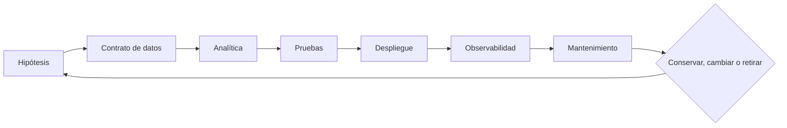

# Clase 199 — Ingeniería de detección como disciplina

> Parte: **8 — Blue Team, detección y SOC** · Fuente: *The Sigma Specification* · *MITRE ATT&CK* · prácticas de Detection Engineering
> ⏱️ Duración estimada: **110 min** · Nivel: **Avanzado**

---

## 🎯 Objetivo

Tratar la detección como ingeniería, no como un conjunto de reglas sueltas: un ciclo de vida con requisitos, desarrollo, pruebas, despliegue, versionado y retiro, gestionado como código (detection-as-code) con CI/CD. Aprenderás a documentar detecciones, medir su calidad, validarlas contra ataques reales y evitar la degradación silenciosa de tu cobertura.

## 📚 Resultados de aprendizaje

Al finalizar, el alumno podrá:

1. **Aplicar** el ciclo de vida de una detección (idea → desarrollo → prueba → producción → retiro).
2. **Gestionar** detecciones como código en un repositorio con CI/CD.
3. **Documentar** cada detección con metadatos, contexto y respuesta esperada.
4. **Validar** detecciones con Atomic Red Team y pruebas automatizadas.
5. **Medir** calidad (precisión, falsos positivos, cobertura, deuda de detección).

## 🗺️ Temas

| # | Tema | Por qué importa |
|---|------|-----------------|
| 1 | Detection Engineering como disciplina | De reglas ad hoc a proceso |
| 2 | Ciclo de vida de una detección | Estructura repetible y auditable |
| 3 | Detection-as-code y control de versiones | Trazabilidad y revisión |
| 4 | CI/CD para detecciones | Validación automática |
| 5 | Documentación y metadatos | Contexto para el analista |
| 6 | Validación con Atomic Red Team | Probar que realmente detecta |
| 7 | Calidad y deuda de detección | Evitar degradación silenciosa |
| 8 | Colaboración red↔blue (puente a purple) | Mejorar con adversario real |

## 🧠 Explicación en profundidad

La ingeniería de detección trata cada analítica como producto mantenible. Comienza con hipótesis y contrato de datos, no con sintaxis del SIEM. El contrato declara fuentes, campos, semántica, latencia y calidad mínima; así una falla upstream se distingue de una evasión.

Detection-as-code incluye regla, metadatos, mapeos y fixtures positivos y negativos. CI valida esquema, conversión, resultados y coste. En producción se vigilan tasa, latencia, campos nulos y distribución por entidad. Una caída de alertas puede significar éxito, pipeline roto o evasión. Toda regla necesita dueño, revisión y retiro; acumular contenido sin mantenimiento aumenta deuda y fatiga.

### La detección como producto

MITRE ATT&CK Detection Strategies conecta comportamiento, analítica y fuentes posibles; Sigma ofrece una especificación portable; Atomic Red Team aporta procedimientos controlados. Ninguna fuente completa sola el ciclo. El ingeniero parte de riesgo y comportamiento, declara telemetría, implementa la analítica, la prueba y observa su operación.

El contrato de datos nombra productor, campos, tipos, significado, latencia, retención y umbrales de calidad. Para detectar creación remota de servicio, por ejemplo, no basta `service_name`: se requieren host, usuario, origen o proceso según la hipótesis. Si un campo crítico queda nulo, la regla puede seguir ejecutándose y producir silencio; el contrato permite alertar sobre esa degradación.

### Repositorio y pruebas

Detection-as-code no es guardar consultas en Git. El repositorio incluye regla, explicación, ATT&CK justificado, datos requeridos, fixtures, conversión, propietario, severidad, excepciones y changelog. La revisión evalúa lógica y efecto operativo. CI valida esquema, positivo mínimo, negativos cercanos y traducción; cuando existe entorno de prueba, ejecuta la consulta y mide tiempo o cardinalidad.

Atomic Red Team puede generar un procedimiento conocido, pero ejecutar un test no demuestra cobertura completa de la técnica. Valida esa variante, sistema y configuración. Se registra comando, prerequisitos, versión, cleanup y eventos esperados. Las pruebas negativas contienen administración legítima parecida para evitar una regla que detecte únicamente la herramienta.

### Desplegar, observar y retirar

El rollout puede comenzar en modo hunting, después alertar a un grupo y finalmente ampliar. Se vigilan coincidencias, entidades únicas, latencia, errores, campos nulos y esfuerzo de triaje. Un aumento puede ser ataque, cambio de software o duplicación; una caída, prevención eficaz, datos rotos o evasión. La observabilidad no interpreta sola: orienta investigación del producto.

Excepciones tienen alcance y vencimiento. La regla se revisa cuando cambia amenaza, plataforma o fuente. Si ya no responde a riesgo, se retira con motivo y reemplazo. El catálogo de miles de reglas no es madurez si nadie sabe cuáles funcionan; una cartera pequeña, probada y vinculada a decisiones puede ofrecer más capacidad.

## 📔 Glosario

- **Contrato de datos:** requisitos verificables de telemetría.
- **Detection-as-code:** contenido versionado y probado.
- **Fixture:** evento de prueba con resultado esperado.
- **CI:** validaciones automáticas previas a integrar.
- **Drift:** cambio del entorno que degrada una regla.
- **Observabilidad de regla:** métricas sobre ejecución.
- **Retiro:** desactivación documentada.

## 📖 Definiciones y características

- **Ingeniería de detección:** disciplina de crear, probar y mantener detecciones con rigor de ingeniería. Característica: ciclo de vida, calidad medible y mejora continua.
- **Detection-as-code:** gestionar reglas como código versionado (Sigma en Git). Característica: revisión por pares, historial y reproducibilidad.
- **CI/CD de detecciones:** pipeline que valida sintaxis, convierte y prueba reglas automáticamente. Característica: previene reglas rotas en producción.
- **Metadatos de detección:** contexto de la regla (autor, ATT&CK, falsos positivos, respuesta). Característica: acelera el triaje y el mantenimiento.
- **Validación:** ejecutar la técnica y comprobar que la regla dispara. Característica: distingue cobertura real de teórica.
- **Deuda de detección:** reglas obsoletas, ruidosas o sin dueño. Característica: degrada la señal si no se gestiona.
- **Precisión de detección:** proporción de alertas verdaderas sobre el total. Característica: mide la calidad, no la cantidad.

## 🧰 Herramientas y preparación

- Un **repositorio Git** para tus reglas Sigma (clase 186) como fuente de verdad.
- **sigma-cli/pySigma** en un pipeline de CI (GitHub Actions/GitLab CI) para validar y convertir.
- **Atomic Red Team** para validar que cada detección dispara ante su técnica.
- Tu SIEM de laboratorio como destino de despliegue.
- Una plantilla de metadatos por detección.

Las validaciones con Atomic Red Team se ejecutan solo en tu laboratorio propio y aislado.

## 🧪 Laboratorio guiado — Un pipeline de detección como código

1. **Estructura el repo.** Crea `detections/` con tus reglas Sigma y una plantilla de metadatos (título, ATT&CK, fuente de datos, falsos positivos, respuesta).
2. **Añade validación de sintaxis.** Un job de CI que corra `sigma check` sobre todas las reglas al hacer push.
3. **Convierte automáticamente.** Otro paso que compile cada regla a tu backend (`sigma convert`) y falle si alguna no compila.
4. **Escribe una detección nueva.** Por ejemplo, ejecución de `certutil` descargando un archivo (T1105).
5. **Valida con Atomic.** Ejecuta el test atómico correspondiente en tu laboratorio y confirma que la regla dispara en el SIEM.
6. **Documenta la respuesta.** Añade a la regla qué debe hacer el analista cuando dispare (triaje, contención).
7. **Gestiona el ciclo.** Marca una regla vieja y ruidosa para retiro; registra la decisión en el historial de Git.
8. **Mide.** Calcula la precisión de 3 detecciones con datos de tu laboratorio y anota tu deuda de detección.

## ✍️ Ejercicios

1. Diseña la plantilla de metadatos de una detección completa.
2. Escribe el pipeline de CI (pseudo-YAML) que valide y convierta reglas.
3. Valida una detección con el test de Atomic Red Team adecuado.
4. Define criterios objetivos para retirar una detección.
5. Calcula la precisión de una regla con TP/FP de ejemplo.
6. Explica cómo el versionado ayuda a auditar cambios de detección.

## 📝 Reto verificable

Entrega un mini repositorio de detección como código con al menos tres reglas documentadas, un pipeline que valida y convierte sintaxis, y la evidencia de que una de ellas fue validada con Atomic Red Team en tu laboratorio. **Criterio de aceptación:** el pipeline falla ante una regla con sintaxis inválida y pasa con las correctas, cada detección incluye metadatos y respuesta esperada, y demuestras que la técnica ejecutada con Atomic dispara la regla correspondiente en el SIEM.

## ⚠️ Errores comunes

| Síntoma / mensaje | Causa y cómo arreglar |
|-------------------|-----------------------|
| Regla rota llega a producción | Sin CI de validación; añade `sigma check` al pipeline |
| Nadie sabe qué hace una alerta | Falta documentación/respuesta; exige metadatos por regla |
| Cobertura "teórica" que no dispara | No validada; prueba con Atomic Red Team |
| Reglas ruidosas acumuladas | Deuda de detección sin gestionar; revisa y retira periódicamente |
| Cambios sin trazabilidad | Detecciones fuera de control de versiones; muévelas a Git |

## ❓ Preguntas frecuentes

**❓ ¿Por qué tratar detecciones como software?**
Porque comparten problemas: calidad, regresiones, mantenimiento y colaboración. Aplicar control de versiones, revisión y CI evita que tu cobertura se degrade sin que nadie lo note.

**❓ ¿Toda detección debe validarse con Atomic?**
Siempre que exista un test atómico aplicable, sí: la cobertura teórica engaña. Validar demuestra que la regla dispara ante la técnica real y no solo en el papel.

**❓ ¿Cuándo retiro una detección?**
Cuando su ratio de falsos positivos es insostenible, la técnica ya no aplica, o otra regla la cubre mejor. Documenta la decisión: retirar también es ingeniería.

## 🔗 Referencias

- SigmaHQ y Sigma Specification — <https://github.com/SigmaHQ/sigma>
- Atomic Red Team — <https://github.com/redcanaryco/atomic-red-team>
- MITRE ATT&CK — <https://attack.mitre.org/>
- Palantir, "Alerting and Detection Strategy Framework" — <https://github.com/palantir/alerting-detection-strategy-framework>
- Splunk, "Detection Engineering" (recursos formativos).
- MITRE ATT&CK Detection Strategies — <https://attack.mitre.org/detectionstrategies/>
- Atomic Red Team, documentación oficial — <https://www.atomicredteam.io/docs/atomic-red-team>

## 📥 Material descargable

- 📄 [Guía en PDF](./clase-199-guia.pdf) — versión imprimible de esta clase.
- 🎞️ [Presentación (PPTX)](./clase-199-presentacion.pptx) — deck para proyectar en clase.

## ⬅️ Clase anterior

[Clase 198 — Casos de estudio de detección](../198-casos-de-estudio-de-deteccion/README.md)

## ➡️ Siguiente clase

[Clase 200 — Purple team desde el lado defensivo](../200-purple-team-desde-el-lado-defensivo/README.md)
