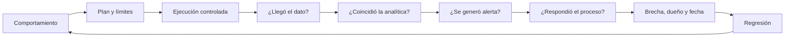

# Clase 200 — Purple team desde el lado defensivo

> Parte: **8 — Blue Team, detección y SOC** · Fuente: *MITRE ATT&CK* · *Blue Team Handbook* — Don Murdoch
> ⏱️ Duración estimada: **120 min** · Nivel: **Experto**

---

## 🎯 Objetivo

Cerrar la parte uniendo ataque y defensa: el purple team es la colaboración deliberada entre red y blue para validar y mejorar la detección de forma iterativa. Desde el lado defensivo, aprenderás a diseñar ejercicios de emulación de adversario, a ejecutar técnicas de forma controlada (Atomic Red Team, Caldera), a medir qué detectas y a cerrar cada hueco con una detección nueva.

> ⚠️ **Ética:** toda emulación de adversario se realiza en tu laboratorio propio y aislado o con autorización explícita y por escrito. El propósito es medir y mejorar la detección, nunca causar daño ni operar fuera del alcance acordado.

## 📚 Resultados de aprendizaje

Al finalizar, el alumno podrá:

1. **Explicar** el propósito y el flujo de un ejercicio purple team.
2. **Planificar** una emulación de adversario basada en ATT&CK e intel.
3. **Ejecutar** técnicas controladas con Atomic Red Team y Caldera.
4. **Medir** cobertura de detección (detectado / prevenido / no visto).
5. **Cerrar** el bucle creando o afinando detecciones por cada hueco.

## 🗺️ Temas

| # | Tema | Por qué importa |
|---|------|-----------------|
| 1 | Qué es el purple team | Colaboración, no competición |
| 2 | Emulación vs simulación de adversario | Realismo del ejercicio |
| 3 | Planificación basada en ATT&CK e intel | Elegir qué emular |
| 4 | Atomic Red Team | Pruebas atómicas por técnica |
| 5 | Caldera y emulación encadenada | Escenarios completos |
| 6 | Scorecard de detección | Medir detectado/prevenido/no visto |
| 7 | Cierre del bucle | De hueco a detección |
| 8 | Cadencia y mejora continua | Purple como programa, no evento |

## 🧠 Explicación en profundidad

Purple team es colaboración orientada a evidencia, no necesariamente un equipo permanente. Se acuerdan comportamiento, activo, procedimiento seguro, datos esperados, detención y responsables. Una prueba atómica valida una unidad; una cadena emulada estudia transiciones. Sus conclusiones no son equivalentes.

El scorecard separa telemetría, analítica, alerta y respuesta; «detectado/no detectado» oculta dónde falló la cadena. Atomic Red Team ofrece pruebas pequeñas y Apache Caldera (Incubating) orquesta perfiles. Ambos requieren autorización, versiones fijas y cleanup. Cada brecha termina con dueño, plazo y repetición; sin regresión el ejercicio es una foto, no capacidad sostenible.

### Planificar una prueba que responda una pregunta

El equipo elige comportamiento por amenaza y activo, no por herramienta atractiva. Para validar PowerShell iniciado desde Office se define host de laboratorio, procedimiento, evento esperado, regla, alerta y respuesta. Se documentan alcance, ventana, contactos, detención y cleanup. Si la prueba toca producción, el dueño del servicio y la autoridad de cambio deben aprobarla.

Atomic Red Team documenta tests pequeños con prerequisitos y cleanup. Sirve para comprobar un eslabón de forma repetible. Apache Caldera (Incubating) permite orquestar abilities y perfiles de adversario para estudiar secuencias. Una cadena añade realismo y dependencias, pero dificulta localizar fallos; por eso primero se validan unidades y después recorridos.

### Leer el scorecard por capas

Si se ejecutó el procedimiento y no hay evento, la brecha está en sensor o configuración. Si hay dato pero la regla no coincide, está en analítica o mapeo. Si coincide sin generar alerta, está en programación o supresión. Si alerta y el analista no la interpreta, está en contexto, runbook o capacidad. Esta separación evita la respuesta inútil «no detectado».

El resultado registra evidencia de cada capa, tiempos, versión y limitaciones. Una prueba de Windows no acredita Linux; una variante con línea de comandos fija no acredita todas las evasiones. ATT&CK comunica el procedimiento, pero la cobertura conserva granularidad.

### Colaboración y mejora cerrada

El red team explica intención y artefactos sin convertir la sesión en una demostración competitiva. El blue team muestra qué vio y cómo razonó. Juntos modifican dato, regla o proceso y repiten. La discusión se centra en el sistema, no en culpar al analista por no conocer previamente el guion.

Cada brecha tiene dueño, fecha, cambio y test de regresión versionado. En la repetición no basta que aparezca una alerta: se confirma contexto y respuesta. Con el tiempo, la biblioteca de regresiones permite detectar cuándo una actualización rompe capacidad. Ese ciclo —hipótesis, ejecución, evidencia, corrección y repetición— es el resultado profesional de purple teaming.

## 📔 Glosario

- **Purple teaming:** colaboración para mejorar controles.
- **Prueba atómica:** procedimiento pequeño y aislado.
- **Emulación:** secuencia de comportamiento adversario.
- **Control objective:** resultado defensivo verificable.
- **Scorecard:** evidencia separada por capa.
- **Cleanup:** reversión de artefactos de prueba.
- **Regresión:** repetición que confirma la corrección.

## 📖 Definiciones y características

- **Purple team:** ejercicio colaborativo donde red ejecuta técnicas y blue mide y mejora la detección en tiempo real. Característica: objetivo compartido de subir la cobertura.
- **Emulación de adversario:** reproducir el comportamiento de un actor real (sus TTPs) de forma fiel. Característica: guiada por intel de un grupo concreto.
- **Atomic Red Team:** biblioteca de pruebas pequeñas y atómicas, una por técnica ATT&CK. Característica: rápidas, granulares y reproducibles.
- **Caldera:** plataforma de MITRE para emulación automatizada y encadenada. Característica: ejecuta operaciones completas con agentes.
- **Scorecard de detección:** matriz de resultados por técnica (prevenido/detectado/registrado/no visto). Característica: comunica la cobertura real.
- **Cierre del bucle:** crear/afinar una detección por cada hueco hallado. Característica: convierte el ejercicio en mejora permanente.
- **Cadencia:** frecuencia de los ejercicios purple. Característica: el valor está en la repetición, no en un evento aislado.

## 🔍 Ejercicio resuelto — cuatro capas de evidencia

Se selecciona una prueba atómica autorizada de ejecución de intérprete. El plan fija host, usuario, tiempo, prerequisitos, detención y cleanup. Blue team no conoce el minuto exacto, pero sí la ventana y límites de seguridad.

El procedimiento se ejecuta. El scorecard encuentra: telemetría presente; regla coincidente; notable suprimido por una excepción vencida; por tanto no hubo triaje. «No detectado» habría ocultado que dato y analítica funcionaban. Se elimina o restringe la excepción, se repite y se verifica que el analista recibe contexto y sigue el runbook.

Después Apache Caldera orquesta una cadena en laboratorio para estudiar transiciones, manteniendo versión y perfil. El resultado no reemplaza la prueba atómica: responde otra pregunta. Cada brecha conserva evidencia, dueño, fecha y test versionado.

## ✅ Criterio de dominio

El alumno distingue prueba y emulación, presenta evidencia por capa, aplica cleanup y demuestra regresión. Ejecutar una herramienta y mostrar una captura sin cambio verificado no completa purple teaming.

## 🧰 Herramientas y preparación

En laboratorio aislado con la telemetría de toda la parte:

- **Atomic Red Team** para pruebas por técnica.
- **MITRE Caldera** para emulación encadenada con agentes.
- Tu **stack de detección** completo: Sysmon, SIEM (Splunk/Elastic/Wazuh), reglas Sigma, EDR de laboratorio.
- **ATT&CK Navigator** para la scorecard.
- Una plantilla de ejercicio (objetivo, técnicas, resultados, mejoras).

Ejecuta las emulaciones exclusivamente contra tus propios sistemas y documenta el alcance antes de empezar.

## 🧪 Laboratorio guiado — Un ciclo purple completo

1. **Planifica.** Elige un grupo de amenaza relevante (de la página Groups de ATT&CK) y selecciona 8–10 técnicas suyas a emular.
2. **Prepara la scorecard.** Crea una capa de Navigator con esas técnicas y un estado inicial "por probar".
3. **Ejecuta pruebas atómicas.** Con Atomic Red Team, lanza cada técnica en el host de laboratorio (p. ej. T1059.001, T1053.005, T1105).
4. **Observa la detección.** Para cada una, comprueba en el SIEM/EDR si fue *prevenida*, *detectada*, solo *registrada* o *no vista*.
5. **Encadena con Caldera.** Lanza una operación que combine varias técnicas en secuencia y observa si detectas la cadena, no solo pasos sueltos.
6. **Puntúa.** Colorea la scorecard: verde detectado, amarillo solo registrado, rojo no visto.
7. **Cierra huecos.** Por cada técnica no vista o solo registrada, crea/afina una detección (Sigma) y vuelve a probar hasta que dispare.
8. **Documenta y define cadencia.** Entrega el reporte con antes/después de cobertura y fija la periodicidad del próximo ejercicio.

## ✍️ Ejercicios

1. Selecciona un grupo ATT&CK y justifica por qué emularlo en tu contexto.
2. Ejecuta 3 pruebas atómicas y clasifica su resultado (prevenido/detectado/no visto).
3. Diseña una operación encadenada en Caldera con 4 técnicas.
4. Construye una scorecard de detección en Navigator.
5. Cierra un hueco creando una detección nueva y revalidándola.
6. Define la cadencia y el alcance de un programa purple trimestral.

## 📝 Reto verificable

Ejecuta un ciclo purple completo sobre al menos 8 técnicas: emúlalas, puntúa la cobertura, cierra los huecos con detecciones nuevas y revalida. **Criterio de aceptación:** entregas una scorecard antes/después que muestra una mejora medible de cobertura, cada técnica inicialmente "no vista" acaba con una detección que dispara al re-ejecutarla, y todo el ejercicio está documentado con su alcance y ejecutado en tu entorno autorizado.

## ⚠️ Errores comunes

| Síntoma / mensaje | Causa y cómo arreglar |
|-------------------|-----------------------|
| Purple se vuelve competición red vs blue | Falta objetivo común; enfócalo en mejorar cobertura juntos |
| Detectas pasos sueltos pero no la cadena | Solo pruebas atómicas; encadena con Caldera para ver el flujo |
| Ejercicio sin mejoras posteriores | No cierras el bucle; crea una detección por cada hueco |
| Emulación poco realista | Técnicas al azar; guíate por un grupo y su intel |
| Se hace una vez y se abandona | Purple es programa, no evento; define cadencia |

## ❓ Preguntas frecuentes

**❓ ¿En qué se diferencia purple de red team?**
El red team busca objetivos con sigilo y evalúa la resistencia global; el purple es colaborativo y transparente, optimizado para medir y mejorar detecciones técnica por técnica. Se complementan.

**❓ ¿Atomic o Caldera?**
Ambos. Atomic valida técnicas individuales con rapidez; Caldera emula operaciones encadenadas y adversarios completos. Empieza por atómicas y escala a escenarios.

**❓ ¿Con qué frecuencia hacer purple?**
Como programa continuo: ciclos regulares (p. ej. mensuales/trimestrales) que revalidan cobertura y cierran huecos. Un solo ejercicio da una foto; la cadencia da mejora sostenida.

## 🔗 Referencias

- MITRE ATT&CK y Groups — <https://attack.mitre.org/groups/>
- Atomic Red Team — <https://github.com/redcanaryco/atomic-red-team>
- Apache Caldera (Incubating), documentación oficial — <https://caldera.apache.org/>
- MITRE ATT&CK Navigator — <https://mitre-attack.github.io/attack-navigator/>
- Murdoch, D. *Blue Team Handbook: SOC, SIEM, and Threat Hunting Use Cases*.

## 📥 Material descargable

- 📄 [Guía en PDF](./clase-200-guia.pdf) — versión imprimible de esta clase.
- 🎞️ [Presentación (PPTX)](./clase-200-presentacion.pptx) — deck para proyectar en clase.

## ⬅️ Clase anterior

[Clase 199 — Ingeniería de detección como disciplina](../199-ingenieria-de-deteccion-como-disciplina/README.md)

## ➡️ Siguiente clase

[Clase 201 — Fundamentos de DFIR y cadena de custodia](../../parte-9-forense-digital-y-respuesta-a-incidentes/201-fundamentos-de-dfir-y-cadena-de-custodia/README.md)
