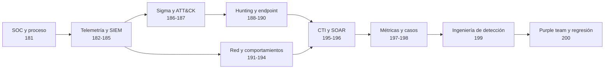

# Parte 8 — Blue Team, detección y SOC

> [⬅️ Volver al programa](../../README.md) · [📚 Índice completo](../README.md) · [⏭️ Parte siguiente](../parte-9-forense-digital-y-respuesta-a-incidentes/README.md)

**20 clases** · rango 181–200 · SIEM, ingeniería de detección, threat hunting y SOAR

**Fuentes de referencia de esta parte:**

- *The Practice of Network Security Monitoring* — Richard Bejtlich (No Starch Press).
- *Applied Network Security Monitoring* — Chris Sanders y Jason Smith (Syngress).
- *Blue Team Handbook: SOC, SIEM, and Threat Hunting Use Cases* — Don Murdoch.
- *MITRE ATT&CK* — framework de tácticas y técnicas adversarias (attack.mitre.org).
- *The Sigma Specification* — proyecto SigmaHQ para reglas de detección portables.
- *NIST SP 800-92* — Guide to Computer Security Log Management.

---

## 🎯 ¿De qué trata esta parte?

Esta parte cambia el punto de vista: dejamos el lado ofensivo (Parte 7) y nos sentamos del lado del defensor. El objetivo ya no es entrar, sino **ver** al atacante, **entenderlo** y **expulsarlo** antes de que cumpla su misión. Para eso construimos la disciplina completa de un Security Operations Center (SOC) moderno: recolección de telemetría, correlación en un SIEM, escritura de detecciones, caza proactiva de amenazas (threat hunting) y automatización de la respuesta con SOAR.

El hilo conductor es el **modelo de monitoreo de seguridad de red y endpoint** que popularizaron Bejtlich y la escuela de Applied NSM: la prevención falla siempre, así que la organización que sobrevive es la que detecta rápido y responde con método. Trabajaremos con herramientas reales y vigentes —Splunk, Elastic Stack, Wazuh, Sysmon, Sigma, Suricata/Zeek— y con marcos que la industria usa a diario: MITRE ATT&CK para hablar de comportamiento adversario y la pirámide del dolor para priorizar qué detectar.

Sirve a quien quiera ser analista de SOC (L1/L2/L3), ingeniero de detección, threat hunter o líder de blue team; también a red teamers que quieren entender qué deja huella y a arquitectos que diseñan la instrumentación. Cada clase combina teoría de por qué funciona una detección con laboratorio reproducible en un entorno propio.

## 🧩 Problemas que resuelve

- No saber **qué registrar** ni dónde: fuentes de telemetría, cobertura y puntos ciegos.
- Ahogarse en alertas: cómo correlacionar, priorizar y reducir falsos positivos.
- Detecciones frágiles atadas a un IOC que el atacante cambia en segundos.
- Falta de un lenguaje común para describir ataques (se resuelve con ATT&CK y Sigma).
- Cazar amenazas que ninguna alerta disparó (movimiento lateral, C2, beaconing).
- Respuesta manual, lenta e inconsistente ante incidentes repetitivos (SOAR).
- Medir si el SOC mejora: métricas de MTTD/MTTR y madurez.

## 🎓 Resultados de aprendizaje

Al terminar la parte, el alumno podrá:

1. Describir la estructura de un SOC moderno y el flujo de vida de una alerta.
2. Diseñar una estrategia de logging con fuentes priorizadas y sin puntos ciegos críticos.
3. Desplegar y consultar un SIEM (Splunk y Elastic/Wazuh) con búsquedas de detección.
4. Escribir reglas Sigma portables y mapearlas a técnicas MITRE ATT&CK.
5. Conducir un ciclo de threat hunting basado en hipótesis y documentar hallazgos.
6. Detectar movimiento lateral, C2 y beaconing a partir de telemetría de red y endpoint.
7. Desplegar deception (honeypots/honeytokens) como fuente de señales de alta fidelidad.
8. Construir un playbook SOAR y medir la madurez del SOC con métricas defendibles.

## 🧱 Prerrequisitos

- Parte 1–3: fundamentos de redes, sistemas y línea de comandos.
- Parte 6: conceptos de amenazas y análisis de malware ayuda pero no es obligatorio.
- Parte 7 (Red Team): entender el ataque hace mucho mejor al defensor; se asume familiaridad con la cadena de ataque y ATT&CK a nivel introductorio.
- Un laboratorio virtualizado (VirtualBox/VMware/Proxmox) con al menos un Windows y un Linux.

## 🗺️ Estructura temática

| Bloque | Clases | Foco |
|--------|--------|------|
| Fundamentos del SOC y telemetría | 181–183 | Roles, procesos, logging, arquitectura SIEM |
| Plataformas SIEM | 184–185 | Splunk, Elastic Stack, Wazuh |
| Ingeniería de detección | 186–187, 199 | Sigma, MITRE ATT&CK, disciplina de detección |
| Hunting y análisis | 188–191 | Metodología, EDR, Event Logs/Sysmon, red/proxy |
| Detección de TTPs avanzadas | 192–194 | Movimiento lateral, C2/beaconing, deception |
| Inteligencia y automatización | 195–196 | Threat intel operacional, SOAR |
| Gobierno y cierre | 197–198, 200 | Métricas, casos de estudio, purple team |

## 🧭 Mapa de aprendizaje

La parte sigue una dependencia deliberada: primero se construye la capacidad operativa y sus datos; luego se escriben y validan detecciones; finalmente se gobierna el aprendizaje. Saltar directamente a reglas suele producir búsquedas sin datos confiables ni proceso de respuesta.

## 🧪 Caso conductor: construir una capacidad SOC verificable

Durante las veinte clases se mantiene un único caso: una organización híbrida con estaciones Windows, servidores Linux, identidad centralizada, servicios cloud y salida a Internet mediante proxy. El alumno amplía el mismo dossier en vez de producir ejercicios inconexos:

1. Define roles, escaladas, fuentes y contratos de datos.
2. Implementa consultas equivalentes en las plataformas estudiadas y documenta sus diferencias.
3. Formula hipótesis, reglas Sigma y mapeos ATT&CK sustentados en campos observables.
4. Reconstruye movimiento lateral y C2 mediante evidencia de endpoint, identidad y red.
5. Convierte hallazgos en playbooks, métricas y pruebas de regresión purple team.

Cada afirmación debe etiquetarse como **observación**, **inferencia** o **hipótesis**. Cada detección debe declarar datos requeridos, prueba positiva, prueba negativa, propietario y criterio de retiro.

## 📋 Cómo estudiar cada clase

- **Antes:** revisa objetivo, glosario y diagrama; identifica qué concepto depende de una clase anterior.
- **Durante:** reproduce el laboratorio en un entorno propio, guarda consultas y registra versiones y zona horaria.
- **Después:** explica con tus palabras qué observa la técnica, qué no observa y qué decisión habilita.
- **Validación:** no marques una detección como cubierta hasta demostrar dato, coincidencia analítica, alerta y respuesta.

## ✅ Evidencias y evaluación de la parte

El portafolio final contiene arquitectura del SOC, catálogo de telemetría, dos búsquedas SIEM equivalentes, reglas Sigma probadas, paquete de threat hunting, timeline de un caso, playbook SOAR y scorecard purple team. Se evalúa con cuatro dimensiones: exactitud técnica, trazabilidad de evidencia, reproducibilidad y claridad de la decisión defensiva. Instalar herramientas o colorear ATT&CK sin pruebas no acredita aprendizaje.

## 🔗 Referencias de la parte

- Bejtlich, R. *The Practice of Network Security Monitoring*. No Starch Press. — <https://nostarch.com/nsm>
- Sanders, C. y Smith, J. *Applied Network Security Monitoring*. Syngress.
- Murdoch, D. *Blue Team Handbook: SOC, SIEM, and Threat Hunting Use Cases*.
- MITRE ATT&CK — <https://attack.mitre.org/>
- SigmaHQ — <https://github.com/SigmaHQ/sigma>
- NIST SP 800-92, gestión de logs — <https://doi.org/10.6028/NIST.SP.800-92>
- NIST SP 800-61 Rev. 3, respuesta a incidentes integrada con CSF 2.0 — <https://doi.org/10.6028/NIST.SP.800-61r3>
- NIST SP 800-55 Vol. 2, programas de medición de seguridad — <https://doi.org/10.6028/NIST.SP.800-55v2>
- MITRE ATT&CK Detection Strategies — <https://attack.mitre.org/detectionstrategies/>
- Sigma Rules Specification 2.1.0 — <https://sigmahq.io/sigma-specification/specification/sigma-rules-specification.html>

## ▶️ Empezar

[Clase 181 — El SOC moderno: roles, niveles y procesos](181-el-soc-moderno-roles-niveles-y-procesos/README.md)
