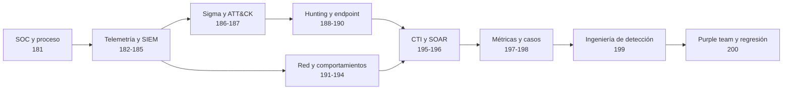

# Parte 8 — Blue Team, detección y SOC

> [⬅️ Volver al programa](../../README.md) · [📚 Índice completo](../README.md) · [⏭️ Parte siguiente](../parte-9-forense-digital-y-respuesta-a-incidentes/README.md)

**20 clases** · rango 181–200 · SIEM, ingeniería de detección, threat hunting y SOAR

**Fuentes de referencia de esta parte:**

- *The Practice of Network Security Monitoring* — Richard Bejtlich (No Starch Press).
- *Applied Network Security Monitoring* — Chris Sanders y Jason Smith (Syngress).
- *Blue Team Handbook: SOC, SIEM, and Threat Hunting Use Cases* — Don Murdoch.
- *MITRE ATT&CK* — framework de tácticas y técnicas adversarias (attack.mitre.org).
- *The Sigma Specification* — proyecto SigmaHQ para reglas de detección portables.
- *NIST SP 800-92* — Guide to Computer Security Log Management.

---

## 🎯 ¿De qué trata esta parte?

Esta parte cambia el punto de vista: dejamos el lado ofensivo (Parte 7) y nos sentamos del lado del defensor. El objetivo ya no es entrar, sino **ver** al atacante, **entenderlo** y **expulsarlo** antes de que cumpla su misión. Para eso construimos la disciplina completa de un Security Operations Center (SOC) moderno: recolección de telemetría, correlación en un SIEM, escritura de detecciones, caza proactiva de amenazas (threat hunting) y automatización de la respuesta con SOAR.

El hilo conductor es el **modelo de monitoreo de seguridad de red y endpoint** que popularizaron Bejtlich y la escuela de Applied NSM: la prevención falla siempre, así que la organización que sobrevive es la que detecta rápido y responde con método. Trabajaremos con herramientas reales y vigentes —Splunk, Elastic Stack, Wazuh, Sysmon, Sigma, Suricata/Zeek— y con marcos que la industria usa a diario: MITRE ATT&CK para hablar de comportamiento adversario y la pirámide del dolor para priorizar qué detectar.

Sirve a quien quiera ser analista de SOC (L1/L2/L3), ingeniero de detección, threat hunter o líder de blue team; también a red teamers que quieren entender qué deja huella y a arquitectos que diseñan la instrumentación. Cada clase combina teoría de por qué funciona una detección con laboratorio reproducible en un entorno propio.

## 🧩 Problemas que resuelve

- No saber **qué registrar** ni dónde: fuentes de telemetría, cobertura y puntos ciegos.
- Ahogarse en alertas: cómo correlacionar, priorizar y reducir falsos positivos.
- Detecciones frágiles atadas a un IOC que el atacante cambia en segundos.
- Falta de un lenguaje común para describir ataques (se resuelve con ATT&CK y Sigma).
- Cazar amenazas que ninguna alerta disparó (movimiento lateral, C2, beaconing).
- Respuesta manual, lenta e inconsistente ante incidentes repetitivos (SOAR).
- Medir si el SOC mejora: métricas de MTTD/MTTR y madurez.

## 🎓 Resultados de aprendizaje

Al terminar la parte, el alumno podrá:

1. Describir la estructura de un SOC moderno y el flujo de vida de una alerta.
2. Diseñar una estrategia de logging con fuentes priorizadas y sin puntos ciegos críticos.
3. Desplegar y consultar un SIEM (Splunk y Elastic/Wazuh) con búsquedas de detección.
4. Escribir reglas Sigma portables y mapearlas a técnicas MITRE ATT&CK.
5. Conducir un ciclo de threat hunting basado en hipótesis y documentar hallazgos.
6. Detectar movimiento lateral, C2 y beaconing a partir de telemetría de red y endpoint.
7. Desplegar deception (honeypots/honeytokens) como fuente de señales de alta fidelidad.
8. Construir un playbook SOAR y medir la madurez del SOC con métricas defendibles.

## 🧱 Prerrequisitos

- Parte 1–3: fundamentos de redes, sistemas y línea de comandos.
- Parte 6: conceptos de amenazas y análisis de malware ayuda pero no es obligatorio.
- Parte 7 (Red Team): entender el ataque hace mucho mejor al defensor; se asume familiaridad con la cadena de ataque y ATT&CK a nivel introductorio.
- Un laboratorio virtualizado (VirtualBox/VMware/Proxmox) con al menos un Windows y un Linux.

## 🗺️ Estructura temática

| Bloque | Clases | Foco |
|--------|--------|------|
| Fundamentos del SOC y telemetría | 181–183 | Roles, procesos, logging, arquitectura SIEM |
| Plataformas SIEM | 184–185 | Splunk, Elastic Stack, Wazuh |
| Ingeniería de detección | 186–187, 199 | Sigma, MITRE ATT&CK, disciplina de detección |
| Hunting y análisis | 188–191 | Metodología, EDR, Event Logs/Sysmon, red/proxy |
| Detección de TTPs avanzadas | 192–194 | Movimiento lateral, C2/beaconing, deception |
| Inteligencia y automatización | 195–196 | Threat intel operacional, SOAR |
| Gobierno y cierre | 197–198, 200 | Métricas, casos de estudio, purple team |

## 🧭 Mapa de aprendizaje

La parte sigue una dependencia deliberada: primero se construye la capacidad operativa y sus datos; luego se escriben y validan detecciones; finalmente se gobierna el aprendizaje. Saltar directamente a reglas suele producir búsquedas sin datos confiables ni proceso de respuesta.

## 📚 Recorrido explicado, clase por clase

La secuencia no es una colección de herramientas. Cada clase resuelve una parte del problema defensivo y deja una evidencia que se reutiliza más adelante.

### Bloque 1 — Construir la capacidad y sus datos

**[Clase 181 — El SOC moderno: roles, niveles y procesos](181-el-soc-moderno-roles-niveles-y-procesos/README.md).** Antes de instalar un SIEM hay que saber quién toma decisiones. La clase explica el SOC como capacidad compuesta por personas, procesos, datos y herramientas; desarrolla triaje, investigación, escalada, modelos interno/MSSP/híbrido, cobertura horaria y métricas. El alumno entrega un flujo de alerta con responsables, entradas, salidas y criterios de cierre.

**[Clase 182 — Logging y fuentes de telemetría](182-logging-y-fuentes-de-telemetria/README.md).** Convierte las necesidades del SOC en evidencia observable. Se aprende a elegir endpoint, identidad, red, nube y aplicación según preguntas defensivas; a distinguir evento original, parseo y normalización; y a definir latencia, calidad, protección y retención. El resultado es un catálogo y contrato de datos, no una lista genérica de logs.

**[Clase 183 — SIEM: arquitectura y componentes](183-siem-arquitectura-y-componentes/README.md).** Toma esos contratos y diseña la cadena que los transporta hasta una decisión. Explica agentes, buffers, brokers, parsers, enriquecimiento, índices, data lakes, alertas y casos, incluidos picos, backpressure y fallos silenciosos. El alumno debe localizar en qué etapa se pierde una señal y justificar capacidad y recuperación.

### Bloque 2 — Consultar y comparar plataformas

**[Clase 184 — Splunk para detección](184-splunk-para-deteccion/README.md).** Introduce SPL como transformación comprobable de eventos, no como recetas copiadas. Desarrolla filtros, campos, `stats`, `tstats`, CIM, lookups, ventanas y deduplicación, y muestra cómo una elección de agrupación cambia la hipótesis. La evidencia es una búsqueda probada con positivos, negativos y explicación de cada comando.

**[Clase 185 — Elastic Stack y Wazuh](185-elastic-stack-y-wazuh/README.md).** Compara dos recorridos técnicos sin declarar un ganador universal. Explica ECS, ingest pipelines, KQL y EQL frente a agentes, decoders y rulesets de Wazuh; también FIM y contenido preconstruido. El alumno implementa la misma pregunta en ambas plataformas y documenta diferencias de semántica, contexto y mantenimiento.

### Bloque 3 — Expresar y justificar detecciones

**[Clase 186 — Escritura de reglas con Sigma](186-escritura-de-reglas-de-deteccion-con-sigma/README.md).** Separa intención de sintaxis. La clase transforma una hipótesis en `logsource`, selecciones y condición; explica modificadores, pipelines y diferencias de backend, y exige fixtures positivos y negativos. El producto es una regla portable en intención y validada realmente en la plataforma elegida.

**[Clase 187 — Detección basada en MITRE ATT&CK](187-deteccion-basada-en-mitre-att-ck/README.md).** Enseña que una técnica no equivale a una regla ni una celda coloreada a cobertura. Se baja desde amenaza y procedimiento hasta componente, campo, analítica y prueba. El alumno crea una matriz cuyos estados distinguen dato, regla, validación, operación y brechas conocidas.

### Bloque 4 — Buscar y reconstruir actividad en endpoint

**[Clase 188 — Threat hunting: metodología](188-threat-hunting-metodologia/README.md).** Pasa de responder alertas a investigar hipótesis falsables. Desarrolla alcance, líneas base, pivotes, sesgo de confirmación y resultados confirmados, refutados o inconclusos. La entrega conserva consultas y limitaciones y transforma el aprendizaje en detección, logging o control.

**[Clase 189 — Análisis de endpoints con EDR](189-analisis-de-endpoints-con-edr/README.md).** Explica cómo reconstruir usuario, proceso padre/hijo, archivo, registro y conexión sin juzgar por nombre o hash. Distingue historia retenida, consulta de estado y adquisición DFIR, y analiza el riesgo de aislar o terminar procesos. El alumno produce un árbol corroborado y una decisión de respuesta reversible.

**[Clase 190 — Windows Event Logs y Sysmon](190-analisis-de-logs-de-windows-event-logs-y-sysmon/README.md).** Profundiza en la fuente que sostiene muchas detecciones de endpoint. Relaciona provider, canal, política y Event ID; compara 4688 con Sysmon Event 1 y une autenticación, proceso, red y persistencia. La práctica obliga a generar eventos conocidos y demostrar exactamente qué registra la configuración.

### Bloque 5 — Observar red y comportamientos adversarios

**[Clase 191 — Logs de red y proxy](191-analisis-de-logs-de-red-y-proxy/README.md).** Distingue flow, metadatos de protocolo, proxy y PCAP, con sus límites de atribución, pérdida y cifrado. Enseña a unir logs Zeek mediante `uid` y a corroborar descarga y ejecución con endpoint. El alumno reconstruye una sesión sin inventar contenido que el sensor no vio.

**[Clase 192 — Detección de movimiento lateral](192-deteccion-de-movimiento-lateral/README.md).** Aplica identidad, endpoint y red a relaciones nuevas entre cuentas y hosts. RDP, SMB, WinRM y SSH se estudian como procedimientos diferentes que también pueden ser administración legítima. La evidencia es una secuencia y un grafo comparados con rutas autorizadas, con cobertura separada por subtécnica.

**[Clase 193 — Detección de C2 y beaconing](193-deteccion-de-c2-y-beaconing/README.md).** Explica periodicidad, jitter, sesiones interactivas, asimetría de bytes, novedad y contexto de proceso. Aclara por qué huellas TLS, entropía y reputación son señales, no veredictos. El alumno combina serie temporal, protocolo y endpoint y descarta alternativas benignas.

**[Clase 194 — Deception, honeypots y honeytokens](194-deception-honeypots-y-honeytokens/README.md).** Diseña señuelos desde rutas de ataque, no desde herramientas. Compara niveles de interacción, contención y mantenimiento; exige tokens sintéticos sin privilegios, atribución única, rotación y playbook. La práctica incluye probar accesos legítimos para medir falsas alarmas reales.

### Bloque 6 — Llevar conocimiento a la operación

**[Clase 195 — Threat intelligence operacional](195-threat-intelligence-operacional/README.md).** Parte de un requerimiento del consumidor y diferencia observable, indicador y TTP. Desarrolla procedencia, confianza, vigencia, STIX, TAXII y TLP, y muestra cuándo observar, detectar, bloquear o retirar. El producto se evalúa por la decisión que cambió, no por la cantidad de indicadores importados.

**[Clase 196 — Automatización con SOAR](196-automatizacion-con-soar/README.md).** Convierte playbooks en estados con entradas, errores, reintentos, aprobaciones y rollback. Separa orquestación de automatización y aplica mínimo privilegio e idempotencia. El alumno automatiza primero enriquecimiento y demuestra manejo seguro de casos incompletos antes de ejecutar contención.

### Bloque 7 — Medir, aprender y mantener

**[Clase 197 — Métricas y madurez del SOC](197-metricas-y-madurez-del-soc/README.md).** Construye medidas desde objetivos y decisiones siguiendo NIST SP 800-55 Vol. 2. Define con precisión MTTD/MTTR, distribuciones, precisión, recall y sesgos; rechaza porcentajes ATT&CK sin evidencia. La entrega incluye fórmula, población, fuente, límites y acción asociada.

**[Clase 198 — Casos de estudio de detección](198-casos-de-estudio-de-deteccion/README.md).** Integra timeline, grafo y consultas sin escribir la conclusión antes de investigar. Separa hecho, inferencia e hipótesis y clasifica fallos en fuente, parser, analítica, alerta o triaje. El caso termina con una corrección específica y una prueba de regresión reproducible.

**[Clase 199 — Ingeniería de detección como disciplina](199-ingenieria-de-deteccion-como-disciplina/README.md).** Consolida todo el ciclo: hipótesis, contrato de datos, regla, pruebas, despliegue, observabilidad, mantenimiento y retiro. Detection-as-code incluye fixtures y metadatos, no solo consultas en Git. El alumno entrega un producto versionado y sabe interpretar tanto un aumento como una caída de alertas.

**[Clase 200 — Purple team desde el lado defensivo](200-purple-team-desde-el-lado-defensivo/README.md).** Cierra la parte validando la cadena completa con ejecución autorizada. Diferencia pruebas atómicas de emulación, usa Atomic Red Team y Apache Caldera con límites y cleanup, y separa dato, analítica, alerta y respuesta en el scorecard. Cada brecha obtiene dueño, plazo y prueba de regresión.

## 🧪 Caso conductor: construir una capacidad SOC verificable

Durante las veinte clases se mantiene un único caso: una organización híbrida con estaciones Windows, servidores Linux, identidad centralizada, servicios cloud y salida a Internet mediante proxy. El alumno amplía el mismo dossier en vez de producir ejercicios inconexos:

1. Define roles, escaladas, fuentes y contratos de datos.
2. Implementa consultas equivalentes en las plataformas estudiadas y documenta sus diferencias.
3. Formula hipótesis, reglas Sigma y mapeos ATT&CK sustentados en campos observables.
4. Reconstruye movimiento lateral y C2 mediante evidencia de endpoint, identidad y red.
5. Convierte hallazgos en playbooks, métricas y pruebas de regresión purple team.

Cada afirmación debe etiquetarse como **observación**, **inferencia** o **hipótesis**. Cada detección debe declarar datos requeridos, prueba positiva, prueba negativa, propietario y criterio de retiro.

## 📋 Cómo estudiar cada clase

- **Antes:** revisa objetivo, glosario y diagrama; identifica qué concepto depende de una clase anterior.
- **Durante:** reproduce el laboratorio en un entorno propio, guarda consultas y registra versiones y zona horaria.
- **Después:** explica con tus palabras qué observa la técnica, qué no observa y qué decisión habilita.
- **Validación:** no marques una detección como cubierta hasta demostrar dato, coincidencia analítica, alerta y respuesta.

## ✅ Evidencias y evaluación de la parte

El portafolio final contiene arquitectura del SOC, catálogo de telemetría, dos búsquedas SIEM equivalentes, reglas Sigma probadas, paquete de threat hunting, timeline de un caso, playbook SOAR y scorecard purple team. Se evalúa con cuatro dimensiones: exactitud técnica, trazabilidad de evidencia, reproducibilidad y claridad de la decisión defensiva. Instalar herramientas o colorear ATT&CK sin pruebas no acredita aprendizaje.

## 🔗 Referencias de la parte

- Bejtlich, R. *The Practice of Network Security Monitoring*. No Starch Press. — <https://nostarch.com/nsm>
- Sanders, C. y Smith, J. *Applied Network Security Monitoring*. Syngress.
- Murdoch, D. *Blue Team Handbook: SOC, SIEM, and Threat Hunting Use Cases*.
- MITRE ATT&CK — <https://attack.mitre.org/>
- SigmaHQ — <https://github.com/SigmaHQ/sigma>
- NIST SP 800-92, gestión de logs — <https://doi.org/10.6028/NIST.SP.800-92>
- NIST SP 800-61 Rev. 3, respuesta a incidentes integrada con CSF 2.0 — <https://doi.org/10.6028/NIST.SP.800-61r3>
- NIST SP 800-55 Vol. 2, programas de medición de seguridad — <https://doi.org/10.6028/NIST.SP.800-55v2>
- MITRE ATT&CK Detection Strategies — <https://attack.mitre.org/detectionstrategies/>
- Sigma Rules Specification 2.1.0 — <https://sigmahq.io/sigma-specification/specification/sigma-rules-specification.html>

## ▶️ Empezar

[Clase 181 — El SOC moderno: roles, niveles y procesos](181-el-soc-moderno-roles-niveles-y-procesos/README.md)
