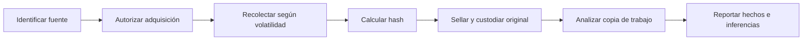

# Clase 201 — Fundamentos de DFIR y cadena de custodia

> Parte: **9 — Forense digital y respuesta a incidentes** · Fuente: *NIST SP 800-86 — Guide to Integrating Forensic Techniques into Incident Response*
> ⏱️ Duración estimada: **90 min** · Nivel: **Fundamentos**

---

## 🎯 Objetivo

Comprender qué es DFIR, en qué se diferencia la respuesta a incidentes del análisis forense, y por qué la **cadena de custodia** y la **integridad de la evidencia** son el cimiento innegociable de todo el trabajo posterior. Al terminar sabrás tratar un equipo comprometido de forma que cualquier hallazgo sea técnicamente sólido y legalmente defendible.

## 📚 Resultados de aprendizaje

Al finalizar, el alumno podrá:

1. **Distinguir** los roles de la forense digital y la respuesta a incidentes dentro de DFIR.
2. **Aplicar** el principio de intercambio de Locard y el orden de volatilidad a un caso real.
3. **Redactar** un formulario de cadena de custodia completo y verificable.
4. **Calcular y verificar** hashes de integridad (MD5/SHA-256) sobre evidencia adquirida.
5. **Identificar** los errores que contaminan evidencia y cómo evitarlos.

## 🗺️ Temas

| # | Tema | Por qué importa |
|---|------|-----------------|
| 1 | Qué es DFIR y sus dos mitades | Marca el alcance de todo el trabajo |
| 2 | Principio de Locard | Orienta la búsqueda de intercambios sin prometer que todo rastro será observable |
| 3 | Orden de volatilidad | Define qué capturar primero |
| 4 | Cadena de custodia | Documenta control y transferencias para auditoría y eventual uso legal |
| 5 | Integridad por hash | Verifica igualdad de bytes entre momentos documentados |
| 6 | Bloqueo de escritura | Evita contaminar el original |
| 7 | Documentación y notas contemporáneas | Reconstruye lo que hiciste y cuándo |
| 8 | Ética y autorización | Delimita qué puedes tocar legalmente |

## 🧠 Explicación en profundidad

DFIR combina dos objetivos que pueden tensionarse: restaurar una operación segura y preservar evidencia suficiente para explicar lo ocurrido. La prioridad depende de vida, servicio, regulación y posible litigio; debe quedar decidida por autoridad competente, no improvisada por el analista.



La cadena de custodia registra quién controló el elemento, cuándo, dónde, por qué y qué acción realizó. Un hash demuestra igualdad de bits entre dos momentos, no quién obtuvo la evidencia ni si el método fue correcto. Se documentan herramienta, versión, reloj, comandos, errores y transferencias. El principio de Locard orienta a buscar intercambio de rastros, pero no elimina explicaciones alternativas.

### Respuesta y forense responden preguntas diferentes

Respuesta busca limitar impacto y recuperar operación; forense busca preservar e interpretar rastros de manera reproducible. Aislar un host puede ser urgente aunque cambie conexiones; adquirir memoria primero puede ser decisivo si existen claves o malware sin archivo. NIST SP 800-86 explica la integración de técnicas forenses con respuesta: la organización debe definir prioridades y procedimientos antes del incidente. El analista documenta la decisión y su efecto, no pretende que no hubo alteración.

### De objeto técnico a evidencia defendible

Un disco encontrado no se vuelve evidencia solo por guardarlo. Se asigna identificador único, se fotografía estado, se registra ubicación, custodio, fecha y autoridad, y se sella. Cada transferencia añade remitente, receptor, propósito y condición. Si se abre el embalaje o cambia el almacenamiento, queda constancia. SWGDE publica buenas prácticas para colección de evidencia digital que respaldan esta disciplina de documentación y preservación.

El hash responde «¿estos bytes son iguales a los verificados?». No demuestra que el reloj fuese correcto, que el dispositivo perteneciera al sospechoso o que la herramienta interpretara bien el filesystem. Esas afirmaciones requieren inventario, testimonio, procedimiento y validación independiente. Por eso una cadena completa combina integridad técnica y trazabilidad humana.

### Volatilidad y reproducibilidad

El orden de volatilidad prioriza datos que desaparecen antes: conexiones, procesos y RAM suelen preceder a discos y copias remotas, pero el orden se ajusta a riesgo y autorización. Cada comando ejecutado en un sistema vivo modifica algo; se usa una herramienta conocida, se registra hash y versión y se limita interacción. El original se preserva y el análisis ocurre sobre copia verificada.

El informe separa observación —«el hash calculado fue…»—, inferencia —«la evidencia es consistente con ejecución»— e hipótesis. El principio de Locard sugiere que toda interacción deja rastros, pero la ausencia de uno no prueba que la interacción no ocurrió: pudo no registrarse, rotarse o perderse. Esa cautela es rigor, no debilidad.

## 📔 Glosario

- **DFIR:** forense digital y respuesta a incidentes.
- **Evidencia:** información con valor para una investigación.
- **Cadena de custodia:** historial continuo de control y transferencias.
- **Integridad:** ausencia de cambio no explicado.
- **Hash:** resumen usado para comparar contenido.
- **Original/copia de trabajo:** evidencia preservada y duplicado analizado.
- **Orden de volatilidad:** prioridad según rapidez con que desaparecen datos.

## 📖 Definiciones y características

- **DFIR**: unión de *Digital Forensics* (análisis riguroso post-mortem) e *Incident Response* (contención y recuperación rápida). Característica clave: tensión entre velocidad y rigor, que hay que equilibrar en cada caso.
- **Principio de intercambio de Locard**: propone que una interacción puede transferir rastros. En digital orienta dónde buscar cambios, pero no asegura que sean registrados, preservados o atribuibles.
- **Orden de volatilidad**: prioridad de captura según cuán rápido desaparece un dato (registros de CPU → RAM → conexiones → disco → backups). Característica: la RAM se pierde al apagar; el disco persiste.
- **Cadena de custodia**: registro documental de quién controló la evidencia, cuándo, dónde, para qué y qué hizo con ella. Característica: un vacío debe declararse y evaluarse; su consecuencia jurídica depende del caso y la jurisdicción.
- **Hash de integridad**: resumen criptográfico usado para comparar bytes entre momentos o copias. Característica: una coincidencia apoya igualdad de contenido, no valida procedencia ni interpretación.
- **Bloqueador de escritura (write blocker)**: hardware o software diseñado para impedir escrituras al medio. Característica: debe verificarse; su sola presencia no demuestra ausencia de cambios.
- **Evidencia volátil vs. persistente**: la volátil (RAM, procesos) muere al apagar; la persistente (disco) sobrevive. Característica: determina la estrategia de adquisición.

## 🔍 Caso razonado — servidor encendido con volumen cifrado

Un servidor crítico presenta conexiones anómalas. El volumen está cifrado y montado; apagarlo puede perder claves y sesiones, pero seguir operando permite cambios. El responsable del incidente autoriza una ventana breve: se documentan reloj y estado, se capturan conexiones y procesos pertinentes, se adquiere memoria y después se crea snapshot o imagen según la plataforma. El servicio se contiene por el mecanismo aprobado.

La bitácora registra quién autorizó, qué comandos se ejecutaron, con qué binarios verificados, a qué hora y qué efectos se observaron. El hash de la memoria demuestra que la copia analizada conserva los mismos bytes que la copia sellada; no demuestra que la RAM no cambiara durante la adquisición. La cadena de custodia documenta transferencias; no valida por sí sola la interpretación. El caso separa integridad, procedencia, método y significado.

## ✅ Criterio de dominio

El alumno domina la clase cuando puede justificar un orden de adquisición adaptado al caso, mantener una cadena de custodia completa y explicar los límites del hash y de Locard. Una lista genérica de «RAM antes que disco» sin considerar cifrado, seguridad, continuidad y autoridad no cumple el criterio.

## 🧰 Herramientas y preparación

- **Entorno**: máquina virtual con Kali Linux o SIFT Workstation (SANS). Trabaja siempre en un **laboratorio aislado y con equipos propios o con autorización explícita por escrito**.
- **Herramientas**: `sha256sum`, `md5sum`, `hashdeep`, un editor de texto para el formulario de custodia, y una plantilla de cadena de custodia (puedes usar la de NIST o SANS).
- **Material físico simulado**: bolsas antiestáticas con etiqueta, marcador indeleble, cuaderno de notas foliado.

## 🧪 Laboratorio guiado

> Ejercicio conceptual y práctico con archivos propios. No requiere evidencia real de terceros.

1. Crea un archivo que simule evidencia adquirida:

   ```bash
   dd if=/dev/urandom of=evidencia.img bs=1M count=50
   ```

2. Calcula y guarda su hash de integridad al momento de la "adquisición":

   ```bash
   sha256sum evidencia.img | tee evidencia.sha256
   ```

3. Redacta el formulario de cadena de custodia con estos campos mínimos:
   - Identificador único del ítem (ej. `CASO-2026-001-ITEM-01`).
   - Descripción, fabricante, número de serie.
   - Fecha/hora de adquisición y zona horaria (UTC recomendado).
   - Nombre y firma de quien adquirió.
   - Hash de integridad (pega el de `evidencia.sha256`).
   - Historial de transferencias (de → a, fecha, motivo).
4. Simula una transferencia: registra en el formulario que entregas el ítem a un "analista".
5. Verifica que la evidencia no se alteró:

   ```bash
   sha256sum -c evidencia.sha256
   ```

   Debe responder `evidencia.img: OK`.
6. Simula contaminación: modifica un byte y vuelve a verificar. Observa cómo `sha256sum -c` falla. Documenta el fallo en tus notas: así se ve una cadena rota.

## ✍️ Ejercicios

1. Enumera, en orden de volatilidad, siete fuentes de evidencia de un portátil encendido.
2. Redacta una plantilla de cadena de custodia con al menos diez campos.
3. Explica con un ejemplo por qué apagar "correctamente" un equipo puede destruir evidencia.
4. Genera hashes MD5 y SHA-256 del mismo archivo y explica por qué preferimos SHA-256.
5. Diseña un procedimiento para etiquetar y fotografiar tres dispositivos incautados.
6. Analiza un caso: un analista copió archivos con arrastrar-y-soltar desde el disco sospechoso. ¿Qué cinco cosas hizo mal?

## 📝 Reto verificable

Adquiere una imagen de un pendrive propio (o de un archivo `.img` que crees), documenta su cadena de custodia completa y verifica integridad antes y después de una transferencia simulada.

**Criterio de aceptación**: entregas (a) el `.img`, (b) su hash SHA-256 en un archivo separado, (c) un formulario de custodia con al menos una transferencia registrada, y (d) la salida de `sha256sum -c` mostrando `OK`. Si alteras un byte, la verificación debe fallar y tú debes haberlo documentado.

## ⚠️ Errores comunes

| Síntoma / mensaje | Causa y cómo arreglar |
|-------------------|-----------------------|
| `sha256sum -c` responde `FAILED` inesperadamente | La evidencia se alteró (montaje sin write-blocker). Reinicia desde el original con bloqueo de escritura. |
| No recuerdas el orden de las acciones | No tomaste notas contemporáneas. Usa un cuaderno foliado o log con marca de tiempo. |
| El tribunal rechaza la evidencia | Hueco en la cadena de custodia. Todo cambio de manos debe estar firmado y fechado. |
| Hashes distintos en dos herramientas | Rutas o codificación distinta, o el archivo cambió. Verifica que apuntas al mismo objeto. |
| Zona horaria confusa en el informe | Usaste hora local sin indicar offset. Registra siempre en UTC. |

## ❓ Preguntas frecuentes

**❓ ¿Forense e incidente son lo mismo?**
No. La respuesta a incidentes prioriza contener y recuperar rápido; la forense prioriza el rigor y la reconstrucción defendible. DFIR las integra.

**❓ ¿MD5 sirve todavía?**
Para deduplicación y verificación rápida sí, pero por colisiones conocidas prefiere SHA-256 en evidencia que pueda ir a juicio.

**❓ ¿Puedo analizar el disco original directamente?**
No. Siempre trabajas sobre una copia forense verificada; el original se preserva con bloqueo de escritura.

**❓ ¿Qué hago si contamino evidencia sin querer?**
Documéntalo de inmediato y con honestidad. Ocultarlo destruye tu credibilidad; registrarlo la preserva.

## 🔗 Referencias verificables y alcance

- NIST SP 800-86: fuente primaria para integrar colección, examen, análisis y reporte forense con respuesta; advierte que no es guía legal ni procedimiento exhaustivo — <https://doi.org/10.6028/NIST.SP.800-86>
- RFC 3227 / BCP 55: fuente primaria para orden de volatilidad, notas, reducción de cambios, checksums, archivo y elementos mínimos de cadena de custodia — <https://www.rfc-editor.org/info/rfc3227/>
- SWGDE, publicaciones de buenas prácticas: referencia profesional para procedimientos de evidencia digital; el documento aplicable debe identificarse por título y versión — <https://www.swgde.org/documents/published>
- Carrier, B. *File System Forensic Analysis*. Addison-Wesley: bibliografía complementaria para estructuras y métodos de análisis de sistemas de archivos.

## 📥 Material descargable

- 📄 [Guía en PDF](./clase-201-guia.pdf) — versión imprimible de esta clase.
- 🎞️ [Presentación (PPTX)](./clase-201-presentacion.pptx) — deck para proyectar en clase.

## ⬅️ Clase anterior

[Clase 200 — Purple team desde el lado defensivo](../../parte-8-blue-team-deteccion-y-soc/200-purple-team-desde-el-lado-defensivo/README.md)

## ➡️ Siguiente clase

[Clase 202 — El ciclo de respuesta a incidentes (NIST y SANS)](../202-el-ciclo-de-respuesta-a-incidentes-nist-y-sans/README.md)
