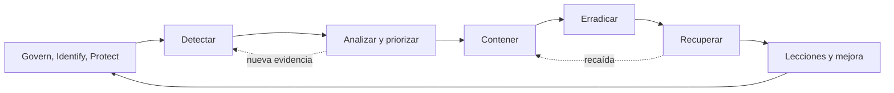

# Clase 202 — El ciclo de respuesta a incidentes (NIST y SANS)

> Parte: **9 — Forense digital y respuesta a incidentes** · Fuente: *NIST SP 800-61 Rev. 3 — Incident Response Recommendations and Considerations for Cybersecurity Risk Management*
> ⏱️ Duración estimada: **90 min** · Nivel: **Fundamentos**

---

## 🎯 Objetivo

Dominar los dos marcos de referencia que estructuran toda respuesta a incidentes: el ciclo de cuatro fases de **NIST SP 800-61** y el modelo **PICERL** de SANS de seis pasos. Al terminar sabrás en qué fase estás durante un incidente real, qué actividades corresponden a cada una y cómo evitar saltar pasos bajo presión.

## 📚 Resultados de aprendizaje

Al finalizar, el alumno podrá:

1. **Describir** las cuatro fases del ciclo NIST y su carácter iterativo.
2. **Mapear** el modelo PICERL de SANS contra las fases de NIST.
3. **Clasificar** un evento como incidente y asignarle severidad.
4. **Definir** los criterios de activación y de cierre de un incidente.
5. **Construir** un runbook mínimo para una fase concreta.

## 🗺️ Temas

| # | Tema | Por qué importa |
|---|------|-----------------|
| 1 | NIST SP 800-61 Rev. 3 y CSF 2.0 | Integra respuesta con gestión de riesgo, no como cuatro cajas aisladas |
| 2 | Preparación | Define autoridad, datos, comunicaciones y capacidades antes de la crisis |
| 3 | Detección y análisis | Distinguir ruido de incidente real |
| 4 | Contención, erradicación y recuperación | El núcleo de la respuesta |
| 5 | Actividad post-incidente | Sin lecciones, se repite el error |
| 6 | Modelo PICERL | Mnemotecnia útil que debe interpretarse como proceso iterativo |
| 7 | Clasificación y severidad | Prioriza recursos escasos |
| 8 | Roles y comunicación | Evita el caos organizativo |

## 🧠 Explicación en profundidad

NIST SP 800-61 Rev. 3 ya no presenta la respuesta como una secuencia aislada: la integra con CSF 2.0. Preparación, gobierno e identificación de riesgos ocurren antes; detección, respuesta y recuperación se solapan durante el incidente; las lecciones realimentan todo el sistema.

PICERL sigue siendo una mnemotecnia útil, no una garantía de linealidad. Contención puede preceder al alcance completo y recuperación puede revelar persistencia. Cada transición necesita autoridad, evidencia mínima y criterio de salida. Severidad expresa impacto y urgencia organizacional, no solo sofisticación técnica.

### Qué cambió con NIST SP 800-61 Rev. 3

La revisión final publicada por NIST en 2025 reemplaza Rev. 2 y presenta recomendaciones de respuesta alineadas con CSF 2.0. Govern, Identify y Protect sostienen preparación; Detect descubre y analiza; Respond contiene y comunica; Recover restaura y aprende. La diferencia pedagógica importa: respuesta no pertenece solo al SOC. Dirección define apetito y autoridad, propietarios conocen impacto, legal evalúa obligaciones y tecnología ejecuta acciones.

PICERL —Preparation, Identification, Containment, Eradication, Recovery, Lessons Learned— sigue ayudando a recordar tareas. No debe enseñarse como seis cajas que terminan para siempre. Mientras se contiene un host puede aparecer otro; durante recuperación se descubre una credencial persistente y se vuelve a erradicación. El diagrama usa flechas de retorno para representar ese trabajo iterativo.

### Clasificar y escalar con impacto

Una alerta es una señal; un incidente exige evaluación. Se confirma validez, activos, identidad, alcance inicial y efecto. Severidad combina impacto y urgencia: acceso a un activo crítico puede ser severo aunque la técnica sea simple; malware sofisticado en un laboratorio aislado puede tener menor impacto inmediato. La matriz debe incluir criterios empresariales, regulatorios y de seguridad.

Cada fase tiene condiciones de entrada y salida. Contener requiere autoridad y objetivo; erradicar exige comprender persistencia y vector; recuperar necesita estado confiable, pruebas y monitoreo reforzado. Cerrar un ticket sin comprobar recurrencia no completa recuperación.

### Comunicación y registro de decisiones

El incident commander mantiene objetivos, responsables y ritmo. El case log registra hechos, acciones y decisiones con horas diferentes: cuándo ocurrió, cuándo se conoció y cuándo se actuó. Comunicación técnica y ejecutiva usan distinto detalle pero la misma evidencia. Los canales fuera de banda se preparan por si correo o identidad están afectados.

Las lecciones no son una reunión genérica. Cada brecha se convierte en acción con dueño, plazo y validación: telemetría faltante, autoridad ambigua, backup no probado o regla ruidosa. Así el ciclo alimenta gobierno y protección, tal como plantea el encaje de Rev. 3 con CSF 2.0.

## 📔 Glosario

- **Incidente:** ocurrencia que compromete o amenaza objetivos de seguridad.
- **Preparación:** capacidades construidas antes del evento.
- **Contención:** limitación del daño o propagación.
- **Erradicación:** eliminación de causa y persistencia.
- **Recuperación:** retorno controlado a operación.
- **PICERL:** modelo SANS de seis fases.
- **Criterio de salida:** evidencia requerida para avanzar de fase.

## 📖 Definiciones y características

- **Evento vs. incidente**: un evento es cualquier ocurrencia observable; un incidente es un evento que viola (o amenaza) la política de seguridad. Característica: no todo evento escala.
- **Preparación**: fase donde se crean equipos, herramientas, contactos y procesos antes de que ocurra nada. Característica: es continua, no un hito.
- **Detección y análisis**: identificación y validación del incidente, determinación de alcance. Característica: aquí se decide si se activa el resto.
- **Contención**: limitar la propagación. Característica: puede ser a corto (aislar) o largo plazo (parcheo temporal).
- **Erradicación**: eliminar la causa (malware, cuentas comprometidas, vulnerabilidad). Característica: incompleta si queda persistencia.
- **Recuperación**: volver a operación normal con monitoreo reforzado. Característica: gradual y verificada.
- **PICERL**: Preparation, Identification, Containment, Eradication, Recovery, Lessons Learned. Característica: mnemotecnia profesional complementaria; no es idéntica a la estructura de CSF 2.0.

## 🔍 Caso razonado — compromiso de una cuenta administrativa

El IdP alerta un inicio de sesión desde una ubicación inusual. Detect todavía no equivale a incidente confirmado: se validan fuente, cuenta, sesión, MFA y actividad posterior. Al encontrar creación de una credencial y cambios de privilegio, el equipo clasifica impacto alto. Respond revoca sesiones y bloquea la credencial con autoridad registrada; al mismo tiempo, análisis busca alcance en otras cuentas y servicios.

Recover no comienza únicamente después de «terminar» Respond. Mientras se restauran configuraciones, aparecen permisos heredados que obligan a volver a erradicación. La comunicación ejecutiva informa impacto y decisiones conocidas; la técnica mantiene indicadores, consultas y desconocidos. Después, una acción mejora la política de credenciales, otra amplía logging y una prueba verifica ambas. Así se lee el bucle de CSF 2.0 en una operación real.

## ✅ Criterio de dominio

El alumno entrega un flujo donde cada transición tiene entrada, responsable, autoridad, evidencia y criterio de salida; distingue alerta, evento e incidente; y muestra al menos un retorno entre análisis, respuesta o recuperación. Repetir nombres de fases sin decisiones ni información requerida no acredita dominio.

## 🧰 Herramientas y preparación

- **Marcos**: consulta NIST SP 800-61 Rev. 3 y CSF 2.0; usa PICERL como mnemotecnia operativa, no como sustituto del marco vigente.
- **Plantillas**: una matriz de severidad (P1–P4), una plantilla de runbook y una lista de contactos de escalado.
- **Software de apoyo**: un sistema de tickets (TheHive es ideal y gratuito) para registrar el ciclo de vida del incidente.

## 🧪 Laboratorio guiado

> Ejercicio aplicado de proceso. No requiere entorno ofensivo.

1. Define una **matriz de severidad** con cuatro niveles. Para cada uno especifica: impacto, tiempo de respuesta objetivo y quién debe ser notificado.
2. Toma este escenario: *"El EDR reporta que un servidor de nóminas ejecutó PowerShell ofuscado que contactó una IP externa a las 03:14 UTC"*. Clasifícalo y justifica la severidad.
3. Recorre las cuatro fases NIST anotando, para este caso, al menos dos acciones concretas por fase.
4. Traduce esas acciones al esquema PICERL y verifica que no falte ninguna.
5. Redacta un **runbook** de la fase de contención para este caso: pasos numerados, decisión de "aislar vs. observar", y quién autoriza.
6. Define los **criterios de cierre**: ¿qué debe cumplirse para declarar el incidente resuelto? Documenta al menos cuatro.
7. Registra todo el ciclo como un ticket en TheHive (o en una tabla si no lo tienes instalado).

## ✍️ Ejercicios

1. Dibuja el ciclo NIST como diagrama y marca dónde es iterativo.
2. Crea una tabla que mapee cada paso PICERL con su fase NIST equivalente.
3. Define cinco criterios que convierten un "evento" en "incidente".
4. Diseña una matriz de severidad P1–P4 para una PYME.
5. Escribe el runbook de detección para alertas de phishing reportadas por usuarios.
6. Analiza un caso donde saltarse la contención antes de la erradicación empeoró las cosas.

## 📝 Reto verificable

Elabora un runbook completo de respuesta para un caso de ransomware en un endpoint, cubriendo las seis etapas de PICERL con acciones concretas, responsables y criterios de transición entre etapas.

**Criterio de aceptación**: el runbook tiene las seis etapas, cada una con al menos tres acciones numeradas, un responsable asignado y una condición explícita para pasar a la siguiente etapa. Un compañero debe poder ejecutarlo sin preguntarte nada.

## ⚠️ Errores comunes

| Síntoma / mensaje | Causa y cómo arreglar |
|-------------------|-----------------------|
| El equipo erradica sin contener | Se saltó una fase por prisa; el malware se reinfecta. Respeta el orden PICERL. |
| Todos los incidentes son "críticos" | Falta matriz de severidad. Define criterios objetivos por nivel. |
| Nadie sabe a quién avisar | No hay lista de escalado. Créala en preparación. |
| El incidente "nunca cierra" | Sin criterios de cierre. Defínelos por adelantado. |
| Se repite el mismo ataque | Se omitió la fase de lecciones aprendidas. Hazla obligatoria. |

## ❓ Preguntas frecuentes

**❓ ¿NIST o SANS, cuál uso?**
Son compatibles. NIST es la referencia formal; PICERL es el mnemónico operativo. Muchos equipos usan PICERL para comunicar y NIST para documentar.

**❓ ¿La preparación es una sola vez?**
No, es continua: cada incidente alimenta mejoras a la preparación.

**❓ ¿Puedo contener y erradicar a la vez?**
A veces se solapan, pero conceptualmente contienes primero para no perder evidencia ni alertar al atacante prematuramente.

**❓ ¿Qué diferencia hay entre contención a corto y largo plazo?**
Corto: aislar el equipo ya. Largo: solución temporal estable (segmentar red, regla de firewall) mientras se erradica.

## 🔗 Referencias verificables y alcance

- NIST SP 800-61 Rev. 3: fuente primaria vigente para incorporar respuesta a incidentes en las funciones de CSF 2.0; reemplazó Rev. 2 en abril de 2025 — <https://doi.org/10.6028/NIST.SP.800-61r3>
- NIST CSF 2.0: fuente primaria para Govern, Identify, Protect, Detect, Respond y Recover — <https://doi.org/10.6028/NIST.CSWP.29>
- SANS, *Incident Handler's Handbook*: material profesional que desarrolla PICERL; se usa como mnemotecnia complementaria — <https://www.sans.org/white-papers/33901/>
- TheHive: documentación oficial de alertas, casos y observables usada para implementar el registro del caso — <https://docs.strangebee.com/thehive/>
- Roberts, S. y Brown, R. *Intelligence-Driven Incident Response*. O'Reilly: bibliografía complementaria sobre respuesta orientada por inteligencia.

## 📥 Material descargable

- 📄 [Guía en PDF](./clase-202-guia.pdf) — versión imprimible de esta clase.
- 🎞️ [Presentación (PPTX)](./clase-202-presentacion.pptx) — deck para proyectar en clase.

## ⬅️ Clase anterior

[Clase 201 — Fundamentos de DFIR y cadena de custodia](../201-fundamentos-de-dfir-y-cadena-de-custodia/README.md)

## ➡️ Siguiente clase

[Clase 203 — Adquisición forense: discos e imágenes](../203-adquisicion-forense-discos-e-imagenes/README.md)
