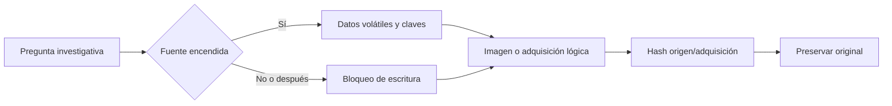

# Clase 203 — Adquisición forense: discos e imágenes

> Parte: **9 — Forense digital y respuesta a incidentes** · Fuente: *Brian Carrier — File System Forensic Analysis* y *NIST SP 800-86*
> ⏱️ Duración estimada: **120 min** · Nivel: **Intermedio**

---

## 🎯 Objetivo

Aprender a adquirir imágenes forenses de discos y memoria de forma verificable y sin alterar el original. Al terminar sabrás elegir entre adquisición física y lógica, usar formatos como RAW (dd) y E01, aplicar bloqueo de escritura y verificar integridad con hashes antes y después.

## 📚 Resultados de aprendizaje

Al finalizar, el alumno podrá:

1. **Diferenciar** adquisición física, lógica y de volumen.
2. **Crear** imágenes con `dd`, `dcfldd`, `ewfacquire` y FTK Imager.
3. **Aplicar** bloqueo de escritura por hardware o software.
4. **Verificar** integridad con hashes durante y tras la adquisición.
5. **Elegir** el formato adecuado (RAW vs. E01/EWF) según el caso.

## 🗺️ Temas

| # | Tema | Por qué importa |
|---|------|-----------------|
| 1 | Física vs. lógica vs. volumen | Define qué datos capturas |
| 2 | Formatos RAW y E01/EWF | Compresión, metadatos e integridad |
| 3 | Bloqueo de escritura | Preserva el original |
| 4 | `dd` y `dcfldd` | Adquisición base en Linux |
| 5 | `ewfacquire` y FTK Imager | Formato forense con verificación |
| 6 | Hashing durante adquisición | Prueba de no alteración |
| 7 | Adquisición en vivo vs. apagado | Decisión bajo orden de volatilidad |
| 8 | Discos cifrados y SSD/TRIM | Retos modernos de adquisición |

## 🧠 Explicación en profundidad

Adquirir no significa copiar archivos visibles. Una imagen física busca sectores direccionables, espacio no asignado y estructuras; una adquisición lógica obtiene objetos accesibles mediante el sistema o una API. La elección depende de pregunta, cifrado, estado, tiempo, capacidad y autoridad.



Apagar puede preservar disco y destruir RAM o claves; mantener encendido altera timestamps. No existe decisión sin impacto, por eso se registra. Un write blocker reduce escrituras en medios compatibles, pero se verifica. Formatos raw y contenedores forenses difieren en metadatos, compresión y segmentación. El hash se calcula y compara en puntos definidos, conservando también logs de herramienta y errores de lectura.

### Elegir método desde la pregunta

Si la pregunta exige archivos de usuario accesibles, una adquisición lógica puede ser suficiente y más rápida. Si interesa contenido borrado, estructura o espacio no asignado, se necesita imagen física cuando el medio y acceso lo permiten. Un volumen cifrado abierto puede justificar adquisición en vivo antes de perder claves; eso modifica el sistema y se registra. NIST SP 800-86 respalda seleccionar técnicas según necesidad de respuesta y preservación, no aplicar un único ritual.

Antes se documentan dispositivo, número de serie, conexiones, estado, fecha, reloj y autoridad. En medios apagados se usa write blocker de hardware o software apropiado y se verifica con una prueba controlada. «Conecté el bloqueador» no demuestra que funcionó. En sistemas vivos se limita el conjunto de comandos y se recoge primero lo más volátil pertinente.

### Imagen, formato y verificación

Raw ofrece una representación sectorial simple; E01 y otros contenedores pueden almacenar metadatos, segmentos, compresión y checks. El formato no garantiza calidad. Se guardan logs con sectores ilegibles y reintentos. Si existen bad sectors, el informe distingue datos adquiridos de los no disponibles y evita afirmar una copia perfecta.

El hash de la adquisición se calcula al crear y se verifica antes de analizar o transferir. Hashes internos de bloques pueden ayudar a detectar corrupción en contenedores. El algoritmo y valor se registran completos. El original se monta de solo lectura o se custodia; las herramientas trabajan sobre copia. libewf ofrece herramientas abiertas para formatos EWF, mientras FTK Imager es una herramienta de adquisición cuyo uso debe documentarse por versión y parámetros.

### Decidir sobre un equipo encendido

Apagar desconecta sesiones y elimina RAM; adquirir en vivo altera memoria y filesystem. Se ponderan cifrado, procesos en memoria, seguridad física, propagación y criticidad. La decisión pertenece al plan de incidente. El diagrama coloca la pregunta antes de la herramienta porque una adquisición técnicamente correcta puede ser investigativamente inútil si destruyó la única evidencia que respondía el caso.

## 📔 Glosario

- **Adquisición física:** copia de sectores direccionables.
- **Adquisición lógica:** colección mediante archivos o API.
- **Imagen raw:** copia sectorial sin contenedor adicional.
- **Write blocker:** control que impide escrituras al medio.
- **Bad sector:** sector que no pudo leerse de forma fiable.
- **Live acquisition:** recolección con sistema en ejecución.
- **Verificación:** comparación documentada de integridad.

## 📖 Definiciones y características

- **Adquisición física**: copia de sectores direccionables del medio o dispositivo accesible, incluido espacio no asignado. Característica: permite buscar residuos si no fueron sobrescritos, eliminados por TRIM o cifrados de forma inaccesible.
- **Adquisición lógica**: copia de archivos y estructuras vivas. Característica: más rápida pero omite lo borrado.
- **Formato RAW (dd)**: copia cruda sin metadatos. Característica: universal pero sin verificación embebida.
- **Formato E01 (EWF)**: contenedor con segmentación, compresión, metadatos y comprobaciones. Característica: sus controles ayudan a detectar corrupción, pero no reemplazan procedimiento ni verificación externa.
- **Write blocker**: dispositivo o control destinado a impedir escrituras al original. Característica: hardware y software deben seleccionarse y probarse según interfaz y escenario.
- **Espacio no asignado (unallocated)**: sectores sin archivo vivo asignado. Característica: fuente de datos borrados y carving.
- **TRIM en SSD**: comando por el que el sistema informa bloques que ya no necesita; el controlador decide cómo y cuándo gestionarlos. Característica: puede reducir o impedir recuperación, sin permitir predecir un resultado universal.

## 🔍 Caso razonado — portátil cifrado y SSD

Un portátil corporativo está encendido, desbloqueado y conectado. La pregunta prioritaria es si una cuenta ejecutó una herramienta y extrajo archivos. Apagar puede cerrar el volumen cifrado y perder RAM; realizar una imagen física en vivo puede tardar y modificar el sistema. El plan autoriza primero memoria y estado de cifrado, después una adquisición lógica de artefactos prioritarios y finalmente la imagen o snapshot técnicamente viable. Cada acción, demora y error queda registrado.

En un SSD, la ausencia de contenido borrado después de TRIM no demuestra que nunca existió. En un E01, metadatos y comprobaciones internas no reemplazan el hash externo ni el log de sectores fallidos. El examinador preserva una copia sellada, verifica una copia de trabajo y limita la conclusión a lo efectivamente adquirido.

## ✅ Criterio de dominio

El alumno compara adquisición física, lógica y en vivo contra una pregunta concreta; documenta formato, herramienta, versión, dispositivo, write blocker, hashes y errores; y explica el impacto de cifrado y TRIM. Una copia sin log, verificación o justificación metodológica no se acepta como adquisición completa.

## 🧰 Herramientas y preparación

- **Linux**: `dd`, `dcfldd`, `ewfacquire` (paquete `libewf-tools`), `hashdeep`.
- **Windows**: **FTK Imager** (gratuito, de Exterro/AccessData) para crear imágenes E01 con verificación.
- **Hardware simulado**: usa un pendrive propio o un archivo `.img` como "disco". Nunca practiques sobre medios de terceros sin autorización.
- **Recuerda**: laboratorio aislado, evidencia propia, y bloqueo de escritura siempre que toques un original.

## 🧪 Laboratorio guiado

> Usa un pendrive PROPIO o un archivo imagen que tú creas. Nunca medios ajenos sin permiso escrito.

1. Identifica el dispositivo (en Linux) sin montarlo:

   ```bash
   lsblk -o NAME,SIZE,TYPE,MOUNTPOINT
   ```

2. Monta el original en solo lectura si necesitas inspeccionarlo (simula write-blocker por software):

   ```bash
   blockdev --setro /dev/sdX
   ```

3. Adquiere con `dcfldd` calculando hash al vuelo:

   ```bash
   dcfldd if=/dev/sdX of=caso001.dd hash=sha256 hashlog=caso001.hashlog bs=4M
   ```

4. Alternativa en formato forense E01:

   ```bash
   ewfacquire /dev/sdX
   ```

   Rellena caso, examinador y notas cuando lo pida.
5. Verifica la imagen RAW contra el original:

   ```bash
   sha256sum caso001.dd
   cat caso001.hashlog
   ```

6. Verifica una imagen E01:

   ```bash
   ewfverify caso001.E01
   ```

7. En Windows, repite con **FTK Imager**: `Create Disk Image → Physical Drive → E01`, activa verificación y compara los hashes que reporta al terminar.
8. Documenta en la cadena de custodia: dispositivo, método, hashes y hora UTC.

## ✍️ Ejercicios

1. Explica cuándo elegirías adquisición lógica en vez de física.
2. Compara RAW y E01 en una tabla de ventajas/desventajas.
3. Adquiere un pendrive propio en ambos formatos y compara tamaños.
4. Investiga cómo un write-blocker de hardware difiere de `blockdev --setro`.
5. Explica por qué el TRIM de un SSD complica la recuperación de borrados.
6. Diseña el procedimiento para adquirir un servidor que no se puede apagar.

## 📝 Reto verificable

Adquiere una imagen forense de un pendrive propio en formato E01 con FTK Imager o `ewfacquire`, y demuestra que la imagen es fiel al original comparando hashes.

**Criterio de aceptación**: entregas la imagen E01, el log de adquisición y la salida de `ewfverify` (o el reporte de FTK) mostrando que el hash de adquisición coincide con el de verificación. La cadena de custodia acompaña el entregable.

## ⚠️ Errores comunes

| Síntoma / mensaje | Causa y cómo arreglar |
|-------------------|-----------------------|
| El SO monta el disco automáticamente | Automount activo alteró tiempos de acceso. Desactiva automount o usa write-blocker antes de conectar. |
| `dd` sin `bs` tarda horas | Bloque por defecto minúsculo. Usa `bs=4M`. |
| Hash de adquisición ≠ verificación | El original cambió o hubo error de lectura. Repite con bloqueo de escritura. |
| Imagen RAW enorme | RAW no comprime. Usa E01 si el espacio importa. |
| `ewfacquire: permission denied` | Falta privilegio de lectura del dispositivo. Ejecuta con `sudo`. |

## ❓ Preguntas frecuentes

**❓ ¿RAW o E01?**
E01 para casos formales (metadatos + integridad integrada); RAW para máxima compatibilidad con herramientas.

**❓ ¿Puedo adquirir un equipo encendido?**
Sí, es adquisición en vivo. Captura primero la RAM (más volátil) y documenta que el sistema estaba activo.

**❓ ¿El bloqueo por software basta?**
Para prácticas sí; en casos legales serios se prefiere un write-blocker de hardware certificado.

**❓ ¿Por qué mi SSD no recupera borrados?**
Por TRIM: el controlador borra físicamente bloques liberados, a veces en segundos.

## 🔗 Referencias verificables y alcance

- NIST SP 800-86: fuente primaria para seleccionar y documentar adquisición según necesidad de respuesta y forense — <https://doi.org/10.6028/NIST.SP.800-86>
- RFC 3227: fuente primaria para orden de volatilidad, copias bit a bit, checksums y análisis sobre copia — <https://www.rfc-editor.org/info/rfc3227/>
- NIST Computer Forensics Tool Testing: proyecto primario de requisitos y pruebas; los resultados aplican a versiones y configuraciones ensayadas — <https://www.nist.gov/itl/ssd/software-quality-group/computer-forensics-tool-testing-program-cftt>
- libewf: implementación primaria abierta de formatos EWF y herramientas como `ewfacquire` — <https://github.com/libyal/libewf>
- FTK Imager: documentación del proveedor para funciones de adquisición; no sustituye validación independiente del método — <https://www.exterro.com/ftk-product-downloads/ftk-imager-version-4-7-3>
- Carrier, B. *File System Forensic Analysis*. Addison-Wesley: bibliografía complementaria.

## 📥 Material descargable

- 📄 [Guía en PDF](./clase-203-guia.pdf) — versión imprimible de esta clase.
- 🎞️ [Presentación (PPTX)](./clase-203-presentacion.pptx) — deck para proyectar en clase.

## ⬅️ Clase anterior

[Clase 202 — El ciclo de respuesta a incidentes (NIST y SANS)](../202-el-ciclo-de-respuesta-a-incidentes-nist-y-sans/README.md)

## ➡️ Siguiente clase

[Clase 204 — Forense de sistemas de archivos: NTFS y ext4](../204-forense-de-sistemas-de-archivos-ntfs-y-ext4/README.md)
