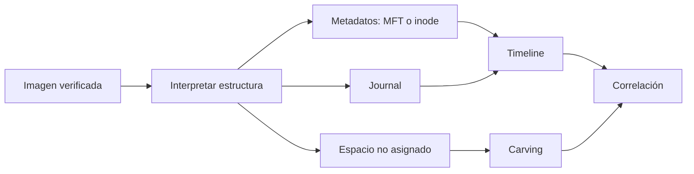

# Clase 204 — Forense de sistemas de archivos: NTFS y ext4

> Parte: **9 — Forense digital y respuesta a incidentes** · Fuente: *Brian Carrier — File System Forensic Analysis*
> ⏱️ Duración estimada: **130 min** · Nivel: **Avanzado**

---

## 🎯 Objetivo

Entender la anatomía interna de NTFS y ext4 al nivel que permite hacer forense real: la MFT y sus atributos, marcas de tiempo, el `$LogFile` y `$UsnJrnl` en NTFS; inodos, journal y timestamps en ext4. Al terminar podrás reconstruir la historia de un archivo aunque haya sido borrado o manipulado.

## 📚 Resultados de aprendizaje

Al finalizar, el alumno podrá:

1. **Explicar** la estructura de la MFT y sus atributos clave.
2. **Interpretar** los timestamps MACB en NTFS y ext4.
3. **Recuperar** archivos borrados a partir de metadatos residuales.
4. **Analizar** el `$UsnJrnl` y el journal de ext4 para reconstruir cambios.
5. **Usar** The Sleuth Kit para recorrer un sistema de archivos.

## 🗺️ Temas

| # | Tema | Por qué importa |
|---|------|-----------------|
| 1 | MFT y registros de archivo | Corazón de NTFS |
| 2 | Atributos `$STANDARD_INFORMATION` y `$FILE_NAME` | Dos juegos de timestamps |
| 3 | Timestamps MACB | Reconstruyen actividad |
| 4 | `$LogFile` y `$UsnJrnl` | Historial de cambios NTFS |
| 5 | Inodos y bloques en ext4 | Corazón de ext4 |
| 6 | Journal de ext4 (jbd2) | Cambios recientes |
| 7 | Archivos borrados y residuos | Recuperación de metadatos |
| 8 | The Sleuth Kit | Herramienta de análisis |

## 🧠 Explicación en profundidad

El sistema de archivos es una base de metadatos que relaciona nombres, identificadores, tiempos y bloques. «El archivo fue borrado» suele significar que la referencia fue liberada; contenido y metadatos pueden persistir hasta sobrescritura. Recuperar bytes no siempre recupera nombre, ruta ni tiempo.



NTFS usa registros MFT y atributos; ext4 usa inodos, extents y journal. Los cuatro tiempos MACB dependen del sistema, operación y herramienta, y pueden modificarse legítima o maliciosamente. Se expresan con zona horaria y procedencia. Journal y USN aportan historial parcial, no registro total. Toda conclusión debe separar presencia actual, rastro de metadato y contenido recuperado.

### NTFS: registros y atributos

NTFS representa cada archivo o directorio mediante registros en la Master File Table. Los atributos pueden contener nombres, datos, tiempos y referencias; archivos pequeños incluso pueden ser residentes. Un objeto puede tener varios nombres o streams. El `$STANDARD_INFORMATION` y `$FILE_NAME` pueden conservar tiempos con historias diferentes, por lo que compararlos ayuda, pero una discrepancia no prueba timestomping sin contexto.

El USN Journal registra cambios seleccionados mientras exista retención; `$LogFile` apoya recuperación transaccional. Ninguno es auditoría completa de usuario. Se correlacionan con Event Logs, Prefetch o LNK. The Sleuth Kit permite enumerar estructuras y construir timelines; MFTECmd interpreta MFT y artefactos relacionados. La herramienta presenta campos: el analista explica su semántica y versión.

### ext4: inodos, extents y journal

En ext4 el nombre vive en la entrada de directorio y el inode conserva metadatos y referencias a datos mediante extents. Borrar puede liberar la entrada y bloques; la recuperación depende de sobrescritura, journal, configuración y medio. El journal busca consistencia tras fallos, no preservar una historia forense exhaustiva. Montar una imagen con escritura puede reproducir operaciones del journal y alterar estado, por eso se analiza copia y se controla montaje.

### Timestamps y afirmaciones

MACB es una convención de análisis: Modified, Accessed, Changed y Birth/Creation cuando el sistema lo ofrece. `ctime` en Unix representa cambio de metadatos, no creación. Acceso puede estar reducido por opciones de montaje. Copiar, extraer o sincronizar altera tiempos de forma distinta. Se conserva valor original, zona y fuente; una timeline no mezcla significados como si fueran idénticos.

Cuando un archivo se elimina, pueden quedar tres tipos de evidencia: metadato que refiere al objeto, contenido recuperado por bloques y rastros en otros artefactos. Recuperar un PDF por carving no recupera necesariamente su ruta ni demuestra apertura. El diagrama converge en correlación precisamente para impedir esa conclusión apresurada.

## 📔 Glosario

- **MFT:** tabla maestra de archivos de NTFS.
- **Inode:** estructura de metadatos en ext4.
- **Extent:** rango contiguo de bloques.
- **Journal:** registro para consistencia del sistema de archivos.
- **Unallocated:** espacio no asignado a un objeto activo.
- **Slack space:** bytes no usados dentro de una unidad asignada.
- **MACB:** tiempos de modificación, acceso, cambio y nacimiento.

## 📖 Definiciones y características

- **MFT (Master File Table)**: base de datos de NTFS donde cada archivo tiene un registro. Característica: incluso los archivos pequeños viven dentro de la MFT (residentes).
- **`$STANDARD_INFORMATION`**: atributo NTFS que incluye timestamps y otros metadatos. Característica: distintas operaciones y APIs pueden modificar sus tiempos; una discrepancia requiere corroboración.
- **`$FILE_NAME`**: atributo NTFS asociado a nombre y referencia de directorio que también contiene tiempos. Característica: compararlo con otras fuentes puede revelar inconsistencias, no probar por sí solo timestomping.
- **MACB**: Modified, Accessed, **Changed** (ctime: cambio de metadatos/entrada MFT), Born (creación). Característica: cuatro marcas que permiten ordenar eventos.
- **`$UsnJrnl`**: Update Sequence Number Journal, registra cambios en archivos. Característica: revela creaciones/borrados recientes.
- **Inodo (ext4)**: estructura con metadatos y punteros a bloques de datos. Característica: al borrar, ext4 suele limpiar punteros (dificulta recuperar).
- **Journal (jbd2)**: mecanismo transaccional usado por ext4 para consistencia. Característica: puede aportar rastros de metadatos dentro de su ventana, pero no es un registro de auditoría completo.

## 🔍 Caso razonado — script eliminado en dos sistemas

En NTFS, una entrada MFT liberada conserva nombre y atributos; el USN puede registrar una razón de cambio dentro de su ventana y Prefetch aporta una relación separada con ejecución. En ext4, el nombre estaba en la entrada de directorio y el inode en otra estructura; el journal puede contener transacciones de metadatos, pero no promete conservar el contenido completo. El mismo verbo «borrar» produce evidencias distintas.

El analista recupera bytes candidatos de ambos medios y registra offsets. En Windows puede relacionar contenido, MFT y USN; en Linux relaciona inode, directorio, journal y logs. Si el carving recupera el script sin metadatos, la conclusión es «contenido consistente con el script existió en estos bloques», no «el usuario lo ejecutó a esta hora».

## ✅ Criterio de dominio

El alumno explica dónde viven nombre, metadatos y datos en NTFS y ext4; interpreta MACB sin llamar creación al `ctime` de Unix; y distingue journal de auditoría. Debe producir una timeline con fuente y semántica por cada timestamp.

## 🧰 Herramientas y preparación

- **The Sleuth Kit (TSK)**: `fls`, `istat`, `icat`, `mmls`, `fsstat`, `mactime`.
- **NTFS específico**: `analyzeMFT.py`, `MFTECmd` (Eric Zimmerman), `UsnJrnl2Csv`.
- **ext4**: `debugfs`, `extundelete`.
- **Entorno**: monta las imágenes en solo lectura. Trabaja sobre imágenes propias creadas en la clase anterior.

## 🧪 Laboratorio guiado

> Usa una imagen `.dd` propia (por ejemplo de un pendrive formateado en NTFS y otro en ext4).

1. Examina la tabla de particiones:

   ```bash
   mmls caso001.dd
   ```

2. Muestra estadísticas del sistema de archivos:

   ```bash
   fsstat -o 2048 caso001.dd
   ```

3. Lista archivos incluyendo borrados (marcados con `*`):

   ```bash
   fls -r -o 2048 caso001.dd
   ```

4. Inspecciona un inodo/registro MFT concreto:

   ```bash
   istat -o 2048 caso001.dd 128
   ```

5. Recupera el contenido de un archivo por su inodo:

   ```bash
   icat -o 2048 caso001.dd 128 > recuperado.bin
   ```

6. Genera una línea de tiempo del sistema de archivos:

   ```bash
   fls -r -m C: -o 2048 caso001.dd > bodyfile.txt
   mactime -b bodyfile.txt -d > timeline.csv
   ```

7. En NTFS, extrae y parsea la MFT con MFTECmd:

   ```bash
   MFTECmd.exe -f "$MFT" --csv salida --csvf mft.csv
   ```

   Compara los timestamps de `$STANDARD_INFORMATION` y `$FILE_NAME` para detectar *timestomping*.
8. En ext4, explora con `debugfs`:

   ```bash
   debugfs -R "stat <2>" imagen_ext4.dd
   ```

## ✍️ Ejercicios

1. Explica la diferencia entre timestamps residentes y no residentes en la MFT.
2. Detecta *timestomping* comparando `$SI` y `$FN` en una MFT de ejemplo.
3. Recupera un archivo borrado propio con `icat` y verifica su contenido.
4. Interpreta el significado de cada letra en MACB con un ejemplo.
5. Usa `debugfs` para listar los inodos borrados de una imagen ext4.
6. Compara cómo NTFS y ext4 manejan el borrado de un archivo.

## 📝 Reto verificable

A partir de una imagen NTFS propia donde borraste un archivo y alteraste deliberadamente sus tiempos, identifica las incoherencias en MFT y fuentes relacionadas, explica qué sostiene la manipulación conocida del laboratorio y recupera el contenido disponible del archivo borrado.

**Criterio de aceptación**: presentas (a) el archivo recuperado con `icat`, (b) una comparación `$SI` vs `$FN` que muestra la incoherencia de timestamps, y (c) una explicación de por qué esa incoherencia indica manipulación.

## ⚠️ Errores comunes

| Síntoma / mensaje | Causa y cómo arreglar |
|-------------------|-----------------------|
| `fls` no muestra offset correcto | Falta `-o` con el sector de inicio de la partición. Sácalo de `mmls`. |
| `icat` devuelve datos basura | El inodo fue reasignado; los bloques ya se sobrescribieron. |
| Timestamps "imposibles" (futuro) | Timestomping o reloj alterado. Contrasta con `$FN`. |
| `extundelete` no recupera nada | ext4 limpió los punteros del inodo. Prueba carving (clase 214). |
| MFTECmd no encuentra `$MFT` | Debes extraer `$MFT` con FTK Imager primero. |

## ❓ Preguntas frecuentes

**❓ ¿Por qué hay dos juegos de timestamps en NTFS?**
Ambos atributos los mantiene NTFS bajo reglas y operaciones distintas; `$FILE_NAME` no debe tratarse como reloj inmune. Compararlos puede revelar una incoherencia que se explica con operaciones, journal y otras fuentes.

**❓ ¿ext4 conserva archivos borrados?**
Con frecuencia quedan menos punteros útiles tras liberar el inodo. El journal puede aportar metadatos dentro de su ventana y el carving es una alternativa, aunque sobrescritura, TRIM, cifrado o fragmentación pueden impedir resultados útiles.

**❓ ¿Qué es un archivo residente?**
Uno tan pequeño que sus datos caben dentro del propio registro de la MFT, sin ocupar clusters aparte.

**❓ ¿El `$UsnJrnl` está siempre activo?**
En Windows moderno normalmente sí. Es una fuente riquísima de creaciones, renombres y borrados recientes.

## 🔗 Referencias verificables y alcance

- Microsoft, NTFS overview: documentación oficial de características NTFS; no interpreta por sí sola artefactos de un caso — <https://learn.microsoft.com/en-us/windows-server/storage/file-server/ntfs-overview>
- Linux Kernel, estructuras ext4: fuente primaria para inodos, extents, directorios y journal JBD2 — <https://www.kernel.org/doc/html/latest/filesystems/ext4/index.html>
- Linux Kernel, journal ext4: explica que JBD2 protege consistencia y que el modo habitual registra principalmente metadatos — <https://www.kernel.org/doc/html/latest/filesystems/ext4/journal.html>
- The Sleuth Kit: documentación primaria de herramientas y técnicas de análisis de filesystem — <https://www.sleuthkit.org/sleuthkit/docs.php>
- MFTECmd: documentación del proyecto para interpretar MFT; sus campos deben contrastarse con versión del parser y fuente original — <https://github.com/EricZimmerman/MFTECmd>
- Carrier, B. *File System Forensic Analysis*. Addison-Wesley: bibliografía complementaria.

## 📥 Material descargable

- 📄 [Guía en PDF](./clase-204-guia.pdf) — versión imprimible de esta clase.
- 🎞️ [Presentación (PPTX)](./clase-204-presentacion.pptx) — deck para proyectar en clase.

## ⬅️ Clase anterior

[Clase 203 — Adquisición forense: discos e imágenes](../203-adquisicion-forense-discos-e-imagenes/README.md)

## ➡️ Siguiente clase

[Clase 205 — Análisis de artefactos de Windows](../205-analisis-de-artefactos-de-windows/README.md)
