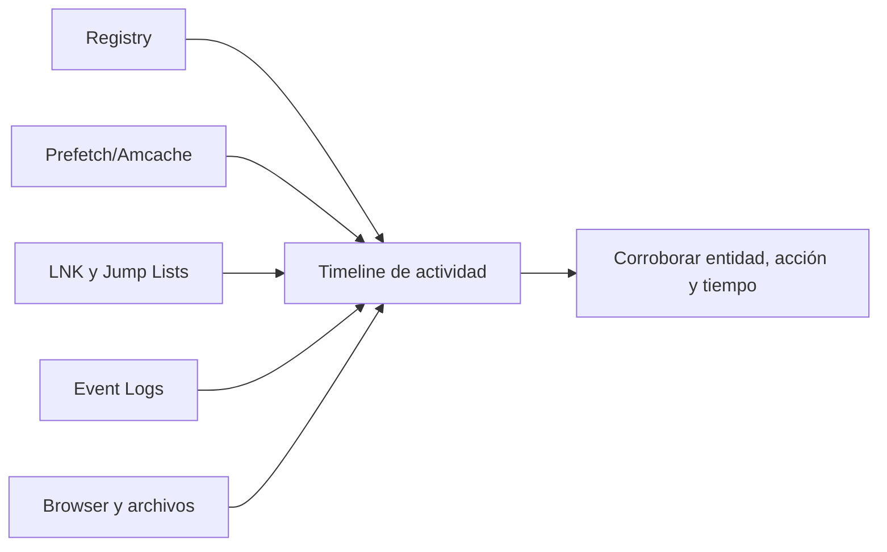

# Clase 205 — Análisis de artefactos de Windows

> Parte: **9 — Forense digital y respuesta a incidentes** · Fuente: *SANS FOR500 — Windows Forensic Analysis* y documentación de Microsoft
> ⏱️ Duración estimada: **130 min** · Nivel: **Avanzado**

---

## 🎯 Objetivo

Aprender a extraer e interpretar los artefactos que Windows deja de la actividad del usuario y del sistema: registro (hives), Prefetch, ShimCache/AmCache, Jump Lists, LNK, Event Logs y ShellBags. Al terminar podrás responder "quién ejecutó qué, cuándo y desde dónde" en un equipo Windows.

## 📚 Resultados de aprendizaje

Al finalizar, el alumno podrá:

1. **Localizar y extraer** los hives del registro y los principales artefactos.
2. **Interpretar** Prefetch, ShimCache y AmCache como evidencia de ejecución.
3. **Analizar** Event Logs para autenticación y creación de procesos.
4. **Reconstruir** actividad de usuario con Jump Lists, LNK y ShellBags.
5. **Usar** las herramientas de Eric Zimmerman y RegRipper.

## 🗺️ Temas

| # | Tema | Por qué importa |
|---|------|-----------------|
| 1 | Hives del registro | Configuración y rastros de uso |
| 2 | Prefetch | Puede aportar evidencia compatible con ejecución según versión y configuración |
| 3 | ShimCache / AmCache | Aportan inventario, presencia o compatibilidad que requiere interpretación cautelosa |
| 4 | Event Logs (EVTX) | Autenticación y procesos |
| 5 | Jump Lists y LNK | Archivos y rutas accedidas |
| 6 | ShellBags | Carpetas navegadas |
| 7 | UserAssist / RecentDocs | Programas y documentos recientes |
| 8 | Herramientas EZ y RegRipper | Automatizan el parseo |

## 🧠 Explicación en profundidad

Un artefacto de Windows es un subproducto de una función del sistema, no un testigo perfecto. Prefetch puede apoyar ejecución, Amcache inventario o presencia y LNK/Jump Lists interacción con rutas; sus significados dependen de versión, configuración y ciclo de vida. Ninguno debería sostener solo una conclusión crítica.



Los hives de registro se asocian a sistema o perfil; se conserva su contexto y logs transaccionales. Los timestamps pueden reflejar creación, modificación, primer o último uso según artefacto. La práctica profesional formula «este artefacto es consistente con…» y busca corroboración independiente. También registra ausencia: puede deberse a limpieza, configuración, rotación o a que la actividad nunca ocurrió.

### Registro: contexto antes que claves sueltas

SYSTEM, SOFTWARE, SAM y SECURITY describen configuración del equipo; NTUSER.DAT y USRCLASS.DAT pertenecen a perfiles. Una clave necesita hive, ruta, valor y last-write time. Ese tiempo suele corresponder a la clave, no necesariamente a cada valor ni a una ejecución. Logs transaccionales pueden ser necesarios para obtener un estado coherente. RegRipper y herramientas de Eric Zimmerman automatizan extracción, pero se conserva hive original y versión del parser.

### Ejecución, presencia e interacción

Prefetch puede aportar nombre, rutas referenciadas, conteo y tiempos según versión/configuración, y es consistente con ejecución del programa observado. Amcache y Shimcache tienen propósitos de compatibilidad e inventario; no deben describirse automáticamente como historial exacto de ejecución. LNK y Jump Lists pueden relacionar usuario, aplicación, ruta y volumen; muestran interacción o referencia según contexto.

Por ejemplo, un ejecutable aparece en Amcache, una LNK apunta a su ubicación y Prefetch contiene un registro asociado. Juntos fortalecen la hipótesis de presencia e interacción, pero la afirmación final todavía debe respetar tiempos y semántica. Event Logs, EDR y filesystem pueden corroborar proceso, usuario y red. RootCause Windows Inspector, incluido como laboratorio del repositorio, se usa para observar comportamiento y comparar con estos artefactos, no como fuente única de verdad.

### Ausencia y vida útil

Prefetch puede estar deshabilitado o limpiado; Jump Lists dependen de usuario y aplicación; Event Logs rotan; un perfil puede no haberse cargado. Ausencia no equivale a «nunca ocurrió». Primero se verifica si el artefacto debería existir en esa edición, versión y configuración, y si su retención cubre la ventana.

El diagrama muestra convergencia porque cada fuente responde una fracción: Registry configura y conserva uso; Prefetch/Amcache apoyan presencia o ejecución; LNK/Jump Lists conectan rutas y usuario; Event Logs aportan eventos. Una conclusión defendible cita los artefactos exactos, explica su significado y enumera alternativas.

## 📔 Glosario

- **Registry hive:** archivo que almacena una rama del registro.
- **Prefetch:** optimización que conserva metadatos de ejecución.
- **Amcache:** artefacto de inventario y compatibilidad.
- **Shimcache:** caché de compatibilidad de aplicaciones.
- **LNK:** acceso directo con metadatos de destino.
- **Jump List:** historial de elementos asociados a una aplicación.
- **Corroboración:** apoyo de una afirmación mediante fuentes independientes.

## 📖 Definiciones y características

- **Hive del registro**: archivo binario (SYSTEM, SOFTWARE, NTUSER.DAT…) con configuración y rastros. Característica: NTUSER.DAT es por usuario.
- **Prefetch**: archivos `.pf` que apoyan optimización de carga cuando la función está habilitada. Característica: pueden contener nombre, rutas, conteos y tiempos cuya cantidad y semántica dependen de versión.
- **ShimCache (AppCompatCache)**: datos de compatibilidad mantenidos en SYSTEM. Característica: pueden apoyar presencia o interacción; no forman un historial inequívoco de ejecución.
- **AmCache.hve**: hive de inventario y compatibilidad con rutas y propiedades de archivos. Característica: ayuda a identificar objetos, pero su presencia no basta para afirmar ejecución.
- **Event Log 4624/4625**: inicio de sesión exitoso/fallido. Característica: base del análisis de autenticación.
- **Jump List**: historial de archivos por aplicación en la barra de tareas. Característica: revela archivos abiertos recientemente.
- **ShellBags**: datos de vista y navegación del shell en hives de usuario. Característica: pueden apoyar interacción con rutas, incluso si ya no existen; requieren contexto de perfil y parser.

## 🔍 Caso razonado — utilidad remota en un perfil de usuario

`remote.exe` aparece en Amcache con una ruta del perfil. Una Jump List refiere un archivo abierto desde un share y una LNK conserva volumen y ruta. Prefetch existe para el ejecutable y EVTX registra autenticación de red durante la ventana. Cada fuente aporta una relación distinta: inventario o presencia, interacción, ejecución compatible y sesión.

La conclusión no nace de contar artefactos, sino de alinear entidad, significado y tiempo. Si Prefetch está ausente, primero se revisan edición, configuración y retención. Si los tiempos difieren, se conserva su semántica en vez de escoger el más conveniente. El reporte identifica hives, rutas, entradas, parser y valores exactos.

## ✅ Criterio de dominio

El alumno formula una hipótesis de ejecución o interacción con al menos tres artefactos independientes, explica qué produce cada uno y propone alternativas. Presentar Shimcache o Amcache como historial inequívoco de ejecución no cumple el criterio.

## 🧰 Herramientas y preparación

- **Eric Zimmerman's Tools**: `PECmd` (Prefetch), `AppCompatCacheParser`, `AmcacheParser`, `JLECmd`, `LECmd`, `SBECmd`, `EvtxECmd`, `Registry Explorer`.
- **RegRipper**: parseo masivo de hives.
- **Extracción**: FTK Imager o KAPE para volcar los artefactos de una imagen montada en solo lectura.
- **Entorno**: usa una imagen de una VM Windows PROPIA donde tú generaste la actividad.

## 🧪 Laboratorio guiado

> Genera la actividad tú mismo en una VM Windows propia, luego analiza sus artefactos.

1. Con KAPE o FTK Imager, extrae de la imagen: `C:\Windows\Prefetch`, hives `SYSTEM`/`SOFTWARE`/`NTUSER.DAT`, `Amcache.hve` y `C:\Windows\System32\winevt\Logs`.
2. Analiza Prefetch:

   ```bash
   PECmd.exe -d Prefetch --csv salida --csvf prefetch.csv
   ```

3. Parsea ShimCache:

   ```bash
   AppCompatCacheParser.exe -f SYSTEM --csv salida
   ```

4. Parsea AmCache:

   ```bash
   AmcacheParser.exe -f Amcache.hve --csv salida
   ```

5. Analiza inicios de sesión en los Event Logs:

   ```bash
   EvtxECmd.exe -d Logs --csv salida --csvf events.csv
   ```

   Filtra los IDs 4624 (login), 4625 (fallo), 4688 (creación de proceso).
6. Reconstruye actividad de usuario:

   ```bash
   JLECmd.exe -d "AutomaticDestinations" --csv salida
   SBECmd.exe -d "C:\ruta\hives" --csv salida
   ```

7. Correlaciona: cruza Prefetch con un evento 4688 y un LNK para construir una explicación cuyo alcance y vacíos queden explícitos.

## ✍️ Ejercicios

1. Explica qué prueba (y qué no) un archivo Prefetch.
2. Diferencia ShimCache de AmCache y di cuándo usar cada uno.
3. Lista cinco Event IDs clave y su significado.
4. Analiza una Jump List propia y di qué archivos abriste.
5. Evalúa si ShellBags conserva evidencia compatible con la visualización de una carpeta ya borrada y explica sus límites de atribución.
6. Cruza tres artefactos para probar la ejecución de un binario concreto.

## 📝 Reto verificable

En una VM Windows propia, ejecuta un binario "sospechoso" inofensivo (por ejemplo, una copia renombrada de `calc.exe` en una carpeta rara), luego sustenta la ejecución del experimento cruzando al menos tres artefactos con semánticas distintas.

**Criterio de aceptación**: presentas evidencia de al menos tres fuentes distintas (Prefetch, ShimCache/AmCache, Event 4688, LNK…) que coinciden en nombre, ruta y ventana temporal del binario, con una conclusión escrita.

## ⚠️ Errores comunes

| Síntoma / mensaje | Causa y cómo arreglar |
|-------------------|-----------------------|
| No hay Prefetch | Prefetch deshabilitado (común en servidores/SSD). Usa ShimCache/AmCache. |
| ShimCache "desordenada" | Su orden no es estrictamente cronológico. No infieras tiempos exactos de ahí. |
| Event Logs vacíos | Rotación o borrado. Busca en backups o en SIEM. |
| Registry Explorer no abre el hive | Hive en uso o corrupto. Extrae la copia offline de la imagen. |
| Timestamps en hora local confusa | Convierte todo a UTC con la zona horaria del sistema (hive SYSTEM). |

## ❓ Preguntas frecuentes

**❓ ¿Prefetch prueba ejecución?**
Es evidencia fuerte y contextual de que Windows procesó esa aplicación según el mecanismo de Prefetch, pero se valida versión, ruta, hash de nombre y otras fuentes antes de atribuir usuario o ejecución maliciosa. Su ausencia tampoco descarta ejecución.

**❓ ¿AmCache tiene hashes?**
Sí, SHA-1 de ejecutables, muy útil para contrastar contra inteligencia de amenazas.

**❓ ¿Qué hive tiene la actividad del usuario?**
NTUSER.DAT (por perfil) y UsrClass.dat (ShellBags). SYSTEM/SOFTWARE son de máquina.

**❓ ¿Puedo confiar en los ShellBags?**
Sí para probar navegación de carpetas; recuerda que persisten aunque la carpeta ya no exista.

## 🔗 Referencias verificables y alcance

- 🛠️ [RootCause Windows Inspector](https://github.com/vladimiracunadev-create/rootcause-windows-inspector) (Apache-2.0) — sensor forense de comportamiento para Windows · lab: [`labs/rootcause-windows`](../../../labs/rootcause-windows/README.md).
- Microsoft, auditoría de seguridad de Windows: fuente oficial para políticas y eventos nativos; un evento solo existe si la política y el canal lo generaron y conservaron — <https://learn.microsoft.com/en-us/windows/security/threat-protection/auditing/>
- Eric Zimmerman's Tools: documentación primaria de los parsers utilizados; la salida debe conservar versión y contrastarse con el artefacto original — <https://ericzimmerman.github.io/>
- RegRipper: repositorio oficial del framework de plugins para Registry — <https://github.com/keydet89/RegRipper3.0>
- SANS DFIR posters: material profesional de consulta rápida; no sustituye documentación de formato ni validación de artefactos — <https://www.sans.org/posters/>

## 📥 Material descargable

- 📄 [Guía en PDF](./clase-205-guia.pdf) — versión imprimible de esta clase.
- 🎞️ [Presentación (PPTX)](./clase-205-presentacion.pptx) — deck para proyectar en clase.

## ⬅️ Clase anterior

[Clase 204 — Forense de sistemas de archivos: NTFS y ext4](../204-forense-de-sistemas-de-archivos-ntfs-y-ext4/README.md)

## ➡️ Siguiente clase

[Clase 206 — Análisis de artefactos de Linux](../206-analisis-de-artefactos-de-linux/README.md)
