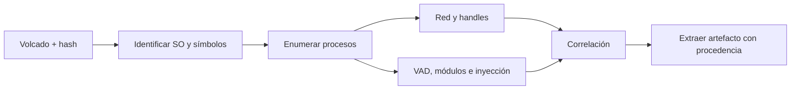

# Clase 207 — Forense de memoria RAM con Volatility

> Parte: **9 — Forense digital y respuesta a incidentes** · Fuente: *Ligh, Case, Levy, Walters — The Art of Memory Forensics* (Wiley, 2014)
> ⏱️ Duración estimada: **140 min** · Nivel: **Avanzado**

---

## 🎯 Objetivo

Aprender a adquirir y analizar volcados de memoria RAM con Volatility 3 para descubrir lo que el disco no revela: procesos ocultos, conexiones de red activas, inyección de código, malware sin archivo y credenciales en memoria. Al terminar podrás cazar amenazas que solo viven en RAM.

## 📚 Resultados de aprendizaje

Al finalizar, el alumno podrá:

1. **Adquirir** volcados de memoria en Windows y Linux de forma forense.
2. **Enumerar** procesos, DLLs, handles y conexiones desde un volcado.
3. **Detectar** inyección de código y procesos ocultos.
4. **Extraer** ejecutables y artefactos de la memoria.
5. **Usar** Volatility 3 con sus plugins principales.

## 🗺️ Temas

| # | Tema | Por qué importa |
|---|------|-----------------|
| 1 | Por qué la RAM importa | Conserva estado de ejecución y datos que pueden no persistir en disco |
| 2 | Adquisición de memoria | Prioridad alta condicionada por riesgo y viabilidad |
| 3 | Enumeración de procesos | Base de todo análisis |
| 4 | Conexiones de red | C2 y exfiltración |
| 5 | Inyección de código | Malware avanzado |
| 6 | Extracción de binarios | Recuperar el malware |
| 7 | Detección de ocultamiento | Rootkits y DKOM |
| 8 | Volatility 3, capas y símbolos | Permiten interpretar estructuras cuando corresponden al sistema capturado |

## 🧠 Explicación en profundidad

La RAM captura estado vivo: procesos, mapeos, sockets, credenciales o claves potenciales y rastros ya ausentes del disco. También es una instantánea incompleta y cambiante. Adquirirla modifica memoria; la meta es minimizar y documentar ese efecto.



Volatility 3 interpreta estructuras mediante capas y símbolos; un plugin no «encuentra malware», presenta objetos que el analista contextualiza. Diferencias entre listas de procesos pueden revelar ocultamiento o artefactos terminados, pero también limitaciones de adquisición. `malfind` señala regiones con características sospechosas, no un veredicto. Se preservan volcado, hash, versión, símbolos, comando y salida.

### Adquirir una instantánea que ya está cambiando

Volatility no adquiere memoria: analiza un volcado producido por otra herramienta. El agente de adquisición ocupa páginas, crea handles y consume CPU; además, el contenido puede cambiar mientras se copia. Se registra herramienta, hash del binario, privilegio, hora, tamaño esperado, salida y hash final. Una captura truncada o inconsistente todavía puede aportar datos, pero la limitación acompaña cada conclusión.

La prioridad de RAM depende de la pregunta. Puede conservar procesos, sockets, comandos, regiones mapeadas, claves o contenido descifrado que desaparecerán al apagar. También puede contener secretos de terceros y datos fuera del alcance; autorización, minimización y almacenamiento protegido forman parte del método.

### Del sistema operativo a los objetos

Volatility 3 usa capas para traducir offsets y tablas de símbolos para interpretar estructuras. En Windows puede obtener símbolos desde PDB; en Linux normalmente necesita símbolos correspondientes al kernel. Una tabla incorrecta puede producir errores o valores plausibles pero falsos. Antes de buscar anomalías se confirma banner, arquitectura, versión y coherencia de plugins básicos.

`pslist`, `pstree` y los scanners responden preguntas distintas. La lista activa describe objetos enlazados; un scanner busca patrones en páginas y puede recuperar procesos terminados o falsos candidatos. La discrepancia inicia una investigación: tiempos, PID, padre, threads, handles y regiones deben coincidir antes de atribuir ocultamiento.

### Inyección, red y extracción

Una región ejecutable y escribible puede ser sospechosa, pero JIT, empaquetadores y software de seguridad también generan permisos inusuales. `malfind` y plugins relacionados priorizan regiones; el analista examina protección, contenido, mapeo, hilo y proceso. Una conexión se relaciona con proceso y tiempo; no basta un destino reputado.

Al extraer una región o PE se conserva offset virtual/físico, proceso, comando, hash y plugin. El objeto puede ser parcial o reconstruido; se analiza como derivado de la memoria, no como copia necesariamente idéntica al archivo original. Disco, EDR y red corroboran su papel.

## 📔 Glosario

- **Memory image:** captura de memoria física disponible.
- **Symbol table:** descripción de tipos y estructuras del kernel.
- **Plugin:** análisis específico de estructuras.
- **VAD:** descriptor de rangos virtuales de un proceso Windows.
- **Handle:** referencia de proceso a un objeto.
- **Inyección:** código o datos introducidos en otro proceso.
- **Pagefile:** almacenamiento que puede contener páginas desplazadas.

## 📖 Definiciones y características

- **Volcado de memoria**: copia del contenido de la RAM en un momento dado. Característica: es la evidencia más volátil; se pierde al apagar.
- **Ejecución sin archivo persistente:** código cuyo componente relevante puede residir en memoria o abusar de componentes legítimos. Característica: exige telemetría y análisis de estado, aunque suelen existir otros rastros.
- **Inyección de código:** ejecución o mapeo de contenido dentro de otro proceso. Característica: permisos, regiones, hilos y contenido deben corroborarse; RWX por sí solo no la prueba.
- **DKOM:** manipulación de objetos del kernel que puede alterar visibilidad. Característica: comparar métodos de enumeración ayuda, pero una discrepancia también puede tener causas residuales o benignas.
- **Enumeración y scanning:** recorridos estructurados y búsquedas de patrones responden preguntas diferentes. Característica: un scanner puede encontrar objetos terminados y falsos candidatos.
- **`malfind`:** plugin que prioriza regiones según características de memoria. Característica: produce candidatos para análisis, no un veredicto automático.
- **Símbolos:** descripciones necesarias para interpretar estructuras del sistema. Característica: deben corresponder a la versión capturada; su obtención automática no está garantizada para todo sistema.

## 🔍 Caso razonado — proceso legítimo con región anómala

`pstree` muestra un proceso firmado iniciado por su padre esperado. `malfind` señala una región privada ejecutable; un hilo comienza dentro de ella y `netscan` relaciona el PID con una conexión reciente. La región contiene cabecera parcial y cadenas de configuración. Esto es consistente con inyección, pero todavía se compara con comportamiento JIT normal de esa aplicación y con EDR.

El analista exporta la región y registra proceso, offset, protección, plugin y hash. El scanner también muestra un proceso terminado: sus tiempos preceden la captura y no se presenta como activo. La conclusión diferencia objeto activo, residuo y derivado extraído.

## ✅ Criterio de dominio

El alumno identifica sistema y símbolos, compara enumeraciones, relaciona proceso–región–hilo–red y conserva procedencia de toda extracción. Ejecutar `malfind` y etiquetar todas sus filas como malware no cumple el criterio.

## 🧰 Herramientas y preparación

- **Adquisición**: **FTK Imager** o **WinPmem** (Windows), **AVML** o LiME (Linux).
- **Análisis**: **Volatility 3** (Python 3). Instala con `pip install volatility3`.
- **Muestras**: usa un volcado de una VM propia o los volcados de práctica públicos (por ejemplo, imágenes de entrenamiento de Volatility). **Nunca ejecutes malware fuera de un laboratorio aislado y desechable.**

## 🧪 Laboratorio guiado

> Adquiere memoria de una VM propia o usa una muestra de entrenamiento pública.

1. Adquiere la memoria (Windows, WinPmem):

   ```powershell
   winpmem_mini.exe memoria.raw
   ```

   En Linux con AVML:

   ```bash
   ./avml memoria.lime
   ```

2. Lista procesos:

   ```bash
   vol -f memoria.raw windows.pslist
   ```

3. Busca procesos ocultos comparando con psscan:

   ```bash
   vol -f memoria.raw windows.psscan
   ```

   Cualquier PID en `psscan` que no esté en `pslist` es sospechoso.
4. Revisa el árbol de procesos para relaciones padre-hijo raras:

   ```bash
   vol -f memoria.raw windows.pstree
   ```

5. Enumera conexiones de red:

   ```bash
   vol -f memoria.raw windows.netscan
   ```

6. Caza inyección de código:

   ```bash
   vol -f memoria.raw windows.malfind
   ```

7. Vuelca un proceso sospechoso para análisis:

   ```bash
   vol -f memoria.raw -o ./salida windows.malfind --pid 1337 --dump   # región RWX inyectada
   # (windows.pslist --pid 1337 --dump vuelca el PE del proceso; dumpfiles solo saca archivos mapeados)
   ```

8. Revisa DLLs cargadas y líneas de comando:

   ```bash
   vol -f memoria.raw windows.cmdline
   vol -f memoria.raw windows.dlllist --pid 1337
   ```

## ✍️ Ejercicios

1. Explica por qué se adquiere RAM antes que disco.
2. Detecta un proceso oculto comparando pslist y psscan.
3. Identifica una conexión de red sospechosa con netscan.
4. Usa malfind para hallar una región RWX inyectada.
5. Extrae el ejecutable de un proceso malicioso de la memoria.
6. Reconstruye la línea de comandos de un proceso con `cmdline`.

## 📝 Reto verificable

A partir de un volcado de memoria (propio o de entrenamiento) que contenga un proceso malicioso inyectado, identifícalo, documenta cómo lo detectaste y extrae su código para análisis.

**Criterio de aceptación**: entregas (a) el PID y nombre del proceso malicioso, (b) la evidencia de inyección (salida de `malfind` con región RWX), (c) su conexión de red si la hay, y (d) el binario extraído con `dumpfiles`.

## ⚠️ Errores comunes

| Síntoma / mensaje | Causa y cómo arreglar |
|-------------------|-----------------------|
| `Unsatisfied requirement` / símbolos | Volatility no halló símbolos del kernel. Deja que los descargue o provee el ISF correcto. |
| `pslist` no ve el malware | Ocultamiento por DKOM. Usa `psscan`. |
| Volcado corrupto o truncado | Adquisición interrumpida. Repite con la máquina estable. |
| Plugins de Vol 2 no funcionan | Sintaxis distinta en Vol 3. Usa `windows.<plugin>`. |
| netscan vacío | Volcado de un SO no soportado o muy antiguo. Verifica la versión. |

## ❓ Preguntas frecuentes

**❓ ¿Volatility 2 o 3?**
Volatility 3 es la rama documentada actualmente y usa Python 3. Puede obtener símbolos disponibles para ciertas plataformas, pero el analista debe verificar correspondencia y disponibilidad; Volatility 2 todavía aparece en procedimientos y plugins históricos.

**❓ ¿Cómo detecto malware fileless?**
En memoria: procesos sin archivo en disco, inyección RWX (malfind), y PowerShell/WMI en `cmdline`. El disco no lo mostraría.

**❓ ¿Puedo sacar contraseñas de la RAM?**
A veces sí (hashes, tokens, incluso texto plano). Trátalas como datos sensibles y protégelas.

**❓ ¿Por qué pslist y psscan difieren?**
pslist confía en la lista del SO (manipulable); psscan escanea la memoria cruda por firmas y encuentra lo ocultado.

## 🔗 Referencias verificables y alcance

- Volatility 3, tutorial de Windows: documentación oficial de adquisición externa, símbolos y ejecución de plugins — <https://volatility3.readthedocs.io/en/latest/getting-started-windows-tutorial.html>
- Volatility 3, fundamentos: documentación oficial de capas, objetos, tablas de símbolos y plugins — <https://volatility3.readthedocs.io/en/latest/basics.html>
- Volatility Foundation: contexto institucional de los proyectos mantenidos; para comandos y compatibilidad se usa la documentación versionada de Volatility 3 — <https://volatilityfoundation.org/>
- WinPmem y AVML: repositorios primarios de adquisidores usados como ejemplos; cada versión y sistema debe probarse por separado — <https://github.com/Velocidex/WinPmem> · <https://github.com/microsoft/avml>
- NIST SP 800-86 y RFC 3227: fuentes primarias para priorizar datos volátiles y documentar adquisición — <https://doi.org/10.6028/NIST.SP.800-86> · <https://www.rfc-editor.org/info/rfc3227/>
- Ligh, Case, Levy y Walters. *The Art of Memory Forensics*. Wiley: bibliografía complementaria; los comandos se contrastan con Volatility 3 actual.

## 📥 Material descargable

- 📄 [Guía en PDF](./clase-207-guia.pdf) — versión imprimible de esta clase.
- 🎞️ [Presentación (PPTX)](./clase-207-presentacion.pptx) — deck para proyectar en clase.

## ⬅️ Clase anterior

[Clase 206 — Análisis de artefactos de Linux](../206-analisis-de-artefactos-de-linux/README.md)

## ➡️ Siguiente clase

[Clase 208 — Forense de red](../208-forense-de-red/README.md)
