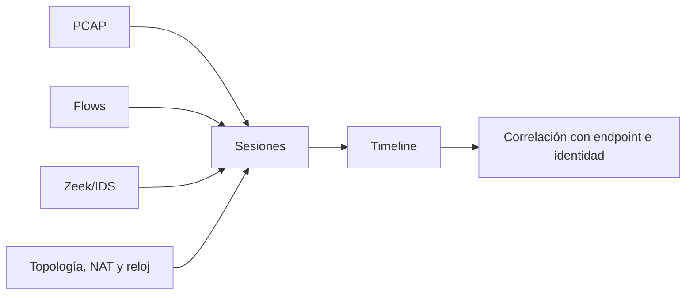

# Clase 208 — Forense de red

> Parte: **9 — Forense digital y respuesta a incidentes** · Fuente: *NIST SP 800-86* y documentación de Wireshark/Zeek
> ⏱️ Duración estimada: **130 min** · Nivel: **Avanzado**

---

## 🎯 Objetivo

Aprender a reconstruir lo que pasó en la red durante un incidente a partir de capturas de paquetes (PCAP) y registros de flujo. Al terminar podrás identificar exfiltración, canales de mando y control (C2), tunneling y movimiento lateral usando Wireshark, tshark, Zeek y NetworkMiner.

## 📚 Resultados de aprendizaje

Al finalizar, el alumno podrá:

1. **Capturar y filtrar** tráfico con tcpdump, Wireshark y tshark.
2. **Reconstruir** sesiones y extraer archivos transferidos de un PCAP.
3. **Detectar** C2, beaconing y exfiltración por DNS/HTTP.
4. **Analizar** logs de Zeek para hallar anomalías a escala.
5. **Distinguir** tráfico legítimo de indicadores de compromiso.

## 🗺️ Temas

| # | Tema | Por qué importa |
|---|------|-----------------|
| 1 | Fuentes: PCAP vs. flujo (NetFlow) | Detalle vs. escala |
| 2 | Filtros de captura y display | Encontrar la aguja |
| 3 | Reensamblado de sesiones TCP | Reconstruir lo que el sensor alcanzó a capturar |
| 4 | Extracción de archivos | Recuperar lo transferido |
| 5 | Detección de C2 y beaconing | Formular hipótesis a partir de periodicidad y contexto |
| 6 | Exfiltración por DNS/HTTP | Reconocer señales y corroborarlas con otras fuentes |
| 7 | Zeek (logs de red) | Análisis a gran escala |
| 8 | TLS y tráfico cifrado | Metadatos cuando no hay claro |

## 🧠 Explicación en profundidad

La forense de red reconstruye comunicaciones desde capturas y metadatos. PCAP ofrece detalle pero solo donde existió sensor; flow resume relaciones; Zeek interpreta protocolos. NAT, balanceadores, VPN y cifrado pueden ocultar identidad o contenido, por lo que topología y posición del sensor forman parte de la evidencia.



La tupla de red identifica una conversación en un punto, no necesariamente al usuario final. La reconstrucción TCP considera retransmisión, pérdida y orden. Extraer un objeto de HTTP no demuestra que se ejecutó; se corrobora en endpoint. Bajo TLS se analizan destino, tiempos, tamaños y handshake disponible, expresando límites de visibilidad.

### Elegir la fuente según la pregunta

Un PCAP puede conservar cabeceras y carga útil, pero únicamente de los paquetes que llegaron al sensor. Un flujo NetFlow/IPFIX resume extremos, puertos, duración y volumen; sacrifica contenido para cubrir más tiempo o más enlaces. Zeek ocupa otro nivel: interpreta protocolos y produce registros como `conn.log`, `dns.log` o `http.log`. Ninguna fuente es universal. Para saber qué archivo atravesó HTTP puede hacer falta PCAP; para descubrir que un host habló con miles de destinos durante una semana, los flujos suelen ser más prácticos.

Antes de atribuir una IP a una persona se dibuja el camino observado: VLAN, punto de captura, NAT, proxy, VPN, balanceador y resolución temporal de DHCP. La IP que aparece como origen en un sensor perimetral puede ser la dirección traducida de muchos equipos. Esta limitación no invalida la evidencia: define qué fuentes adicionales —DHCP, proxy, EDR o identidad— son necesarias.

### Filtrar, reensamblar y extraer sin perder el contexto

Wireshark distingue filtros de captura y filtros de visualización. El primero decide qué paquetes se conservan y, por tanto, puede producir una pérdida irreversible; el segundo cambia solamente la vista sobre una captura ya guardada. Durante una investigación conviene preservar el PCAP original y trabajar con vistas o copias derivadas. Al seguir una secuencia TCP, la herramienta reordena segmentos disponibles, pero no puede inventar paquetes perdidos ni descifrar TLS sin material criptográfico autorizado.

La extracción de objetos es un paso analítico, no una conclusión. Se registra flujo, offset o número de paquete, método de extracción y hash del objeto. Después se valida tipo real, estructura y relación con DNS, HTTP y endpoint. Un ejecutable descargado demuestra transferencia observada; Prefetch, Amcache, memoria u otro artefacto son los que pueden apoyar una conclusión sobre ejecución.

### Reconocer patrones sin convertirlos en pruebas automáticas

Beaconing describe contactos repetidos que pueden ser compatibles con C2, pero servicios de actualización, telemetría y monitoreo también generan periodicidad. Se comparan intervalos, *jitter*, volumen, edad y reputación del destino, horario, certificado y comportamiento del proceso originador. De igual modo, subdominios largos o consultas TXT pueden aparecer en servicios legítimos. Una hipótesis de túnel DNS gana fuerza cuando se combinan alta entropía, volumen, direccionalidad, dominio inusual y correlación con un host comprometido.

En TLS, SNI —cuando está disponible—, versiones, suites, certificados, tamaños y tiempos aportan contexto, pero una huella como JA3 no identifica por sí sola a una familia o usuario: varias aplicaciones pueden compartirla y una actualización puede cambiarla. El lenguaje del informe debe reflejar esa incertidumbre.

## 📔 Glosario

- **PCAP:** captura de paquetes.
- **NetFlow/IPFIX:** resumen de flujos.
- **5-tuple:** IP y puerto origen/destino más protocolo.
- **Reassembly:** reconstrucción del flujo TCP.
- **NAT:** traducción que modifica direcciones visibles.
- **Packet loss:** tráfico no capturado por el sensor.
- **Sessionization:** agrupación de paquetes o eventos en conversaciones.

## 📖 Definiciones y características

- **PCAP**: archivo de paquetes observados por un sensor. Característica: puede conservar gran detalle, pero su cobertura depende del punto de captura, filtros y pérdidas.
- **NetFlow/IPFIX**: metadatos de flujos (quién habló con quién, cuánto). Característica: liviano y escalable, sin contenido.
- **Beaconing**: patrón de contactos repetidos compatible con automatización o C2. Característica: la periodicidad orienta el análisis, pero necesita contexto y corroboración.
- **Túnel DNS**: uso de consultas o respuestas DNS para transportar datos. Característica: longitud, entropía, volumen y tipos de registro son indicadores, no una prueba aislada.
- **Zeek (antes Bro)**: analizador de red que genera logs estructurados (conn, dns, http, ssl…). Característica: convierte PCAP en tablas analizables.
- **JA3/JA3S**: huellas calculadas a partir de elementos del handshake TLS. Característica: ayudan a agrupar tráfico, pero no identifican de forma inequívoca un cliente o servidor.
- **Reensamblado de flujo (Follow TCP Stream)**: ordena los bytes capturados de una conversación. Característica: puede mostrar contenido en claro cuando fue observado, sin recuperar paquetes ausentes ni descifrar automáticamente TLS.

## 🔍 Caso razonado — descarga periódica por HTTPS

Un host contacta cada cinco minutos a un dominio recién observado y descarga respuestas de tamaño similar. Esa periodicidad permite priorizar la sesión, no declararla maliciosa. El analista verifica primero si el destino pertenece a una plataforma de actualización, compara el patrón con otros equipos y revisa DNS, certificado, SNI y volumen. Luego relaciona la hora con el EDR y descubre que las conexiones proceden de un proceso ejecutado desde el perfil temporal del usuario.

La captura permite sostener que hubo comunicaciones y cuantificar los bytes transferidos. Si se recupera un objeto, su hash y estructura respaldan qué contenido atravesó el sensor. Para afirmar ejecución se necesita evidencia del host o memoria. El caso enseña a separar tres conclusiones diferentes: **transferencia observada**, **patrón compatible con C2** y **ejecución corroborada**.

## ✅ Criterio de dominio

Dominas la clase cuando puedes seleccionar PCAP, flujo o logs Zeek según una pregunta; explicar la influencia del sensor, NAT, cifrado y pérdida; conservar trazabilidad de un objeto extraído; y defender una hipótesis de C2 o exfiltración con al menos dos señales independientes y una alternativa legítima evaluada.

## 🧰 Herramientas y preparación

- **Captura**: `tcpdump`, `dumpcap`.
- **Análisis**: **Wireshark** y **tshark**, **Zeek**, **NetworkMiner** (extracción de archivos), **RITA** (detección de beaconing sobre logs de Zeek).
- **Muestras**: usa PCAPs propios o datasets públicos de práctica (por ejemplo, capturas de Malware-Traffic-Analysis con fines educativos). **Analiza malware solo en laboratorio aislado.**

## 🧪 Laboratorio guiado

> Usa un PCAP propio o una muestra pública de entrenamiento.

1. Estadística rápida del PCAP con tshark:

   ```bash
   tshark -r captura.pcap -q -z conv,tcp
   ```

2. Filtra tráfico HTTP y extrae hosts contactados:

   ```bash
   tshark -r captura.pcap -Y "http.request" -T fields -e http.host -e http.request.uri
   ```

3. En Wireshark, usa *Follow → TCP Stream* para reconstruir los bytes de la sesión que quedaron disponibles en la captura.
4. Extrae archivos transferidos:
   - Wireshark: `File → Export Objects → HTTP`.
   - NetworkMiner: carga el PCAP y revisa la pestaña *Files*.
5. Detecta túnel DNS buscando subdominios largos y muchas TXT:

   ```bash
   tshark -r captura.pcap -Y "dns" -T fields -e dns.qry.name | sort | uniq -c | sort -rn | head
   ```

6. Procesa el PCAP con Zeek:

   ```bash
   zeek -r captura.pcap
   cat conn.log | zeek-cut id.orig_h id.resp_h id.resp_p duration
   ```

7. Busca beaconing: analiza `conn.log` con RITA o calcula intervalos regulares hacia una misma IP externa.
8. Con TLS, revisa `ssl.log` y las huellas JA3 para identificar clientes anómalos.

## ✍️ Ejercicios

1. Filtra en Wireshark solo el tráfico de una IP y un puerto concretos.
2. Extrae un archivo transferido por HTTP de un PCAP.
3. Identifica un patrón de beaconing por su periodicidad.
4. Detecta un túnel DNS por el volumen y forma de las consultas.
5. Usa zeek-cut para listar las diez conversaciones más largas.
6. Explica qué puedes y qué no puedes ver en tráfico TLS.

## 📝 Reto verificable

Dado un PCAP que contiene un canal C2 con beaconing y una exfiltración de datos, identifica la IP del C2, el intervalo de beaconing y qué se exfiltró.

**Criterio de aceptación**: reportas la IP/puerto del C2, el intervalo aproximado del beacon (con evidencia de la periodicidad), el método de exfiltración (DNS/HTTP) y, si es posible, el contenido o el tamaño de lo exfiltrado.

## ⚠️ Errores comunes

| Síntoma / mensaje | Causa y cómo arreglar |
|-------------------|-----------------------|
| No ves contenido, solo cifrado | Es TLS. Analiza metadatos (SNI, JA3, tamaños) en vez del claro. |
| Wireshark se cuelga con PCAP grande | Demasiado en memoria. Filtra con tshark o divide con `editcap`. |
| No detectas el beacon | Jitter aleatorio del malware. Analiza distribución de intervalos, no valores exactos. |
| Export Objects vacío | El archivo va fragmentado o cifrado. Prueba NetworkMiner o reensamblado manual. |
| Zeek no genera logs | Ruta o versión incorrecta. Verifica instalación y permisos de escritura. |

## ❓ Preguntas frecuentes

**❓ ¿PCAP o NetFlow?**
PCAP puede aportar contenido y cabeceras con mayor detalle, pero consume más almacenamiento; NetFlow resume conversaciones y facilita cobertura temporal. Se elige una o ambas fuentes según pregunta, sensor, retención y disponibilidad.

**❓ ¿Puedo descifrar TLS?**
Solo si tienes las claves o el `SSLKEYLOGFILE`. Sin ellas, trabajas con metadatos: SNI, certificados, JA3, tamaños y tiempos.

**❓ ¿Cómo se ve un túnel DNS?**
Muchas consultas a un mismo dominio con subdominios largos y aleatorios, a menudo tipo TXT o NULL.

**❓ ¿Zeek reemplaza a Wireshark?**
No: Zeek resume a escala; Wireshark inspecciona a fondo. Se complementan.

## 🔗 Referencias verificables y alcance

- **Wireshark User’s Guide:** <https://www.wireshark.org/docs/wsug_html/> — documentación oficial para captura, reensamblado, análisis y exportación de objetos.
- **Wireshark Display Filter Reference:** <https://www.wireshark.org/docs/man-pages/wireshark-filter.html> — sintaxis oficial; aclara que un filtro de visualización no elimina paquetes del archivo.
- **Zeek Documentation:** <https://docs.zeek.org/> — referencia oficial para los registros estructurados y el procesamiento de PCAP.
- **NetworkMiner:** <https://www.netresec.com/?page=NetworkMiner> — documentación del proveedor para extracción y reconstrucción; sus resultados deben validarse contra el PCAP.
- **RITA:** <https://github.com/activecm/rita> — proyecto abierto para analizar metadatos de Zeek; su puntuación prioriza conexiones y no sustituye la corroboración.
- **NIST SP 800-86:** <https://doi.org/10.6028/NIST.SP.800-86> — marco de integración de técnicas forenses en respuesta a incidentes; no prescribe una única herramienta.

## 📥 Material descargable

- 📄 [Guía en PDF](./clase-208-guia.pdf) — versión imprimible de esta clase.
- 🎞️ [Presentación (PPTX)](./clase-208-presentacion.pptx) — deck para proyectar en clase.

## ⬅️ Clase anterior

[Clase 207 — Forense de memoria RAM con Volatility](../207-forense-de-memoria-ram-con-volatility/README.md)

## ➡️ Siguiente clase

[Clase 209 — Análisis de línea de tiempo (timeline)](../209-analisis-de-linea-de-tiempo-timeline/README.md)
