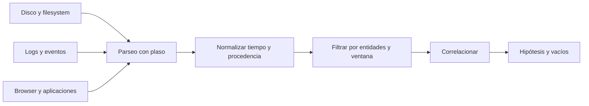

# Clase 209 — Análisis de línea de tiempo (timeline)

> Parte: **9 — Forense digital y respuesta a incidentes** · Fuente: *SANS FOR508* y documentación de plaso/log2timeline
> ⏱️ Duración estimada: **130 min** · Nivel: **Avanzado**

---

## 🎯 Objetivo

Aprender a construir y analizar **super-timelines**: la integración de timestamps extraídos de sistema de archivos, registro, logs y aplicaciones en una vista temporal trazable. Al terminar podrás usar plaso/log2timeline y Timesketch para reconstruir la secuencia sustentada de un incidente, incluidos vacíos y conflictos.

## 📚 Resultados de aprendizaje

Al finalizar, el alumno podrá:

1. **Explicar** la diferencia entre timeline de FS y super-timeline.
2. **Generar** una super-timeline con `log2timeline`/`psort`.
3. **Filtrar y acotar** una timeline a la ventana del incidente.
4. **Analizar** una timeline en Timesketch de forma colaborativa.
5. **Interpretar** patrones MACB para reconstruir la actividad.

## 🗺️ Temas

| # | Tema | Por qué importa |
|---|------|-----------------|
| 1 | Timeline de FS vs. super-timeline | Alcance de la evidencia temporal |
| 2 | plaso: log2timeline y psort | Flujo reproducible de extracción y exportación |
| 3 | Fuentes que agrega plaso | Riqueza del resultado |
| 4 | Acotar por ventana temporal | Reducir el ruido |
| 5 | MACB y pivoteo | Encontrar el punto de entrada |
| 6 | Timesketch | Análisis colaborativo |
| 7 | Anti-forense en timelines | Timestomping y huecos |
| 8 | Correlación multi-fuente | Una historia sustentada con alcances y vacíos |

## 🧠 Explicación en profundidad

Una timeline no es una lista ordenada sin más: integra relojes con semánticas distintas. Tiempo del evento, escritura del registro, adquisición e ingesta pueden divergir. Zona horaria, DST, deriva y precisión deben normalizarse sin borrar el valor original.



Una super-timeline facilita pivotes pero amplifica errores de parsers y volumen. Cada fila necesita fuente y parser; varias filas pueden representar una sola acción. Se empieza con hitos confiables, se amplía la ventana y se buscan eventos que contradigan la historia. La ausencia temporal puede ser rotación, apagado, pérdida o falta de instrumentación.

### Cuatro tiempos que no deben confundirse

El tiempo del hecho, el tiempo escrito por una aplicación, el tiempo de modificación del contenedor y el tiempo de adquisición pueden ser distintos. Un servidor puede registrar en UTC, una aplicación en hora local y un artefacto conservar una precisión de segundos. Además, el reloj del host puede estar adelantado. Normalizar facilita ordenar, pero se conserva el valor original, zona, precisión y corrección aplicada. RFC 3227 recomienda documentar desfase y configuración temporal precisamente porque una línea ordenada puede ser falsa si se mezclan relojes sin examinarlos.

MACB tampoco significa cuatro observadores independientes. Son categorías de tiempos del sistema de archivos cuya semántica depende del formato y de la operación. Copiar, extraer, renombrar o restaurar puede actualizar tiempos distintos. Por eso una fila temporal describe un cambio registrado, no necesariamente la intención humana detrás de él.

### De la imagen al almacén Plaso

`log2timeline.py` identifica fuentes y las procesa mediante parsers hacia un archivo `.plaso`; `pinfo.py` permite inspeccionar información del procesamiento; `psort.py` filtra y exporta eventos. Esta separación es pedagógicamente importante: el CSV no es la fuente original, sino una representación derivada. El expediente debe conservar imagen, almacenamiento Plaso, versión, parámetros, zona horaria, parser y hash de los productos relevantes.

Habilitar más parsers aumenta cobertura y ruido, y también el tiempo de proceso. Una selección se justifica por sistema, pregunta y ventana. Antes de interpretar millones de filas, se revisan errores del procesamiento y se comprueba que las fuentes esperadas realmente fueron reconocidas.

### Pivotar, contradecir y medir confianza

El análisis parte de un hito de alta confianza —por ejemplo, una autenticación confirmada o una descarga observada— y abre ventanas antes y después. Se agrupan filas que pueden corresponder a una misma acción y se buscan confirmaciones en fuentes con mecanismos distintos. Un tiempo alterado en el filesystem puede entrar en conflicto con journal, navegador, EDR o red; esa contradicción es evidencia útil, pero no demuestra por sí sola *timestomping*.

Timesketch facilita consultas, etiquetas y colaboración, pero no convierte automáticamente eventos en narrativa. La conclusión debe explicar qué fuente sostiene cada paso, qué corrección temporal se aplicó y qué intervalos siguen siendo desconocidos.

## 📔 Glosario

- **Timeline:** secuencia temporal de artefactos.
- **Super-timeline:** integración de múltiples fuentes.
- **Time skew:** diferencia entre reloj observado y referencia.
- **DST:** cambio estacional de hora.
- **Parser:** lógica que interpreta un artefacto.
- **Hito:** evento confiable usado como pivote.
- **Provenance:** vínculo de la fila con su fuente.

## 📖 Definiciones y características

- **Timeline de sistema de archivos**: ordena solo los timestamps MACB del FS. Característica: rápida pero limitada.
- **Super-timeline**: integra eventos derivados de filesystem, registro, logs, navegador y otras fuentes. Característica: amplía la cobertura, pero conserva vacíos, duplicados y errores de interpretación.
- **plaso**: framework que produce timelines; `log2timeline` extrae, `psort` filtra/exporta. Característica: soporta cientos de parsers.
- **Plaso storage (.plaso)**: base intermedia de eventos. Característica: se filtra sin re-procesar la imagen.
- **Timesketch**: plataforma web para analizar y anotar timelines en equipo. Característica: permite etiquetar y buscar a gran escala.
- **Pivote**: saltar de un evento clave a los relacionados en el tiempo. Característica: técnica central del análisis.
- **Timestomping**: alterar timestamps para dificultar la reconstrucción. Característica: puede producir incoherencias, aunque estas también admiten causas legítimas y requieren corroboración.

## 🔍 Caso razonado — descarga, ejecución y persistencia con relojes distintos

El proxy registra una descarga a las `14:02 UTC`; el navegador del portátil conserva `10:02` sin zona explícita; Prefetch muestra actividad dos minutos después y una tarea programada aparece a las `14:06 UTC`. Antes de ordenar, el analista verifica que el host estaba en UTC−4 y que su reloj atrasaba 47 segundos. Conserva tiempos originales y agrega columnas normalizadas, fuente y precisión.

La secuencia es consistente con descarga seguida de ejecución y persistencia, pero el historial no prueba que una persona leyó la página y Prefetch no identifica por sí solo quién inició el programa. La narrativa final diferencia hechos registrados, inferencias y vacíos. Si `$STANDARD_INFORMATION` muestra una fecha de creación anterior a la descarga mientras `$FILE_NAME`, el journal y el proxy concuerdan, se investiga manipulación o copia preservando tiempos en lugar de escoger inmediatamente una sola explicación.

## ✅ Criterio de dominio

Dominas la clase cuando construyes una timeline reproducible, conservas tiempo original y normalizado, documentas zona y desfase, puedes rastrear cada fila hasta fuente y parser, agrupas eventos relacionados sin contarlos doble y redactas una secuencia que incluye contradicciones y límites de confianza.

## 🧰 Herramientas y preparación

- **plaso**: `log2timeline.py`, `psort.py`, `pinfo.py` (imagen Docker oficial `log2timeline/plaso`).
- **Timesketch**: despliegue Docker para análisis colaborativo.
- **Entrada**: una imagen `.dd`/`.E01` propia de las clases anteriores.
- **Recuerda**: trabaja sobre copias, nunca el original.

## 🧪 Laboratorio guiado

> Usa una imagen forense propia de una VM que investigaste.

1. Genera el storage de plaso desde la imagen:

   ```bash
   log2timeline.py --storage-file caso.plaso imagen.E01
   ```

2. Revisa qué se recolectó:

   ```bash
   pinfo.py caso.plaso
   ```

3. Exporta una super-timeline completa a CSV:

   ```bash
   psort.py -o l2tcsv -w timeline.csv caso.plaso
   ```

4. Acota a la ventana del incidente (por ejemplo, un día):

   ```bash
   psort.py -o l2tcsv -w recorte.csv caso.plaso \
     "date > '2026-07-10 00:00:00' AND date < '2026-07-11 00:00:00'"
   ```

5. Importa a Timesketch y crea un *sketch* del caso; etiqueta los eventos clave (ejecución de malware, creación de cuenta, exfiltración).
6. Pivotea: parte de un artefacto conocido (una ejecución de Prefetch de la clase 205) y examina qué ocurrió en los minutos previos y posteriores.
7. Busca timestomping: eventos del FS cuyos tiempos no cuadran con logs o con el `$UsnJrnl`.
8. Redacta la secuencia reconstruida: entrada → ejecución → persistencia → exfiltración.

## ✍️ Ejercicios

1. Genera una super-timeline y cuenta cuántas fuentes agregó plaso.
2. Filtra la timeline a una ventana de dos horas.
3. Pivotea desde un evento de login hasta la primera ejecución de malware.
4. Detecta un caso de timestomping por incoherencia entre fuentes.
5. Etiqueta en Timesketch los cinco eventos clave de un incidente.
6. Escribe la narrativa cronológica del incidente en un párrafo.

## 📝 Reto verificable

Construye la super-timeline de una imagen propia con un incidente simulado y entrega la secuencia cronológica desde la entrada del atacante hasta la exfiltración, con al menos seis eventos fechados y correlacionados de fuentes distintas.

**Criterio de aceptación**: tu narrativa incluye seis eventos con fecha/hora UTC, cada uno respaldado por una fuente identificada (FS, registro, log, navegador…), y las fuentes coinciden entre sí (o explicas las incoherencias por timestomping).

## ⚠️ Errores comunes

| Síntoma / mensaje | Causa y cómo arreglar |
|-------------------|-----------------------|
| La timeline tiene millones de líneas | No la acotaste. Filtra por ventana y fuentes relevantes. |
| Tiempos en zonas distintas | Mezcla de UTC y local. Normaliza todo a UTC con `--timezone`. |
| log2timeline tarda muchísimo | Imagen grande con todos los parsers. Usa `--parsers` para acotar. |
| Eventos que se contradicen | Timestomping. Contrasta `$SI` vs `$FN` y `$UsnJrnl`. |
| Timesketch no importa el CSV | Formato incorrecto. Exporta con el formato compatible (`l2tcsv` o `json_line`). |

## ❓ Preguntas frecuentes

**❓ ¿Super-timeline siempre?**
No siempre: es potente pero ruidosa. Para casos acotados, una timeline de FS puede bastar.

**❓ ¿Cómo evito ahogarme en datos?**
Acota por ventana temporal, filtra por fuentes relevantes y pivotea desde eventos conocidos en vez de leer todo.

**❓ ¿Timesketch es obligatorio?**
No, pero facilita el trabajo en equipo, el etiquetado y la búsqueda. Un CSV también sirve para casos pequeños.

**❓ ¿Cómo detecto manipulación de tiempos?**
Buscando incoherencias entre fuentes que registran el mismo hecho: FS, `$UsnJrnl`, logs y artefactos deberían concordar.

## 🔗 Referencias verificables y alcance

- **Plaso User’s Guide:** <https://plaso.readthedocs.io/en/latest/sources/user/Users-Guide.html> — documentación oficial del flujo `log2timeline`, almacén y herramientas de inspección.
- **Using psort:** <https://plaso.readthedocs.io/en/latest/sources/user/Using-psort.html> — referencia oficial de filtrado y exportación; documenta que UTC es la zona de salida predeterminada.
- **Timesketch Documentation:** <https://timesketch.org/> — documentación del proyecto para búsqueda, anotación y colaboración; no sustituye la validación del parser.
- **The Sleuth Kit:** <https://www.sleuthkit.org/sleuthkit/docs.php> — documentación del proyecto para timelines de filesystem y semántica de sus herramientas.
- **RFC 3227 / BCP 55:** <https://www.rfc-editor.org/info/rfc3227/> — guía para recolección y archivo de evidencia; sustenta documentar reloj, zona y deriva.
- **Carrier, B. — *File System Forensic Analysis*, Addison-Wesley, 2005:** fundamento técnico; sus ejemplos deben contrastarse con versiones actuales de cada filesystem.

## 📥 Material descargable

- 📄 [Guía en PDF](./clase-209-guia.pdf) — versión imprimible de esta clase.
- 🎞️ [Presentación (PPTX)](./clase-209-presentacion.pptx) — deck para proyectar en clase.

## ⬅️ Clase anterior

[Clase 208 — Forense de red](../208-forense-de-red/README.md)

## ➡️ Siguiente clase

[Clase 210 — Forense de navegadores y correo](../210-forense-de-navegadores-y-correo/README.md)
