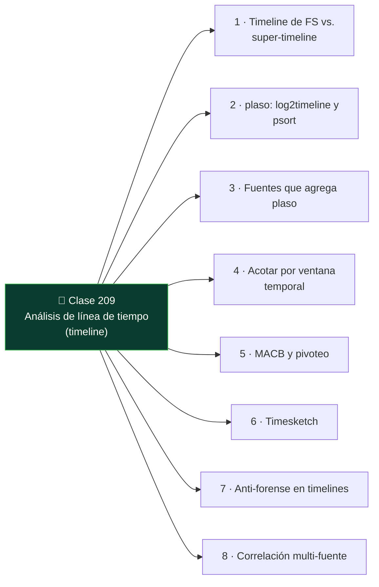

# Clase 209 — Análisis de línea de tiempo (timeline)

<!-- cabecera:inicio -->

<div align="center">

[](../README.md)
[](../../README.md)
[](../../README.md)
[](../../README.md)

</div>

> 🗂️ Parte: **9 — Forense digital y respuesta a incidentes** · 📖 Fuente: *SANS FOR508* y documentación de plaso/log2timeline
> ⏱️ Duración estimada: **130 min** · 🎚️ Nivel: **Avanzado**

<!-- cabecera:fin -->

---

## 🎯 Objetivo

Aprender a construir y analizar **super-timelines**: la fusión de todos los timestamps de un sistema (sistema de archivos, registro, logs, artefactos) en una única línea de tiempo ordenada. Al terminar podrás usar plaso/log2timeline y Timesketch para reconstruir la secuencia exacta de un incidente.

## 📚 Resultados de aprendizaje

Al finalizar, el alumno podrá:

1. **Explicar** la diferencia entre timeline de FS y super-timeline.
2. **Generar** una super-timeline con `log2timeline`/`psort`.
3. **Filtrar y acotar** una timeline a la ventana del incidente.
4. **Analizar** una timeline en Timesketch de forma colaborativa.
5. **Interpretar** patrones MACB para reconstruir la actividad.

## 🗺️ Temas

<!-- mapa:inicio -->



<!-- mapa:fin -->

| # | Tema | Por qué importa |
|---|------|-----------------|
| 1 | Timeline de FS vs. super-timeline | Alcance de la evidencia temporal |
| 2 | plaso: log2timeline y psort | Motor estándar de timelines |
| 3 | Fuentes que agrega plaso | Riqueza del resultado |
| 4 | Acotar por ventana temporal | Reducir el ruido |
| 5 | MACB y pivoteo | Encontrar el punto de entrada |
| 6 | Timesketch | Análisis colaborativo |
| 7 | Anti-forense en timelines | Timestomping y huecos |
| 8 | Correlación multi-fuente | La historia completa |

## 📖 Definiciones y características

- **Timeline de sistema de archivos**: ordena solo los timestamps MACB del FS. Característica: rápida pero limitada.
- **Super-timeline**: fusiona FS, registro, logs, navegador, etc. Característica: visión completa, pero voluminosa y ruidosa.
- **plaso**: framework que produce timelines; `log2timeline` extrae, `psort` filtra/exporta. Característica: soporta cientos de parsers.
- **Plaso storage (.plaso)**: base intermedia de eventos. Característica: se filtra sin re-procesar la imagen.
- **Timesketch**: plataforma web para analizar y anotar timelines en equipo. Característica: permite etiquetar y buscar a gran escala.
- **Pivote**: saltar de un evento clave a los relacionados en el tiempo. Característica: técnica central del análisis.
- **Timestomping**: alterar timestamps para engañar. Característica: crea incoherencias detectables entre fuentes.

## 🧰 Herramientas y preparación

- **plaso**: `log2timeline.py`, `psort.py`, `pinfo.py` (imagen Docker oficial `log2timeline/plaso`).
- **Timesketch**: despliegue Docker para análisis colaborativo.
- **Entrada**: una imagen `.dd`/`.E01` propia de las clases anteriores.
- **Recuerda**: trabaja sobre copias, nunca el original.

## 🧪 Laboratorio guiado

> Usa una imagen forense propia de una VM que investigaste.

1. Genera el storage de plaso desde la imagen:

   ```bash
   log2timeline.py --storage-file caso.plaso imagen.E01
   ```

2. Revisa qué se recolectó:

   ```bash
   pinfo.py caso.plaso
   ```

3. Exporta una super-timeline completa a CSV:

   ```bash
   psort.py -o l2tcsv -w timeline.csv caso.plaso
   ```

4. Acota a la ventana del incidente (por ejemplo, un día):

   ```bash
   psort.py -o l2tcsv -w recorte.csv caso.plaso \
     "date > '2026-07-10 00:00:00' AND date < '2026-07-11 00:00:00'"
   ```

5. Importa a Timesketch y crea un *sketch* del caso; etiqueta los eventos clave (ejecución de malware, creación de cuenta, exfiltración).
6. Pivotea: parte de un artefacto conocido (una ejecución de Prefetch de la clase 205) y examina qué ocurrió en los minutos previos y posteriores.
7. Busca timestomping: eventos del FS cuyos tiempos no cuadran con logs o con el `$UsnJrnl`.
8. Redacta la secuencia reconstruida: entrada → ejecución → persistencia → exfiltración.

## ✍️ Ejercicios

1. Genera una super-timeline y cuenta cuántas fuentes agregó plaso.
2. Filtra la timeline a una ventana de dos horas.
3. Pivotea desde un evento de login hasta la primera ejecución de malware.
4. Detecta un caso de timestomping por incoherencia entre fuentes.
5. Etiqueta en Timesketch los cinco eventos clave de un incidente.
6. Escribe la narrativa cronológica del incidente en un párrafo.

## 📝 Reto verificable

Construye la super-timeline de una imagen propia con un incidente simulado y entrega la secuencia cronológica desde la entrada del atacante hasta la exfiltración, con al menos seis eventos fechados y correlacionados de fuentes distintas.

**Criterio de aceptación**: tu narrativa incluye seis eventos con fecha/hora UTC, cada uno respaldado por una fuente identificada (FS, registro, log, navegador…), y las fuentes coinciden entre sí (o explicas las incoherencias por timestomping).

## ⚠️ Errores comunes

| Síntoma / mensaje | Causa y cómo arreglar |
|-------------------|-----------------------|
| La timeline tiene millones de líneas | No la acotaste. Filtra por ventana y fuentes relevantes. |
| Tiempos en zonas distintas | Mezcla de UTC y local. Normaliza todo a UTC con `--timezone`. |
| log2timeline tarda muchísimo | Imagen grande con todos los parsers. Usa `--parsers` para acotar. |
| Eventos que se contradicen | Timestomping. Contrasta `$SI` vs `$FN` y `$UsnJrnl`. |
| Timesketch no importa el CSV | Formato incorrecto. Exporta con el formato compatible (`l2tcsv` o `json_line`). |

## ❓ Preguntas frecuentes

**❓ ¿Super-timeline siempre?**
No siempre: es potente pero ruidosa. Para casos acotados, una timeline de FS puede bastar.

**❓ ¿Cómo evito ahogarme en datos?**
Acota por ventana temporal, filtra por fuentes relevantes y pivotea desde eventos conocidos en vez de leer todo.

**❓ ¿Timesketch es obligatorio?**
No, pero facilita el trabajo en equipo, el etiquetado y la búsqueda. Un CSV también sirve para casos pequeños.

**❓ ¿Cómo detecto manipulación de tiempos?**
Buscando incoherencias entre fuentes que registran el mismo hecho: FS, `$UsnJrnl`, logs y artefactos deberían concordar.

## 🔗 Referencias

- plaso / log2timeline: <https://plaso.readthedocs.io/>
- Timesketch: <https://timesketch.org/>
- SANS — Windows Forensic Analysis (FOR508): <https://www.sans.org/>
- Carrier, B. — *File System Forensic Analysis*, Addison-Wesley 2005.

## 📥 Material descargable

- 📄 [Guía en PDF](./clase-209-guia.pdf) — versión imprimible de esta clase.
- 🎞️ [Presentación (PPTX)](./clase-209-presentacion.pptx) — deck para proyectar en clase.

## ⬅️ Clase anterior

[Clase 208 — Forense de red](../208-forense-de-red/README.md)

## ➡️ Siguiente clase

[Clase 210 — Forense de navegadores y correo](../210-forense-de-navegadores-y-correo/README.md)
