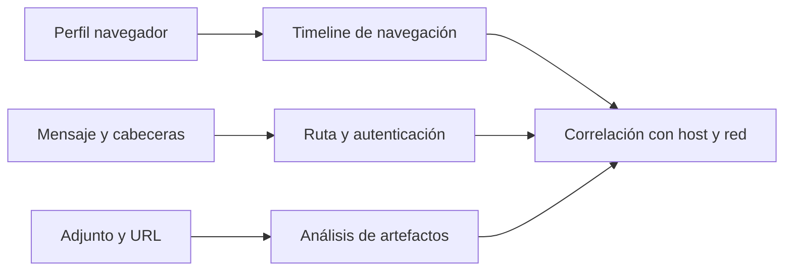

# Clase 210 — Forense de navegadores y correo

> Parte: **9 — Forense digital y respuesta a incidentes** · Fuente: *SANS FOR500* y documentación de formatos de navegador/correo
> ⏱️ Duración estimada: **120 min** · Nivel: **Intermedio**

---

## 🎯 Objetivo

Aprender a extraer y analizar actividad web y de correo: historial, cookies, descargas, caché y sesiones de navegadores (Chrome, Firefox, Edge), y encabezados, adjuntos y trazabilidad de mensajes. Al terminar podrás reconstruir actividad observable y analizar la ruta confiable y autenticación de un correo sospechoso.

## 📚 Resultados de aprendizaje

Al finalizar, el alumno podrá:

1. **Localizar y parsear** las bases SQLite de los navegadores.
2. **Reconstruir** historial, descargas y sesiones de navegación.
3. **Analizar** encabezados de correo para delimitar la ruta confiable y sus límites.
4. **Extraer** adjuntos y detectar phishing y spoofing.
5. **Correlacionar** actividad web/correo con la timeline del caso.

## 🗺️ Temas

| # | Tema | Por qué importa |
|---|------|-----------------|
| 1 | Bases de datos de navegador | Historial, cookies, descargas |
| 2 | Chrome/Edge (History, Cookies) | Formato SQLite dominante |
| 3 | Firefox (places.sqlite) | Estructura propia |
| 4 | Caché y sesiones | Contenido y pestañas abiertas |
| 5 | Formatos de correo (PST, OST, MBOX, EML) | Dónde vive el correo |
| 6 | Encabezados de correo | Reconstruir la ruta declarada y sus límites |
| 7 | SPF/DKIM/DMARC | Interpretar autenticación y alineación de dominios |
| 8 | Adjuntos y phishing | Vector de entrada común |

## 🧠 Explicación en profundidad

Navegadores y correo mezclan contenido local, sincronizado y remoto. Historial, cookies, caché, descargas y sesiones dependen de perfil y versión; un URL en historial no prueba lectura consciente. En correo, cabeceras registran una cadena de transporte, pero campos presentados al usuario pueden falsificarse.



Se preserva mensaje original en su formato, no solo captura de pantalla. `Received` se lee de abajo hacia arriba con cautela; SPF, DKIM y DMARC expresan controles diferentes y resultados ligados al receptor. Un adjunto se hashea y analiza en copia. Para navegador se relacionan descarga, Mark-of-the-Web, archivo y ejecución antes de afirmar compromiso.

### Adquirir el perfil antes de consultar sus bases

Chrome, Edge y Firefox distribuyen actividad entre bases SQLite, archivos de sesión, caché y preferencias. Copiar solo `History` puede omitir transacciones pendientes en archivos `-wal` y `-shm`; abrir el navegador puede escribir nuevas visitas, sincronizar datos o rotar sesiones. Se documentan usuario, perfil, versión, estado del proceso y método de copia, y se analiza un duplicado coherente del conjunto. La ubicación del archivo orienta, pero la estructura y la época temporal se verifican según producto y versión.

Una URL puede aparecer por navegación consciente, redirección, precarga, sincronización o recurso embebido. Una cookie indica que un navegador almacenó datos para un dominio, no que el titular de la cuenta autenticó personalmente. La interpretación mejora al relacionar visita, transición, descarga, caché, DNS, proxy y ejecución en el endpoint.

### Preservar el mensaje y reconstruir el transporte

RFC 5322 define la sintaxis del mensaje de Internet, mientras MIME estructura cuerpos y adjuntos. El `.eml` original conserva campos que una captura de pantalla pierde. Cada servidor de transporte suele anteponer un campo `Received`, por eso el análisis comienza normalmente en el salto inferior confiable y avanza hacia arriba; aun así, los campos anteriores al primer servidor administrado por una parte confiable pueden haber sido proporcionados por el emisor.

Se separan `From` visible, `Return-Path`, dominio de DKIM, `Message-ID`, fechas y `Authentication-Results`. La IP hallada en la cadena puede identificar un relé o proveedor, no el dispositivo de la persona. Los adjuntos se extraen sin ejecución, conservando nombre MIME, tipo declarado, tipo real, hash y relación con el mensaje.

### SPF, DKIM y DMARC responden preguntas distintas

SPF autoriza hosts para el dominio usado en la identidad del sobre; DKIM verifica una firma y las partes cubiertas del mensaje; DMARC evalúa alineación del dominio visible con SPF o DKIM y aplica una política publicada. Un `fail` es evidencia de un resultado de autenticación en un receptor concreto, no prueba universal de intención maliciosa. Un correo puede pasar autenticación y seguir siendo phishing si usa un dominio controlado por el atacante o una cuenta legítima comprometida.

La conclusión útil no es solo «el mensaje era sospechoso», sino qué ocurrió después: entrega, apertura inferida, visita, descarga y ejecución. Cada paso exige su propio artefacto y nivel de certeza.

## 📔 Glosario

- **Browser profile:** conjunto de datos de un usuario/navegador.
- **Cache:** copia local de recursos recuperados.
- **Cookie:** dato asociado a una sesión o sitio.
- **MIME:** estructura de contenido de correo.
- **Received:** salto añadido por servidores de transporte.
- **DKIM:** firma de dominio sobre partes del mensaje.
- **Mark-of-the-Web:** marca de procedencia de zona en Windows.

## 📖 Definiciones y características

- **History (Chrome)**: SQLite con visitas, tiempos y descargas. Característica: los timestamps usan época WebKit (microsegundos desde 1601).
- **places.sqlite (Firefox)**: base de historial y marcadores. Característica: timestamps en microsegundos desde 1970.
- **Cookies**: datos asociados por el navegador a un origen o sesión. Característica: prueban almacenamiento local, pero su significado y atribución dependen del tipo, cifrado y contexto.
- **PST/OST**: contenedores de Outlook. Característica: PST es exportable; OST es la caché local.
- **MBOX/EML**: formatos de correo de texto. Característica: EML es un mensaje individual con encabezados completos.
- **Encabezados `Received`**: campos agregados durante el transporte. Característica: se examinan desde el primer salto confiable y no todos poseen igual confianza.
- **SPF/DKIM/DMARC**: mecanismos complementarios de autorización, firma y alineación de dominios. Característica: sus resultados deben interpretarse con identidad evaluada, política y receptor.

## 🔍 Caso razonado — del mensaje a la ejecución

Un `.eml` presenta como remitente al área financiera. El primer `Received` confiable muestra entrega desde un servicio externo; SPF falla para la identidad del sobre, DKIM no existe y DMARC falla por falta de alineación. Esto sustenta suplantación del dominio, pero aún no demuestra que el usuario actuó. El analista extrae la URL, encuentra una visita en el perfil y una descarga con nombre de factura. El hash del archivo coincide con el objeto visto por el proxy y, minutos después, un artefacto del endpoint apoya su ejecución.

La narrativa conserva la separación: los encabezados explican autenticación y transporte; el navegador apoya visita y descarga; el endpoint apoya ejecución. Si DMARC hubiera pasado, no se descartaría el phishing: se evaluaría dominio parecido, cuenta comprometida o contenido engañoso.

## ✅ Criterio de dominio

Dominas la clase cuando adquieres un perfil sin alterar su estado lógico, incluyes archivos auxiliares de SQLite cuando corresponda, conviertes tiempos conservando su época, analizas un mensaje desde el primer salto confiable, explicas SPF/DKIM/DMARC por separado y correlacionas correo, navegación, descarga y ejecución sin atribuir más de lo que cada artefacto permite.

## 🧰 Herramientas y preparación

- **Navegadores**: `DB Browser for SQLite`, herramientas de Eric Zimmerman, `Hindsight` (Chrome), `nirsoft BrowsingHistoryView`.
- **Correo**: `libpff` (PST), `readpst`, un visor de EML, y análisis manual de encabezados.
- **Entorno**: usa perfiles de navegador y correos PROPIOS. Si analizas un correo de phishing real recibido por ti, hazlo en entorno aislado y no abras los adjuntos.

## 🧪 Laboratorio guiado

> Usa tu propio perfil de navegador y correos propios.

1. Copia (no abras el navegador en vivo) la base de historial de Chrome:
   - Windows: `%LOCALAPPDATA%\Google\Chrome\User Data\Default\History`.
2. Explora el historial con SQL:

   ```sql
   SELECT url, title, visit_count, last_visit_time FROM urls ORDER BY last_visit_time DESC;
   ```

3. Convierte los timestamps WebKit a fecha legible (recuerda: microsegundos desde 1601).
4. Analiza Firefox:

   ```sql
   SELECT url, title, visit_count FROM moz_places ORDER BY last_visit_date DESC;
   ```

5. Usa Hindsight para un informe consolidado de Chrome (historial, cookies, descargas, extensiones).
6. Analiza un correo sospechoso propio (archivo `.eml`): abre los encabezados e identifica desde abajo el primer salto administrado por infraestructura confiable; separa relé observado de origen del usuario.
7. Verifica autenticación del remitente:
   - Revisa `Authentication-Results` para ver el resultado de SPF, DKIM y DMARC.
   - Un `spf=fail` o `dkim=fail` con dominio suplantado indica spoofing.
8. Extrae el adjunto sin ejecutarlo y calcula su hash SHA-256 para contrastarlo contra VirusTotal (solo el hash, no subas datos sensibles).

## ✍️ Ejercicios

1. Convierte tres timestamps WebKit a fecha UTC legible.
2. Lista las diez URLs más visitadas de tu perfil.
3. Reconstruye una descarga con su origen y destino.
4. Traza la ruta declarada en `Received` y marca desde qué salto puede confiarse según la infraestructura disponible.
5. Detecta spoofing con `Authentication-Results`.
6. Extrae y hashea un adjunto sin abrirlo.

## 📝 Reto verificable

Analiza un correo sospechoso propio, determina si la evidencia sustenta suplantación de dominio o requiere otra hipótesis, identifica el primer salto confiable y los resultados de SPF/DKIM/DMARC, y correlaciona una URL con artefactos del navegador.

**Criterio de aceptación**: reportas (a) el primer salto confiable y los límites para atribuir origen, (b) identidad y resultados evaluados por SPF/DKIM/DMARC, y (c) si los artefactos son compatibles con una visita o descarga, sin atribuir intención del usuario solo desde historial.

## ⚠️ Errores comunes

| Síntoma / mensaje | Causa y cómo arreglar |
|-------------------|-----------------------|
| `database is locked` | El navegador está abierto. Trabaja sobre una copia con el navegador cerrado. |
| Timestamps sin sentido | Épocas distintas (WebKit vs. Unix). Convierte con la fórmula correcta. |
| Encabezados `Received` confusos | Léelos de abajo hacia arriba; los de arriba pueden estar falsificados. |
| SPF pasa pero igual es phishing | SPF valida el sobre, no el `From` visible. Revisa DKIM y DMARC. |
| Adjunto peligroso | Nunca lo ejecutes. Solo hashea y analiza en aislamiento. |

## ❓ Preguntas frecuentes

**❓ ¿Por qué timestamps raros en Chrome?**
Usa la época WebKit: microsegundos desde el 1 de enero de 1601. Hay que convertirla.

**❓ ¿SPF suficiente contra spoofing?**
No. SPF valida el remitente del sobre (envelope), no el `From` que ve el usuario. DMARC alinea ambos; revísalo siempre.

**❓ ¿Puedo recuperar correo borrado?**
A veces sí desde PST/OST (elementos recuperables) o desde el espacio no asignado con carving.

**❓ ¿El modo incógnito deja rastro?**
En disco casi no, pero puede quedar en memoria, DNS caché y logs del proxy o del servidor.

## 🔗 Referencias verificables y alcance

- **Mozilla — Profiles:** <https://support.mozilla.org/en-US/kb/profiles-where-firefox-stores-user-data> — documentación oficial sobre datos conservados en un perfil Firefox; las rutas y esquemas pueden cambiar por versión.
- **RFC 5322:** <https://www.rfc-editor.org/info/rfc5322/> — especificación del formato de mensajes de Internet y sus campos.
- **RFC 7208:** <https://www.rfc-editor.org/info/rfc7208/> — especificación de SPF y de la identidad que evalúa; no autentica por sí solo el `From` visible.
- **RFC 6376:** <https://www.rfc-editor.org/info/rfc6376/> — especificación de DKIM y del alcance de las firmas.
- **RFC 9989:** <https://www.rfc-editor.org/info/rfc9989/> — especificación vigente de DMARC para alineación, política y reportes.
- **Hindsight:** <https://github.com/obsidianforensics/hindsight> — herramienta abierta para artefactos Chromium; sus resultados deben verificarse contra las bases originales y la versión analizada.
- **libpff:** <https://github.com/libyal/libpff> — proyecto abierto para PST/OST; la extracción no sustituye la preservación del contenedor original.

## 📥 Material descargable

- 📄 [Guía en PDF](./clase-210-guia.pdf) — versión imprimible de esta clase.
- 🎞️ [Presentación (PPTX)](./clase-210-presentacion.pptx) — deck para proyectar en clase.

## ⬅️ Clase anterior

[Clase 209 — Análisis de línea de tiempo (timeline)](../209-analisis-de-linea-de-tiempo-timeline/README.md)

## ➡️ Siguiente clase

[Clase 211 — Forense móvil](../211-forense-movil/README.md)
