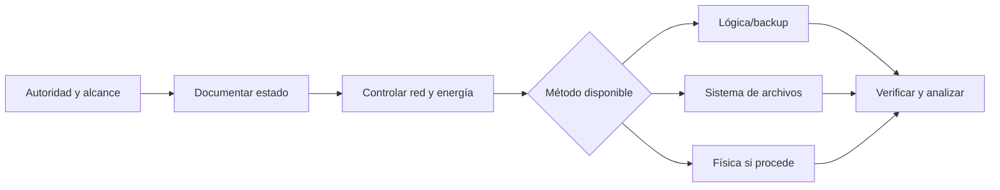

# Clase 211 — Forense móvil

> Parte: **9 — Forense digital y respuesta a incidentes** · Fuente: *NIST SP 800-101 Rev. 1 — Guidelines on Mobile Device Forensics*
> ⏱️ Duración estimada: **120 min** · Nivel: **Avanzado**

---

## 🎯 Objetivo

Comprender los retos particulares de la forense en dispositivos móviles (Android e iOS): niveles de extracción, cifrado, bloqueo, y los artefactos donde vive la evidencia (bases SQLite de apps, mensajes, ubicación, registros de llamadas). Al terminar sabrás planificar una adquisición móvil y analizar sus artefactos.

## 📚 Resultados de aprendizaje

Al finalizar, el alumno podrá:

1. **Explicar** los niveles de extracción móvil (manual, lógica, sistema de archivos, física).
2. **Describir** el impacto del cifrado y el bloqueo en la adquisición.
3. **Localizar** artefactos clave en Android e iOS.
4. **Analizar** bases SQLite de apps de mensajería y ubicación.
5. **Usar** ADB y herramientas forenses móviles de forma metódica.

## 🗺️ Temas

| # | Tema | Por qué importa |
|---|------|-----------------|
| 1 | Retos del móvil | Cifrado, bloqueo, diversidad |
| 2 | Niveles de extracción | Qué se puede obtener |
| 3 | Android: estructura y `/data` | Dónde viven las apps |
| 4 | iOS: backups y keychain | Modelo cerrado de Apple |
| 5 | Bases SQLite de apps | Mensajes, contactos, llamadas |
| 6 | Ubicación y actividad | Reconstruir movimientos |
| 7 | ADB y modo de arranque | Acceso técnico a Android |
| 8 | Aspectos legales y consentimiento | Límites de la extracción |

## 🧠 Explicación en profundidad

La adquisición móvil depende de dispositivo, versión, estado de bloqueo, cifrado, respaldo y autoridad. «Lógica», «sistema de archivos» y «física» describen alcances diferentes; una extracción más grande no garantiza interpretación correcta. Mantener el teléfono aislado puede preservar datos y también agotar batería o alterar conectividad.



Se fotografía estado, conexiones, SIM, hora y pantalla antes de actuar. Modo avión, bolsa Faraday y apagado tienen fallos y efectos que deben probarse. Apps mantienen bases, caches y datos cloud con semántica propia. Herramientas comerciales no eliminan validación: se corroboran resultados y se documenta versión y método.

### El estado del dispositivo condiciona la estrategia

Un teléfono encendido, desbloqueado y en estado AFU puede exponer datos que dejarán de estar disponibles después de apagarlo. Al mismo tiempo, mantenerlo encendido permite procesos de fondo, borrado remoto, sincronización y consumo de batería. No existe una acción universal: se evalúan autoridad, riesgo de conectividad, disponibilidad de energía, tipo de bloqueo y capacidades del laboratorio. La decisión y sus consecuencias esperadas se registran antes de ejecutarla.

Aislar no equivale simplemente a introducir el equipo en una bolsa. Una bolsa Faraday puede degradar la señal y aumentar el consumo; modo avión puede requerir interacción y no siempre deshabilita todas las interfaces; apagar protege frente a red pero cambia el estado criptográfico. Cada control se verifica, por ejemplo comprobando Wi-Fi, Bluetooth y señal celular, sin asumir que la interfaz confirmó el resultado real.

### Los niveles de extracción describen acceso, no calidad automática

Una extracción lógica obtiene datos expuestos por servicios, API o backup. Una extracción de filesystem puede conservar jerarquía, bases, preferencias y archivos auxiliares. Una adquisición física intenta acceder a bloques o memoria de almacenamiento, pero el cifrado moderno puede dejar contenido inutilizable. La terminología cambia entre fabricantes y herramientas; por eso el informe enumera exactamente qué particiones, rutas y clases de datos se obtuvieron.

Más bytes no significan más evidencia interpretable. Un backup cifrado autorizado puede contener artefactos con estructura y contexto que una imagen física sin claves no revela. La validación incluye hash del paquete adquirido, registros de herramienta, versión, errores, conteos y comparación con una segunda vista o parser cuando el hallazgo es crítico.

### De SQLite a una afirmación sobre actividad

Apps de mensajería, navegación y salud usan SQLite, archivos binarios, caches y servicios cloud. Una fila puede representar creación local, sincronización, recepción o estado del servidor. Los archivos `-wal` y `-shm` pueden contener transacciones recientes, por lo que deben conservarse junto con la base. También se interpretan unidades temporales, zonas, identificadores de cuenta y relaciones entre tablas.

Ubicación requiere especial cautela: un punto puede venir de GPS, red, una foto, una búsqueda o un lugar sincronizado. Antes de afirmar que el dispositivo estuvo allí se identifica el origen, precisión, tiempo, cuenta y si el dato registra observación, preferencia o destino solicitado.

## 📔 Glosario

- **Extracción lógica:** datos accesibles por interfaces de alto nivel.
- **Filesystem extraction:** colección amplia del sistema de archivos.
- **Extracción física:** acceso a almacenamiento de bajo nivel.
- **AFU/BFU:** estado después o antes del primer desbloqueo.
- **Faraday:** aislamiento de radiofrecuencia.
- **SIM/eSIM:** identidad de suscripción móvil.
- **Backup:** copia estructurada creada por el ecosistema.

## 📖 Definiciones y características

- **Extracción lógica**: copia de archivos accesibles vía API/backup. Característica: rápida pero limitada a lo que el SO expone.
- **Extracción de sistema de archivos**: acceso más profundo a la partición de datos. Característica: requiere privilegios (root/jailbreak) o exploits.
- **Extracción física**: acceso a bloques o contenido de almacenamiento mediante un método compatible. Característica: puede ofrecer más cobertura, pero el cifrado, hardware y estado del equipo limitan su utilidad.
- **FBE (File-Based Encryption)**: cifrado por archivo en Android moderno. Característica: complica la extracción física sin credenciales.
- **iOS backup**: respaldo generado mediante mecanismos de Apple, cifrado o no según configuración. Característica: ofrece un subconjunto estructurado cuyo contenido depende de versión, estado y método.
- **Keychain**: almacén cifrado de credenciales en iOS. Característica: protegido por hardware (Secure Enclave).
- **BFU vs. AFU**: *Before First Unlock* frente a *After First Unlock*. Característica: describe disponibilidad criptográfica; AFU suele exponer más clases de datos, pero el resultado depende del dispositivo y método.

## 🔍 Caso razonado — teléfono bloqueado con sincronización activa

Se recibe un teléfono encendido y bloqueado; las notificaciones muestran actividad reciente y la cuenta asociada sincroniza con la nube. Apagarlo reduciría el riesgo remoto, pero podría llevarlo de AFU a BFU. El equipo documenta pantalla, hora, batería, interfaces y autoridad; conecta energía controlada, aplica aislamiento verificado y conserva la justificación. Paralelamente, solicita preservación de los datos cloud dentro del alcance autorizado.

Una extracción lógica recupera mensajes y una base de ubicaciones. El analista no presenta cada coordenada como presencia física: revisa la tabla, precisión, aplicación originadora y relación con fotos y red. Dos parsers discrepan en un timestamp; se vuelve al valor crudo y se descubre que uno trató milisegundos como segundos. El hallazgo final documenta qué corrigió, sin ocultar la discrepancia.

## ✅ Criterio de dominio

Dominas la clase cuando propones una estrategia distinta para BFU y AFU, justificas aislamiento y energía, defines con precisión el alcance del método de extracción, conservas bases con WAL/SHM, validas tiempos y puedes distinguir dato local, sincronizado y cloud antes de atribuir una acción o ubicación.

## 🧰 Herramientas y preparación

- **Android**: `adb` (Android Debug Bridge), `DB Browser for SQLite`, ALEAPP.
- **iOS**: análisis de backups con `iLEAPP`, `libimobiledevice`.
- **Comerciales (referencia)**: Cellebrite UFED, Magnet AXIOM, Oxygen Forensic (no libres; se mencionan por su rol en la industria).
- **Entorno**: usa un dispositivo o emulador PROPIO. La extracción de un móvil ajeno requiere consentimiento u orden judicial; respétalo siempre.

## 🧪 Laboratorio guiado

> Usa un dispositivo Android propio (o un emulador) con datos de prueba que tú generas.

1. Habilita depuración USB en el dispositivo propio y conecta ADB:

   ```bash
   adb devices
   ```

2. Realiza una extracción lógica por backup:

   ```bash
   adb backup -all -f backup.ab
   ```

3. Convierte el backup a un tar analizable (con `abe.jar` o `android-backup-extractor`).
4. Extrae info del dispositivo:

   ```bash
   adb shell getprop ro.product.model
   adb shell dumpsys package com.whatsapp | head
   ```

5. Analiza una base SQLite de una app de mensajería PROPIA (por ejemplo, tus propios mensajes de prueba):

   ```sql
   SELECT datetime(timestamp/1000,'unixepoch'), sender, body FROM messages ORDER BY timestamp;
   ```

6. Procesa la extracción con ALEAPP para un informe automatizado (ubicación, apps, notificaciones, uso).
7. Revisa artefactos de ubicación y actividad de apps que ALEAPP consolida.
8. Documenta el método de extracción, el nivel logrado y por qué (bloqueo, cifrado).

## ✍️ Ejercicios

1. Explica las diferencias entre extracción lógica, de FS y física.
2. Describe por qué BFU limita más la extracción que AFU.
3. Realiza un backup ADB de un dispositivo propio y lístalo.
4. Analiza una base SQLite de mensajes propia con SQL.
5. Genera un informe con ALEAPP o iLEAPP.
6. Redacta los requisitos legales para extraer un móvil ajeno.

## 📝 Reto verificable

En un dispositivo Android propio, genera actividad de prueba (mensajes, ubicaciones simuladas), extrae los datos y reconstruye una línea de tiempo de esa actividad a partir de las bases SQLite y el informe de ALEAPP.

**Criterio de aceptación**: entregas una timeline con al menos cinco eventos (mensajes, aperturas de app, ubicaciones) fechados, cada uno con la base de datos o artefacto de origen, y describes el nivel de extracción que lograste.

## ⚠️ Errores comunes

| Síntoma / mensaje | Causa y cómo arreglar |
|-------------------|-----------------------|
| `adb devices` no lista el equipo | Depuración USB desactivada o falta autorizar la clave RSA. Acepta el diálogo en el móvil. |
| `adb backup` vacío | Apps modernas bloquean backup (`allowBackup=false`). Necesitas otro método. |
| Datos cifrados ilegibles | Dispositivo en BFU o FBE. Requiere credenciales o herramientas especializadas. |
| Timestamps en milisegundos | Divídelos entre 1000 antes de convertir a época Unix. |
| Alteraste el dispositivo | Encenderlo/usarlo cambia datos. Documenta y usa modo avión/aislamiento (Faraday). |

## ❓ Preguntas frecuentes

**❓ ¿Por qué es tan difícil la forense de iOS?**
Por su cifrado por hardware (Secure Enclave) y modelo cerrado. Los backups son la vía forense más común.

**❓ ¿Qué es BFU vs AFU?**
Before/After First Unlock. En AFU las claves de descifrado están en memoria, permitiendo más extracción; en BFU casi todo está cifrado.

**❓ ¿Necesito root para extraer Android?**
Para extracción profunda (FS/física) normalmente sí, o exploits. La lógica vía backup no lo requiere pero es limitada.

**❓ ¿Puedo extraer un móvil ajeno?**
Solo con consentimiento del titular u orden judicial. Hacerlo sin autorización es ilegal.

## 🔗 Referencias verificables y alcance

- **NIST SP 800-101 Rev. 1:** <https://doi.org/10.6028/NIST.SP.800-101r1> — guía metodológica para forense móvil; es de 2014, por lo que los detalles de plataformas deben contrastarse con documentación actual.
- **Android Debug Bridge:** <https://developer.android.com/tools/adb> — documentación oficial de ADB; la disponibilidad de comandos y datos depende de autorización, versión y configuración.
- **Apple Platform Security:** <https://support.apple.com/guide/security/welcome/web> — referencia oficial del modelo de protección y cifrado; no describe procedimientos forenses específicos.
- **ALEAPP / iLEAPP:** <https://github.com/abrignoni> — parsers comunitarios para artefactos Android/iOS; sus resultados se validan contra datos crudos y versión.
- **libimobiledevice:** <https://libimobiledevice.org/> — proyecto abierto para comunicarse con dispositivos iOS; no evita restricciones criptográficas o legales.

## 📥 Material descargable

- 📄 [Guía en PDF](./clase-211-guia.pdf) — versión imprimible de esta clase.
- 🎞️ [Presentación (PPTX)](./clase-211-presentacion.pptx) — deck para proyectar en clase.

## ⬅️ Clase anterior

[Clase 210 — Forense de navegadores y correo](../210-forense-de-navegadores-y-correo/README.md)

## ➡️ Siguiente clase

[Clase 212 — Forense en la nube](../212-forense-en-la-nube/README.md)
