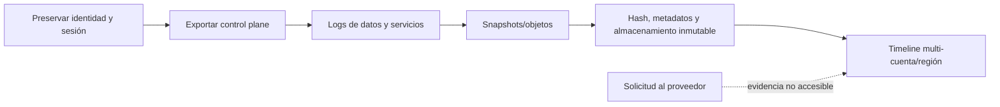

# Clase 212 — Forense en la nube

> Parte: **9 — Forense digital y respuesta a incidentes** · Fuente: *NIST IR 8006 — Cloud Computing Forensic Science Challenges* y documentación de AWS/Azure/GCP
> ⏱️ Duración estimada: **120 min** · Nivel: **Avanzado**

---

## 🎯 Objetivo

Entender cómo cambia la forense cuando la evidencia vive en la nube: modelo de responsabilidad compartida, logs de plataforma (CloudTrail, Azure Activity Log, GCP Audit), snapshots de discos, y adquisición de instancias efímeras. Al terminar sabrás qué evidencia pedir, cómo preservarla y cómo investigar un compromiso de identidad en la nube.

## 📚 Resultados de aprendizaje

Al finalizar, el alumno podrá:

1. **Explicar** cómo el modelo de responsabilidad compartida afecta la evidencia.
2. **Identificar** las fuentes de logs forenses en AWS, Azure y GCP.
3. **Adquirir** evidencia mediante snapshots y exportación de logs.
4. **Investigar** un compromiso de credenciales/identidad en la nube.
5. **Preservar** evidencia efímera antes de que desaparezca.

## 🗺️ Temas

| # | Tema | Por qué importa |
|---|------|-----------------|
| 1 | Responsabilidad compartida | Define a qué evidencia accedes |
| 2 | CloudTrail y logs de control | Historial de acciones de API |
| 3 | Azure Activity/Sign-in Logs | Equivalente en Azure |
| 4 | GCP Audit Logs | Equivalente en GCP |
| 5 | Snapshots de disco | Adquisición de volúmenes |
| 6 | Instancias efímeras y contenedores | Evidencia que se evapora |
| 7 | Compromiso de identidad (IAM) | Relacionar principal, sesión, permisos y acciones |
| 8 | Preservación y aislamiento | Reducir cambios y conservar fuentes accesibles |

## 🧠 Explicación en profundidad

En nube, gran parte de la evidencia no es un disco bajo control del investigador: son registros de control plane, snapshots, objetos versionados e información entregada por el proveedor. Responsabilidad compartida determina qué puede adquirir el cliente y qué debe solicitar formalmente.



Primero se protege el acceso investigativo y se evita destruir recursos al revocar credenciales. Logs pueden estar deshabilitados, tener demora o vivir en otra cuenta/región. Snapshot no equivale a imagen física y una API puede cambiar metadatos. Se conserva respuesta original, request ID, cuenta, región, comando, hora y mecanismo de exportación. La retención se prepara antes del incidente.

### Separar identidad, plano de control y plano de datos

El plano de control registra cambios administrativos: crear una instancia, modificar una política o deshabilitar un registro. El plano de datos registra operaciones sobre contenido, como leer un objeto, y con frecuencia requiere habilitación o configuración adicional. Los logs de identidad agregan inicios de sesión, emisión de tokens, MFA y riesgo. Investigar solo uno de estos planos puede ocultar la secuencia entre acceso, escalado y uso de datos.

Los nombres cambian por proveedor y servicio. CloudTrail, Azure Activity Log y Cloud Audit Logs no son equivalentes fila por fila ni garantizan la misma cobertura. Para cada fuente se documentan eventos incluidos, cuenta o tenant, región, retención, latencia, identidad representada y campos que pueden ser proporcionados por el cliente.

### Preservar antes de cambiar el entorno

Revocar una credencial comprometida limita daño, pero puede invalidar la sesión que el equipo necesita para exportar evidencia. La preparación crea roles de emergencia de solo lectura, destino de logging separado y retención protegida. Durante el incidente se registra cada consulta y respuesta, incluidos request ID y paginación; una captura de consola no sustituye la exportación original.

Un snapshot captura el estado que el servicio expone para un volumen en un momento, no RAM, hipervisor ni necesariamente consistencia de aplicación. Para cargas críticas se coordina congelación o mecanismos nativos cuando sea viable. Contenedores y funciones efímeras exigen preservar logs, configuración, imagen, digest, variables y plano de orquestación antes de que el ciclo de vida los elimine.

### Reconstruir una sesión IAM

Una clave, rol o token no equivale automáticamente a una persona. Se siguen principal, rol asumido, sesión, cadena de federación, IP, agente, región y permisos efectivos. Después se consulta qué recursos tocó y qué cambios alteraron la visibilidad. Un evento ausente puede significar fuente deshabilitada, región equivocada, latencia o una operación no cubierta; no se convierte inmediatamente en prueba de borrado.

La integridad también debe demostrarse. En AWS, la validación de archivos de CloudTrail usa digest y firmas cuando fue habilitada; en otros casos se conservan hashes, exportación, controles del almacenamiento y trazabilidad operativa sin afirmar capacidades que el proveedor no ofrece.

## 📔 Glosario

- **Control plane:** API que administra recursos.
- **Data plane:** operaciones sobre el servicio o sus datos.
- **Snapshot:** estado capturado por el proveedor.
- **Object versioning:** conservación de versiones de objetos.
- **Request ID:** identificador de una operación API.
- **Legal hold:** preservación frente a borrado según autoridad.
- **Cross-account logging:** envío a una cuenta separada.

## 📖 Definiciones y características

- **Responsabilidad compartida**: el proveedor asegura la infraestructura; el cliente, sus datos y configuración. Característica: no tienes acceso al hipervisor ni al hardware.
- **CloudTrail (AWS)**: servicio que registra actividades cubiertas de usuario, rol y servicios. Característica: su cobertura depende del tipo de evento, región, trail y configuración.
- **Azure Activity Log / Sign-in Log**: acciones sobre recursos e inicios de sesión de identidad. Característica: separan plano de control y autenticación.
- **GCP Audit Logs**: Admin Activity, Data Access, System Event. Característica: Data Access puede estar desactivado por costo.
- **Snapshot**: representación puntual administrada por el proveedor de un volumen. Característica: preserva estado accesible del disco, pero no equivale a una imagen física ni garantiza consistencia de aplicación.
- **Evidencia efímera**: datos ligados al ciclo de vida de instancias, contenedores, memoria o almacenamiento temporal. Característica: puede desaparecer al reemplazar o terminar el recurso.

## 🔍 Caso razonado — rol asumido en dos regiones

Una alerta muestra creación de claves en una región poco usada. El evento identifica un rol asumido, no la credencial humana original. El analista sigue el ARN de sesión hasta el proveedor de identidad, conserva logs de autenticación y luego busca el mismo `accessKeyId`, principal y ventana en todas las regiones. Descubre enumeración de secretos, modificación de una política y acceso a un bucket cuyos eventos de datos sí estaban habilitados.

Antes de revocar, exporta los eventos con un rol de investigación separado y registra comandos, páginas, request ID y hashes. Después revoca la sesión, preserva la política anterior y crea snapshots de volúmenes afectados. El informe no llama al snapshot «imagen física» y deja explícito que un servicio sin data events habilitados mantiene un vacío de visibilidad.

## ✅ Criterio de dominio

Dominas la clase cuando diferencias control, datos e identidad; enumeras cobertura y retención por proveedor; preservas respuestas API reproducibles; explicas los límites de snapshots; y reconstruyes una cadena de sesión IAM a través de cuentas y regiones sin atribuir el principal técnico directamente a una persona.
- **Rol/clave IAM comprometida**: credencial robada usada por el atacante. Característica: se investiga por patrones anómalos en los logs de API.

## 🧰 Herramientas y preparación

- **AWS**: consola de CloudTrail, `aws cloudtrail lookup-events`, snapshots EBS, herramientas como `Prowler` para revisar configuración.
- **Azure**: Activity Log, Microsoft Sentinel, KQL.
- **GCP**: Cloud Logging, `gcloud logging read`.
- **Entorno**: usa una cuenta/proyecto PROPIO (nivel gratuito). Nunca investigues cuentas ajenas sin autorización.

## 🧪 Laboratorio guiado

> Usa tu propia cuenta de nube en nivel gratuito. Simula el "incidente" tú mismo.

1. Genera actividad de prueba y consúltala en CloudTrail (AWS):

   ```bash
   aws cloudtrail lookup-events --lookup-attributes AttributeKey=EventName,AttributeValue=RunInstances
   ```

2. Busca acciones sospechosas por identidad:

   ```bash
   aws cloudtrail lookup-events --lookup-attributes AttributeKey=Username,AttributeValue=usuario-prueba
   ```

3. Adquiere evidencia de un volumen creando un snapshot:

   ```bash
   aws ec2 create-snapshot --volume-id vol-0123456789 --description "Evidencia CASO-2026-01"
   ```

4. Aísla la instancia comprometida cambiando su security group a uno sin tráfico (sin apagarla, para no perder RAM).
5. En Azure, consulta inicios de sesión sospechosos en el Sign-in Log con KQL:

   ```kql
   SigninLogs | where ResultType != 0 | project TimeGenerated, UserPrincipalName, IPAddress, ResultDescription
   ```

6. En GCP, exporta logs de auditoría:

   ```bash
   gcloud logging read 'logName:"cloudaudit.googleapis.com"' --limit 50 --format json
   ```

7. Reconstruye el compromiso: identifica la credencial usada, la IP de origen, las acciones realizadas y los recursos afectados.
8. Preserva: exporta los logs relevantes a un bucket con *object lock* / retención para que no se alteren.

## ✍️ Ejercicios

1. Explica qué evidencia NO puedes obtener por la responsabilidad compartida.
2. Consulta en CloudTrail las últimas 24 h de acciones de una identidad.
3. Crea un snapshot de un volumen propio como evidencia.
4. Detecta un login desde IP inusual en Azure Sign-in Logs.
5. Exporta logs de auditoría de GCP a formato analizable.
6. Diseña un procedimiento para aislar una instancia sin perder RAM.

## 📝 Reto verificable

En tu cuenta de nube, simula un compromiso de credenciales (una clave IAM que "un atacante" usa desde otra sesión) y reconstruye, solo desde los logs de la plataforma, qué hizo, cuándo y desde dónde, preservando la evidencia de forma inmutable.

**Criterio de aceptación**: entregas un informe con la credencial comprometida, la línea de tiempo de sus acciones (con marcas UTC), la IP de origen, los recursos afectados y la prueba de que los logs de evidencia quedaron con retención/inmutabilidad.

## ⚠️ Errores comunes

| Síntoma / mensaje | Causa y cómo arreglar |
|-------------------|-----------------------|
| CloudTrail no tiene el evento | Trail no configurado para esa región/servicio. Habilita un trail multi-región. |
| Data Access logs vacíos en GCP | Desactivados por costo. Actívalos antes del incidente. |
| Snapshot no monta | Falta adjuntarlo a una instancia forense. Crea un volumen desde el snapshot. |
| Apagaste la instancia y perdiste RAM | Aísla por red, no por apagado, si quieres la memoria. |
| Logs alterables | Sin retención/inmutabilidad. Usa object lock o cuenta de logging separada. |

## ❓ Preguntas frecuentes

**❓ ¿Qué evidencia no tengo en la nube?**
El hipervisor, el hardware y la red física del proveedor. Trabajas con lo que las APIs y logs exponen.

**❓ ¿Cómo capturo una instancia efímera?**
Antes de que se destruya: snapshot del disco y, si puedes, volcado de memoria vía agente. Automatiza la captura ante alerta.

**❓ ¿CloudTrail lo registra todo?**
Registra llamadas a la API (plano de control). Data events (S3, Lambda) y logs de aplicación requieren configuración adicional.

**❓ ¿Cómo preservo logs para que no se borren?**
Exporta a almacenamiento con retención/immutabilidad (object lock) o a una cuenta/proyecto de logging aislado.

## 🔗 Referencias verificables y alcance

- **NISTIR 8006:** <https://doi.org/10.6028/NIST.IR.8006> — taxonomía de desafíos forenses en nube; no prescribe procedimientos específicos de cada proveedor.
- **AWS CloudTrail log file integrity validation:** <https://docs.aws.amazon.com/en_en/awscloudtrail/latest/userguide/cloudtrail-log-file-validation-intro.html> — documentación oficial de digest, firma y validación; requiere configuración previa.
- **Azure Activity Log:** <https://learn.microsoft.com/en-us/azure/azure-monitor/platform/activity-log> — referencia oficial del plano de control; se complementa con logs de identidad, datos y recursos.
- **Google Cloud Audit Logs:** <https://docs.cloud.google.com/logging/docs/audit/understanding-audit-logs> — documentación oficial de Admin Activity, Data Access, System Event y Policy Denied, con diferencias de disponibilidad.
- **NIST SP 800-86:** <https://doi.org/10.6028/NIST.SP.800-86> — principios de recolección, examen, análisis y reporte aplicables, con adaptación al modelo cloud.

## 📥 Material descargable

- 📄 [Guía en PDF](./clase-212-guia.pdf) — versión imprimible de esta clase.
- 🎞️ [Presentación (PPTX)](./clase-212-presentacion.pptx) — deck para proyectar en clase.

## ⬅️ Clase anterior

[Clase 211 — Forense móvil](../211-forense-movil/README.md)

## ➡️ Siguiente clase

[Clase 213 — Anti-forense y sus contramedidas](../213-anti-forense-y-sus-contramedidas/README.md)
