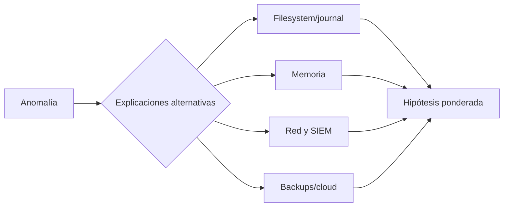

# Clase 213 — Anti-forense y sus contramedidas

> Parte: **9 — Forense digital y respuesta a incidentes** · Fuente: *The Art of Memory Forensics* y literatura de anti-forensics
> ⏱️ Duración estimada: **110 min** · Nivel: **Avanzado**

---

## 🎯 Objetivo

Conocer las técnicas que los atacantes usan para borrar sus huellas y engañar al analista —borrado seguro, timestomping, cifrado, ocultamiento, log tampering, esteganografía— y, sobre todo, aprender a **detectarlas y contrarrestarlas**. Al terminar sabrás reconocer cuándo alguien intentó destruir o falsear evidencia.

> ⚠️ **Nota ética**: estas técnicas se estudian para defender y detectar. Practícalas solo en tus propios sistemas de laboratorio. Usar anti-forense para obstruir una investigación real es ilegal.

## 📚 Resultados de aprendizaje

Al finalizar, el alumno podrá:

1. **Clasificar** las principales familias de técnicas anti-forense.
2. **Detectar** timestomping y manipulación de metadatos.
3. **Identificar** borrado y limpieza de logs.
4. **Reconocer** ocultamiento de datos y esteganografía.
5. **Aplicar** contramedidas y fuentes redundantes de evidencia.

## 🗺️ Temas

| # | Tema | Por qué importa |
|---|------|-----------------|
| 1 | Familias de anti-forense | Mapa del terreno |
| 2 | Borrado seguro (wiping) | Destrucción de datos |
| 3 | Timestomping | Falsear la cronología |
| 4 | Limpieza de logs | Borrar el rastro |
| 5 | Cifrado y ocultamiento | Negar acceso al contenido |
| 6 | Esteganografía | Datos escondidos en otros datos |
| 7 | Living-off-the-land | No dejar binarios propios |
| 8 | Detección y redundancia | Cómo se contraatacan |

## 🧠 Explicación en profundidad

Anti-forense agrupa acciones para destruir, ocultar, alterar o volver ambigua la evidencia. Detectarla no autoriza asumir culpabilidad: limpieza rutinaria, privacidad, rotación y errores producen síntomas similares. La respuesta es corroborar fuentes independientes y declarar incertidumbre.



Timestomping puede generar discordancia entre MACB, journal y eventos; borrado seguro reduce carving; cifrado impide contenido pero deja contexto; log clearing puede producir eventos o huecos. Sensores remotos e inmutables limitan la capacidad de un host comprometido para borrar historia. Las contramedidas se diseñan antes: sincronización, forwarding, acceso mínimo, versionado y alertas de interrupción.

### Destruir, alterar, ocultar y confundir no son lo mismo

El borrado y la sobrescritura intentan reducir contenido recuperable; el *timestomping* altera metadatos; el cifrado y ADS ocultan acceso o visibilidad; *living off the land* usa herramientas presentes para reducir artefactos nuevos. Clasificar la técnica ayuda a elegir una fuente que no comparta el mismo punto de fallo. Si se borró un log local, se buscan copias en colector; si se alteró un tiempo del archivo, se consulta journal, EDR y red.

El término anti-forense describe una intención o efecto posible, no una conclusión automática. Rotación legítima, restauraciones, sincronización, herramientas administrativas y fallos de disco pueden producir huecos o tiempos discordantes. La investigación plantea al menos una explicación maliciosa y una legítima, y compara predicciones observables de ambas.

### La contradicción es un dato, no una sentencia

En NTFS, `$STANDARD_INFORMATION`, `$FILE_NAME`, USN Journal y eventos poseen mecanismos diferentes, pero ninguno es incorruptible ni está siempre disponible. Un tiempo discordante orienta hacia copia, restauración, preservación de atributos o manipulación. En logs, un evento de limpieza o cambio brusco de secuencia apoya que el registro cambió, pero para atribuir quién y por qué se requiere identidad, proceso y fuente remota.

En SSD, TRIM y recolección de basura dependen del dispositivo, sistema y tiempo; no se afirma recuperación imposible sin probar. Un carver que no encuentra contenido solo demuestra el resultado del método sobre esa adquisición.

### Diseñar evidencia que sobreviva al host

La contramedida más sólida es arquitectónica: sincronización temporal, forwarding autenticado, almacenamiento con controles de retención, registros cloud separados, telemetría de identidad y alertas cuando una fuente deja de reportar. Versionado y backups aportan otras vistas, siempre que su acceso no dependa de la misma credencial comprometida.

LOLBins complican la detección basada en hashes, pero dejan argumentos, relaciones padre-hijo, acceso a red, módulos y cambios de estado cuando la telemetría existe. Se investiga comportamiento y contexto, no se declara malicioso un binario firmado por su mera presencia.

## 📔 Glosario

- **Anti-forense:** interferencia con adquisición o interpretación.
- **Timestomping:** alteración de timestamps.
- **Log tampering:** modificación o eliminación de registros.
- **Secure deletion:** sobrescritura o descarte criptográfico.
- **Data hiding:** ocultación en ubicaciones no evidentes.
- **Fuente independiente:** evidencia fuera del control comprometido.
- **Inmutabilidad:** protección contra modificación durante retención.

## 📖 Definiciones y características

- **Wiping**: sobrescritura u otra operación destinada a reducir recuperación. Característica: el resultado depende del medio, método, cobertura y verificación.
- **Timestomping**: alterar timestamps para dificultar la cronología. Característica: puede crear incoherencias entre metadatos y fuentes externas, pero estas requieren explicación contextual.
- **Log tampering**: borrar, truncar o alterar registros. Característica: puede dejar eventos, cambios de secuencia o divergencias con colectores, según plataforma y configuración.
- **Esteganografía**: ocultar información dentro de otro portador. Característica: algunos métodos alteran estructura o estadísticas, pero no existe un indicador universal.
- **Cifrado/ADS**: cifrar datos o esconderlos en *Alternate Data Streams* de NTFS. Característica: los ADS son invisibles en un `dir` normal.
- **LOLBins**: binarios legítimos del SO usados con fines maliciosos. Característica: no dejan un ejecutable ajeno que analizar.
- **Redundancia de evidencia**: cruzar fuentes con mecanismos y dominios de control distintos. Característica: aumenta capacidad de corroboración y hace visibles contradicciones.

## 🔍 Caso razonado — registro limpiado y ejecutable con tiempos antiguos

Un servidor muestra el evento de limpieza del registro y un ejecutable recién descubierto conserva fechas anteriores a su instalación. La hipótesis maliciosa es limpieza y *timestomping*; la alternativa incluye mantenimiento autorizado y copia de un archivo preservando atributos. El analista consulta el colector remoto, USN Journal, creación del servicio, descarga en proxy y autenticaciones. El colector conserva eventos ausentes localmente y relaciona la operación con una cuenta de servicio usada desde un host no habitual.

La conclusión no depende del «archivo viejo». Se apoya en la convergencia de descarga, creación de persistencia, uso anómalo de identidad y divergencia local/remota. Las fechas se describen como inconsistentes con la secuencia, y el método concreto de alteración queda como inferencia si no hay evidencia suficiente.

## ✅ Criterio de dominio

Dominas la clase cuando clasificas una técnica por el efecto sobre evidencia, propones explicaciones alternativas, eliges fuentes fuera del dominio comprometido, distingues ausencia de resultado de destrucción demostrada y diseñas controles de retención y alerta que permitan investigar la manipulación.

## 🧰 Herramientas y preparación

- **Detección**: MFTECmd (`$SI` vs `$FN`), `EvtxECmd` (gaps de secuencia), `streams`/`dir /r` (ADS), `stegdetect`/`zsteg` (esteganografía), `binwalk`.
- **Análisis de wiping**: inspección de patrones en espacio no asignado.
- **Entorno**: laboratorio propio. Genera tú las técnicas y luego detéctalas.

## 🧪 Laboratorio guiado

> Todo sobre tus propios sistemas de laboratorio.

1. **Timestomping y su detección**: cambia el mtime de un archivo propio y detéctalo comparando `$SI` vs `$FN` en la MFT:

   ```bash
   MFTECmd.exe -f "$MFT" --csv salida --csvf mft.csv
   ```

   Busca registros donde los tiempos de `$SI` sean anteriores a los de `$FN` (imposible en uso normal).
2. **Alternate Data Streams**: crea y detecta un ADS en NTFS:

   ```cmd
   echo secreto > archivo.txt:oculto.txt
   dir /r
   ```

3. **Limpieza de logs**: borra un log de eventos propio y detecta el hueco:

   ```cmd
   wevtutil cl Application
   ```

   El evento 1102 registra que se limpió el registro de auditoría cuando Windows logra generarlo y conservarlo; búscalo también en colectores remotos.
4. **Esteganografía**: esconde un texto en una imagen propia y detéctalo:

   ```bash
   zsteg imagen.png
   binwalk imagen.png
   ```

5. **Wiping**: sobrescribe un archivo y observa el espacio no asignado; discute por qué el patrón (o su ausencia) es una pista.
6. Documenta, para cada técnica, la **contramedida**: qué fuente redundante permitió detectarla.

## ✍️ Ejercicios

1. Detecta timestomping por incoherencia `$SI`/`$FN`.
2. Crea y encuentra un ADS en NTFS.
3. Identifica una limpieza de log por el evento 1102.
4. Detecta datos ocultos en una imagen con zsteg/binwalk.
5. Explica por qué el TRIM ayuda al atacante que quiere borrar.
6. Diseña una estrategia de redundancia de evidencia contra cada técnica.

## 📝 Reto verificable

En un sistema de laboratorio propio, aplica tres técnicas anti-forense distintas (por ejemplo timestomping, limpieza de un log y un ADS) y luego, actuando como analista, detéctalas todas usando fuentes de evidencia independientes.

**Criterio de aceptación**: por cada una de las tres técnicas, presentas (a) cómo la aplicaste, (b) la evidencia que la delató y (c) la fuente redundante que usaste para detectarla pese a la manipulación.

## ⚠️ Errores comunes

| Síntoma / mensaje | Causa y cómo arreglar |
|-------------------|-----------------------|
| Confías en un solo timestamp | Es manipulable. Cruza `$SI`, `$FN`, `$UsnJrnl` y logs. |
| No ves el ADS | `dir` normal no lo muestra. Usa `dir /r` o `streams`. |
| Log "limpio" sin sospecha | Un log vacío o con gaps ya es sospechoso. Revisa el evento 1102. |
| Una herramienta no detecta esteganografía | Ningún detector cubre todos los métodos. Revisa estructura, estadísticas y contexto; compara con el portador original si existe. |
| Asumes que el wiping borró todo | Copias en shadow copies, journal, backups o RAM pueden sobrevivir. |

## ❓ Preguntas frecuentes

**❓ ¿El anti-forense hace imposible la investigación?**
Puede reducir o eliminar evidencia accesible y, en otros casos, producir incoherencias o divergencias. El resultado depende del método, medio, retención y fuentes independientes disponibles.

**❓ ¿Cómo detecto timestomping?**
Comparando timestamps y eventos con mecanismos distintos. Las incoherencias justifican investigar manipulación, copia, restauración, deriva o errores antes de concluir.

**❓ ¿Qué es un LOLBin?**
Un binario legítimo del sistema (PowerShell, certutil, rundll32…) usado con fines maliciosos para no dejar malware propio.

**❓ ¿Puedo recuperar algo tras un wipe en SSD?**
Difícil por TRIM, pero busca en shadow copies, backups, journal, memoria y logs externos.

## 🔗 Referencias verificables y alcance

- **MITRE ATT&CK T1070 — Indicator Removal:** <https://attack.mitre.org/techniques/T1070/> — catálogo de comportamientos observados y mitigaciones; no prueba que una anomalía concreta sea adversaria.
- **MITRE ATT&CK T1070.004 — File Deletion:** <https://attack.mitre.org/techniques/T1070/004/> — ejemplos y detecciones para borrado de archivos.
- **MITRE ATT&CK T1070.006 — Timestomp:** <https://attack.mitre.org/techniques/T1070/006/> — comportamiento y fuentes de detección para modificación temporal.
- **LOLBAS:** <https://lolbas-project.github.io/> — catálogo comunitario de usos documentados de binarios legítimos; una coincidencia requiere contexto.
- **Eric Zimmerman’s Tools:** <https://ericzimmerman.github.io/> — documentación de herramientas para artefactos Windows; validar versión y resultados contra fuentes originales.
- **Ligh, Case, Levy y Walters — _The Art of Memory Forensics_, Wiley, 2014:** fundamento para análisis en memoria; los perfiles y comandos históricos no sustituyen documentación actual de Volatility 3.

## 📥 Material descargable

- 📄 [Guía en PDF](./clase-213-guia.pdf) — versión imprimible de esta clase.
- 🎞️ [Presentación (PPTX)](./clase-213-presentacion.pptx) — deck para proyectar en clase.

## ⬅️ Clase anterior

[Clase 212 — Forense en la nube](../212-forense-en-la-nube/README.md)

## ➡️ Siguiente clase

[Clase 214 — Recuperación de datos y file carving](../214-recuperacion-de-datos-y-file-carving/README.md)
