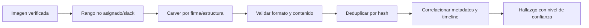

# Clase 214 — Recuperación de datos y file carving

> Parte: **9 — Forense digital y respuesta a incidentes** · Fuente: *Brian Carrier — File System Forensic Analysis*
> ⏱️ Duración estimada: **120 min** · Nivel: **Avanzado**

---

## 🎯 Objetivo

Aprender a recuperar archivos borrados incluso cuando el sistema de archivos ya no los referencia, mediante **file carving**: reconstruir archivos a partir de sus firmas (headers/footers) en el espacio no asignado. Al terminar sabrás usar PhotoRec, Scalpel, foremost y bulk_extractor para rescatar evidencia perdida.

## 📚 Resultados de aprendizaje

Al finalizar, el alumno podrá:

1. **Diferenciar** recuperación por metadatos y recuperación por carving.
2. **Aplicar** carving con PhotoRec, foremost y Scalpel.
3. **Reconocer** las firmas (magic numbers) de formatos comunes.
4. **Extraer** artefactos con bulk_extractor.
5. **Evaluar** las limitaciones del carving (fragmentación, falsos positivos).

## 🗺️ Temas

| # | Tema | Por qué importa |
|---|------|-----------------|
| 1 | Borrado vs. destrucción | Qué se puede recuperar |
| 2 | Recuperación por metadatos | La vía rápida cuando existe |
| 3 | File carving por firmas | Cuando no hay metadatos |
| 4 | Magic numbers | Cómo se reconocen los archivos |
| 5 | PhotoRec / foremost / Scalpel | Herramientas de carving |
| 6 | Fragmentación | El gran enemigo del carving |
| 7 | bulk_extractor | Extraer artefactos a granel |
| 8 | Validación de recuperados | Evitar falsos positivos |

## 🧠 Explicación en profundidad

File carving recupera contenido por firmas y estructura sin depender del directorio. Es útil en espacio no asignado o sistemas dañados, pero pierde con frecuencia nombre, ruta y tiempos. Un resultado es un conjunto de bytes candidato, no automáticamente «el archivo que usó el atacante».



Firmas de cabecera/pie pueden aparecer en datos aleatorios; fragmentación puede truncar o mezclar objetos. Se valida estructura interna y se compara con metadatos residuales, thumbnails, logs o hashes. El análisis ocurre sobre copia, registra offsets y parámetros, y evita contar duplicados como eventos separados. SSD/TRIM y cifrado pueden limitar la recuperación de forma irreversible.

### Recuperar por metadatos antes de tallar por firmas

Eliminar una entrada suele cambiar metadatos y marcar unidades como disponibles; no describe cuánto contenido permanece ni por cuánto tiempo. Si MFT, inodo o entrada de directorio conserva punteros válidos, la recuperación por metadatos puede mantener nombre, ruta y asignación con mayor fidelidad. Por eso se examina primero la estructura del filesystem y se usa carving cuando los metadatos faltan, están dañados o no cubren la pregunta.

Espacio no asignado, *slack*, copias de volumen, contenedores y memoria son ámbitos distintos. La herramienta debe registrar exactamente qué rango procesó. Recuperar los mismos bytes desde una shadow copy y desde espacio no asignado no significa dos acciones del usuario; el hash y la procedencia permiten deduplicar sin perder las dos ubicaciones.

### Una firma inicia una hipótesis de formato

Los *magic numbers* son patrones compatibles con un formato, no identificadores únicos. `PK` aparece en ZIP y en múltiples formatos basados en ZIP; `%PDF` puede existir dentro de texto o datos comprimidos. Un carver simple busca cabecera y pie, calcula un rango y escribe bytes. Si el archivo estaba fragmentado puede unir fragmentos ajenos, truncar contenido o exceder el objeto real.

La validación combina parser específico, estructura interna, tamaño coherente, apertura segura, hash y comparación con metadatos residuales. En imágenes se verifican marcadores y dimensiones; en PDF, tabla xref, objetos y páginas; en ZIP, directorio central y CRC. Que una aplicación «abra» el archivo no basta, porque muchas toleran corrupción.

### Conservar offset y construir contexto

Cada objeto recuperado lleva hash, offset inicial y final, fuente, herramienta, configuración y mensajes de error. `bulk_extractor` busca características como correos o URLs sin depender del filesystem; estas características pueden pertenecer a contenido válido, borrado o fragmentos duplicados. Sirven para pivotar, no para atribuir automáticamente una comunicación.

El valor probatorio aparece al correlacionar: un PDF recuperado comparte hash con un adjunto, su nombre sobrevive en la MFT y una miniatura confirma apertura aproximada. Si faltan esos vínculos, se informa que el contenido estaba presente en el rango analizado, sin inventar nombre, propietario o uso.

## 📔 Glosario

- **Carving:** recuperación basada en contenido.
- **File signature:** patrón que identifica un formato.
- **Offset:** posición de bytes dentro de la imagen.
- **Fragmentación:** bloques de un archivo no contiguos.
- **False carving:** candidato que imita firmas sin ser objeto válido.
- **TRIM:** indicación de bloques liberados a un SSD.
- **Deduplicación:** agrupación de contenido idéntico.

## 📖 Definiciones y características

- **Recuperación por metadatos**: usar estructuras residuales del filesystem para localizar contenido. Característica: puede conservar más contexto si punteros y unidades no fueron reutilizados.
- **File carving**: reconstruir archivos por sus firmas, ignorando el FS. Característica: funciona sin metadatos, pero sufre con la fragmentación.
- **Magic number / firma**: patrón de bytes compatible con uno o más formatos (`FFD8` JPEG, `%PDF` PDF, `PK` ZIP y derivados). Característica: inicia la detección, pero exige validación estructural.
- **Header/footer carving**: extraer entre una firma de inicio y una de fin. Característica: falla si el archivo está fragmentado.
- **Fragmentación**: archivo disperso en clusters no contiguos. Característica: el carving simple lo reconstruye mal.
- **bulk_extractor**: busca características como correos y URLs sin depender del filesystem. Característica: útil para triage; sus hallazgos necesitan contexto y deduplicación.

## 🔍 Caso razonado — dos JPEG y un PDF parcialmente sobrescrito

En una imagen, la recuperación por MFT rescata un JPEG con nombre y clusters; PhotoRec recupera el mismo contenido y otro JPEG desde espacio no asignado. Los hashes revelan que el primero es duplicado, mientras que el segundo posee estructura completa pero carece de ruta. Se conserva como hallazgo de contenido presente, sin atribuir quién lo creó.

Un candidato PDF comienza con `%PDF` pero su tabla xref apunta a sectores sobrescritos. El visor muestra una página, aunque el parser reporta objetos faltantes. El informe lo clasifica como recuperación parcial, anota offsets y evita compararlo mediante «hash original vs. recuperado» si no existe un original conocido. La validez se expresa por estructura observada y limitaciones, no por apariencia visual.

## ✅ Criterio de dominio

Dominas la clase cuando eliges recuperación por metadatos antes de carving cuando corresponde, delimitas el espacio procesado, registras offsets y parámetros, validas cada formato con estructura interna, deduplicas por hash y redactas conclusiones que distinguen presencia de bytes, archivo válido, identidad y uso.
- **Falso positivo**: dato "recuperado" que no es un archivo válido. Característica: hay que validar cada recuperado.

## 🧰 Herramientas y preparación

- **Carving**: `photorec`, `foremost`, `scalpel`.
- **Triage**: `bulk_extractor`.
- **Metadatos**: The Sleuth Kit (`icat`, `fls -d`), `extundelete` (ext4), `testdisk` (particiones).
- **Entrada**: una imagen `.dd` propia donde borraste archivos a propósito.

## 🧪 Laboratorio guiado

> Usa una imagen propia donde tú borraste archivos conocidos (para verificar la recuperación).

1. Primero intenta recuperación por metadatos con TSK:

   ```bash
   fls -d -r -o 2048 imagen.dd        # lista borrados
   icat -o 2048 imagen.dd 512 > recuperado_meta.bin
   ```

2. Si no hay metadatos, aplica carving con foremost:

   ```bash
   foremost -t jpg,pdf,doc,zip -i imagen.dd -o salida_foremost
   ```

3. Prueba PhotoRec (interactivo, muy potente para imágenes):

   ```bash
   photorec imagen.dd
   ```

4. Usa Scalpel con su archivo de configuración de firmas:

   ```bash
   scalpel -c /etc/scalpel/scalpel.conf -o salida_scalpel imagen.dd
   ```

5. Ejecuta bulk_extractor para triage rápido:

   ```bash
   bulk_extractor -o salida_bulk imagen.dd
   ```

   Revisa `email.txt`, `url.txt`, `ccn.txt`.
6. **Valida** cada archivo recuperado: ábrelo, verifica su firma y compara su hash con el original que borraste. Descarta falsos positivos.
7. Documenta qué recuperó cada herramienta y por qué unas funcionaron mejor (fragmentación, tipo de archivo).

## ✍️ Ejercicios

1. Explica cuándo prefieres metadatos y cuándo carving.
2. Identifica las firmas de JPEG, PDF y ZIP en un editor hex.
3. Recupera imágenes borradas propias con PhotoRec y valídalas.
4. Compara los resultados de foremost y Scalpel sobre la misma imagen.
5. Extrae correos y URLs con bulk_extractor.
6. Explica por qué la fragmentación arruina el carving simple.

## 📝 Reto verificable

Borra cinco archivos conocidos (de tipos distintos) de una imagen propia, recupéralos por carving y demuestra —comparando hashes— cuáles se recuperaron íntegros y cuáles no, explicando la causa.

**Criterio de aceptación**: entregas los archivos recuperados, una tabla con hash, offset, método y resultado de validación por cada uno; si existe un original de referencia, comparas hashes, y si no existe, no inventas esa equivalencia. Explicas corrupción o límites mediante evidencia de fragmentación, sobrescritura o estructura.

## ⚠️ Errores comunes

| Síntoma / mensaje | Causa y cómo arreglar |
|-------------------|-----------------------|
| Muchos archivos corruptos | Fragmentación; el carving por firmas no la maneja. Prueba PhotoRec con validación. |
| Falsos positivos abundantes | Firmas genéricas. Valida cada recuperado por su estructura. |
| No recupera nada | Espacio ya sobrescrito o SSD con TRIM. Busca en otras fuentes. |
| foremost trunca archivos | Tamaño máximo por defecto. Ajusta la config de tipos. |
| bulk_extractor tarda mucho | Imagen grande. Es normal; corre en background. |

## ❓ Preguntas frecuentes

**❓ ¿Metadatos o carving primero?**
Metadatos primero (más fiable y rápido). Carving cuando el FS ya no referencia el archivo.

**❓ ¿Por qué falla el carving con archivos grandes?**
Porque suelen estar fragmentados, y el carving por header/footer asume contigüidad.

**❓ ¿Qué recupera bulk_extractor?**
Artefactos como emails, URLs, números de tarjeta y dominios, sin necesidad de parsear el sistema de archivos. Ideal para triage.

**❓ ¿Cómo sé si un recuperado es válido?**
Ábrelo, verifica su firma/estructura y, si tienes el original, compara hashes. No confíes solo en la extensión.

## 🔗 Referencias verificables y alcance

- **The Sleuth Kit documentation:** <https://www.sleuthkit.org/sleuthkit/docs.php> — referencia del proyecto para análisis de filesystem y unidades no asignadas.
- **PhotoRec:** <https://www.cgsecurity.org/wiki/PhotoRec> — documentación del proyecto sobre recuperación basada en firmas y formatos compatibles.
- **foremost:** <https://foremost.sourceforge.net/> — documentación del carver; sus resultados requieren validación estructural.
- **bulk_extractor:** <https://github.com/simsong/bulk_extractor> — código y documentación del proyecto para extracción de características sin parsear el filesystem.
- **NIST CFTT:** <https://www.nist.gov/itl/ssd/software-quality-group/computer-forensics-tool-testing-program-cftt> — programa oficial de metodología y pruebas de herramientas forenses; consultar reportes aplicables a herramienta y versión.
- **Carrier, B. — _File System Forensic Analysis_, Addison-Wesley, 2005:** fundamento conceptual; contrastar detalles con el filesystem y versión actuales.

## 📥 Material descargable

- 📄 [Guía en PDF](./clase-214-guia.pdf) — versión imprimible de esta clase.
- 🎞️ [Presentación (PPTX)](./clase-214-presentacion.pptx) — deck para proyectar en clase.

## ⬅️ Clase anterior

[Clase 213 — Anti-forense y sus contramedidas](../213-anti-forense-y-sus-contramedidas/README.md)

## ➡️ Siguiente clase

[Clase 215 — Playbooks de respuesta a incidentes](../215-playbooks-de-respuesta-a-incidentes/README.md)
