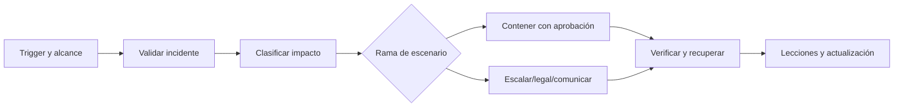

# Clase 215 — Playbooks de respuesta a incidentes

> Parte: **9 — Forense digital y respuesta a incidentes** · Fuente: *Roberts & Brown — Intelligence-Driven Incident Response* y NIST SP 800-61
> ⏱️ Duración estimada: **110 min** · Nivel: **Intermedio**

---

## 🎯 Objetivo

Aprender a diseñar **playbooks** de respuesta: procedimientos estructurados y repetibles que guían al equipo paso a paso ante tipos concretos de incidente (phishing, ransomware, cuenta comprometida, malware). Al terminar podrás escribir playbooks accionables e integrarlos con automatización (SOAR).

## 📚 Resultados de aprendizaje

Al finalizar, el alumno podrá:

1. **Estructurar** un playbook con fases, roles y puntos de decisión.
2. **Escribir** playbooks para incidentes comunes.
3. **Integrar** inteligencia de amenazas y ATT&CK en el playbook.
4. **Definir** criterios de escalado y de decisión.
5. **Automatizar** pasos repetibles con SOAR.

## 🗺️ Temas

| # | Tema | Por qué importa |
|---|------|-----------------|
| 1 | Qué es un playbook | Respuesta consistente |
| 2 | Anatomía: fases, roles, decisiones | Estructura reutilizable |
| 3 | Playbook de phishing | Coordinar correo, identidad, endpoint y comunicación |
| 4 | Playbook de ransomware | Decidir ante propagación, cifrado y continuidad |
| 5 | Playbook de cuenta comprometida | Revocar sesiones sin perder alcance ni evidencia |
| 6 | Integración con ATT&CK | Mapear al adversario |
| 7 | SOAR y automatización | Escalar la respuesta |
| 8 | Mantenimiento del playbook | No dejar que caduque |

## 🧠 Explicación en profundidad

Un playbook convierte política y conocimiento técnico en decisiones repetibles. No es una lista rígida: define disparadores, información mínima, ramas, responsables, aprobaciones, comunicaciones, evidencia y salida. Debe funcionar bajo presión y también explicar cuándo detenerse.

Runbook detalla una tarea; playbook coordina varias. Los contactos, credenciales de emergencia y dependencias se prueban, no se suponen. Cada acción de contención incluye efecto empresarial y reversión. Una versión debe señalar marco aplicable, propietario, fecha y pruebas tabletop. La automatización ejecuta pasos autorizados; no amplía autoridad.

### Un playbook es un contrato operativo

El documento une señal de entrada, severidad, responsables, fuentes mínimas, decisiones y criterios de salida. «Investigar el correo» no es un paso ejecutable; «preservar el `.eml`, calcular SHA-256 y consultar URL, adjunto, remitente y destinatarios» sí define productos verificables. Cada paso señala quién ejecuta, quién aprueba, dónde registra el resultado y qué dependencia puede detenerlo.

Las ramas se construyen con criterios observables, aunque no siempre binarios: cifrado activo, privilegio administrativo, datos regulados, propagación o impacto de continuidad. El playbook también define cómo proceder con información insuficiente. Una decisión de aislar puede requerir aprobación distinta si afecta una estación de usuario o un sistema clínico.

### El escenario cambia las preguntas, no el método de calidad

En phishing se preserva mensaje, se busca alcance entre destinatarios, se correlaciona navegación y se evalúa identidad. En ransomware se priorizan propagación, backups, claves, sistemas críticos y comunicación. En una cuenta cloud se revocan sesiones y secretos coordinadamente, se investigan roles asumidos y se evita destruir la sesión investigativa. Estos ejemplos no se ordenan por una supuesta frecuencia universal: la organización prioriza según su riesgo y datos propios.

ATT&CK ayuda a describir comportamientos y diseñar búsquedas, pero no reemplaza la lógica de respuesta. Un IOC puede caducar o compartirse con infraestructura legítima; un playbook incluye validación, expiración y reversión de bloqueos.

### Mantener, probar y automatizar con límites

Cada playbook tiene propietario, versión, cambios, dependencias y fecha de la última prueba. Un tabletop prueba autoridad y coordinación; una prueba técnica valida comandos y permisos. Los hallazgos generan cambios trazables y una reprueba. Revisarlo solo por calendario es insuficiente si cambió una API, proveedor, arquitectura o obligación.

SOAR puede enriquecer, abrir casos, consultar y bloquear, pero el grado de automatización depende del daño potencial y confianza. Acciones destructivas o de amplio impacto conservan aprobación y mecanismo de reversión. Las credenciales del SOAR se tratan como acceso privilegiado.

## 📔 Glosario

- **Playbook:** flujo de decisiones y tareas de un escenario.
- **Runbook:** procedimiento técnico específico.
- **Trigger:** condición que inicia el flujo.
- **Decision gate:** punto que exige criterio o aprobación.
- **Escalation path:** ruta formal hacia mayor autoridad.
- **Out-of-band:** canal separado de sistemas posiblemente afectados.
- **Versionado:** historial controlado de cambios.

## 📖 Definiciones y características

- **Playbook**: procedimiento estructurado para un tipo de incidente. Característica: repetible y accionable, no un ensayo teórico.
- **Runbook**: pasos técnicos detallados de una tarea concreta dentro del playbook. Característica: más granular.
- **Punto de decisión**: bifurcación con criterio explícito (p. ej. "¿hay cifrado activo? → sí/no"). Característica: evita improvisar bajo presión.
- **Escalado**: paso a un nivel superior (líder, legal, dirección). Característica: se dispara por criterios definidos.
- **SOAR**: Security Orchestration, Automation and Response. Característica: automatiza tareas repetibles del playbook.
- **IOC**: indicador de compromiso (hash, IP, dominio). Característica: alimenta el bloqueo y la búsqueda retroactiva.
- **ATT&CK**: matriz de tácticas/técnicas del adversario. Característica: da un lenguaje común para describir el ataque.

## 🔍 Caso razonado — cifrado activo en un servidor de archivos

La alerta combina renombrados masivos y una nota de rescate. El playbook exige validar host, proceso y alcance, preservar telemetría disponible y decidir aislamiento según propagación e impacto. La rama «cifrado activo confirmado» autoriza aislamiento de red por el líder de incidente; desconectar almacenamiento compartido requiere al responsable de continuidad. Paralelamente se protege la infraestructura de backups con credenciales separadas.

El documento no ordena «borrar malware». Antes de erradicar, registra imagen, memoria si es viable, identidad, conexiones y mecanismo de persistencia. La recuperación solo avanza desde un punto anterior al compromiso verificado y con monitoreo reforzado. Cada decisión deja hora, responsable, evidencia conocida y resultado esperado.

## ✅ Criterio de dominio

Dominas la clase cuando otra persona puede ejecutar tu playbook sin interpretación privada: cada paso produce evidencia, cada rama tiene criterios, autoridad y reversión, las dependencias han sido probadas y la automatización conserva límites. Además, puedes adaptar el mismo modelo a phishing, ransomware e identidad sin copiar listas genéricas.

## 🧰 Herramientas y preparación

- **Documentación**: plantilla de playbook (fases PICERL), diagramas de flujo.
- **SOAR/casos**: TheHive + Cortex (gratuitos), o Shuffle para automatización.
- **Inteligencia**: MITRE ATT&CK Navigator, MISP para IOCs.
- **Ejercicio aplicado**: no requiere entorno ofensivo; es diseño de proceso.

## 🧪 Laboratorio guiado

> Ejercicio aplicado de diseño de proceso.

1. Elige un tipo de incidente (empieza por **phishing**) y define su alcance y disparadores.
2. Estructura el playbook por fases PICERL. Para **detección/identificación**, define:
   - Fuentes de alerta (reporte de usuario, gateway de correo, EDR).
   - Cómo validar que es phishing real.
3. Para **contención**, escribe pasos concretos:
   - Aislar el buzón, bloquear el remitente/dominio, buscar quién más lo recibió (búsqueda retroactiva por IOC).
4. Añade **puntos de decisión** con criterio: "¿el usuario hizo clic? → sí: revisar credenciales y sesión; no: cerrar".
5. Mapea cada paso a técnicas **ATT&CK** (p. ej. Phishing T1566) para dar contexto.
6. Define **criterios de escalado** (¿varias víctimas? ¿ejecutivo afectado? → escalar a líder y legal).
7. Marca los pasos **automatizables** con SOAR (extraer IOCs, bloquear en el gateway, notificar).
8. Cierra con **criterios de resolución** y captura de lecciones aprendidas.

## ✍️ Ejercicios

1. Escribe la fase de contención de un playbook de ransomware.
2. Define cinco puntos de decisión para una cuenta comprometida.
3. Mapea un playbook de malware a tres técnicas ATT&CK.
4. Diseña los criterios de escalado a legal y dirección.
5. Identifica qué tres pasos automatizarías con SOAR y por qué.
6. Crea un diagrama de flujo del playbook de phishing.

## 📝 Reto verificable

Diseña un playbook completo para "cuenta de correo corporativa comprometida" con las seis fases PICERL, al menos cuatro puntos de decisión, mapeo a ATT&CK, criterios de escalado y tres pasos marcados como automatizables.

**Criterio de aceptación**: el playbook es ejecutable por otra persona sin ayuda, cada fase tiene pasos numerados con responsable, los puntos de decisión tienen criterio explícito, y hay al menos tres técnicas ATT&CK referenciadas.

## ⚠️ Errores comunes

| Síntoma / mensaje | Causa y cómo arreglar |
|-------------------|-----------------------|
| El playbook es teoría, no acción | Faltan pasos concretos. Escribe comandos/acciones verificables. |
| Nadie sabe cuándo escalar | Sin criterios de escalado. Defínelos por adelantado. |
| Puntos de decisión ambiguos | Criterio subjetivo. Hazlos binarios y objetivos. |
| Playbook desactualizado | Sin mantenimiento. Revísalo tras cada incidente. |
| Todo manual, sin escala | No identificaste tareas automatizables. Marca las repetibles para SOAR. |

## ❓ Preguntas frecuentes

**❓ ¿Playbook o runbook?**
El playbook orquesta la respuesta a un tipo de incidente; el runbook detalla una tarea técnica dentro de él.

**❓ ¿Cuántos playbooks necesito?**
Prioriza con datos de riesgo, incidentes, amenazas y dependencias de tu organización. Phishing, ransomware, cuenta comprometida y malware son plantillas iniciales posibles, no un ranking universal.

**❓ ¿SOAR reemplaza al analista?**
No. Automatiza lo repetible (enriquecer IOCs, bloquear, notificar) para que el analista se enfoque en decisiones.

**❓ ¿Cómo evito que caduquen?**
Revísalos tras cada incidente y en las lecciones aprendidas; un playbook es un documento vivo.

## 🔗 Referencias verificables y alcance

- **NIST SP 800-61 Rev. 3:** <https://doi.org/10.6028/NIST.SP.800-61r3> — recomendaciones actuales que integran respuesta a incidentes con CSF 2.0; reemplaza Rev. 2.
- **CISA Incident and Vulnerability Response Playbooks:** <https://www.cisa.gov/sites/default/files/publications/Cybersecurity_Incident_Vulnerability_Response_Playbooks_508C.pdf> — ejemplo oficial de pasos, roles y coordinación; debe adaptarse al contexto y al marco NIST vigente.
- **MITRE ATT&CK:** <https://attack.mitre.org/> — lenguaje y conocimiento de comportamientos para búsquedas y cobertura; no es un procedimiento de respuesta.
- **TheHive:** <https://docs.strangebee.com/thehive/> — documentación oficial de gestión de casos y observables; la herramienta no define por sí sola autoridad operativa.
- **Roberts y Brown — _Intelligence-Driven Incident Response_, O’Reilly, 2017:** enfoque de respuesta guiada por inteligencia; complementar con normas y arquitectura actuales.

## 📥 Material descargable

- 📄 [Guía en PDF](./clase-215-guia.pdf) — versión imprimible de esta clase.
- 🎞️ [Presentación (PPTX)](./clase-215-presentacion.pptx) — deck para proyectar en clase.

## ⬅️ Clase anterior

[Clase 214 — Recuperación de datos y file carving](../214-recuperacion-de-datos-y-file-carving/README.md)

## ➡️ Siguiente clase

[Clase 216 — Contención, erradicación y recuperación](../216-contencion-erradicacion-y-recuperacion/README.md)
