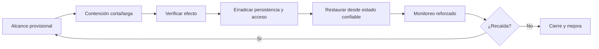

# Clase 216 — Contención, erradicación y recuperación

> Parte: **9 — Forense digital y respuesta a incidentes** · Fuente: *NIST SP 800-61 Rev. 3* y documentación técnica de plataforma
> ⏱️ Duración estimada: **110 min** · Nivel: **Intermedio**

---

## 🎯 Objetivo

Dominar tres grupos de trabajo de la respuesta: **contener** reduciendo impacto y preservando evidencia pertinente, **erradicar** accesos y condiciones dentro del alcance conocido, y **recuperar** la operación con confianza justificada. Al terminar sabrás decidir entre aislar u observar, buscar persistencia por varias fuentes y validar criterios de recuperación sin prometer certeza absoluta.

## 📚 Resultados de aprendizaje

Al finalizar, el alumno podrá:

1. **Elegir** la estrategia de contención adecuada (aislar vs. observar).
2. **Preservar** evidencia durante la contención.
3. **Erradicar** malware, acceso y persistencia dentro del alcance investigado.
4. **Recuperar** sistemas con monitoreo reforzado.
5. **Validar** que la amenaza fue eliminada antes de cerrar.

## 🗺️ Temas

| # | Tema | Por qué importa |
|---|------|-----------------|
| 1 | Contención corto vs. largo plazo | Rapidez vs. estabilidad |
| 2 | Aislar vs. observar | Trade-off inteligencia/riesgo |
| 3 | Preservar evidencia al contener | No romper la forense |
| 4 | Erradicación de persistencia | El atacante no debe volver |
| 5 | Reconstrucción vs. limpieza | Confianza en el sistema |
| 6 | Rotación de credenciales | Cerrar el acceso robado |
| 7 | Recuperación monitorizada | Detectar reinfección |
| 8 | Validación de erradicación | Criterio para cerrar |

## 🧠 Explicación en profundidad

Contener limita impacto; erradicar elimina causas y persistencia; recuperar restablece servicio confiable. Aislar demasiado pronto puede cortar C2 y también alertar al adversario, perder evidencia o detener negocio. La decisión combina riesgo técnico, criticidad, visibilidad y autoridad.



Erradicación incluye credenciales, tokens, reglas cloud y vectores, no solo borrar malware. Recuperar desde backup requiere comprobar que el backup precede al compromiso y no conserva persistencia. Se fijan criterios de salud, propietario y ventana de observación. Las acciones mantienen un log común para relacionar cambios operativos con evidencia.

### Contener es reducir riesgo bajo restricciones reales

La contención inmediata busca frenar daño; la de largo plazo crea un estado sostenible mientras se comprende y erradica. Aislar un endpoint desde EDR, bloquear una cuenta, segmentar una subred o deshabilitar una integración producen efectos distintos. Cada acción se evalúa por velocidad, alcance, reversibilidad, evidencia que altera e impacto empresarial. El criterio se registra con lo que se sabía en ese momento.

Observar al adversario puede ampliar inteligencia, pero también permite daño adicional. Solo se justifica con autoridad, monitoreo, límites de tiempo y criterios de interrupción. En la mayoría de escenarios donde continúa cifrado o exfiltración, reducir impacto domina; aun así, preservar memoria o conexiones puede ejecutarse en paralelo si no retrasa una contención crítica.

### Erradicar exige eliminar acceso y condiciones

Borrar el binario visible no revoca tokens, claves API, tareas, servicios, aplicaciones OAuth, reglas de reenvío ni vulnerabilidades explotadas. Se construye una matriz de activos, identidades, persistencias y vector inicial; cada elemento recibe acción y evidencia de verificación. La rotación se ordena para evitar que una sesión comprometida capture las nuevas credenciales.

La reconstrucción desde una imagen confiable suele reducir incertidumbre frente a una limpieza compleja, pero tampoco es una «garantía plena»: firmware, credenciales, imágenes base, automatización y backups pueden conservar el problema. Se valida procedencia y fecha de la base, se aplica configuración actual y se prueban controles antes de reconectar.

### Recuperar es una transición observada

La recuperación define servicio mínimo, criterios de salud, dependencias, validación de datos y plan de reversión. Los sistemas vuelven por etapas y con telemetría reforzada. Una ausencia breve de alertas no demuestra erradicación; la ventana se justifica por ciclos de negocio, persistencia observada y riesgo.

El cierre exige demostrar que las rutas conocidas de acceso están eliminadas, el servicio funciona, las fuentes de detección reportan y las acciones pendientes tienen dueño. Si queda incertidumbre relevante, se comunica en vez de transformar «no observado» en «no existe».

## 📔 Glosario

- **Contención corta/larga:** medidas inmediatas y sostenibles.
- **Erradicación:** eliminación de causa y persistencia.
- **Recovery:** retorno controlado a operación.
- **Known-good:** estado cuya confianza fue validada.
- **Recaída:** reaparición de actividad relacionada.
- **Blast radius:** alcance potencial del daño.
- **Monitoring reforzado:** vigilancia temporal tras restauración.

## 📖 Definiciones y características

- **Contención a corto plazo**: acción inmediata para frenar la propagación (aislar un host). Característica: rápida, a veces temporal.
- **Contención a largo plazo**: medida estable mientras se erradica (segmentar red, regla de firewall). Característica: mantiene operación sin dar terreno.
- **Aislar vs. observar**: cortar al atacante ya, o vigilarlo para ganar inteligencia. Característica: observar arriesga más daño pero revela alcance.
- **Erradicación**: eliminar acceso, persistencia y condiciones explotadas dentro del alcance conocido. Característica: requiere verificación por activo e identidad.
- **Persistencia**: mecanismos para conservar acceso o efecto, incluidos servicios, tareas, identidades y configuraciones cloud. Característica: se enumeran mediante varias fuentes porque ninguna lista aislada asegura totalidad.
- **Reconstrucción (rebuild)**: desplegar desde una base declarada confiable. Característica: reduce incertidumbre si también se validan imagen, credenciales, firmware, datos y configuración.
- **Validación**: comprobar criterios de salud, telemetría y ausencia de comportamientos conocidos durante una ventana justificada. Característica: reduce incertidumbre, sin demostrar una ausencia absoluta.

## 🔍 Caso razonado — credencial de dominio usada en varios sistemas

Un servidor muestra una herramienta remota y autenticaciones de una cuenta administrativa hacia tres hosts. Aislar solo el servidor limita una ruta, pero la identidad permite continuar. El equipo preserva telemetría, deshabilita temporalmente la cuenta, revoca sesiones y busca su uso en controladores, VPN, nube y endpoints. La rotación incluye secretos de servicios dependientes y se coordina para no romper recuperación.

Dos hosts se reconstruyen desde una imagen validada; el tercero se conserva para análisis porque contiene evidencia única. Antes de reconectar, se corrige el vector inicial, se aplican controles, se prueban logs y se ejecuta búsqueda de persistencia conocida. El cierre enumera qué se verificó, cuánto duró la observación y qué riesgo residual permanece.

## ✅ Criterio de dominio

Dominas la clase cuando comparas opciones de contención por riesgo, reversión e impacto; amplías erradicación a activos, identidad y nube; validas una reconstrucción más allá del sistema operativo; y defines recuperación y cierre mediante evidencia positiva en lugar de una simple ausencia de alertas.

## 🧰 Herramientas y preparación

- **Contención**: reglas de firewall/EDR para aislar, VLAN de cuarentena.
- **Erradicación**: EDR (aislar y remediar), `autoruns` (persistencia Windows), revisión de cron/systemd (Linux).
- **Credenciales**: gestor de secretos, rotación de claves, revocación de sesiones/tokens.
- **Ejercicio aplicado**: diseño y práctica en laboratorio propio.

## 🧪 Laboratorio guiado

> Sobre una VM de laboratorio propia previamente "comprometida" por ti.

1. **Contén** el host aislándolo por red sin apagarlo (preservas RAM y estado):
   - EDR: acción "aislar"; o regla de firewall que solo permita la IP del analista.
2. Antes de erradicar, **captura evidencia**: volcado de RAM (clase 207) e imagen de disco (clase 203).
3. **Enumera la persistencia** en Windows con Autoruns:

   ```powershell
   autorunsc.exe -a * -c > autoruns.csv
   ```

   Revisa servicios, tareas programadas, claves Run, y WMI.
4. En Linux, revisa cron, systemd y perfiles de shell (clase 206), y declara qué otras superficies quedan fuera de esa enumeración.
5. **Erradica**: elimina cada mecanismo identificado y el malware. Si el compromiso fue profundo (root/SYSTEM), planifica **reconstrucción desde cero**.
6. **Rota credenciales**: cambia contraseñas, revoca tokens/sesiones y claves API que el atacante pudo ver.
7. **Recupera** el sistema con monitoreo reforzado: EDR en alerta, logging aumentado, y una regla que avise si reaparecen los IOCs.
8. **Valida**: define un periodo de observación y los criterios ("cero IOCs, cero conexiones al C2, cero reintentos de la persistencia") para cerrar.

## ✍️ Ejercicios

1. Decide para tres escenarios si aislar u observar, y justifícalo.
2. Enumera cinco mecanismos de persistencia en Windows.
3. Explica por qué a veces la única opción es reconstruir.
4. Diseña un plan de rotación de credenciales tras un compromiso.
5. Define los criterios de validación de erradicación.
6. Explica cómo contener sin perder la memoria del equipo.

## 📝 Reto verificable

En una VM comprometida por ti, ejecuta las tres fases: contiene documentando cambios sobre evidencia, busca y elimina la persistencia conocida mediante varias fuentes y valida recuperación con criterios explícitos y riesgo residual.

**Criterio de aceptación**: documentas (a) cómo aislaste y qué evidencia pudo cambiar, (b) mecanismos de persistencia buscados, hallados y eliminados más límites de cobertura, (c) rotación y revocación ordenadas, y (d) criterios cumplidos y riesgo residual para declarar la recuperación.

## ⚠️ Errores comunes

| Síntoma / mensaje | Causa y cómo arreglar |
|-------------------|-----------------------|
| El malware reaparece tras limpiar | Quedó persistencia sin eliminar. Enumera TODA con Autoruns/cron/systemd. |
| Perdiste la RAM al contener | Apagaste el equipo. Aísla por red, no por apagado. |
| El atacante vuelve con la misma clave | No rotaste credenciales. Cámbialas y revoca sesiones. |
| Limpiaste pero no confías en el host | Compromiso profundo. Reconstruye desde cero. |
| Cerraste demasiado pronto | Sin periodo de validación. Monitorea antes de declarar resuelto. |

## ❓ Preguntas frecuentes

**❓ ¿Aislar u observar?**
Aísla si el riesgo de daño es alto; observa solo si necesitas inteligencia y puedes contener el daño. Ante la duda, aísla.

**❓ ¿Limpiar o reconstruir?**
Ante compromiso con privilegios altos o rootkits, reconstruir desde una base validada suele reducir más incertidumbre que limpiar. También debes revisar firmware, identidad, datos, imágenes y automatización relacionadas.

**❓ ¿Cuándo roto credenciales?**
Cuando el alcance indique acceso posible o exposición: contraseñas, tokens, claves API y secretos de servicio. Define el orden para revocar sesiones antes de emitir reemplazos utilizables.

**❓ ¿Cómo sé que erradiqué de verdad?**
Con monitoreo reforzado durante un periodo y criterios objetivos: cero IOCs activos, cero conexiones al C2, cero reintentos de persistencia.

## 🔗 Referencias verificables y alcance

- **NIST SP 800-61 Rev. 3:** <https://doi.org/10.6028/NIST.SP.800-61r3> — recomendaciones actuales para integrar preparación, detección, respuesta y recuperación con CSF 2.0.
- **Sysinternals Autoruns:** <https://learn.microsoft.com/sysinternals/downloads/autoruns> — documentación oficial para ubicaciones de inicio automático Windows; no cubre todas las formas de acceso, identidad o persistencia cloud.
- **MITRE ATT&CK — Persistence:** <https://attack.mitre.org/tactics/TA0003/> — taxonomía de comportamientos para ampliar búsquedas; la cobertura depende de fuentes disponibles.
- **CISA Incident Response Playbook:** <https://www.cisa.gov/sites/default/files/publications/Cybersecurity_Incident_Vulnerability_Response_Playbooks_508C.pdf> — ejemplo oficial de acciones y coordinación; adaptar autoridad y criterios al entorno.

## 📥 Material descargable

- 📄 [Guía en PDF](./clase-216-guia.pdf) — versión imprimible de esta clase.
- 🎞️ [Presentación (PPTX)](./clase-216-presentacion.pptx) — deck para proyectar en clase.

## ⬅️ Clase anterior

[Clase 215 — Playbooks de respuesta a incidentes](../215-playbooks-de-respuesta-a-incidentes/README.md)

## ➡️ Siguiente clase

[Clase 217 — Análisis de causa raíz](../217-analisis-de-causa-raiz/README.md)
