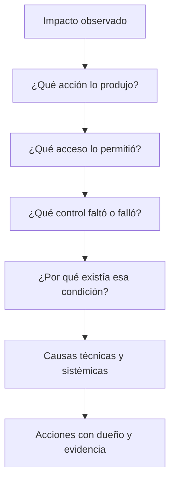

# Clase 217 — Análisis de causa raíz

> Parte: **9 — Forense digital y respuesta a incidentes** · Fuente: *NIST SP 800-61* (post-incident) y metodologías de RCA
> ⏱️ Duración estimada: **100 min** · Nivel: **Intermedio**

---

## 🎯 Objetivo

Aprender a determinar la **causa raíz** de un incidente —no solo el síntoma— usando metodologías como los 5 Porqués, el diagrama de Ishikawa y la reconstrucción de la cadena de ataque (kill chain). Al terminar sabrás distinguir causa próxima de causa raíz y proponer acciones correctivas que eviten la recurrencia.

## 📚 Resultados de aprendizaje

Al finalizar, el alumno podrá:

1. **Distinguir** causa próxima, contribuyente y raíz.
2. **Aplicar** los 5 Porqués e Ishikawa a un incidente.
3. **Reconstruir** la cadena de ataque desde el acceso inicial.
4. **Formular** acciones correctivas verificables.
5. **Redactar** un análisis post-incidente sin culpar a personas.

## 🗺️ Temas

| # | Tema | Por qué importa |
|---|------|-----------------|
| 1 | Causa próxima vs. raíz | Arreglar el síntoma no basta |
| 2 | Los 5 Porqués | Método simple y potente |
| 3 | Diagrama de Ishikawa | Causas por categoría |
| 4 | Reconstrucción de secuencia de ataque | Relacionar acciones, controles y efectos |
| 5 | Cultura blameless | Aprender, no castigar |
| 6 | Acciones correctivas | Prevenir la recurrencia |
| 7 | Métricas post-incidente | MTTD, MTTR |
| 8 | Lecciones aprendidas | Cerrar el ciclo NIST |

## 🧠 Explicación en profundidad

Causa raíz no significa encontrar una única persona o vulnerabilidad. Un incidente emerge de condiciones técnicas y organizativas: exposición, identidad, control preventivo, telemetría, decisión y gobernanza. «Phishing» describe un mecanismo inicial, no por qué produjo impacto.

Los «5 porqués» ayudan si se sustentan en hechos y no se fuerzan hasta una respuesta conveniente. Un diagrama causal permite múltiples contribuyentes y barreras fallidas. Se separan causa, factor contribuyente y síntoma. Las acciones se priorizan por reducción de riesgo y se verifican mediante métrica o prueba; «capacitar usuarios» sin condición medible rara vez corrige el sistema completo.

### Pasar de la cronología al mecanismo causal

Una timeline responde principalmente cuándo y en qué orden; el RCA pregunta qué condiciones hicieron posible el impacto. Que una persona abriera un adjunto puede ser un hecho próximo, pero el resultado también dependió de controles de correo, configuración de macros, privilegios, segmentación, telemetría y capacidad de recuperación. El modelo causal conecta acciones con barreras presentes, ausentes o ineficaces.

No toda condición es «la raíz». Se distingue disparador, causa próxima, factor contribuyente, condición sistémica e impacto. Varias ramas pueden converger. Esta precisión evita una cadena artificial donde el quinto «porqué» refleja la preferencia del facilitador y no la evidencia.

### Usar métodos como ayudas, no como máquinas de verdad

Los 5 Porqués funcionan bien para una cadena acotada y se detienen cuando falta evidencia o se sale del control de la organización. Ishikawa ayuda a explorar personas, proceso, tecnología, entorno y gobernanza, pero cada rama debe validarse. ATT&CK ofrece vocabulario para acciones adversarias; no explica por sí solo por qué los controles internos fallaron.

Un postmortem sin culpa no elimina responsabilidad profesional. Busca entender decisiones dentro de la información, incentivos y herramientas disponibles, y separa conducta deliberada de error razonable. Esto aumenta la probabilidad de obtener datos honestos y acciones de sistema.

### Diseñar acciones que demuestren reducción de riesgo

Cada acción se vincula a una causa, tiene dueño, plazo, prioridad y prueba de eficacia. «Implementar MFA resistente al phishing para administradores y simular un inicio con credencial robada» es verificable; «mejorar MFA» no. También se revisan efectos secundarios y cobertura: un control puede reducir una ruta pero dejar cuentas de servicio o recuperación fuera.

MTTD y MTTR requieren definición de inicio, fin, población e incidentes excluidos. Un promedio que mezcla severidades o solo casos detectados puede ocultar deterioro. Se complementan con distribución, cobertura, tiempo por fase y reincidencia de condiciones causales.

## 📔 Glosario

- **Causa raíz:** condición cuya corrección reduce recurrencia significativa.
- **Factor contribuyente:** condición que aumentó probabilidad o impacto.
- **Síntoma:** manifestación observable del problema.
- **5 Whys:** técnica iterativa de preguntas causales.
- **Causal graph:** relaciones entre condiciones y resultado.
- **Control fallido:** barrera inexistente, ineficaz o eludida.
- **Acción correctiva:** cambio con dueño y validación.

## 📖 Definiciones y características

- **Causa próxima**: el evento inmediato que produjo el daño (p. ej. "se ejecutó el macro"). Característica: visible pero superficial.
- **Causa raíz**: condición sistémica cuya corrección reduce de forma demostrable la probabilidad o impacto de recurrencia. Característica: puede coexistir con otras causas y no asegura prevención absoluta.
- **Causa contribuyente**: factor que agravó o facilitó. Característica: no es la raíz, pero importa.
- **5 Porqués**: preguntar por condiciones causales sucesivas y respaldarlas con evidencia. Característica: útil para cadenas acotadas; puede simplificar en exceso sistemas complejos.
- **Ishikawa (espina de pescado)**: agrupa causas por categorías (personas, proceso, tecnología…). Característica: útil para causas múltiples.
- **Blameless post-mortem**: análisis sin culpar individuos. Característica: fomenta honestidad y aprendizaje.
- **MTTD/MTTR**: medidas de tiempo de detección y respuesta bajo una definición explícita. Característica: orientan tendencias, pero son sensibles a población, severidad y sesgo de detección.

## 🔍 Caso razonado — por qué «el usuario hizo clic» no cierra el análisis

Un adjunto ejecuta código y roba un token administrativo. Culpar el clic propone capacitar otra vez, pero no explica por qué el adjunto llegó, por qué pudo ejecutar, por qué la cuenta tenía privilegio continuo ni por qué el uso del token tardó horas en detectarse. El diagrama causal muestra fallos independientes en filtrado, política de ejecución, privilegio y telemetría.

Las acciones resultantes son distintas: bloquear el tipo de contenido mediante una prueba reproducible, reducir privilegio permanente, aplicar autenticación resistente al phishing y alertar sobre uso anómalo del token. Cada control se asigna y se reprueba. La capacitación puede ser complementaria, pero deja de presentarse como remedio único.

## ✅ Criterio de dominio

Dominas la clase cuando transformas una timeline en un modelo causal con múltiples contribuyentes, detienes un método cuando falta evidencia, evitas atribuir la raíz a una persona por comodidad y defines acciones cuya eficacia puede probarse con condiciones y métricas bien delimitadas.

## 🧰 Herramientas y preparación

- **Metodologías**: plantilla de 5 Porqués, diagrama de Ishikawa, plantilla de post-mortem blameless.
- **Insumos**: la timeline (clase 209), los hallazgos forenses y el mapeo ATT&CK del incidente.
- **Ejercicio aplicado**: análisis, no herramientas ofensivas.

## 🧪 Laboratorio guiado

> Usa un incidente que ya investigaste en clases anteriores (o el caso de la clase 220).

1. Reúne los hechos: timeline, IOCs, artefactos y el mapeo ATT&CK del ataque.
2. Aplica los **5 Porqués** partiendo del impacto. Ejemplo:
   - ¿Por qué se cifraron los archivos? → Se ejecutó ransomware.
   - ¿Por qué se ejecutó? → Un usuario abrió un adjunto con macro.
   - ¿Por qué la macro corrió? → Las macros no estaban bloqueadas por política.
   - ¿Por qué llegó el correo? → El gateway no filtró el adjunto.
   - ¿Por qué escaló a red? → La cuenta tenía privilegios excesivos.
3. Construye el **Ishikawa** clasificando causas en: Personas, Proceso, Tecnología, Configuración.
4. Reconstruye la **kill chain** completa (acceso inicial → ejecución → persistencia → movimiento → impacto).
5. Distingue explícitamente causa próxima, contribuyentes y raíz(es).
6. Formula **acciones correctivas** verificables por cada causa raíz (bloquear macros por GPO, filtrar adjuntos, principio de mínimo privilegio) con responsable y fecha.
7. Calcula **MTTD y MTTR** del incidente a partir de la timeline.
8. Redacta el post-mortem **blameless**: qué pasó, por qué, qué mejoramos, sin señalar personas.

## ✍️ Ejercicios

1. Aplica los 5 Porqués a un caso de phishing.
2. Construye un Ishikawa con cuatro categorías de causa.
3. Distingue causa próxima y raíz en tres incidentes distintos.
4. Formula tres acciones correctivas verificables.
5. Calcula MTTD y MTTR de una timeline dada.
6. Reescribe un post-mortem con culpas en versión blameless.

## 📝 Reto verificable

Realiza el análisis de causa raíz completo de un incidente que investigaste, entregando el árbol de 5 Porqués, el Ishikawa, la kill chain, y al menos tres acciones correctivas que ataquen causas raíz (no síntomas), cada una con criterio de verificación.

**Criterio de aceptación**: cada acción correctiva ataca una causa raíz identificada (no un síntoma), tiene responsable, fecha y una forma objetiva de verificar que se implementó. El post-mortem no señala a ningún individuo.

## ⚠️ Errores comunes

| Síntoma / mensaje | Causa y cómo arreglar |
|-------------------|-----------------------|
| Arreglas el síntoma y recurre | Te quedaste en la causa próxima. Sigue preguntando "por qué". |
| El análisis busca culpables | Cultura de culpa. Adopta el enfoque blameless. |
| Acciones vagas ("mejorar seguridad") | No verificables. Hazlas concretas y medibles. |
| Una sola causa asumida | Muchos incidentes tienen varias. Usa Ishikawa. |
| No se implementan las acciones | Sin responsable/fecha. Asígnalos y da seguimiento. |

## ❓ Preguntas frecuentes

**❓ ¿Causa próxima o raíz?**
La próxima es el disparo inmediato; la raíz es la condición de fondo. Corrige la raíz para prevenir recurrencia.

**❓ ¿Por qué blameless?**
Porque culpar oculta la verdad. Un análisis sin culpa obtiene información honesta y mejora el sistema, no castiga a la persona.

**❓ ¿5 Porqués o Ishikawa?**
5 Porqués para causas lineales; Ishikawa cuando hay múltiples factores por categoría. A menudo se combinan.

**❓ ¿Para qué sirven MTTD/MTTR?**
Miden la eficacia del programa de respuesta y permiten fijar objetivos de mejora incidente a incidente.

## 🔗 Referencias verificables y alcance

- **NIST SP 800-61 Rev. 3:** <https://doi.org/10.6028/NIST.SP.800-61r3> — vincula aprendizaje de incidentes, mejora continua y gestión de riesgo en CSF 2.0.
- **Google SRE — Postmortem Culture:** <https://sre.google/sre-book/postmortem-culture/> — práctica publicada para postmortems orientados al aprendizaje; debe adaptarse a obligaciones laborales y regulatorias.
- **MITRE ATT&CK:** <https://attack.mitre.org/> — vocabulario para reconstruir comportamientos; no constituye por sí mismo un análisis causal organizacional.
- **NIST Cybersecurity Framework 2.0:** <https://www.nist.gov/cyberframework> — marco oficial para relacionar hallazgos con gobierno, identificación, protección, detección, respuesta y recuperación.

## 📥 Material descargable

- 📄 [Guía en PDF](./clase-217-guia.pdf) — versión imprimible de esta clase.
- 🎞️ [Presentación (PPTX)](./clase-217-presentacion.pptx) — deck para proyectar en clase.

## ⬅️ Clase anterior

[Clase 216 — Contención, erradicación y recuperación](../216-contencion-erradicacion-y-recuperacion/README.md)

## ➡️ Siguiente clase

[Clase 218 — Reporte forense y aspectos legales](../218-reporte-forense-y-aspectos-legales/README.md)
