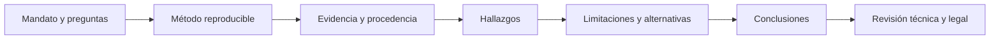

# Clase 218 — Reporte forense y aspectos legales

> Parte: **9 — Forense digital y respuesta a incidentes** · Fuente: *SWGDE Best Practices* y NIST SP 800-86
> ⏱️ Duración estimada: **110 min** · Nivel: **Intermedio**

---

## 🎯 Objetivo

Aprender a redactar un **informe forense defendible** y a manejar los aspectos legales de una investigación: admisibilidad de la evidencia, cadena de custodia documentada, testimonio pericial, y consideraciones de privacidad y notificación (GDPR y leyes locales). Al terminar sabrás producir un informe que se sostenga ante un tribunal y comunicarlo a distintas audiencias.

## 📚 Resultados de aprendizaje

Al finalizar, el alumno podrá:

1. **Estructurar** un informe forense completo y trazable.
2. **Escribir** hallazgos que separen hechos de opiniones.
3. **Documentar** fiabilidad, custodia y limitaciones para que el foro aplicable pueda evaluarlas.
4. **Adaptar** el informe a audiencias técnica, ejecutiva y legal.
5. **Reconocer** obligaciones de privacidad y notificación de brechas.

## 🗺️ Temas

| # | Tema | Por qué importa |
|---|------|-----------------|
| 1 | Estructura del informe | Claridad y trazabilidad |
| 2 | Hechos vs. opinión | Credibilidad pericial |
| 3 | Fiabilidad y requisitos procesales | Documentar método para el contexto aplicable |
| 4 | Cadena de custodia en el informe | Integridad demostrable |
| 5 | Audiencias del informe | Técnico, ejecutivo, legal |
| 6 | Testimonio pericial | Defender los hallazgos |
| 7 | Privacidad y notificación | Identificar jurisdicción, alcance y plazos aplicables |
| 8 | Retención y confidencialidad | Manejo del material |

## 🧠 Explicación en profundidad

El informe convierte trabajo técnico en afirmaciones auditables para una audiencia y jurisdicción concretas. Separa alcance, métodos, limitaciones, hechos, inferencias y opinión experta. No ofrece asesoría legal: preservación, privacidad, notificación y transferencias se coordinan con asesoría competente.

Cada hallazgo cita artefacto, ubicación y procedimiento; capturas ilustran pero no sustituyen evidencia. El lenguaje calibra certeza: observado, consistente con, probablemente o no determinable. Fechas incluyen zona horaria. El resumen ejecutivo explica impacto y decisión sin exagerar atribución. Anexos conservan hashes, herramientas y cadena de custodia.

### Construir una cadena desde la pregunta hasta la conclusión

El informe comienza con mandato, alcance y preguntas autorizadas. Después describe fuentes, adquisición, integridad, herramientas, versiones, parámetros y transformaciones. Un hallazgo conecta una observación concreta con su procedencia y explica el razonamiento que conduce a la interpretación. Así, el lector puede distinguir evidencia primaria, producto derivado y ayuda visual.

La reproducibilidad no exige que toda persona obtenga idéntica interfaz, sino que pueda repetir el procedimiento relevante y evaluar decisiones. Se incluyen hashes, consultas, filtros, zona horaria, parsers y limitaciones. Si una herramienta cerrada no revela su algoritmo, se documenta esa restricción y se corrobora un hallazgo crítico con otra fuente o método cuando sea viable.

### Escribir para audiencias distintas sin cambiar los hechos

El anexo técnico conserva detalle; el resumen ejecutivo explica impacto, alcance conocido, decisiones y riesgo residual. Legal necesita comprender procedencia, privacidad, privilegio y notificación; operaciones necesita acciones; dirección necesita incertidumbre y consecuencias. Se pueden crear vistas diferentes, pero todas deben derivar del mismo conjunto de hechos.

La atribución se formula con especial cuidado. Una cuenta ejecutó una acción no significa que su titular la ejecutó. Una IP puede pertenecer a NAT, VPN o proveedor. El informe presenta explicaciones alternativas evaluadas y evita lenguaje categórico cuando las fuentes solo sostienen compatibilidad.

### El marco legal se determina, no se presume

Admisibilidad, consentimiento, monitoreo laboral, transferencia internacional, retención y notificación dependen de jurisdicción, relación contractual y proceso. NIST SP 800-86 declara expresamente una perspectiva de TI y no ofrece asesoría legal. ISO/IEC 27037 aporta directrices técnicas, pero tampoco decide una regla procesal local.

El GDPR exige notificar a la autoridad de control sin dilación indebida y, cuando sea viable, dentro de 72 horas desde que el responsable tenga conocimiento, salvo que sea improbable un riesgo para derechos y libertades. Esa regla no significa que todo incidente global tenga exactamente el mismo plazo. El equipo registra cuándo se alcanzó conocimiento, hechos disponibles y consulta legal competente.

## 📔 Glosario

- **Mandato:** autoridad y preguntas autorizadas.
- **Hallazgo:** conclusión respaldada por evidencia citada.
- **Limitación:** condición que restringe interpretación.
- **Admisibilidad:** aceptación de evidencia según reglas aplicables.
- **Legal hold:** obligación de preservar información.
- **Privilegio:** protección jurídica evaluada por asesoría.
- **Peer review:** revisión independiente del trabajo.

## 📖 Definiciones y características

- **Informe forense**: documento que expone método, evidencia y conclusiones. Característica: reproducible por un tercero.
- **Hecho vs. opinión**: el hecho es observable y verificable; la opinión es interpretación fundada. Característica: deben distinguirse siempre.
- **Admisibilidad**: decisión regida por reglas de la jurisdicción y el proceso. Característica: método, relevancia, autenticidad y manejo pueden ser evaluados de modo distinto según el foro.
- **Cadena de custodia**: registro cronológico de posesión, transferencia y acciones sobre evidencia. Característica: una discontinuidad debe investigarse y explicarse; su efecto legal no es automático ni universal.
- **Testigo experto**: perito que explica hallazgos técnicos al tribunal. Característica: debe ser claro, imparcial y defendible.
- **Notificación de brecha**: obligación aplicable bajo un marco y hechos concretos. Característica: autoridad, afectados, umbral y plazo varían; GDPR incorpora la regla condicionada de 72 horas del artículo 33.

## 🔍 Caso razonado — dos timestamps en conflicto

Un informe debe responder si una cuenta exportó datos antes de ser deshabilitada. El log cloud registra la API a `18:04:12 UTC`; un archivo local presenta modificación a `14:03:51` sin zona y el host tenía 38 segundos de deriva. El analista conserva ambos valores, documenta conversión y concluye que son temporalmente consistentes, pero no afirma identidad humana porque el evento representa una sesión asumida.

El resumen ejecutivo declara acceso observado y alcance conocido. El anexo cita evento, request ID, hash de exportación, comando y corrección temporal. La sección legal identifica que existen datos personales y remite la decisión de notificación a asesoría de la jurisdicción aplicable, sin transformar el informe técnico en opinión jurídica.

## ✅ Criterio de dominio

Dominas la clase cuando cada conclusión puede rastrearse a una fuente, separas hecho e inferencia, declaras alternativas y limitaciones, adaptas profundidad sin cambiar los hechos y reconoces qué decisiones requieren asesoría legal. Tu informe permite repetir los pasos sustantivos y no promete admisibilidad universal.
- **Privacidad**: límites sobre qué datos se pueden recolectar/analizar. Característica: varía por jurisdicción y contexto laboral.

## 🧰 Herramientas y preparación

- **Plantilla de informe**: portada, resumen ejecutivo, alcance, metodología, hallazgos, línea de tiempo, conclusiones, anexos.
- **Trazabilidad**: hashes, capturas y referencias a cada artefacto.
- **Marco legal**: familiarízate con GDPR, y con la normativa de tu país (en Chile, la Ley 19.628 y la Ley 21.459 de delitos informáticos, por ejemplo).
- **Ejercicio aplicado**: redacción, no herramientas técnicas.

## 🧪 Laboratorio guiado

> Redacta el informe de un caso que ya investigaste (por ejemplo el de la clase 220).

1. Crea la **portada**: caso, examinador, fechas, clasificación de confidencialidad.
2. Escribe el **resumen ejecutivo** (media página, sin jerga): qué pasó, impacto y recomendación clave, para dirección.
3. Define **alcance y limitaciones**: qué se analizó, qué no y por qué.
4. Documenta la **metodología**: herramientas, versiones, procedimientos y hashes de las imágenes.
5. Redacta los **hallazgos** separando claramente hecho de interpretación. Ejemplo:
   - *Hecho*: "El artefacto Prefetch registra la ejecución de `x.exe` el 2026-07-10 03:14 UTC (SHA-256: …)."
   - *Opinión*: "En mi opinión profesional, esto es consistente con la ejecución del malware descrito."
6. Incluye la **línea de tiempo** reconstruida y la **cadena de custodia** completa.
7. Añade **conclusiones** y **recomendaciones**, y los **anexos** (hashes, capturas, comandos).
8. Prepara una versión **ejecutiva** y una **técnica** del mismo caso.

## ✍️ Ejercicios

1. Escribe un resumen ejecutivo de media página para un caso.
2. Reescribe tres hallazgos separando hecho de opinión.
3. Documenta la metodología con herramientas y versiones.
4. Redacta la sección de cadena de custodia de un ítem.
5. Adapta un hallazgo técnico para una audiencia legal.
6. Enumera las obligaciones de notificación bajo GDPR.

## 📝 Reto verificable

Redacta un informe forense completo de un caso que investigaste, con todas las secciones, hallazgos que distingan hecho de opinión, cadena de custodia trazable y una versión ejecutiva aparte.

**Criterio de aceptación**: el informe permite a un tercero reproducir el análisis (herramientas, versiones, parámetros y hashes), cada hallazgo separa hecho de interpretación, toda discontinuidad de custodia está declarada y evaluada, y existe un resumen ejecutivo comprensible sin conocimientos técnicos.

## ⚠️ Errores comunes

| Síntoma / mensaje | Causa y cómo arreglar |
|-------------------|-----------------------|
| Un revisor cuestiona la evidencia | Puede faltar procedencia, explicación del método o validación. Reconstruye la trazabilidad y consulta requisitos del foro aplicable. |
| Mezclas hecho y opinión | Se pierde credibilidad. Sepáralos explícitamente. |
| Dirección no entiende el informe | Demasiada jerga. Añade resumen ejecutivo claro. |
| No puedes reproducir tu análisis | Faltan versiones/comandos. Registra la metodología completa. |
| No está claro el plazo de notificación | No se determinó jurisdicción, umbral o momento de conocimiento. Escala temprano a asesoría y documenta los hechos. |

## ❓ Preguntas frecuentes

**❓ ¿Qué hace admisible la evidencia?**
No existe una fórmula universal. Se documentan método, integridad, procedencia, custodia, competencia y limitaciones, y se evalúan las reglas del proceso y jurisdicción con asesoría competente.

**❓ ¿Puedo dar opiniones en el informe?**
Sí, como perito, pero identificadas como opinión profesional y fundadas en hechos, separadas de estos.

**❓ ¿Debo notificar toda brecha?**
Depende de la jurisdicción y del dato afectado. GDPR exige notificar a la autoridad en 72 h ciertas brechas de datos personales; consulta la ley local.

**❓ ¿Cuántas versiones del informe hago?**
Al menos una técnica (detallada) y una ejecutiva (breve, sin jerga). La legal puede requerir formato específico.

## 🔗 Referencias verificables y alcance

- **NIST SP 800-86:** <https://doi.org/10.6028/NIST.SP.800-86> — metodología de TI para recolección, examen, análisis y reporte; el propio documento aclara que no es asesoría legal.
- **SWGDE Published Documents:** <https://www.swgde.org/documents/published> — buenas prácticas y documentos técnicos publicados; se debe seleccionar la versión y disciplina aplicables.
- **Reglamento (UE) 2016/679, artículo 33:** <https://eur-lex.europa.eu/eli/reg/2016/679/oj> — fuente normativa primaria de la regla de notificación; su aplicación requiere analizar rol, conocimiento, riesgo y jurisdicción.
- **ISO/IEC 27037:** <https://www.iso.org/standard/44381.html> — directrices internacionales de identificación, recolección, adquisición y preservación; el texto completo puede requerir acceso de pago y no reemplaza ley local.

## 📥 Material descargable

- 📄 [Guía en PDF](./clase-218-guia.pdf) — versión imprimible de esta clase.
- 🎞️ [Presentación (PPTX)](./clase-218-presentacion.pptx) — deck para proyectar en clase.

## ⬅️ Clase anterior

[Clase 217 — Análisis de causa raíz](../217-analisis-de-causa-raiz/README.md)

## ➡️ Siguiente clase

[Clase 219 — Ejercicios de mesa (tabletop)](../219-ejercicios-de-mesa-tabletop/README.md)
