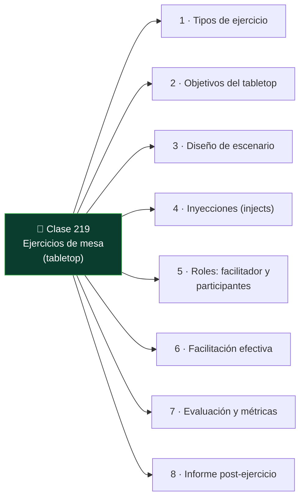

# Clase 219 — Ejercicios de mesa (tabletop)

<!-- cabecera:inicio -->

> 🗂️ Parte: **9 — Forense digital y respuesta a incidentes** · 📖 Fuente: *NIST SP 800-84 — Guide to Test, Training, and Exercise Programs*
> ⏱️ Duración estimada: **100 min** · 🎚️ Nivel: **Intermedio**

<!-- cabecera:fin -->

---

## 🎯 Objetivo

Aprender a diseñar y facilitar **ejercicios de mesa (tabletop)**: simulacros discutidos donde el equipo ensaya su respuesta a un incidente sin sistemas reales en riesgo. Al terminar sabrás construir un escenario con inyecciones, facilitar la discusión, evaluar la respuesta y capturar mejoras.

## 📚 Resultados de aprendizaje

Al finalizar, el alumno podrá:

1. **Distinguir** los tipos de ejercicio (tabletop, funcional, simulacro completo).
2. **Diseñar** un escenario realista con inyecciones progresivas.
3. **Facilitar** la sesión manteniendo el foco y el ritmo.
4. **Evaluar** la respuesta contra los playbooks existentes.
5. **Capturar** hallazgos y acciones de mejora.

## 🗺️ Temas

<!-- mapa:inicio -->

<!-- mapa:fin -->

| # | Tema | Por qué importa |
|---|------|-----------------|
| 1 | Tipos de ejercicio | Elegir el adecuado |
| 2 | Objetivos del tabletop | Qué se quiere probar |
| 3 | Diseño de escenario | Realismo y relevancia |
| 4 | Inyecciones (injects) | Hacer avanzar la crisis |
| 5 | Roles: facilitador y participantes | Dinámica de la sesión |
| 6 | Facilitación efectiva | Mantener el valor |
| 7 | Evaluación y métricas | Medir la preparación |
| 8 | Informe post-ejercicio | Convertir en mejoras |

## 📖 Definiciones y características

- **Tabletop**: ejercicio de discusión sin sistemas reales. Característica: bajo costo y riesgo, alto valor para procesos y roles.
- **Ejercicio funcional**: prueba parcial con sistemas/herramientas reales. Característica: más realista, más costoso.
- **Simulacro completo (full-scale)**: respuesta real end-to-end. Característica: máximo realismo y coste.
- **Inject (inyección)**: nueva información introducida por el facilitador para escalar el escenario. Característica: obliga a decidir.
- **Facilitador**: guía la sesión, lanza injects, evita que se estanque. Característica: neutral, no resuelve por el equipo.
- **MSEL (Master Scenario Events List)**: guion de eventos e injects planificados. Característica: estructura el ejercicio.
- **Hotwash**: debrief inmediato tras el ejercicio. Característica: captura impresiones en caliente.

## 🧰 Herramientas y preparación

- **Diseño**: plantilla de escenario, MSEL con injects y tiempos, objetivos medibles.
- **Facilitación**: sala (física o virtual), reloj, y un observador que tome notas.
- **Insumos**: los playbooks (clase 215) que se quieren poner a prueba.
- **Ejercicio aplicado**: no requiere entorno técnico; es organizativo.

## 🧪 Laboratorio guiado

> Diseña y facilita un tabletop. Puedes ejecutarlo con compañeros o en solitario como diseño.

1. Define **objetivos** medibles: p. ej. "validar el playbook de ransomware y los criterios de escalado".
2. Elige un **escenario** realista para tu contexto (ransomware que cifra un servidor de archivos y exige rescate).
3. Redacta la **MSEL** con injects progresivos y sus tiempos. Ejemplo de injects:
   - T+0: el EDR alerta de cifrado masivo en un servidor.
   - T+15: usuarios reportan que no acceden a archivos.
   - T+30: aparece una nota de rescate; el atacante amenaza con filtrar datos.
   - T+45: un periodista contacta pidiendo comentarios.
4. Asigna **roles**: facilitador, participantes (IR, TI, legal, comunicación, dirección) y observador.
5. **Facilita** la sesión: lanza cada inject, deja que el equipo decida usando sus playbooks, y anota dónde dudan o fallan.
6. Introduce **puntos de decisión** clave: ¿se paga el rescate? ¿se notifica a la autoridad? ¿quién habla con prensa?
7. Cierra con un **hotwash**: qué funcionó, qué no, qué faltó en los playbooks.
8. Redacta el **informe post-ejercicio** con hallazgos y acciones de mejora asignadas.

## ✍️ Ejercicios

1. Define tres objetivos medibles para un tabletop.
2. Escribe una MSEL con cinco injects y sus tiempos.
3. Diseña un escenario de brecha de datos con inject de prensa.
4. Redacta las preguntas de decisión para dirección y legal.
5. Crea una rúbrica para evaluar la respuesta del equipo.
6. Escribe el guion de un hotwash de 15 minutos.

## 📝 Reto verificable

Diseña un ejercicio tabletop completo (objetivos, escenario, MSEL con al menos cinco injects, roles y rúbrica de evaluación) sobre un incidente relevante, listo para ejecutarse con un equipo real.

**Criterio de aceptación**: el paquete permite a otro facilitador correr el ejercicio sin ayuda; incluye objetivos medibles, MSEL cronometrada con cinco injects, roles claros, puntos de decisión y una rúbrica para evaluar la respuesta.

## ⚠️ Errores comunes

| Síntoma / mensaje | Causa y cómo arreglar |
|-------------------|-----------------------|
| El ejercicio se estanca | Faltan injects o facilitación. Prepara MSEL y lanza eventos a tiempo. |
| Se convierte en clase teórica | El facilitador resuelve por el equipo. Deja que decidan ellos. |
| Escenario irreal | No aplica al contexto. Diseña sobre amenazas plausibles para la organización. |
| Sin conclusiones accionables | No hubo informe. Cierra con hotwash y acciones asignadas. |
| Solo participa TI | Falta convocar a legal, comunicación y dirección. Inclúyelos. |

## ❓ Preguntas frecuentes

**❓ ¿Tabletop o simulacro real?**
Tabletop primero: barato, sin riesgo, ideal para validar procesos y roles. Los funcionales y full-scale se hacen cuando el proceso ya madura.

**❓ ¿Con qué frecuencia se hacen?**
Al menos anual, y tras cambios grandes (nuevos sistemas, reorganización) o incidentes relevantes.

**❓ ¿Quién debe participar?**
No solo TI/seguridad: incluye legal, comunicación, RR. HH. y dirección, según el escenario.

**❓ ¿Qué es la MSEL?**
El guion maestro de eventos e injects, con tiempos, que estructura el ejercicio y mantiene el ritmo.

## 🔗 Referencias

- NIST SP 800-84 — Test, Training, and Exercise Programs: <https://csrc.nist.gov/publications/detail/sp/800-84/final>
- CISA — Tabletop Exercise Packages (CTEP): <https://www.cisa.gov/resources-tools/services/cisa-tabletop-exercise-packages>
- SANS — Incident Response resources: <https://www.sans.org/>
- NIST SP 800-61 Rev. 2: <https://csrc.nist.gov/publications/detail/sp/800-61/rev-2/final>

## 📥 Material descargable

- 📄 [Guía en PDF](./clase-219-guia.pdf) — versión imprimible de esta clase.
- 🎞️ [Presentación (PPTX)](./clase-219-presentacion.pptx) — deck para proyectar en clase.

## ⬅️ Clase anterior

[Clase 218 — Reporte forense y aspectos legales](../218-reporte-forense-y-aspectos-legales/README.md)

## ➡️ Siguiente clase

[Clase 220 — Caso completo de respuesta a incidentes end-to-end](../220-caso-completo-de-respuesta-a-incidentes-end-to-end/README.md)
