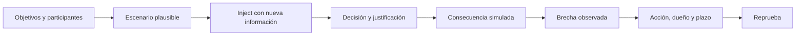

# Clase 219 — Ejercicios de mesa (tabletop)

> Parte: **9 — Forense digital y respuesta a incidentes** · Fuente: *NIST SP 800-84 — Guide to Test, Training, and Exercise Programs*
> ⏱️ Duración estimada: **100 min** · Nivel: **Intermedio**

---

## 🎯 Objetivo

Aprender a diseñar y facilitar **ejercicios de mesa (tabletop)**: simulacros discutidos donde el equipo ensaya su respuesta a un incidente sin sistemas reales en riesgo. Al terminar sabrás construir un escenario con inyecciones, facilitar la discusión, evaluar la respuesta y capturar mejoras.

## 📚 Resultados de aprendizaje

Al finalizar, el alumno podrá:

1. **Distinguir** los tipos de ejercicio (tabletop, funcional, simulacro completo).
2. **Diseñar** un escenario realista con inyecciones progresivas.
3. **Facilitar** la sesión manteniendo el foco y el ritmo.
4. **Evaluar** la respuesta contra los playbooks existentes.
5. **Capturar** hallazgos y acciones de mejora.

## 🗺️ Temas

| # | Tema | Por qué importa |
|---|------|-----------------|
| 1 | Tipos de ejercicio | Elegir el adecuado |
| 2 | Objetivos del tabletop | Qué se quiere probar |
| 3 | Diseño de escenario | Realismo y relevancia |
| 4 | Inyecciones (injects) | Hacer avanzar la crisis |
| 5 | Roles: facilitador y participantes | Dinámica de la sesión |
| 6 | Facilitación efectiva | Mantener el valor |
| 7 | Evaluación y métricas | Medir la preparación |
| 8 | Informe post-ejercicio | Convertir en mejoras |

## 🧠 Explicación en profundidad

Un tabletop es una conversación facilitada para evaluar decisiones, dependencias y autoridad frente a un escenario; no mide la capacidad técnica por sí solo. Los objetivos deben ser observables: decidir aislamiento, activar comunicaciones, obtener evidencia cloud o escalar a dirección.

Los injects introducen evidencia o restricciones, no trucos. El facilitador separa evaluación de enseñanza y crea seguridad psicológica para exponer vacíos. Se registran decisiones, supuestos y tiempos, no se puntúa memoria de documentos. El after-action report prioriza acciones concretas; sin dueño, fecha y reprueba, el ejercicio produce conversación pero no mejora.

### Diseñar desde objetivos y participantes

«Probar respuesta a ransomware» es demasiado amplio. Un objetivo observable puede ser que operaciones y negocio decidan en quince minutos si aislar un servidor crítico, usando criterios del playbook y autoridad definida. Los participantes se eligen por esa decisión: seguridad, infraestructura, propietario del servicio, continuidad, legal, comunicación y dirección según alcance. Incluir personas sin función concreta agrega ruido; excluir a quien aprueba impide probar el proceso real.

El escenario describe contexto suficiente y deja incertidumbre. Debe ser plausible para arquitectura, datos y amenazas de la organización, pero no necesita copiar un incidente real. Se establecen reglas, supuestos y qué sistemas se simulan. Un tabletop evalúa coordinación y razonamiento declarado; para comprobar que un comando o backup funciona se necesita prueba técnica o ejercicio funcional.

### Los injects revelan decisiones y dependencias

La MSEL ordena hora, inject, canal, destinatario, respuesta esperada, objetivo evaluado y contingencia. Un inject útil aporta nueva evidencia: el EDR pierde conectividad, un cliente publica datos o el backup usa la misma identidad comprometida. No existe para engañar, sino para forzar una decisión vinculada a un objetivo.

El facilitador pregunta qué haría el equipo, quién lo autoriza, con qué información y qué registraría. Si entrega la solución, convierte el ejercicio en clase. Si el grupo se estanca, puede recordar reglas o lanzar una contingencia, dejando registrado que faltaba conocimiento o documentación.

### Evaluar brechas y volver a probar

Se capturan decisiones, tiempo, evidencia solicitada, comunicaciones, supuestos y dependencias. Una puntuación puede ayudar, pero no demuestra «madurez» completa: el desempeño depende del alcance y tipo de ejercicio. El *hotwash* recoge observaciones inmediatas; el after-action report las valida y prioriza.

Cada mejora tiene dueño, fecha, criterio de aceptación y ejercicio de reprueba. Si se detecta que nadie puede aprobar el aislamiento fuera de horario, la acción no es «mejorar coordinación», sino actualizar guardia y delegación, probar el contacto y repetir ese punto de decisión.

## 📔 Glosario

- **Tabletop exercise:** simulación conversacional de decisiones.
- **Inject:** información añadida durante el escenario.
- **Facilitador:** persona que guía sin decidir por participantes.
- **Controller:** administra ritmo y reglas del ejercicio.
- **Observer:** registra evidencia sin intervenir.
- **Hotwash:** debrief inmediato.
- **After-action report:** resultados y plan de mejora.

## 📖 Definiciones y características

- **Tabletop**: ejercicio basado en discusión y escenario. Característica: evalúa decisiones, roles y coordinación dentro de su alcance, no ejecución técnica completa.
- **Ejercicio funcional**: prueba parcial con sistemas/herramientas reales. Característica: más realista, más costoso.
- **Simulacro completo (full-scale)**: ejercicio amplio con operaciones coordinadas y recursos reales o representativos. Característica: ofrece mayor realismo, complejidad, costo y riesgo controlado.
- **Inject (inyección)**: nueva información introducida por el facilitador para escalar el escenario. Característica: obliga a decidir.
- **Facilitador**: guía la sesión, lanza injects, evita que se estanque. Característica: neutral, no resuelve por el equipo.
- **MSEL (Master Scenario Events List)**: guion de eventos e injects planificados. Característica: estructura el ejercicio.
- **Hotwash**: debrief inmediato tras el ejercicio. Característica: captura impresiones en caliente.

## 🔍 Caso razonado — ransomware con presión pública y continuidad

El ejercicio inicia con cifrado aparente en un servidor de archivos. El primer inject pide decidir aislamiento; el segundo informa que el sistema soporta despacho y que el procedimiento de continuidad está desactualizado. Luego aparece una publicación del supuesto atacante y legal debe evaluar preservación y notificación. Finalmente se descubre que la cuenta de backup comparte dependencia con el dominio afectado.

El facilitador no confirma si la filtración es real: pide qué evidencia solicitar, quién decide y cómo comunicar incertidumbre. La evaluación observa autoridad, tiempos, uso del playbook y coordinación con negocio. El AAR genera acciones concretas para delegación fuera de horario, segregación de backups y plantilla de comunicación, cada una con reprueba.

## ✅ Criterio de dominio

Dominas la clase cuando cada objetivo es observable, la MSEL vincula injects con decisiones, los participantes tienen una función, el facilitador registra sin resolver y el AAR convierte brechas en acciones verificables. También puedes explicar qué conclusiones no permite un tabletop y qué prueba adicional se necesita.

## 🧰 Herramientas y preparación

- **Diseño**: plantilla de escenario, MSEL con injects y tiempos, objetivos medibles.
- **Facilitación**: sala (física o virtual), reloj, y un observador que tome notas.
- **Insumos**: los playbooks (clase 215) que se quieren poner a prueba.
- **Ejercicio aplicado**: no requiere entorno técnico; es organizativo.

## 🧪 Laboratorio guiado

> Diseña y facilita un tabletop. Puedes ejecutarlo con compañeros o en solitario como diseño.

1. Define **objetivos** medibles: p. ej. "validar el playbook de ransomware y los criterios de escalado".
2. Elige un **escenario** realista para tu contexto (ransomware que cifra un servidor de archivos y exige rescate).
3. Redacta la **MSEL** con injects progresivos y sus tiempos. Ejemplo de injects:
   - T+0: el EDR alerta de cifrado masivo en un servidor.
   - T+15: usuarios reportan que no acceden a archivos.
   - T+30: aparece una nota de rescate; el atacante amenaza con filtrar datos.
   - T+45: un periodista contacta pidiendo comentarios.
4. Asigna **roles**: facilitador, participantes (IR, TI, legal, comunicación, dirección) y observador.
5. **Facilita** la sesión: lanza cada inject, deja que el equipo decida usando sus playbooks, y anota dónde dudan o fallan.
6. Introduce **puntos de decisión** clave: ¿se paga el rescate? ¿se notifica a la autoridad? ¿quién habla con prensa?
7. Cierra con un **hotwash**: qué funcionó, qué no, qué faltó en los playbooks.
8. Redacta el **informe post-ejercicio** con hallazgos y acciones de mejora asignadas.

## ✍️ Ejercicios

1. Define tres objetivos medibles para un tabletop.
2. Escribe una MSEL con cinco injects y sus tiempos.
3. Diseña un escenario de brecha de datos con inject de prensa.
4. Redacta las preguntas de decisión para dirección y legal.
5. Crea una rúbrica para evaluar la respuesta del equipo.
6. Escribe el guion de un hotwash de 15 minutos.

## 📝 Reto verificable

Diseña un ejercicio tabletop completo (objetivos, escenario, MSEL con al menos cinco injects, roles y rúbrica de evaluación) sobre un incidente relevante, listo para ejecutarse con un equipo real.

**Criterio de aceptación**: el paquete permite a otro facilitador correr el ejercicio sin ayuda; incluye objetivos medibles, MSEL cronometrada con cinco injects, roles claros, puntos de decisión y una rúbrica para evaluar la respuesta.

## ⚠️ Errores comunes

| Síntoma / mensaje | Causa y cómo arreglar |
|-------------------|-----------------------|
| El ejercicio se estanca | Faltan injects o facilitación. Prepara MSEL y lanza eventos a tiempo. |
| Se convierte en clase teórica | El facilitador resuelve por el equipo. Deja que decidan ellos. |
| Escenario irreal | No aplica al contexto. Diseña sobre amenazas plausibles para la organización. |
| Sin conclusiones accionables | No hubo informe. Cierra con hotwash y acciones asignadas. |
| Solo participa TI | Falta convocar a legal, comunicación y dirección. Inclúyelos. |

## ❓ Preguntas frecuentes

**❓ ¿Tabletop o simulacro real?**
Tabletop primero: barato, sin riesgo, ideal para validar procesos y roles. Los funcionales y full-scale se hacen cuando el proceso ya madura.

**❓ ¿Con qué frecuencia se hacen?**
Al menos anual, y tras cambios grandes (nuevos sistemas, reorganización) o incidentes relevantes.

**❓ ¿Quién debe participar?**
No solo TI/seguridad: incluye legal, comunicación, RR. HH. y dirección, según el escenario.

**❓ ¿Qué es la MSEL?**
El guion maestro de eventos e injects, con tiempos, que estructura el ejercicio y mantiene el ritmo.

## 🔗 Referencias verificables y alcance

- **NIST SP 800-84:** <https://csrc.nist.gov/pubs/sp/800/84/final> — guía oficial para programas de pruebas, capacitación y ejercicios; debe adaptarse al riesgo y objetivos de la organización.
- **CISA Tabletop Exercise Package documents:** <https://www.cisa.gov/resources-tools/resources/ctep-package-documents> — plantillas y paquetes oficiales para diseñar escenarios, MSEL y evaluación.
- **NIST SP 800-61 Rev. 3:** <https://doi.org/10.6028/NIST.SP.800-61r3> — integra aprendizaje y mejora de la capacidad de respuesta en el ciclo de gestión de riesgo.
- **CISA Incident Response Playbook:** <https://www.cisa.gov/sites/default/files/publications/Cybersecurity_Incident_Vulnerability_Response_Playbooks_508C.pdf> — material para convertir procedimientos en puntos de decisión ejercitables; adaptar a autoridad local.

## 📥 Material descargable

- 📄 [Guía en PDF](./clase-219-guia.pdf) — versión imprimible de esta clase.
- 🎞️ [Presentación (PPTX)](./clase-219-presentacion.pptx) — deck para proyectar en clase.

## ⬅️ Clase anterior

[Clase 218 — Reporte forense y aspectos legales](../218-reporte-forense-y-aspectos-legales/README.md)

## ➡️ Siguiente clase

[Clase 220 — Caso completo de respuesta a incidentes end-to-end](../220-caso-completo-de-respuesta-a-incidentes-end-to-end/README.md)
