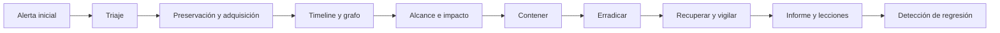

# Clase 220 — Caso completo de respuesta a incidentes end-to-end

> Parte: **9 — Forense digital y respuesta a incidentes** · Fuente: síntesis de *NIST SP 800-61*, *The Art of Memory Forensics* e *Intelligence-Driven Incident Response*
> ⏱️ Duración estimada: **150 min** · Nivel: **Experto**

---

## 🎯 Objetivo

Integrar todo lo aprendido en la parte resolviendo un incidente **de principio a fin**: desde la alerta inicial hasta el informe y las lecciones aprendidas. Este es el proyecto capstone: adquisición, análisis multi-fuente, timeline, contención, erradicación, RCA e informe, ejecutados como un caso real y coherente.

## 📚 Resultados de aprendizaje

Al finalizar, el alumno podrá:

1. **Ejecutar** el ciclo completo PICERL sobre un incidente realista.
2. **Correlacionar** evidencia de disco, memoria y red en una sola narrativa.
3. **Construir** una super-timeline que sostenga las conclusiones.
4. **Contener y erradicar** con preservación de evidencia.
5. **Entregar** un informe forense y un post-mortem defendibles.

## 🗺️ Temas

| # | Tema | Por qué importa |
|---|------|-----------------|
| 1 | Escenario y alcance | Enmarca el caso |
| 2 | Triage inicial | Primeras decisiones |
| 3 | Adquisición multi-fuente | Disco, RAM, red |
| 4 | Análisis correlacionado | Unir las piezas |
| 5 | Timeline maestra | Cronología del ataque |
| 6 | Contención y erradicación | Detener y limpiar |
| 7 | RCA y lecciones | Prevenir recurrencia |
| 8 | Informe final | Cerrar con calidad |

## 🧠 Explicación en profundidad

El caso final integra SOC, respuesta y forense sin asumir una historia prefabricada. Se parte de una alerta con confianza limitada, se preservan fuentes según volatilidad, se mantiene un registro de decisiones y se actualiza el alcance a medida que aparece evidencia.



La bitácora separa hora del incidente, hora conocida y hora de decisión; así puede evaluarse la razonabilidad con información disponible entonces. El informe distingue hechos, inferencias y desconocidos. La calidad final no se mide por encontrar todos los indicadores, sino por preservar trazabilidad, reducir riesgo, justificar decisiones y convertir brechas en controles verificables.

### Fase 1: convertir una alerta en preguntas investigables

La alerta inicial no contiene la historia. El equipo registra quién la produjo, lógica, alcance, tiempo y datos disponibles; formula hipótesis competidoras y define qué observación las apoyaría o refutaría. Un PowerShell codificado puede ser administración, simulación o intrusión. El triage prioriza criticidad, propagación, privilegio, datos y actividad en curso sin confundir severidad de alerta con impacto confirmado.

El alcance es provisional y se versiona. Usuarios, hosts, IP, dominios, cuentas cloud y periodos se agregan por relación evidenciada, no por intuición. Cada ampliación anota origen y pregunta pendiente.

### Fase 2: preservar según volatilidad y producir una timeline explicada

La adquisición sigue una estrategia documentada: memoria y conexiones si aportan valor y son viables; logs remotos, identidad y nube antes de retención o cambios; discos y artefactos con hashes y cadena de custodia. RFC 3227 aporta orden de volatilidad como guía, pero el responsable adapta el orden al riesgo operativo y cifra activa.

Memoria puede mostrar proceso y conexión; disco, archivo y persistencia; red, transferencia; identidad, sesión y privilegio. La correlación no obliga a que tres fuentes «concuerden»: una fuente puede refutar la hipótesis o no haber observado el segmento. La timeline conserva tiempo original, normalizado, procedencia y confianza. Los vacíos se mantienen visibles.

### Fase 3: decidir, contener y recuperar con trazabilidad

El registro de decisiones incluye hora conocida, alternativas, autoridad, impacto esperado y reversión. Así se distingue una decisión razonable con información limitada de una explicación reconstruida después. Contención aborda host e identidad; erradicación incluye acceso, persistencia, vector y condiciones; recuperación parte de una base verificada y comprueba datos, servicio y telemetría.

Las hipótesis se actualizan. Si el PCAP muestra descarga pero el supuesto proceso no existe en memoria y no hay artefacto de ejecución, el equipo no fuerza la narrativa: considera descarga no ejecutada, pérdida de memoria relevante o host equivocado y busca evidencia discriminante.

### Fase 4: cerrar el expediente y abrir la mejora

El paquete final contiene mandato, inventario de evidencia, hashes, bitácora, timeline, consultas, hallazgos, limitaciones, acciones y anexos. La causa raíz se conecta con controles y pruebas. El cierre operativo y el cierre de acciones pueden ocurrir en fechas distintas; ambos se siguen.

Una regla nueva no se considera eficaz porque fue desplegada. Se reproduce de forma segura el comportamiento o se ejecuta una prueba controlada, se confirma alerta con contexto suficiente y se revisa cobertura. El capstone termina cuando el alumno puede defender qué sabe, cómo lo sabe, qué no sabe y qué cambió de manera verificable.

## 📔 Glosario

- **Case log:** registro cronológico de acciones y decisiones.
- **Scope:** entidades y periodos potencialmente afectados.
- **Evidence matrix:** relación entre preguntas y fuentes.
- **Decision log:** razón, autoridad y resultado de cada decisión.
- **Unknown:** aspecto que la evidencia no resuelve.
- **Exit criteria:** condiciones para cerrar respuesta.
- **Regression detection:** analítica que verifica una mejora posterior.

## 📖 Definiciones y características

- **Capstone**: proyecto integrador que ejercita todas las competencias. Característica: evalúa el criterio, no solo la técnica.
- **Triage**: evaluación rápida para priorizar y decidir. Característica: define el rumbo con información incompleta.
- **Correlación multi-fuente**: relacionar disco, memoria, red, identidad y otros registros. Característica: cada fuente puede confirmar, refutar, limitar o no observar una hipótesis.
- **Narrativa del incidente**: explicación cronológica y causal sustentada en evidencia e inferencias declaradas. Característica: incluye alternativas, vacíos y nivel de confianza.
- **IOC/IOA**: indicadores de compromiso/ataque. Característica: alimentan detección y búsqueda retroactiva.
- **Contención con preservación**: frenar sin destruir evidencia. Característica: el equilibrio central de DFIR.
- **Cierre**: decisión formal basada en criterios operativos, evidencia y riesgo residual aceptado. Característica: no implica conocimiento absoluto ni final automático de todas las mejoras.

## 🔍 Caso razonado — identidad comprometida, descarga y movimiento lateral

Una alerta detecta PowerShell en una estación financiera. La memoria muestra un proceso con conexión externa; el PCAP conserva una descarga, y el navegador relaciona la URL con un correo. Una autenticación posterior usa la cuenta del usuario hacia un servidor, pero los logs de identidad muestran además un token cloud emitido antes del aislamiento. El alcance se amplía a endpoint, servidor, cuenta y tenant, con razones registradas.

El equipo preserva memoria, PCAP, perfil, eventos Windows, autenticación y logs cloud. La timeline corrige desfase y separa descarga de ejecución. Aísla la estación, revoca sesiones y segmenta el servidor; no apaga el servidor hasta adquirir la evidencia volátil que la evaluación de riesgo permite. La erradicación elimina persistencia, rota credenciales en orden y corrige la regla de aplicación que permitió ejecución.

El RCA encuentra privilegio excesivo y telemetría cloud incompleta como condiciones contribuyentes. Las acciones incluyen privilegio temporal, habilitación de data events relevantes y prueba de una regla de detección. El informe declara un intervalo sin visibilidad en un servicio, en vez de completar la historia con suposiciones.

## ✅ Criterio de dominio

Dominas la Parte 9 cuando puedes conducir el caso desde una alerta incierta hasta un cierre defendible: formulas hipótesis competidoras, preservas por volatilidad y riesgo, mantienes custodia y bitácora, correlacionas sin forzar concordancia, justificas contención, verificas recuperación y conviertes causas en controles reprobados.

## 🧰 Herramientas y preparación

- **Todo el arsenal de la parte**: FTK Imager/ewfacquire, Volatility 3, The Sleuth Kit/Autopsy, plaso/Timesketch, Wireshark/Zeek, Eric Zimmerman's Tools.
- **Escenario**: móntalo tú en un laboratorio aislado de VMs propias, o usa un dataset de entrenamiento DFIR público.
- **Recuerda**: cualquier malware se maneja solo en laboratorio aislado y desechable, con snapshots.

## 🧪 Laboratorio guiado

> Escenario propuesto: una estación Windows generó una alerta EDR de PowerShell ofuscado que contactó una IP externa; sospechas de intrusión con exfiltración. Reprodúcelo en tu laboratorio propio.

1. **Triage e identificación**: revisa la alerta, clasifica severidad (clase 202) y define el alcance inicial. Decide aislar por red preservando RAM (clase 216).
2. **Adquisición**:
   - Volca la RAM (WinPmem) y el disco (FTK Imager → E01), con hashes y cadena de custodia (clases 201, 203, 207).
   - Captura tráfico si el atacante sigue activo (clase 208).
3. **Análisis de memoria**: con Volatility 3 halla el proceso malicioso, su inyección y su conexión C2:

   ```bash
   vol -f memoria.raw windows.malfind
   vol -f memoria.raw windows.netscan
   vol -f memoria.raw windows.cmdline
   ```

4. **Análisis de disco**: en Autopsy/TSK examina artefactos de ejecución y persistencia (clases 204, 205): Prefetch, ShimCache/AmCache, tareas programadas, claves Run.
5. **Análisis de red**: en Zeek/Wireshark confirma el C2, el beaconing y qué se exfiltró (clase 208).
6. **Timeline maestra**: con plaso genera la super-timeline y reconstruye la secuencia entrada → ejecución → persistencia → movimiento → exfiltración (clase 209).
7. **Contención y erradicación**: busca persistencia en las superficies definidas, elimina mecanismos hallados, rota credenciales y valida recuperación declarando límites (clase 216).
8. **RCA e informe**: aplica 5 Porqués e Ishikawa (clase 217) y redacta el informe forense y el post-mortem blameless (clases 217, 218).

## ✍️ Ejercicios

1. Escribe la decisión de triage y su justificación de severidad.
2. Correlaciona un hallazgo de memoria con uno de disco y uno de red.
3. Construye la timeline maestra con al menos ocho eventos.
4. Enumera las superficies de persistencia examinadas, los mecanismos hallados y lo que queda fuera de cobertura.
5. Deriva cinco IOCs del incidente para búsqueda retroactiva.
6. Formula tres acciones correctivas contra causas raíz.

## 📝 Reto verificable

Resuelve el incidente completo y entrega el paquete final: cadena de custodia, hallazgos de memoria/disco/red correlacionados, timeline maestra, plan de contención/erradicación ejecutado, RCA e informe forense con versión ejecutiva.

**Criterio de aceptación**: la narrativa usa evidencia de memoria, disco y red —más identidad o nube cuando el escenario lo requiera— y explica coincidencias, contradicciones y fuentes sin visibilidad; la timeline tiene al menos ocho eventos con tiempo original, UTC, procedencia y confianza; el informe permite reproducir el análisis; y las acciones correctivas atacan causas demostradas y se prueban.

## ⚠️ Errores comunes

| Síntoma / mensaje | Causa y cómo arreglar |
|-------------------|-----------------------|
| Conclusiones sin respaldo | Una sola fuente. Corrobora con memoria, disco y red. |
| Perdiste la RAM | Contuviste apagando. Aísla por red primero. |
| Timeline caótica | No la acotaste ni pivoteaste. Filtra por ventana y parte de eventos conocidos. |
| Erradicación incompleta | Persistencia sin enumerar. Revísala toda antes de cerrar. |
| Informe no reproducible | Faltan hashes/versiones. Documenta la metodología completa. |

## ❓ Preguntas frecuentes

**❓ ¿Por dónde empiezo un caso real?**
Por el triage: entiende la alerta, acota el alcance y decide contención preservando evidencia. Luego adquieres antes de analizar.

**❓ ¿Qué fuente analizo primero?**
Sigue el orden de volatilidad: memoria y red en vivo primero, disco después. Pero correlaciona las tres al final.

**❓ ¿Cómo sé que terminé?**
Cuando la narrativa se sostiene con evidencia concordante, la persistencia está erradicada y validada, y el informe permite a un tercero reproducir el análisis.

**❓ ¿Y si el laboratorio tiene malware real?**
Manéjalo solo en VMs aisladas y desechables, con snapshots, sin salida a Internet salvo la controlada para observar el C2.

## 🔗 Referencias verificables y alcance

- **NIST SP 800-61 Rev. 3:** <https://doi.org/10.6028/NIST.SP.800-61r3> — marco vigente para integrar respuesta y gestión de riesgo.
- **NIST SP 800-86:** <https://doi.org/10.6028/NIST.SP.800-86> — proceso de recolección, examen, análisis y reporte desde una perspectiva de TI.
- **RFC 3227 / BCP 55:** <https://www.rfc-editor.org/info/rfc3227/> — principios de volatilidad, documentación, copias y verificación durante recolección.
- **Volatility 3 Documentation:** <https://volatility3.readthedocs.io/en/latest/> — referencia oficial para análisis de memoria; Volatility analiza adquisiciones, no realiza por sí mismo la captura de RAM.
- **The Sleuth Kit documentation:** <https://www.sleuthkit.org/sleuthkit/docs.php> — herramientas y conceptos de filesystem para validar pasos del caso.
- **Plaso User’s Guide:** <https://plaso.readthedocs.io/en/latest/sources/user/Users-Guide.html> — flujo reproducible para extracción temporal y almacenamiento intermedio.

## 📥 Material descargable

- 📄 [Guía en PDF](./clase-220-guia.pdf) — versión imprimible de esta clase.
- 🎞️ [Presentación (PPTX)](./clase-220-presentacion.pptx) — deck para proyectar en clase.

## ⬅️ Clase anterior

[Clase 219 — Ejercicios de mesa (tabletop)](../219-ejercicios-de-mesa-tabletop/README.md)

## ➡️ Siguiente clase

[Clase 221 — Fundamentos de seguridad en la nube y responsabilidad compartida](../../parte-10-seguridad-en-la-nube-y-contenedores/221-fundamentos-de-seguridad-en-la-nube-y-responsabilidad-compartida/README.md)
