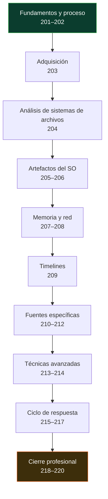

# 🔬 Parte 9 — Forense digital y respuesta a incidentes

> [⬅️ Volver al programa](../../README.md) · [📚 Índice completo](../README.md) · [⏭️ Parte siguiente](../parte-10-seguridad-en-la-nube-y-contenedores/README.md)

DFIR, adquisición, memoria, timelines y playbooks

**Fuentes de referencia de esta parte:**

- Michael Hale Ligh, Andrew Case, Jamie Levy, AAron Walters — *The Art of Memory Forensics* (Wiley, 2014).
- Brian Carrier — *File System Forensic Analysis* (Addison-Wesley, 2005).
- Scott J. Roberts, Rebekah Brown — *Intelligence-Driven Incident Response* (O'Reilly, 2017).
- NIST SP 800-61 Rev. 2 — *Computer Security Incident Handling Guide*.
- NIST SP 800-86 — *Guide to Integrating Forensic Techniques into Incident Response*.
- SANS Incident Handler's Handbook y modelo PICERL.

---

## 🎯 ¿De qué trata esta parte?

La forense digital y la respuesta a incidentes (DFIR, por *Digital Forensics and Incident Response*) es la disciplina que entra en acción cuando la prevención falla. Cuando un atacante ya está dentro, o cuando un equipo fue comprometido, alguien tiene que reconstruir qué pasó, cuándo, cómo, qué se llevaron y cómo expulsarlo sin destruir las pruebas. Esta parte te enseña ese oficio: adquirir evidencia sin alterarla, analizar discos, memoria y red, construir líneas de tiempo, escribir informes que resistan un tribunal y coordinar la respuesta desde la detección hasta las lecciones aprendidas.

DFIR es donde convergen la técnica pura (entender NTFS a nivel de MFT, leer estructuras de kernel en un volcado de RAM) y el rigor de proceso (cadena de custodia, integridad por hash, documentación defendible). Un hallazgo brillante no sirve de nada si la evidencia se contamina o si el informe no se sostiene. Por eso trabajamos con herramientas reales y reproducibles —Autopsy, The Sleuth Kit, Volatility 3, FTK Imager, plaso/log2timeline, Wireshark— y con marcos reconocidos como el ciclo de NIST SP 800-61 y el PICERL de SANS.

Esta parte sirve a analistas de SOC que quieren pasar de la alerta al análisis profundo, a respondedores de incidentes, a peritos forenses y a cualquier ingeniero de seguridad que necesite entender qué hacer las primeras 72 horas de una brecha. Construimos sobre lo aprendido en detección y SOC (Parte 8) y preparamos el terreno para la nube (Parte 10), donde la evidencia vive en logs efímeros y snapshots de API.

## 🧩 Problemas que resuelve

- Cómo capturar un disco o la memoria de un equipo comprometido sin alterar la evidencia ni romper la cadena de custodia.
- Cómo reconstruir la actividad de un usuario o un atacante a partir de artefactos del sistema de archivos y del sistema operativo.
- Cómo detectar malware que solo vive en memoria y nunca toca el disco.
- Cómo ordenar cientos de miles de eventos dispersos en una única línea de tiempo coherente.
- Cómo contener y erradicar una amenaza sin destruir los datos que necesitas para el análisis.
- Cómo escribir un informe forense y una cadena de custodia que resistan escrutinio legal.
- Cómo ensayar la respuesta antes de que ocurra el incidente real mediante ejercicios de mesa.

## 🎓 Resultados de aprendizaje

Al terminar la parte, el alumno podrá:

1. Explicar y aplicar el principio de intercambio de Locard y el orden de volatilidad en una adquisición real.
2. Adquirir imágenes forenses de disco y memoria verificando integridad con hashes y bloqueo de escritura.
3. Analizar sistemas de archivos NTFS y ext4 a nivel de metadatos (MFT, journal, inodos).
4. Extraer y correlacionar artefactos de Windows y Linux para reconstruir actividad.
5. Analizar volcados de memoria con Volatility 3 para hallar procesos, conexiones e inyecciones.
6. Construir super-timelines con plaso/log2timeline y analizarlas con criterio.
7. Redactar playbooks de respuesta y ejecutar el ciclo completo PICERL/NIST.
8. Producir un informe forense defendible y coordinar un ejercicio tabletop.

## 🧱 Prerrequisitos

- **Parte 8 — Blue Team, detección y SOC**: comprender alertas, SIEM, logs y telemetría de endpoint es la base para saber qué evidencia buscar.
- **Parte 2 — Sistemas operativos y redes**: manejo de Windows, Linux, sistemas de archivos y TCP/IP.
- **Parte 1 — Fundamentos**: criptografía básica (hashes) y línea de comandos.
- Un entorno de laboratorio aislado (máquinas virtuales) para practicar adquisición y análisis sin riesgo.

## 🗺️ Estructura temática

<!-- arco:inicio -->

<!-- arco:fin -->

| Bloque | Clases | Enfoque |
|--------|--------|---------|
| Fundamentos y proceso | 201–202 | Cadena de custodia, ciclo NIST/SANS |
| Adquisición | 203 | Imágenes de disco y memoria |
| Análisis de sistemas de archivos | 204 | NTFS y ext4 |
| Artefactos del SO | 205–206 | Windows y Linux |
| Memoria y red | 207–208 | Volatility y forense de red |
| Timelines | 209 | Super-timelines con plaso |
| Fuentes específicas | 210–212 | Navegadores/correo, móvil, nube |
| Técnicas avanzadas | 213–214 | Anti-forense, carving |
| Ciclo de respuesta | 215–217 | Playbooks, contención, RCA |
| Cierre profesional | 218–220 | Informe/legal, tabletop, caso end-to-end |

## 🔗 Referencias de la parte

- Ligh, Case, Levy, Walters — *The Art of Memory Forensics*, Wiley 2014.
- Carrier — *File System Forensic Analysis*, Addison-Wesley 2005.
- Roberts, Brown — *Intelligence-Driven Incident Response*, O'Reilly 2017.
- NIST SP 800-61 Rev. 2 — <https://csrc.nist.gov/publications/detail/sp/800-61/rev-2/final>
- NIST SP 800-86 — <https://csrc.nist.gov/publications/detail/sp/800-86/final>
- The Sleuth Kit & Autopsy — <https://www.sleuthkit.org/>
- Volatility Foundation — <https://www.volatilityfoundation.org/>

## ▶️ Empezar

[Clase 201 — Fundamentos de DFIR y cadena de custodia](201-fundamentos-de-dfir-y-cadena-de-custodia/README.md)
