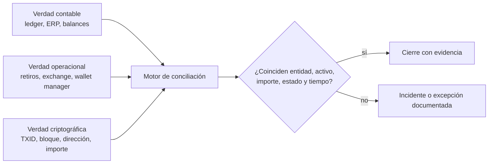
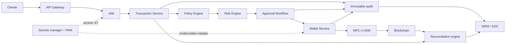

# Caso transversal — custodia de activos digitales

Este recurso conecta identidad, arquitectura, logging, SOC, DFIR, respuesta a
incidentes, auditoría y gobierno mediante un único problema profesional:
**un descuadre entre el ledger interno, la operación y la blockchain**.

El laboratorio usa exclusivamente la empresa ficticia **Nebula Custody**,
identidades inventadas, direcciones sintéticas y registros creados para
entrenamiento. No contiene claves privadas, fondos ni datos de clientes reales.

> **Contexto público y límites.** La imagen aportada sobre OrionX se usa sólo como
> detonante pedagógico: muestra que una querella puede alegar diferencias entre
> registros internos y movimientos observables. Una querella, un informe
> preliminar, una hipótesis investigativa y un hecho judicialmente establecido
> tienen distinto valor probatorio. Este material no verifica los datos de la
> imagen, no reproduce acusaciones, no identifica responsables y no concluye
> responsabilidad penal. El escenario práctico no representa a OrionX.

## Diagnóstico de integración

La auditoría encontró 19 partes y 340 clases. Los temas base ya existen; la brecha
no era otra clase teórica, sino un artefacto que obligara a usarlos juntos.

| Tema existente | Nivel actual | Brecha aplicada | Mejora propuesta | Punto de integración |
|---|---|---|---|---|
| IAM, MFA y PAM | sólido por dominio | autorización no equivale a legitimidad de una transferencia | decisiones RBAC/ABAC, JIT/JEA, break-glass y revisión de sesiones | clases 222, 313, 315 y laboratorio |
| Zero Trust y arquitectura | sólido por dominio | faltaba aplicar confianza explícita a firmas y conciliación | arquitectura con policy/risk engine, MPC/HSM y señales continuas | clases 316, 329 y laboratorio |
| Logging, SIEM y SOC | sólido por dominio | faltaba un contrato de evento financiero/cripto correlacionable | esquema de 20 campos, controles de completitud e inmutabilidad | clases 182–199 y laboratorio |
| Threat modeling | STRIDE desarrollado | faltaban abuse cases, insider y árbol de ataque sobre custodia | modelo combinado con activos, actores, límites y tratamientos | clase 237 y `THREAT_MODEL.md` |
| DFIR y cadena de custodia | sólido por fuente técnica | faltaba correlacionar evidencia interna, exchange y blockchain | procedimiento de preservación, hashes, timeline y límites de atribución | clases 201–220 y laboratorio |
| Playbooks de IR | método y escenarios generales | faltaban escenarios de custodia | ocho fichas con trigger, severidad, roles, contención, evidencia y recuperación | clase 215 y `PLAYBOOKS.md` |
| Auditoría, GRC y SoD | controles y auditoría general | faltaba una matriz maker-checker verificable | flujo de ocho pasos, incompatibilidades y pruebas de diseño/operación | clases 276–289 y laboratorio |
| Criptografía y secretos | claves, KMS y HSM cubiertos | faltaba comparar modelos de custodia | single-key, multisig, MPC y HSM-backed con límites explícitos | clases 55, 63, 65 y laboratorio |
| Capstones | pentest, blue team y DFIR | faltaba un caso financiero multifuente | entregables, rúbrica, solución y criterios reproducibles | clase 307 y laboratorio |

## Modelo de las tres verdades

El diagrama no afirma que la blockchain sea una contabilidad completa. La cadena
confirma transacciones válidas para su propio protocolo; no conoce por sí sola al
cliente, la autorización corporativa, el propósito económico ni todos los activos
custodiados en un exchange. El ledger tampoco prueba que los fondos existan. La
operación puede registrar una orden que nunca se liquidó. La conclusión surge de
la correlación y debe declarar qué fuente respalda cada afirmación.

La clave de unión es `correlation_id`, complementada por `request_id`,
`approval_id` y `tx_hash`. La conciliación compara importe y activo, pero también
estado, dirección, modelo UTXO/cuenta, comisiones, confirmaciones y ventana
temporal. Una diferencia puede ser fraude, error, evento tardío, fee, reorg,
decimales, activo envuelto o cobertura incompleta. **Una señal abre una
investigación; no prueba intención ni autoría.**

## Recorrido recomendado

1. Estudia logging (182), cadena de custodia (201), playbooks (215), causa raíz
   (217), threat modeling (237), auditoría (285), PAM (315) y Zero Trust (329).
2. Ejecuta el [laboratorio Nebula Custody](../labs/custodia-activos-digitales/README.md).
3. Entrega conciliación, timeline, matriz de evidencia, causa raíz, controles y
   revisión de arquitectura según la rúbrica.
4. Contrasta con la [solución docente](../labs/custodia-activos-digitales/SOLUCION.md)
   sólo después de producir tus hashes y resultados.

## Arquitectura objetivo

El camino superior separa petición, política, riesgo, aprobación, firma y
ejecución. El plano de observabilidad recibe eventos antes de que una identidad
operativa pueda alterarlos y el conciliador compara fuentes independientes. MPC o
HSM reducen exposición de claves, pero no vuelven legítima una orden autorizada
con una política incorrecta: IAM responde quién es; autorización, qué puede hacer;
el workflow y el contexto de riesgo, si esta operación concreta debe continuar.

## Evidencia de aprendizaje

La entrega final debe permitir a un tercero repetir cálculos y distinguir:

- hechos observados, inferencias, hipótesis y datos ausentes;
- saldo esperado, saldo operacional y saldo verificable;
- identidad autenticada, permiso concedido y legitimidad de negocio;
- causa próxima, factores contribuyentes y condiciones sistémicas;
- controles preventivos, detectivos y correctivos con prueba de eficacia.

## Referencias primarias y alcance

- [NIST SP 800-61 Rev. 3](https://doi.org/10.6028/NIST.SP.800-61r3): ciclo y mejora continua de respuesta a incidentes.
- [NIST SP 800-86](https://doi.org/10.6028/NIST.SP.800-86): integración de técnicas forenses en respuesta; no sustituye asesoría jurídica.
- [NIST SP 800-53 Rev. 5](https://doi.org/10.6028/NIST.SP.800-53r5): familias AC, AU, IA, IR y SC para acceso, auditoría, identidad, respuesta y protección.
- [NIST SP 800-207](https://doi.org/10.6028/NIST.SP.800-207): principios de Zero Trust; no prescribe un producto de custodia.
- [OWASP Logging Cheat Sheet](https://cheatsheetseries.owasp.org/cheatsheets/Logging_Cheat_Sheet.html): diseño y protección de eventos de aplicación.
- [MITRE ATT&CK Enterprise](https://attack.mitre.org/): vocabulario de comportamientos; una técnica mapeada no atribuye actor ni intención.
- [Bitcoin Developer Reference](https://developer.bitcoin.org/reference/): semántica de transacciones, bloques y modelo UTXO.
- [Ethereum JSON-RPC](https://ethereum.org/en/developers/apis/json-rpc/): métodos de consulta de bloques, transacciones y receipts.
- [Blockstream Esplora API](https://github.com/Blockstream/esplora/blob/master/API.md): contrato del endpoint testnet usado por el cliente opcional; sigue siendo una fuente derivada.

## Navegación

- [← Índice principal](../README.md)
- [Ir al laboratorio →](../labs/custodia-activos-digitales/README.md)
