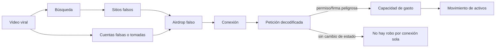

# Caso transversal — seguridad en memecoins y lanzamientos virales

Este documento registra la auditoría curricular realizada antes de incorporar el caso. El objetivo
no es crear una especialidad de criptoactivos, sino usar un lanzamiento viral como escenario moderno
para practicar competencias que ya pertenecen a identidad, OSINT, web, malware, DFIR y riesgo.

## Inventario y resultado de la auditoría

El catálogo verificado contiene **20 partes y 360 clases (001–360)**. La validación inicial revisó
516 documentos y 7.200 enlaces Markdown sin encontrar rutas rotas; el catálogo de rutas tampoco
tenía clases huérfanas y el corpus estaba en UTF-8 válido. Se revisaron los títulos y recorridos de
todas las partes, y se buscaron explícitamente los trece mecanismos solicitados.

La conclusión fue doble:

1. la base técnica ya existe y está bien distribuida; añadir una parte «crypto» duplicaría phishing,
   autenticación, análisis web, comportamiento de malware y respuesta a incidentes;
2. faltaba un artefacto que uniera esas capacidades desde la experiencia de un usuario expuesto a
   viralidad, identidad falsa y una autorización de wallet difícil de interpretar.

Por eso se conserva la numeración y se añade el [laboratorio OrbitPup](../labs/lanzamientos-virales/README.md),
apoyado por profundizaciones en las clases donde cada mecanismo sí pertenece.

## Encaje de las veinte partes

| Parte | Decisión | Motivo |
|---:|---|---|
| 0 · Fundamentos | prerequisito | CIA/AAA, HTTP, sistemas, ética y laboratorio permiten razonar el caso sin vocabulario nuevo |
| 1 · Redes | apoyo | DNS, TLS, proxy y telemetría ayudan a validar origen y observar tráfico, pero no son el centro |
| 2 · Criptografía | apoyo | firmas y gestión de secretos explican autoridad y custodia; no validan por sí solas la intención de una transacción |
| 3 · Pentesting | sin cambio directo | metodología y alcance son reutilizables; el caso es defensivo y no requiere explotar terceros |
| 4 · Aplicaciones web | **integración primaria** | el sitio, frontend, proveedor de wallet y red forman fronteras de confianza distintas |
| 5 · Binarios | apoyo | útil si el clipboard hijacker exige reversing, no para el primer diagnóstico |
| 6 · Malware | **integración primaria** | la lectura/sustitución del portapapeles es comportamiento de endpoint, no propiedad de la blockchain |
| 7 · Red team | apoyo | phishing y acceso inicial existen, pero el caso no enseña una campaña ofensiva real |
| 8 · Blue team | apoyo operativo | correlación de proxy, identidad, EDR y transacciones; se reutiliza sin crear una clase temática |
| 9 · DFIR e IR | **integración primaria** | preservación, timeline, contención y causa raíz cierran el caso completo |
| 10 · Nube | sin cambio directo | aplicaría a infraestructura de proveedores, fuera del alcance del usuario del caso |
| 11 · DevSecOps | apoyo | SAST/DAST/modelado sirven para desarrollar dapps, pero el caso evalúa interacción y respuesta |
| 12 · OSINT e ingeniería social | **entrada principal** | video, búsqueda, cuentas, influencer, suplantación, airdrop, urgencia y phishing comienzan aquí |
| 13 · Móvil/IoT | apoyo | muchas wallets son móviles, pero el mecanismo no depende de Android o iOS |
| 14 · GRC y riesgo | **integración primaria** | separa drainer, fraude, mercado, liquidez y rug pull antes de elegir tratamiento |
| 15 · Seguridad de IA | apoyo | deepfakes pueden amplificar la suplantación, sin ser requisito del escenario |
| 16 · Capstones | reutilización | el laboratorio puede actuar como variante de blue-team/DFIR sin nueva clase numerada |
| 17 · Profundización | apoyo | phishing avanzado, PAM e ingeniería de detección amplían el análisis |
| 18 · IA aplicada | sin cambio directo | automatización no mejora el objetivo pedagógico central del caso |
| 19 · Game security | fuera de alcance | no aporta una competencia necesaria para esta cadena |

## Ubicación caso por caso

| Caso | Punto primario | Conexiones | Evidencia de aprendizaje |
|---|---|---|---|
| fake token | 252 y laboratorio | 251, 277 | compara red + contrato/mint contra referencia y rechaza el ticker como identidad |
| fake website | 086 y laboratorio | 090, 251, 319 | diagrama de origen, dominio, frontend, wallet y servicio on-chain |
| wallet drainer | 259 y laboratorio | 086, 220 | correlación entre autorización, spender y transferencia posterior |
| phishing | 256–259 | 166, 319 | clasifica el enlace social/airdrop como phishing sin reducirlo al correo |
| impersonation | 252 y 259 | 250–251, 319 | separa nombre visible, cuenta, operador y canal oficial |
| fake airdrop | 259 y laboratorio | 256, 258 | identifica recompensa, urgencia y petición sensible como pretexto |
| rug pull | 277 y laboratorio | 276, 285 | exige evidencia de control/retiro/abandono; no infiere desde una caída de precio |
| social engineering | 256 y 259 | 257–258 | modela FOMO, autoridad, escasez y fricción del proceso |
| fake influencer | 252 | 253, 299 | valida procedencia de cuenta y medio, no popularidad o apariencia |
| account takeover | 252 y 259 | 101–102, 315, 319 | correlaciona publicación con sesión, dispositivo, MFA y revocación |
| malicious smart contract/program | 086 y laboratorio | 109, 237 | decodifica efectos y declara diferencias entre redes/arquitecturas |
| seed phrase theft | 259 y laboratorio | 063, 241 | distingue secreto raíz de permisos revocables y aplica migración condicionada |
| clipboard attacks | 148 y laboratorio | 189–190, 205 | vincula proceso, padre, valor sustituido y transferencia sin fusionar hipótesis |

## Decisión pedagógica sobre el caso completo

El flujo solicitado se conserva, pero se vuelve causal y verificable:

La lectura del gráfico impide dos simplificaciones. El ataque no necesita que todas las ramas estén
presentes: una cuenta tomada puede sustituir a una falsa, y el robo de frase semilla puede sustituir
al approval. Además, la conexión es una frontera de interacción, no una causa suficiente del robo.
El paso probatorio es identificar **qué autoridad adquirió el atacante** y cómo se usó.

## Criterios de alcance y veracidad

- El escenario, dominios `.example`, direcciones, cuentas y eventos son ficticios.
- No se conecta una wallet real, no se firma, no se despliega código y no se consulta mainnet.
- «Malicioso» describe el efecto demostrado por el dataset; en un caso real se conserva como
  hipótesis hasta decodificar, simular y observar estado.
- Un contrato/programa verificado puede contener riesgo; uno no verificado no es automáticamente
  malicioso. Código, frontend, claves de administración, liquidez y comunicación son capas distintas.
- La regulación de criptoactivos depende de jurisdicción y cambia; el material no ofrece asesoría
  financiera ni jurídica ni clasifica automáticamente un token como valor.

## Verificación de publicación

La integración se acepta cuando:

1. los trece casos aparecen en contenido explicativo o práctica, no solo en esta tabla;
2. el analizador y sus tests funcionan offline;
3. estructura, enlaces, rutas, codificación y trazabilidad de fuentes siguen pasando;
4. el diff no altera numeración, archivos binarios ni el caso institucional de custodia;
5. los README de las partes modificadas explican por qué el caso aparece allí y qué evidencia produce.

## Fuentes primarias

- [SEC — 5 Ways Fraudsters May Lure Victims Into Scams Involving Crypto Asset Securities](https://www.investor.gov/introduction-investing/general-resources/news-alerts/alerts-bulletins/investor-alerts/crypto-scams).
- [MetaMask — What is a token approval?](https://support.metamask.io/stay-safe/safety-in-web3/what-is-a-token-approval/).
- [Ethereum Foundation — Trillion Dollar Security Project](https://ethereum.org/reports/trillion-dollar-security/).
- [Solana — Core Concepts](https://solana.com/docs/core).
- [MITRE ATT&CK — T1115 Clipboard Data](https://attack.mitre.org/techniques/T1115/).
- [SEC — litigation release sobre control de LP tokens y rug pull](https://www.sec.gov/enforcement-litigation/litigation-releases/lr-26223).

## Navegación

- [Índice principal](../README.md)
- [Laboratorio OrbitPup](../labs/lanzamientos-virales/README.md)
