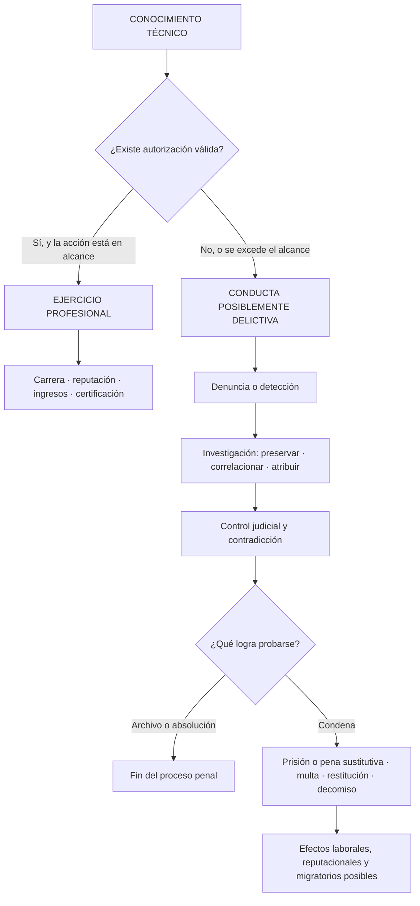
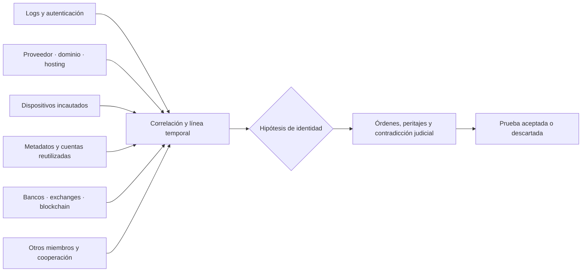
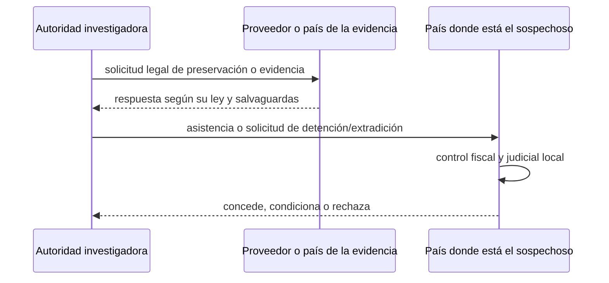

# ⚠️ ¿Y si cruzas la línea?

## El costo real de utilizar la ciberseguridad para delinquir

> **Vigencia jurídica y documental:** revisado el **1 de septiembre de 2026**.
> Este recurso es educativo y no constituye asesoría legal. La calificación de una conducta, la
> jurisdicción competente y la pena dependen de los hechos probados, la ley vigente y la decisión
> de un tribunal.

La ciberseguridad no se divide entre técnicas «buenas» y «malas». Un escáner, un depurador, una
regla de correlación o un conocimiento de Active Directory pueden proteger o perjudicar. Lo que
cambia la naturaleza de la acción es el **mandato**: quién autorizó, sobre qué activos, durante qué
plazo, con qué técnicas y para qué propósito. La [Clase 025](../classes/parte-0-fundamentos-y-prerrequisitos/025-etica-legalidad-alcance-y-divulgacion-responsable/README.md)
enseña dónde está esa frontera. Este documento explica qué puede suceder después de cruzarla.

No es una promesa de que todo delito será resuelto ni de que toda acusación terminará en prisión.
Es una lectura basada en leyes y casos reales: la aparente distancia entre una pantalla y la
víctima no elimina el daño, la evidencia, la jurisdicción ni las consecuencias.



El diagrama no afirma que el recorrido sea automático. Una alerta no equivale a culpabilidad y
una identidad técnica no basta por sí sola para condenar. Muestra la cadena que una investigación
intenta construir: **conducta → evidencia → persona → norma aplicable → decisión judicial**.

## 🪞 El espejo de las capacidades profesionales

El programa contiene 340 clases y 19 partes. No todas poseen una «versión criminal»: gobernar un
SGSI o redactar una política no se transforma mágicamente en delito. Sí existen capacidades de
doble uso cuyo propósito cambia al desaparecer el consentimiento o aparecer fraude, daño,
apropiación, extorsión o sabotaje.

| Parte o capacidad del programa | Uso profesional legítimo | Uso ilícito posible | Punto exacto de ruptura |
|---|---|---|---|
| 0 · sistemas, scripting y laboratorio | Administrar activos propios y automatizar tareas | Automatizar accesos sobre activos ajenos | Falta de autorización o exceso del alcance |
| 1 · redes y tráfico | Diagnóstico, NSM y respuesta | Interceptación, reconocimiento intrusivo o DDoS | Captar tráfico o degradar servicios sin derecho |
| 2 · criptografía | Confidencialidad, firma, autenticación | Cifrado usado para extorsionar o proteger ganancias ilícitas | La herramienta no es ilícita; lo son el daño y el propósito |
| 3 · pentesting | Prueba contratada con RoE | Intrusión y venta de acceso inicial | Ausencia de permiso o salida deliberada del *scope* |
| 4 · AppSec y bug bounty | Hallar, reportar y corregir fallos | Explotar aplicaciones y extraer datos | Probar fuera de la política o apropiarse del resultado |
| 5 · explotación y reversa | Validar mitigaciones e investigar binarios | Desarrollar exploits contra víctimas | Dirigir la capacidad a sistemas reales sin autorización |
| 6 · análisis de malware | Entender, detectar y contener amenazas | Crear, adaptar o distribuir malware | Intención y puesta a disposición para delinquir |
| 7 · Red Team | Emular adversarios bajo contrato | Comprometer organizaciones, persistir y extorsionar | El mandato profesional desaparece |
| 8 · SOC y detección | Correlacionar señales y responder | Abusar de la visibilidad para vigilar o facilitar ataques | Uso de privilegios para un fin no autorizado |
| 9 · DFIR | Preservar, analizar y explicar evidencia | Alterar, destruir u ocultar evidencia | Ruptura de integridad y cadena de custodia |
| 10 · nube | Proteger IAM, cargas y contenedores | Secuestrar cuentas o consumir cómputo ajeno | Uso no consentido de identidad y recursos |
| 11 · DevSecOps | Asegurar pipeline y cadena de suministro | Insertar una puerta trasera en una dependencia o build | Alteración engañosa de un artefacto confiado |
| 12 · OSINT e ingeniería social | Inteligencia legítima y evaluación autorizada | Phishing, acoso, suplantación o preparación de fraude | Engaño para obtener acceso, dinero o datos |
| 13 · móvil, IoT, radio e ICS | Evaluar dispositivos y resiliencia operacional | Sabotear equipos, plantas o servicios esenciales | Interferencia no autorizada y riesgo físico |
| 14 · GRC | Gobernar riesgo, cumplimiento y auditoría | Encubrir deliberadamente una conducta o abusar de confianza | Fraude, obstrucción o incumplimiento consciente del deber |
| 15 · seguridad de IA | Evaluar modelos y automatizar defensa | Escalar fraude, suplantación o abuso con IA | La automatización amplifica una conducta ilícita |
| 16 · capstones | Integrar capacidades en laboratorios autorizados | Ejecutar una campaña real contra terceros | Sustituir el entorno controlado por víctimas reales |
| 17 · IAM, datos y arquitectura | Diseñar control y resiliencia | Robar privilegios, exfiltrar datos o preparar sabotaje | Apropiación o abuso del acceso confiado |
| 18 · agentes de IA | Orquestar auditorías con aprobación humana | Automatizar acciones ofensivas sin permiso | Delegar a un agente no crea autorización |

La conclusión no es que aprender ofensiva sea sospechoso. Un pentester, *red teamer*, analista de
malware o investigador de vulnerabilidades puede operar al máximo nivel técnico dentro de la ley.
La sofisticación profesional se mide por control, evidencia y responsabilidad, no por atacar a
una víctima real.

## 🟥 Catálogo de actividades y su salida profesional

Estas fichas describen conductas, no «carreras». Evitan instrucciones operativas y relacionan cada
riesgo con un camino legítimo ya presente en el programa.

### 1. Intrusión no autorizada y venta de acceso inicial

**Qué es.** Entrar o mantenerse en un sistema sin permiso; el *initial access broker* además
transfiere o vende ese acceso a otro actor. **Qué conocimientos utiliza.** Redes, enumeración,
vulnerabilidades, credenciales, Active Directory y nube de las Partes 1, 3, 4, 7, 10 y 17.
**Uso profesional legítimo.** Un pentest o Red Team con autorización escrita. **Dónde se cruza la
línea.** Falta de consentimiento, exceso del alcance, persistencia, apropiación de datos o cesión
del acceso. **A quién perjudica.** Usuarios, organización, clientes, proveedores y aseguradoras.
**🟢 Utiliza esas capacidades legalmente.** [Pentester](../rutas/pentester.md),
[Analista de Seguridad Ofensiva](../rutas/analista-seguridad-ofensiva.md) o
[Red Teamer](../rutas/red-team.md).

### 2. Robo de credenciales y phishing

**Qué es.** Obtener contraseñas, códigos o sesiones mediante engaño, captura o acceso indebido.
**Qué conocimientos utiliza.** Identidad, web, correo, OSINT e ingeniería social de las Partes 4,
12 y 17. **Uso profesional legítimo.** Simulaciones de phishing expresamente autorizadas,
concienciación y evaluación de IAM. **Dónde se cruza la línea.** Engañar a una persona real para
apoderarse de su identidad, dinero o acceso. **A quién perjudica.** Personas, empleadores,
entidades financieras y contactos de la víctima. **🟢 Utiliza esas capacidades legalmente.**
[Analista SecOps](../rutas/secops-analista.md), [SOC / Blue Team](../rutas/soc-blue-team.md) o
[Gestión de Vulnerabilidades](../rutas/gestion-vulnerabilidades.md).

### 3. Business Email Compromise y fraude por ingeniería social

**Qué es.** Comprometer o suplantar correo empresarial para cambiar instrucciones de pago,
facturas o beneficiarios. **Qué conocimientos utiliza.** Correo, dominios, OSINT, identidad y
procesos financieros. **Uso profesional legítimo.** Evaluar controles de correo y procesos de
doble aprobación. **Dónde se cruza la línea.** Suplantación, engaño y desvío de fondos.
**A quién perjudica.** Empresas, universidades, administraciones, proveedores y empleados.
**🟢 Utiliza esas capacidades legalmente.** [Analista de Ciberseguridad](../rutas/analista-ciberseguridad.md),
[GRC](../rutas/grc.md) o [SOC / Blue Team](../rutas/soc-blue-team.md).

### 4. Fraude digital y robo de identidad

**Qué es.** Manipular sistemas o usar datos de otra persona para obtener un beneficio económico.
**Qué conocimientos utiliza.** Aplicaciones, autenticación, pagos, OSINT y datos. **Uso profesional
legítimo.** Prevención de fraude, diseño de controles y análisis de transacciones. **Dónde se cruza
la línea.** Falsedad, suplantación, perjuicio y beneficio indebido. **A quién perjudica.** Personas,
bancos, comercios y organismos públicos. **🟢 Utiliza esas capacidades legalmente.**
[Analista de Ciberseguridad](../rutas/analista-ciberseguridad.md), [GRC](../rutas/grc.md) o
[Security Engineer](../rutas/secops-engineer.md).

### 5. Desarrollo o distribución de malware

**Qué es.** Crear, adaptar o entregar software destinado a acceder, espiar, dañar o facilitar
otros delitos. **Qué conocimientos utiliza.** Programación, reversa, persistencia, evasión y
formatos binarios de las Partes 5, 6 y 7. **Uso profesional legítimo.** Analizar muestras,
construir simuladores inocuos y desarrollar detecciones. **Dónde se cruza la línea.** Diseñar o
poner a disposición el código con intención delictiva; la mera existencia de una herramienta de
doble uso no demuestra esa intención. **A quién perjudica.** Usuarios, empresas, hospitales,
administraciones y proveedores. **🟢 Utiliza esas capacidades legalmente.**
[DFIR](../rutas/dfir.md), [SOC / Blue Team](../rutas/soc-blue-team.md) o ingeniería de detección.

### 6. Ransomware y extorsión digital

**Qué es.** Impedir acceso a sistemas o amenazar con publicar datos para exigir un pago.
**Qué conocimientos utiliza.** Intrusión, malware, movimiento lateral, criptografía, exfiltración
y negociación abusiva. **Uso profesional legítimo.** Investigación de amenazas, respuesta,
recuperación y ejercicios de crisis. **Dónde se cruza la línea.** Cifrado o robo sin permiso,
amenaza y exigencia patrimonial. **A quién perjudica.** Desde pequeñas empresas hasta hospitales,
municipios e infraestructura crítica. **🟢 Utiliza esas capacidades legalmente.**
[DFIR](../rutas/dfir.md), [SOC / Blue Team](../rutas/soc-blue-team.md) o
[CISO](../rutas/ciso.md).

### 7. Operación de botnet y DDoS criminal

**Qué es.** Controlar dispositivos comprometidos y usarlos para fraude, spam, malware o
denegación de servicio. **Qué conocimientos utiliza.** Redes, automatización, C2, malware e IoT.
**Uso profesional legítimo.** Pruebas de carga acordadas, investigación de C2 y desmantelamiento
defensivo. **Dónde se cruza la línea.** Controlar equipos ajenos o degradar un servicio sin
autorización. **A quién perjudica.** Propietarios de dispositivos, servicios atacados y usuarios
que dependen de ellos. **🟢 Utiliza esas capacidades legalmente.**
[Security Engineer](../rutas/secops-engineer.md), [SOC / Blue Team](../rutas/soc-blue-team.md) o
[Seguridad de Infraestructura](../rutas/seguridad-infraestructura.md).

### 8. Robo, receptación y comercialización de datos

**Qué es.** Extraer, almacenar, transferir o vender datos obtenidos ilícitamente, incluidos
credenciales y expedientes personales. **Qué conocimientos utiliza.** Bases de datos, DLP, nube,
web, identidad y canales de exfiltración. **Uso profesional legítimo.** Clasificación, DLP,
privacidad y respuesta a brechas. **Dónde se cruza la línea.** Apropiación, divulgación o comercio
sin derecho, incluso si quien vende no realizó la intrusión original. **A quién perjudica.** Las
personas identificadas, la organización custodio y terceros expuestos a fraude. **🟢 Utiliza esas
capacidades legalmente.** [GRC](../rutas/grc.md), [Security Engineer](../rutas/secops-engineer.md)
o [CISO](../rutas/ciso.md).

### 9. Abuso de nube y cryptojacking

**Qué es.** Usar cuentas, cómputo, almacenamiento o electricidad ajenos para minería u otras
cargas sin pagarlos ni obtener permiso. **Qué conocimientos utiliza.** IAM, API cloud,
contenedores, automatización y facturación. **Uso profesional legítimo.** Ingeniería y auditoría
cloud, optimización y detección de consumo anómalo. **Dónde se cruza la línea.** Acceso engañoso o
no autorizado y apropiación de recursos. **A quién perjudica.** Titular de la cuenta, proveedor y
clientes afectados por costo o indisponibilidad. **🟢 Utiliza esas capacidades legalmente.**
[Cloud Security Engineer](../rutas/cloud-security.md) o
[Ingeniero DevSecOps](../rutas/devsecops-engineer.md).

### 10. Ataque a la cadena de suministro

**Qué es.** Alterar código, dependencias, actualizaciones o pipelines confiados para llegar a
usuarios posteriores. **Qué conocimientos utiliza.** Git, CI/CD, artefactos, firma, SBOM,
dependencias y secretos de la Parte 11. **Uso profesional legítimo.** Revisar procedencia,
endurecer builds y responder a compromisos. **Dónde se cruza la línea.** Introducir o distribuir
una alteración engañosa sin mandato. **A quién perjudica.** Proveedor original y todas las
organizaciones que confían en él. **🟢 Utiliza esas capacidades legalmente.**
[Ingeniero DevSecOps](../rutas/devsecops-engineer.md), [AppSec](../rutas/appsec.md) o
[Product CISO](../rutas/product-ciso.md).

### 11. Abuso de privilegios internos

**Qué es.** Usar un acceso laboral válido para consultar, copiar, alterar o divulgar información
fuera del propósito autorizado. **Qué conocimientos utiliza.** Administración, IAM, registros,
datos y procesos internos. **Uso profesional legítimo.** Operar con mínimo privilegio y trazabilidad.
**Dónde se cruza la línea.** El permiso para cumplir una función no autoriza curiosidad, venganza,
beneficio personal ni entrega a terceros. **A quién perjudica.** Empleador, compañeros, clientes y
personas cuyos datos estaban confiados. **🟢 Utiliza esas capacidades legalmente.**
[Analista SecOps](../rutas/secops-analista.md), [GRC](../rutas/grc.md) o
[Jefe de Seguridad](../rutas/ciso-jefe-seguridad.md).

### 12. Sabotaje y alteración u ocultación de evidencia

**Qué es.** Dañar sistemas o datos, o manipular evidencia para impedir que se conozcan los hechos.
**Qué conocimientos utiliza.** Administración, scripting, DFIR, almacenamiento y continuidad.
**Uso profesional legítimo.** Contención, borrado autorizado, recuperación y preservación forense.
**Dónde se cruza la línea.** Destrucción o alteración sin derecho y con perjuicio u obstrucción.
**A quién perjudica.** Organización, clientes, investigadores, tribunal y personas que necesitan
el servicio. **🟢 Utiliza esas capacidades legalmente.** [DFIR](../rutas/dfir.md),
[Seguridad de Infraestructura](../rutas/seguridad-infraestructura.md) o
[Analista SecOps](../rutas/secops-analista.md).

### 13. Ataques contra infraestructura crítica e ICS

**Qué es.** Interferir con sistemas cuya indisponibilidad puede afectar transporte, energía,
agua, salud o seguridad pública. **Qué conocimientos utiliza.** Segmentación, protocolos
industriales, firmware, radio y arquitectura IT/OT. **Uso profesional legítimo.** Evaluación
controlada de resiliencia y diseño seguro. **Dónde se cruza la línea.** Acceso o interferencia no
autorizada, especialmente cuando crea riesgo físico o social grave. **A quién perjudica.**
Operadores, trabajadores y comunidades enteras. **🟢 Utiliza esas capacidades legalmente.**
[Arquitecto IT/OT](../rutas/arquitecto-it-ot.md) u [OT CISO](../rutas/ot-ciso.md).

### 14. Espionaje informático ilegal

**Qué es.** Obtener secretos, comunicaciones o propiedad intelectual sin derecho para ventaja
económica, personal o de otra organización. **Qué conocimientos utiliza.** OSINT, intrusión,
persistencia, nube, correo y exfiltración. **Uso profesional legítimo.** Threat intelligence,
investigación autorizada y protección de activos críticos. **Dónde se cruza la línea.**
Interceptación, acceso y apropiación sin consentimiento; el contexto estatal puede añadir reglas
de seguridad nacional distintas según la jurisdicción. **A quién perjudica.** Personas, empresas,
universidades y Estados. **🟢 Utiliza esas capacidades legalmente.**
[SOC / Blue Team](../rutas/soc-blue-team.md), [DFIR](../rutas/dfir.md) o
[Cooperación y Alianzas Técnicas](../rutas/cooperacion-alianzas.md).

### 15. Utilización criminal de IA

**Qué es.** Emplear modelos o agentes para escalar suplantación, fraude, generación de señuelos o
acciones no autorizadas. **Qué conocimientos utiliza.** LLM, agentes, automatización, deepfakes y
seguridad de modelos de las Partes 15 y 18. **Uso profesional legítimo.** AI Red Team con alcance,
gobierno y automatización defensiva. **Dónde se cruza la línea.** La misma que para una persona:
engaño, acceso, daño o apropiación sin derecho. Un agente no absorbe la responsabilidad de quien
lo configura y despliega. **A quién perjudica.** Personas suplantadas, víctimas de fraude,
organizaciones y público. **🟢 Utiliza esas capacidades legalmente.**
[AI CISO](../rutas/ai-ciso.md), [AppSec](../rutas/appsec.md) o ingeniería de seguridad de IA.

## ⚖️ Consecuencias legales reales

### Chile como referencia principal

La Ley 21.459 tipifica ataques a sistemas y datos, acceso e interceptación ilícitos,
falsificación, receptación, fraude y abuso de dispositivos. La pena concreta no se obtiene
copiando el máximo de una tabla: el tribunal considera forma de participación, tentativa o
consumación, agravantes, atenuantes, concurso con otros delitos y reglas procesales. En la escala
chilena, **presidio menor mínimo** abarca 61 a 540 días, **medio** 541 días a 3 años y **máximo**
3 años y un día a 5 años.

| Conducta | Norma y artículo | Pena legal posible | Qué no debe inferirse |
|---|---|---|---|
| Impedir el funcionamiento de un sistema | Ley 21.459, art. 1 | Presidio menor medio a máximo | No significa que todo incidente reciba 5 años |
| Acceso superando barreras, sin autorización o excediéndola | Ley 21.459, art. 2 inc. 1 | Presidio menor mínimo **o** 11–20 UTM | La multa es alternativa en este inciso, no absolución |
| Acceso para apoderarse o usar información | Ley 21.459, art. 2 inc. 2 | Presidio menor mínimo a medio | Debe probarse el elemento adicional |
| Obtener y divulgar la información | Ley 21.459, art. 2 inc. 3 | Presidio menor medio a máximo | La publicación puede agravar la exposición |
| Interceptación técnica no pública | Ley 21.459, art. 3 | Presidio menor medio; ciertas emisiones, medio a máximo | VPN, Tor o captura autorizada no son ilícitos por sí mismos |
| Alterar, dañar o suprimir datos con daño grave | Ley 21.459, art. 4 | Presidio menor medio | El daño grave forma parte del supuesto descrito |
| Falsificación informática | Ley 21.459, art. 5 | Presidio menor medio a máximo; puede aumentar para empleado público | Puede concurrir con fraude u otros delitos |
| Comercializar o almacenar datos ilícitos con fin ilícito | Ley 21.459, art. 6 | Pena del delito de origen rebajada en un grado | No exige ser quien realizó el acceso original |
| Fraude informático | Ley 21.459, art. 7 | Desde presidio menor mínimo y multa; sobre 400 UTM, máximo y 21–30 UTM | El tramo depende del perjuicio y hechos probados |
| Dispositivos, programas o claves adaptados principalmente para delinquir | Ley 21.459, art. 8 | Presidio menor mínimo y 5–10 UTM | Una herramienta legítima no queda prohibida por su sola existencia |

La reforma incorporada por la Ley 21.663 contempla una exclusión específica para determinadas
actividades de investigación de vulnerabilidades sujetas a condiciones legales. No es un permiso
general para «probar primero y avisar después»: deben cumplirse todas las condiciones aplicables,
incluidos registro, comunicación y límites establecidos. La regla segura para este programa sigue
siendo trabajar con autorización expresa y alcance escrito.

### Comparación internacional seleccionada

| País / marco | Conducta | Norma / artículo | Pena máxima o rango legal citado | Observación |
|---|---|---|---|---|
| 🇺🇸 Estados Unidos | Acceso, fraude, daño o extorsión sobre computadora protegida | 18 U.S.C. §1030 | Varía por inciso: desde 1 año hasta 20; daño con muerte puede llegar a cadena perpetua | CFAA no es una sola pena y pueden concurrir fraude, identidad y lavado |
| 🇪🇸 España | Acceso vulnerando seguridad | Código Penal, art. 197 bis.1 | 6 meses a 2 años | Distingue acceso de daños e interferencia |
| 🇪🇸 España | Daño o interferencia grave | Código Penal, arts. 264 y 264 bis | 6 meses a 3 años; supuestos agravados alcanzan 2–5 o 3–8 años y multa | Infraestructura crítica y daño elevado agravan |
| 🇬🇧 Reino Unido | Acceso no autorizado | Computer Misuse Act 1990, s.1 | Máximo de 2 años en acusación formal | El contrato y límites de un empleado importan para probar autorización |
| 🇬🇧 Reino Unido | Actos que deterioran sistemas | CMA, s.3 | Máximo de 10 años | Incluye DDoS cuando concurren sus elementos |
| 🇬🇧 Reino Unido | Daño grave o riesgo grave | CMA, s.3ZA | Máximo de 14 años; cadena perpetua en ciertos daños a bienestar humano o seguridad nacional | No se aplica automáticamente a toda intrusión |
| 🇪🇺 Unión Europea | Acceso, interferencia, interceptación y herramientas | Directiva 2013/40/UE, arts. 3–9 | Obliga a máximos mínimos de al menos 2 años y mayores umbrales en supuestos graves | Es un piso de armonización; la pena la fija cada Estado miembro |

Estas cifras son **penas legales posibles**, no condenas observadas ni tiempo efectivamente
cumplido. Una noticia sobre cargos tampoco es una condena. La tabla siguiente usa únicamente
casos en los que la fuente oficial informa sentencia.

## 🧑‍⚖️ Condenas documentadas

| Caso, país y fecha | Conducta e investigación publicada | Resultado judicial informado | Consecuencias patrimoniales / posteriores |
|---|---|---|---|
| **Phishing de Ovalle**, Chile, 2017 | Página bancaria falsa, transferencias por $15 millones; testimonios, documentación bancaria, PDI y levantamiento del secreto bancario | 540 días de presidio, remitidos | Se recuperaron $10 millones; $5 millones no fueron reversados |
| **Roman Seleznev**, EE. UU., 21-04-2017 | Malware en POS de más de 500 negocios, millones de tarjetas y venta en mercados criminales; condenado por 38 cargos | 27 años de prisión federal | DOJ atribuyó más de USD 169 millones en pérdidas; otras sentencias concurrentes incluyeron restitución |
| **Gregory King**, EE. UU., 07-10-2008 | Botnet y DDoS; FBI analizó logs, ejecutó órdenes, examinó sus computadores y obtuvo confesión | 2 años de prisión federal | Más de USD 69.000 de restitución |
| **Yaroslav Vasinskyi / REvil**, EE. UU., 01-05-2024 | Afiliado de ransomware, extraditado desde Polonia; más de 2.500 ataques atribuidos por el expediente | 13 años y 7 meses de prisión | Más de USD 16 millones de restitución |
| **Oludayo Adeagbo**, EE. UU., 02-10-2024 | BEC contra entidades educativas y empresas; extraditado desde Reino Unido | 7 años de prisión y 1 año de libertad supervisada | USD 942.655,03 de restitución |
| **Charles O. Parks III**, EE. UU., 15-08-2025 | Cuentas cloud obtenidas mediante engaño para minería; conversión por exchanges, NFT, pagos y bancos | 1 año y 1 día de prisión | Decomiso de USD 500.000 y un Mercedes-Benz; restitución pendiente al publicarse la fuente |
| **Shannon Stafford**, EE. UU., 24-09-2020 | Exadministrador accedió y dañó la red de su exempleador | 1 año y 1 día de prisión y 3 años de libertad supervisada | USD 193.258,10 de restitución |
| **Zain Qaiser**, Reino Unido, 2019 | Publicidad maliciosa y ransomware de bloqueo dentro de un grupo internacional; movimientos financieros formaron parte de la investigación | 6 años y 5 meses de prisión | La NCA identificó más de GBP 700.000 recibidos en sus cuentas y gasto de lujo |

En Ovalle, «540 días remitidos» no equivale a 540 días de prisión efectiva: la propia fuente
informa una modalidad sustitutiva. En Vasinskyi, los USD 700 millones fueron **demandas de
rescate atribuidas al esquema**, mientras la orden judicial de restitución superó USD 16 millones.
Separar esas categorías evita inflar o minimizar una consecuencia real.

## 🔎 ¿Crees que nadie te va a encontrar?

La atribución no suele depender de una «IP mágica». Se construye cuando varias fuentes
independientes cuentan una historia compatible y resisten impugnación. Cada una tiene límites:
una dirección IP puede identificar una conexión, no necesariamente a la persona; una cuenta puede
haber sido robada; un artefacto puede haber sido plantado. La fuerza aparece en la correlación.



Una investigación moderna puede combinar:

- registros de autenticación, aplicaciones, EDR, proxy, DNS y proveedores;
- dominios, hosting, infraestructura comprometida e historiales de cuentas;
- dispositivos incautados, análisis forense y copias existentes en otros lugares;
- horarios, zonas horarias, hábitos, alias, correos y números reutilizados;
- transferencias bancarias, beneficiarios, compras y retiros;
- movimientos públicos de determinadas redes blockchain y datos obtenidos legalmente de
  intermediarios;
- telecomunicaciones y datos de suscriptor cuando existe base y autorización legal;
- evidencia encontrada en cómplices, proveedores o víctimas;
- errores operacionales y declaraciones del propio investigado;
- cooperación entre fiscalías, policías y empresas de varios países.

El caso Gregory King muestra logs, órdenes de registro y forense de dispositivos en una misma
investigación. La documentación judicial de ChipMixer explica cómo el FBI empleó análisis de
blockchain para relacionar flujos con pagos de ransomware. Esto no significa que toda
criptomoneda identifique automáticamente a una persona: significa que «cripto» no borra el resto
de la cadena probatoria.

Este documento deliberadamente no enseña a borrar huellas, ocultar fondos, derrotar el forense ni
evitar órdenes judiciales. La perspectiva es la de preservación, investigación y control judicial.

## 🧩 Mitos frente a realidad

| Mito | Realidad verificable y prudente |
|---|---|
| «Una VPN me vuelve invisible» | Cambia una parte del trayecto de red; no elimina dispositivos, cuentas, pagos, horarios, proveedores ni evidencia de terceros |
| «Tor es ilegal» | Es una tecnología de privacidad con usos legítimos; la legalidad depende de la conducta, no de instalarla |
| «Criptomonedas significa anonimato total» | Algunas redes conservan un historial público; atribuir una dirección a una persona exige evidencia adicional |
| «Si borro el archivo, desapareció» | Puede persistir en logs, respaldos, snapshots, destinatarios, nube o dispositivos relacionados |
| «Un servidor extranjero me protege» | Puede investigarse o incautarse mediante el derecho del país anfitrión y cooperación internacional |
| «Una cuenta falsa no se relaciona conmigo» | Alias, recuperación, sesiones, pagos, dispositivos y contactos pueden correlacionarse; ninguna señal aislada basta siempre |
| «La IA hizo la acción, no yo» | Automatizar no crea permiso ni elimina la posible responsabilidad de quien configura, ordena o facilita la conducta |
| «Si pasan años, ya estoy libre» | Prescripción, suspensión e interrupción dependen del delito y jurisdicción; una regla universal sería falsa |

## 🌎 ¿Y si estás en otro país?

Un delito transnacional puede tocar varios territorios: donde está el autor, la víctima, el
servidor, el proveedor o el perjuicio. Más de un Estado puede reclamar jurisdicción. Eso no
significa que todos puedan detener a cualquiera en cualquier lugar. Cada medida requiere una base
legal y un procedimiento.

El Convenio de Budapest proporciona herramientas para preservar datos, solicitar asistencia y
cooperar sobre evidencia electrónica. Su artículo 24 trata la extradición entre Partes bajo sus
condiciones. INTERPOL facilita intercambio policial; no es un tribunal y una notificación no
reemplaza una orden nacional. Europol apoya cooperación policial en la UE y Eurojust la
coordinación judicial. La extradición depende, entre otros factores, del tratado o base aplicable,
doble incriminación, pena, nacionalidad, prueba presentada, derechos fundamentales y decisión de
las autoridades y tribunales competentes.

Dos ejemplos concretos evitan las abstracciones:

- **REvil:** Vasinskyi fue detenido en Polonia, extraditado a Estados Unidos y después condenado.
- **Operation Cronos / LockBit:** autoridades de diez países intervinieron 34 servidores en ocho
  jurisdicciones. La coordinación logró incautación y disrupción, pero una operación no convierte
  automáticamente a toda persona investigada en culpable.



## 💰 No solo puedes perder la libertad

Una sentencia puede combinar prisión o pena sustitutiva con consecuencias distintas:

| Consecuencia | Qué significa | Ejemplo documentado |
|---|---|---|
| Multa | Pago punitivo fijado por ley y sentencia | La Ley 21.459 combina multas UTM con ciertos delitos |
| Restitución | Devolver a las víctimas pérdidas reconocidas por el tribunal | Vasinskyi: más de USD 16 millones; Stafford: USD 193.258,10 |
| Decomiso | Pérdida de ganancias o bienes vinculados al delito | Parks: USD 500.000 y un Mercedes-Benz |
| Incautación | Custodia de dispositivos, servidores o fondos como evidencia o medida procesal | LockBit: 34 servidores intervenidos en la operación internacional |
| Responsabilidad civil | Reclamaciones de víctimas separadas o vinculadas al proceso penal | Depende de la jurisdicción y del daño probado |
| Costos de defensa | Honorarios, peritajes, tiempo y restricciones durante el proceso | No son una «pena» y varían caso a caso |

**Multa, restitución y decomiso no son sinónimos.** Una multa sanciona; la restitución busca
compensar pérdidas reconocidas; el decomiso priva de instrumentos o ganancias. Una misma sentencia
puede contener las tres. Tampoco todo monto sustraído termina recuperado: el caso chileno de
phishing recuperó $10 millones de $15 millones transferidos.

## 📄 La condena no termina necesariamente al salir del tribunal

Una condena puede generar antecedentes y penas accesorias expresamente previstas por la ley.
También puede producir efectos prácticos que no son automáticos: término o pérdida de empleo,
rechazo de una habilitación, dificultad para acceder a funciones de confianza, revisión de una
autorización de seguridad, mayor escrutinio contractual o daño reputacional.

Conviene separar tres preguntas:

1. **¿La sentencia impuso una inhabilitación?** Se responde leyendo el fallo y la ley.
2. **¿Una regulación excluye a la persona de una función concreta?** Se responde con la norma del
   sector y su jurisdicción.
3. **¿Un empleador o cliente decidirá no contratar?** Es una posibilidad práctica, sujeta a leyes
   laborales, de datos y no discriminación; no una consecuencia universal.

No es correcto afirmar que toda persona condenada queda «inhabilitada para trabajar en TI para
siempre». Sí es razonable explicar por qué una condena por abuso de acceso puede ser especialmente
relevante en cargos que administran privilegios, dinero, datos sensibles o infraestructura.

## 🛂 Una condena también puede cruzar fronteras contigo

No existe la regla «con antecedentes nunca podrás viajar». Existen evaluaciones diferentes por
país, visa, nacionalidad, delito, pena, tiempo transcurrido y posibles excepciones.

| País | Regla oficial resumida al 01-09-2026 | Por qué no es absoluta |
|---|---|---|
| 🇨🇦 Canadá | Un delito cometido o una condena puede producir inadmisibilidad; decide un oficial al solicitar visa/eTA o en frontera | Existen vías como rehabilitación o permiso temporal según el caso |
| 🇬🇧 Reino Unido | Las reglas contemplan rechazo obligatorio para ciertas condenas de 12 meses o más y rechazo discrecional para otras | Cambian según pena, ruta migratoria, tiempo y circunstancias |
| 🇦🇺 Australia | Debe cumplirse el requisito de carácter; se declaran cargos y condenas y pueden pedir certificados | La autoridad evalúa el caso bajo la Migration Act; no toda condena implica idéntico resultado |
| 🇺🇸 Estados Unidos | La INA enumera causales, como ciertos delitos de vileza moral o múltiples condenas con 5 años agregados de reclusión | Hay excepciones y *waivers* para algunas causales; decide la autoridad competente |

Ocultar deliberadamente una condena puede crear un problema migratorio adicional por falsedad o
engaño. La decisión prudente es consultar la regla oficial vigente y obtener asesoría jurídica
para el caso concreto, no confiar en foros ni en esta tabla como dictamen.

## 🏃 La falsa tranquilidad de estar prófugo

Estar fuera del país que investiga no cierra el expediente. Puede significar una orden pendiente,
restricciones de movimiento, detención al cruzar una frontera, procesos de extradición y años sin
poder regresar con seguridad jurídica. Usar documentos o declaraciones falsas puede añadir
nuevos delitos. La separación familiar, laboral y patrimonial no es una pena uniforme escrita en
un código, pero puede ser una consecuencia práctica de mantener una vida condicionada por una
orden vigente.

Adeagbo fue extraditado desde Reino Unido a Estados Unidos en 2022 y condenado en 2024. Vasinskyi
fue extraditado desde Polonia. Seleznev fue detenido en Maldivas y trasladado a Estados Unidos,
donde un jurado lo condenó. Ninguno de esos casos demuestra que la extradición sea automática;
demuestran que cambiar de país no garantiza el cierre de una investigación.

## 🔬 Estudios de caso: de la señal a la sentencia

### Caso A · Gregory King: botnet y DDoS

```text
Ataques DDoS contra dos servicios
        ↓
registros de Internet y denuncia
        ↓
órdenes judiciales de registro
        ↓
análisis forense de computadores
        ↓
correlación con la operación de la botnet y confesión
        ↓
declaración de culpabilidad
        ↓
2 años de prisión + más de USD 69.000 de restitución
```

La enseñanza no es «qué error cometió». Es que logs, dispositivos y declaraciones son fuentes
distintas; juntas vincularon actividad, infraestructura y persona. La evidencia estuvo sujeta al
proceso penal, no a una conclusión automática del investigador.

### Caso B · REvil: ransomware transnacional

```text
Ataques de ransomware a víctimas internacionales
        ↓
investigaciones en varios países
        ↓
identificación de un afiliado y su papel
        ↓
detención en Polonia
        ↓
extradición a Estados Unidos
        ↓
declaración de culpabilidad
        ↓
13 años y 7 meses + más de USD 16 millones de restitución
```

Aquí la distancia geográfica no impidió el proceso, pero cada etapa necesitó cooperación y base
legal. La cifra de restitución ordenada no debe confundirse con los rescates demandados por toda
la campaña.

### Caso C · phishing de Ovalle: datos bancarios y rastro financiero

```text
víctima llega a una página bancaria falsa
        ↓
tres transferencias por $15 millones
        ↓
documentación del banco + testimonios + PDI
        ↓
levantamiento judicial del secreto bancario
        ↓
identificación de quien retiró $5 millones
        ↓
juicio simplificado y condena
        ↓
540 días remitidos; $10 millones recuperados
```

El rastro financiero complementó la evidencia digital. La condena publicada se refiere a la
persona enjuiciada; la fuente señala que Fiscalía no descartaba participación de otras personas.

### Caso D · Charles Parks: cloud, cripto y bienes

```text
cuentas cloud creadas con identidades y empresas declaradas
        ↓
consumo de más de USD 3,5 millones sin pago
        ↓
minería y movimientos por exchanges, NFT, pagos y bancos
        ↓
investigación FBI / NYPD y causa federal
        ↓
declaración de culpabilidad por fraude electrónico
        ↓
1 año y 1 día de prisión
        ↓
decomiso de USD 500.000 y un vehículo de lujo
```

La nube y las criptomonedas no borraron la dimensión contractual, contable y bancaria. El caso
también muestra que el decomiso puede alcanzar bienes comprados con ganancias del esquema.

## 🧪 Práctica segura y verificable

Esta práctica es documental; no requiere ni autoriza tocar sistemas ajenos.

1. Elige una de las 15 fichas y dibuja una cadena causal con cinco columnas: conducta, víctima,
   evidencia esperable, norma posible y salida profesional legítima.
2. Para Chile, toma los artículos 1 a 8 de la Ley 21.459 y clasifica tres escenarios hipotéticos.
   Marca explícitamente los hechos que faltan: autorización, barrera técnica, daño grave, ánimo de
   apoderamiento, perjuicio o beneficio económico.
3. Compara la **pena legal máxima** con la **condena impuesta** en dos casos. Explica por qué no son
   intercambiables.
4. Construye una matriz de atribución para el caso King. Por cada evidencia indica qué demuestra,
   qué no demuestra y qué fuente independiente podría corroborarla.
5. Redacta una reconducción profesional: una persona interesada en malware, OSINT o cloud debe
   producir tres artefactos legales de portafolio y enlazarlos con una ruta real del programa.

**Criterio de aceptación:** el trabajo distingue hecho, inferencia y conclusión judicial; no
incluye instrucciones de evasión; usa al menos una fuente oficial chilena y una internacional;
y diferencia pena teórica, solicitud fiscal, sentencia y cumplimiento efectivo.

## ⚠️ Errores de razonamiento frecuentes

| Error | Corrección |
|---|---|
| «Si técnicamente podía hacerlo, estaba autorizado» | Capacidad y permiso son categorías distintas |
| «No causé daño, por tanto no hubo delito» | Algunas figuras sancionan acceso o interceptación; otras sí exigen daño o perjuicio |
| «Fue acusado, entonces es culpable» | Cargos y formalización son alegaciones; la culpabilidad requiere el proceso aplicable |
| «La fiscalía pidió tres años, entonces recibió tres años» | Petición, pena legal y sentencia son cifras diferentes |
| «Le dieron 540 días, así que estuvo 540 días preso» | Debe verificarse si la pena fue efectiva o sustitutiva |
| «USD 700 millones en rescates significa USD 700 millones restituidos» | Demanda atribuida, pérdida probada y restitución son magnitudes distintas |
| «Usar VPN, Tor o cripto demuestra delito» | Son tecnologías legítimas; importa la conducta y la prueba completa |
| «Una IP identifica por sí sola a una persona» | Identifica un punto de red en un momento; atribución personal exige más evidencia |

## ❓ Preguntas para razonar

1. ¿Por qué un acceso laboral válido puede ser ilícito cuando se usa para consultar datos de un
   tercero sin necesidad funcional?
2. ¿Qué hechos separarían un análisis de malware legítimo del abuso de dispositivos previsto en
   la legislación chilena?
3. ¿Por qué una cadena de evidencia con cuatro señales débiles e independientes puede ser más
   convincente que una sola señal aparentemente fuerte?
4. ¿Qué diferencia existe entre incautar un servidor y condenar a su operador?
5. ¿Qué factores impiden afirmar que toda solicitud de extradición será concedida?
6. ¿Por qué la restitución no reemplaza necesariamente la multa o la prisión?
7. ¿Cómo explicarías a un reclutador que tu portafolio ofensivo demuestra habilidad sin tocar
   víctimas reales?
8. ¿Qué información tendrías que verificar antes de aconsejar a una persona condenada sobre una
   visa concreta?

## 🟢 La salida está dentro de la ley

| Interés técnico | Trayecto legítimo | Evidencia de aprendizaje segura |
|---|---|---|
| Intrusión y explotación | [Pentester](../rutas/pentester.md) / [Red Team](../rutas/red-team.md) | Informe de laboratorio con RoE y remediación |
| Malware y ransomware | [DFIR](../rutas/dfir.md) / [SOC](../rutas/soc-blue-team.md) | Análisis de una muestra controlada y reglas de detección |
| Phishing y fraude | [Analista SecOps](../rutas/secops-analista.md) / [GRC](../rutas/grc.md) | Simulación autorizada y rediseño del proceso de pago |
| Credenciales e identidad | [Security Engineer](../rutas/secops-engineer.md) | Modelo IAM, detección y playbook de revocación |
| Nube | [Cloud Security](../rutas/cloud-security.md) | Auditoría CSPM de una cuenta propia |
| Web | [AppSec / Bug Bounty](../rutas/appsec.md) | Hallazgo en laboratorio o programa dentro de alcance |
| Cadena de suministro | [Ingeniero DevSecOps](../rutas/devsecops-engineer.md) | Pipeline con SBOM, firma y políticas verificables |
| IA | [AI CISO](../rutas/ai-ciso.md) | Evaluación de riesgo y AI Red Team autorizado |
| ICS / infraestructura crítica | [Arquitecto IT/OT](../rutas/arquitecto-it-ot.md) | Arquitectura y tabletop sin interacción con planta real |

Todo lo necesario para llegar lejos en ciberseguridad puede ejercerse legalmente. Cruzar la línea
no demuestra mayor habilidad: cambia el consentimiento por víctimas, el informe por evidencia y
la carrera por un proceso cuyas consecuencias pueden acompañar a la persona durante años.

## 🔗 Fuentes oficiales y trazabilidad

Cada fuente indica qué afirmación respalda. Las normas se consultaron en su texto oficial; los
casos se usan por el resultado que publica la fiscalía, policía u organismo responsable.

- Biblioteca del Congreso Nacional de Chile, **Ley 21.459** — tipos penales, sanciones y texto vigente: <https://www.bcn.cl/leychile/Navegar?idNorma=1177743&idParte=10343832&idVersion=2222-02-02>
- Biblioteca del Congreso Nacional de Chile, **Código Penal, artículo 56** — escala y grados de las penas: <https://www.bcn.cl/leychile/navegar?idNorma=1984&idParte=9672257&idVersion=2025-11-28>
- Fiscalía de Chile, **Cibercriminalidad** — categorías investigadas y especialización institucional: <https://www.fiscaliadechile.cl/persecucion-penal/areas-de-persecucion/cibercriminalidad>
- Fiscalía de Chile, **phishing de Ovalle** — hechos, evidencia, condena y recuperación parcial: <https://www.fiscaliadechile.cl/actualidad/noticias/regionales/ovalle-condenan-mujer-por-fraude-informatico-en-el-cual-se-falseo>
- U.S. House, **18 U.S.C. §1030** — delitos y penas de la CFAA: <https://uscode.house.gov/view.xhtml?edition=2023&num=0&req=granuleid%3AUSC-2023-title18-section1030>
- BOE, **Código Penal español** — artículos 197 bis/ter y 264 a 264 ter: <https://www.boe.es/buscar/act.php?id=BOE-A-1995-25444>
- Crown Prosecution Service, **Computer Misuse Act** — elementos, jurisdicción y máximos de las secciones 1, 2, 3 y 3ZA: <https://www.cps.gov.uk/prosecution-guidance/computer-misuse-act>
- EUR-Lex, **Directiva 2013/40/UE** — definiciones, delitos, umbrales mínimos y cooperación: <https://eur-lex.europa.eu/legal-content/ES/TXT/?uri=celex%3A32013L0040>
- Consejo de Europa, **Convenio de Budapest** — cooperación internacional, evidencia y extradición condicionada: <https://www.coe.int/en/web/cybercrime/convention-on-cybercrime>
- DOJ, **Roman Seleznev** — veredicto, pena y pérdidas atribuidas: <https://www.justice.gov/usao-wdwa/pr/russian-cyber-criminal-sentenced-27-years-prison-hacking-and-credit-card-fraud-scheme>
- DOJ, **Yaroslav Vasinskyi / REvil** — extradición, pena y restitución: <https://www.justice.gov/archives/opa/pr/sodinokibirevil-affiliate-sentenced-role-700m-ransomware-scheme>
- DOJ, **Gregory King** — logs, órdenes, forense, pena y restitución: <https://www.justice.gov/archive/criminal/cybercrime/press-releases/2008/kingSent.pdf>
- DOJ, **Oludayo Adeagbo** — BEC, extradición, pena y restitución: <https://www.justice.gov/archives/opa/pr/previously-extradited-foreign-national-sentenced-role-multimillion-dollar-business-email>
- DOJ, **Charles O. Parks III** — cryptojacking, trazas financieras, prisión y decomiso: <https://www.justice.gov/usao-edny/pr/crypto-influencer-sentenced-prison-multi-million-dollar-cryptojacking-scheme>
- DOJ, **Shannon Stafford** — abuso interno, daño, prisión y restitución: <https://www.justice.gov/usao-md/pr/crofton-man-sentenced-more-one-year-federal-prison-intentionally-damaging-computers-his>
- DOJ, **declaración jurada ChipMixer** — análisis de blockchain como una fuente dentro de una investigación: <https://www.justice.gov/opa/press-release/file/1574581/dl>
- National Crime Agency, **Zain Qaiser** — investigación de ransomware, condena y movimientos financieros: <https://nationalcrimeagency.gov.uk/news/hacker-from-russian-crime-group-jailed-for-multi-million-pound-global-blackmail-conspiracy>
- Europol, **Operation Cronos / LockBit** — cooperación de diez países e intervención de infraestructura: <https://www.europol.europa.eu/media-press/newsroom/news/law-enforcement-disrupt-worlds-biggest-ransomware-operation>
- Europol, **Emotet** — coordinación Europol/Eurojust e infraestructura distribuida: <https://www.europol.europa.eu/media-press/newsroom/news/world%E2%80%99s-most-dangerous-malware-emotet-disrupted-through-global-action>
- Gobierno de Canadá, **inadmisibilidad** — decisión migratoria, criminalidad y vías posibles: <https://www.canada.ca/en/immigration-refugees-citizenship/services/admissibility-enforcement/inadmissibility.html>
- UK Visas and Immigration, **criminality grounds** — rechazo obligatorio y discrecional: <https://www.gov.uk/government/publications/grounds-for-refusal-criminality/grounds-for-refusal-criminality-accessible>
- Australian Home Affairs, **character requirements** — declaración, certificados y posible rechazo o cancelación: <https://immi.homeaffairs.gov.au/help-support/meeting-our-requirements/character>
- U.S. Department of State, **visa denials** — causales penales, excepciones y *waivers*: <https://travel.state.gov/content/travel/en/us-visas/visa-information-resources/visa-denials.html>
