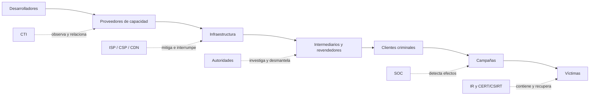
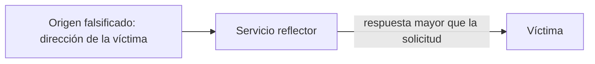
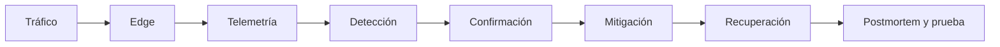
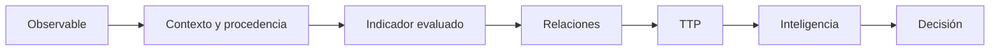
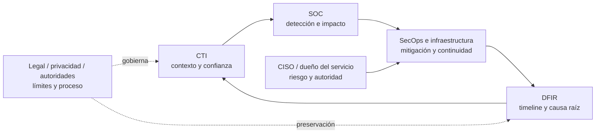

# Cybercrime-as-a-Service — cómo se industrializa el ciberdelito

> Recurso transversal defensivo · Conecta las clases 045, 150, 154, 195 y 322 con el laboratorio Blue Team/SOC.

## Qué significa CaaS

**Cybercrime-as-a-Service** o **Crime-as-a-Service (CaaS)** describe un mercado de capacidades
criminales: distintos actores desarrollan, operan, revenden o consumen componentes que permiten una
campaña. En documentación de nube, CaaS también puede significar *Containers as a Service*; el
contexto decide el significado. No es una taxonomía rígida ni implica que exista una sola empresa
criminal integrada.

El cambio importante es organizativo. Un atacante individual tendría que descubrir un acceso,
crear malware, mantener infraestructura y monetizar el resultado. Un ecosistema de servicios reparte
esas tareas. Esa especialización reduce barreras, permite sustituir proveedores y hace que
interrumpir una marca no elimine necesariamente la capacidad.

El diagrama representa funciones, no una cadena obligatoria. Un actor puede cumplir varias y una
campaña puede prescindir de intermediarios. Para defender, conviene preguntar qué capacidad se usó,
quién la operó, qué infraestructura dejó evidencia y qué relación está demostrada.

## Familias de servicios y límites de la clasificación

- **Malware-as-a-Service** ofrece código o acceso gestionado a malware.
- **Ransomware-as-a-Service (RaaS)** separa con frecuencia operadores, afiliados y proveedores de
  acceso. Es una especialización de CaaS, no toda la economía criminal.
- **Phishing-as-a-Service** empaqueta plantillas, alojamiento u operación de campañas.
- Los **initial access brokers** venden o transfieren acceso ya obtenido. No todo intermediario de
  acceso usa la etiqueta “as-a-Service”.
- Los ecosistemas de **infostealers y credenciales** reúnen recolección, clasificación, venta y uso
  de datos robados.
- Los servicios de infraestructura pueden incluir proxies, alojamiento resistente a retiradas y
  otros recursos. La expresión *bulletproof hosting* describe tolerancia deliberada al abuso; una
  jurisdicción o un proveedor concreto no bastan para inferirla.
- **DDoS-for-hire** comercializa capacidad para degradar disponibilidad. *Booter* y *stresser* son
  nombres usados para servicios de este tipo, a menudo presentados como pruebas de carga.

Estas categorías se solapan y cambian. Son modelos analíticos útiles, no identidades que puedan
atribuirse por una sola IP, marca o muestra.

## Stresser, booter y prueba de carga autorizada

Una prueba de carga legítima tiene propietario identificable, autorización escrita, objetivos y
rangos definidos, límites de tasa, ventana, contactos de emergencia, observabilidad y criterio de
parada. Un servicio que permite dirigir tráfico a terceros sin verificar control del objetivo se
comporta como DDoS-for-hire aunque se anuncie como “stresser”. El nombre comercial no crea
autorización.

Un servicio puede reunir capacidad mediante botnets, recursos alquilados, sistemas comprometidos o
reflectores abusados. Conocer esa distinción ayuda a investigar señales y coordinar mitigación; no
autoriza a contratar, probar ni interactuar con el servicio. La investigación profesional parte de
informes oficiales, expedientes públicos, telemetría propia y fuentes CTI autorizadas.

## Cómo produce impacto un DDoS

**DoS** busca agotar un recurso y **DDoS** distribuye la generación del tráfico entre múltiples
orígenes. El objetivo puede ser el enlace, el estado de dispositivos y protocolos, o la aplicación:

| Clase | Recurso presionado | Señales útiles | Límite de la señal |
|---|---|---|---|
| Volumétrica | BPS y capacidad upstream | salto de bytes, muchos orígenes, enlace saturado | un evento masivo legítimo puede parecerse |
| Protocolo/estado | PPS, tablas de conexión, CPU de red | sesiones incompletas, resets, colas | una avería o retry storm puede producirlo |
| Aplicación | workers, dependencias, caché, base de datos | RPS, latencia, 429/5xx, rutas costosas | un fallo interno puede causar los mismos síntomas |

En MITRE ATT&CK, **T1498 Network Denial of Service** pertenece a Impact; **T1498.001 Direct
Network Flood** y **T1498.002 Reflection Amplification** separan dos mecanismos de red. El mapeo
describe comportamiento observado; no identifica por sí mismo actor, servicio ni motivación.

### Reflexión y amplificación

UDP facilita ciertos escenarios porque no establece una sesión equivalente al *handshake* de TCP:
si el operador acepta una dirección de origen falsificada, el reflector envía la respuesta a la
víctima. La **reflexión** desvía la respuesta; la **amplificación** hace que sea mayor que la petición.
BCP 38 y BCP 84 reducen el abuso mediante filtrado de direcciones de origen, con consideraciones
específicas para redes multihomed. Configuración segura, limitar exposición y *Response Rate
Limiting* donde el protocolo lo admita reducen superficie. Ninguna medida aislada elimina todas las
variantes.

## Observar, confirmar y mitigar

NetFlow/IPFIX aporta bytes, paquetes, duración, cardinalidad y dirección; métricas de aplicación
aportan latencia, errores y saturación; el proveedor aporta visibilidad del borde. Un salto de
tráfico inicia una hipótesis, no la confirma. Hay que contrastar campañas legítimas, crawlers, una
dependencia caída, despliegues defectuosos y *retry storms*.

La defensa se diseña por capas: ISP/upstream y servicios de *scrubbing* para capacidad que no cabe
en el enlace; CDN y Anycast para absorber y distribuir; ACL y filtrado para patrones inequívocos;
WAF y *rate limiting* para proteger operaciones de aplicación; caché, *circuit breakers*, balanceo
y capacidad para conservar funciones críticas; SIEM, runbooks y comunicación para decidir. Añadir
servidores detrás de un enlace ya saturado no recupera disponibilidad.

## CaaS como objeto de Threat Intelligence

Conviene separar ocho objetos: **actor**, **capacidad**, **infraestructura**, **servicio**, **cliente**,
**campaña**, **objetivo** e **indicador**. STIX puede expresar objetos y relaciones; MISP u OpenCTI
pueden conservar procedencia, confianza y vigencia; Diamond Model ayuda a razonar sobre adversario,
capacidad, infraestructura y víctima. Una relación técnica compartida puede indicar reutilización o
un proveedor común. No demuestra que dos campañas tengan el mismo autor.

La regla epistemológica es: **observación ≠ indicador ≠ inferencia ≠ atribución**. Una IP observada
en tráfico es un hecho. Convertirla en indicador requiere contexto y ventana. Relacionarla con un
servicio es una inferencia sustentada. Nombrar al responsable exige evidencia adicional e
independiente.

## Modelo operativo y responsabilidades por rol

CaaS no crea un puesto llamado «analista CaaS». Es un contexto de amenaza que atraviesa varios
roles. La responsabilidad cambia con la decisión que debe tomarse:

| Rol | Pregunta que responde | Entregable | Límite |
|---|---|---|---|
| [Threat Intelligence Analyst](../rutas/threat-intelligence-analyst.md) | ¿Qué capacidad, infraestructura y campaña están relacionadas, con qué confianza? | PIR, grafo con procedencia, estimación e indicadores con caducidad | No atribuye identidad por una IP, marca o relación técnica |
| [SOC / Blue Team](../rutas/soc-blue-team.md) | ¿Qué está ocurriendo ahora en nuestra telemetría? | Caso, timeline inicial, consultas y escalamiento | Detecta y confirma impacto; no dirige mitigación upstream ni atribución |
| [Analista SecOps](../rutas/secops-analista.md) | ¿Quién cierra el riesgo operativo y en qué SLA? | Ticket, runbook, excepción, verificación y mejora | Coordina controles; no sustituye al dueño del servicio ni a DFIR |
| [Ingeniero SecOps](../rutas/secops-engineer.md) | ¿Qué telemetría, límite o automatización reversible falta? | Integración, control, prueba, rollback y observabilidad | No promete que autoscaling resuelva un enlace saturado |
| [Seguridad de infraestructura](../rutas/seguridad-infraestructura.md) | ¿Dónde se absorbe o filtra el tráfico y quién activa la capacidad? | Arquitectura de borde, contactos, capacidad y prueba | Distingue control local de dependencia ISP/CDN/CSP |
| [DFIR](../rutas/dfir.md) | ¿Qué pasó, qué cambió y por qué produjo impacto? | Evidencia, timeline, RCA y lecciones | Distingue desencadenante de causa raíz; no inventa actor |
| [CISO](../rutas/ciso.md) / jefatura | ¿Qué riesgo de continuidad se acepta y quién tiene autoridad? | BIA, SLA, decisión, comunicación y ejercicio | El riesgo residual lo acepta el dueño autorizado, no CTI o SOC |
| Legal, privacidad y autoridades | ¿Qué puede conservarse, compartirse o investigarse? | Base, preservación, canal y solicitud formal | La atribución jurídica exige proceso y evidencia adicionales |

CTI entrega contexto, SOC confirma lo observable, operación e infraestructura mitigan, DFIR
reconstruye y el dueño autorizado decide riesgo y continuidad. El ciclo vuelve a CTI porque una
mitigación o un takedown cambia infraestructura, indicadores y prioridades de colección.

## Caso público: acciones contra servicios DDoS-for-hire en 2025

En mayo de 2025, el Departamento de Justicia de Estados Unidos informó de la incautación judicial
de nueve dominios asociados a servicios DDoS-for-hire y de detenciones anunciadas en paralelo por
Polonia. Los hechos públicos permiten afirmar que existieron dominios y órdenes judiciales, que las
autoridades describieron servicios, comunicaciones e infraestructura investigada, y que coordinaron
acciones internacionales. Permiten estudiar una cadena con administradores, clientes, servicios,
infraestructura y víctimas.

No permiten concluir que cada usuario identificado ejecutó un ataque, que toda IP relacionada era
maliciosa ni que una incautación eliminó el mercado. Para SOC, CTI e IR la enseñanza es conservar
procedencia y tiempo, coordinar temprano con proveedores y autoridades, y tratar un *takedown* como
una interrupción medible: observar desplazamiento, reaparición o cambio de infraestructura.

## Práctica segura y causa raíz

El escenario [DDoS defensivo del laboratorio Blue Team/SOC](../labs/blue-team-soc/PLAYBOOK-DDOS.md)
usa telemetría sintética. El alumno compara una línea base con un incidente, formula alternativas,
mapea T1498, decide mitigación y documenta evidencia. No genera paquetes ni contacta sistemas
externos.

En el postmortem hay que separar el **evento desencadenante** —por ejemplo, tráfico distribuido— de
la **debilidad que permitió el impacto**: origen expuesto, falta de protección upstream, dependencia
única, capacidad insuficiente, ausencia de límites, respuesta tardía o telemetría incompleta. “La
causa fue un DDoS” describe el evento; no explica por qué el servicio cayó ni cómo verificar que no
se repita.

## Fuentes y uso

- [MITRE ATT&CK T1498](https://attack.mitre.org/techniques/T1498/) sustenta el mapeo de Network
  Denial of Service y sus subtécnicas.
- [CISA, Volumetric DDoS Technical Guidance](https://www.cisa.gov/sites/default/files/2023-09/TLP%20CLEAR%20-DDOS%20Mitigations%20Guidance_508c.pdf)
  sustenta la defensa por capacidad y las limitaciones de controles locales.
- [Europol, IOCTA](https://www.europol.europa.eu/publications-events/main-reports/internet-organised-crime-threat-assessment)
  sustenta la evolución de Crime-as-a-Service; la edición más reciente consultada es IOCTA 2026.
- [FBI, booter y stresser](https://www.fbi.gov/contact-us/field-offices/anchorage/fbi-intensify-efforts-to-combat-illegal-ddos-attacks)
  sustenta la caracterización pública y legal estadounidense de DDoS-for-hire.
- [DOJ, acción de mayo de 2025](https://www.justice.gov/usao-cdca/pr/law-enforcement-seizes-9-ddos-hire-webpages-part-global-crackdown-booter-and-stresser)
  sustenta el caso de estudio.
- [RFC 2827 / BCP 38](https://www.rfc-editor.org/rfc/rfc2827) y
  [RFC 3704 / BCP 84](https://www.rfc-editor.org/rfc/rfc3704) sustentan filtrado de origen y sus
  límites en redes multihomed.
